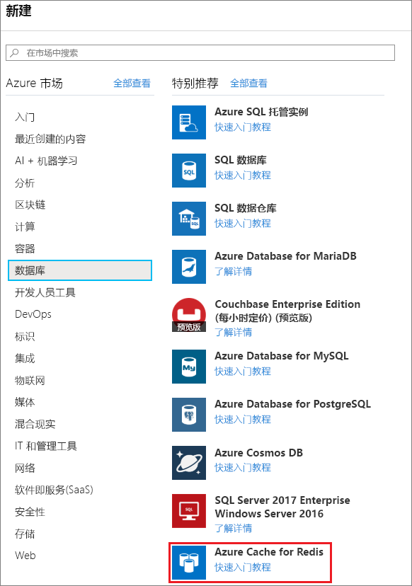
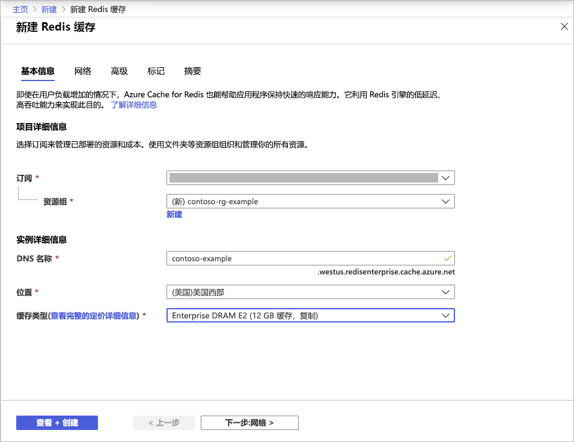
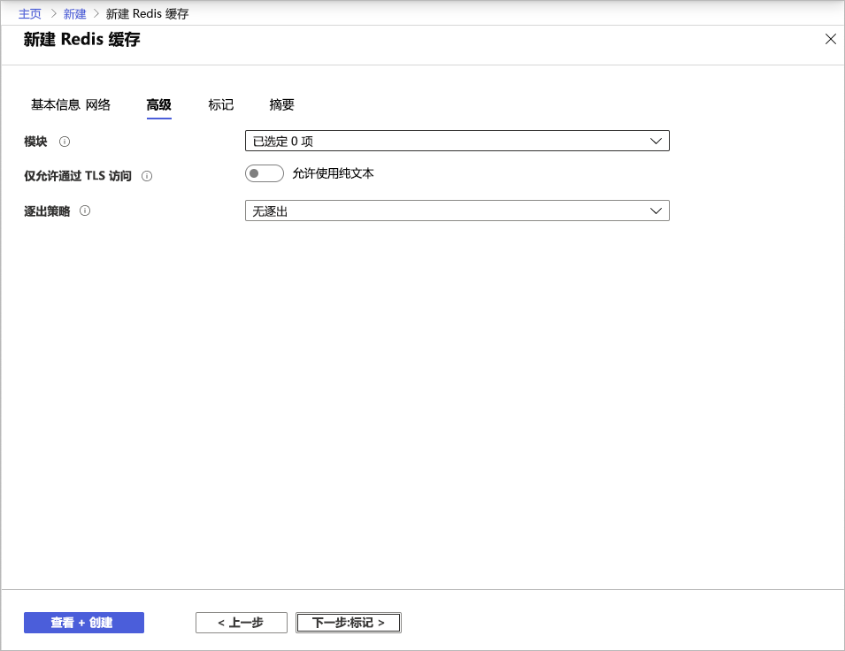
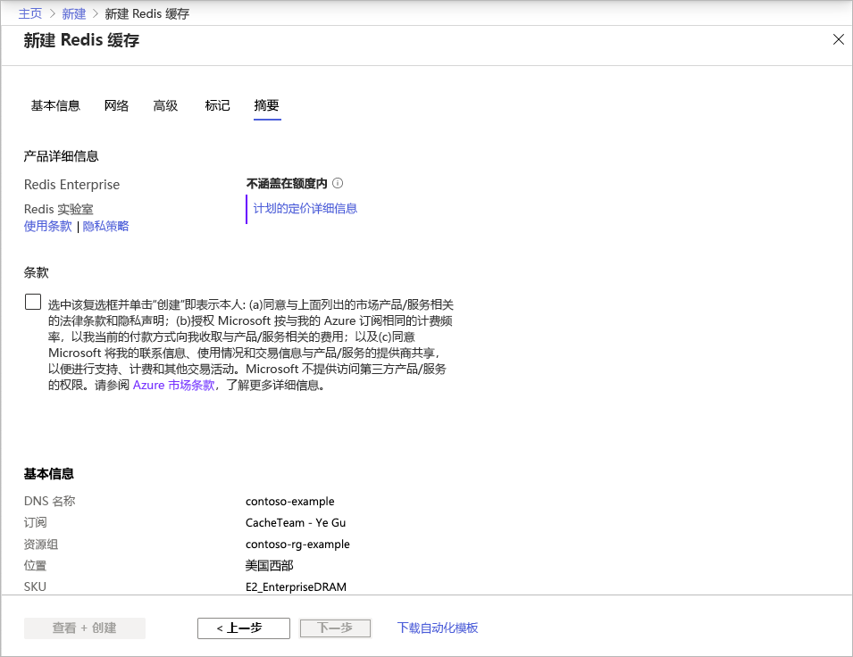

# 快速入门：创建企业层缓存（预览版）

Azure Cache for Redis 企业层在 Azure 上提供了完全集成和托管的 [Redis Enterprise](https://redislabs.com/redis-enterprise/)。 此功能目前以预览版的形式提供。 此预览版中有两个新层：
* 企业层，它在虚拟机上使用易失存储器 (DRAM) 存储数据
* 企业 SSD，使用易失存储器和非易失存储器 (NVMe) 存储数据。

加入此预览版不需任何费用。 如果你有兴趣，可以通过 [Azure 市场](https://aka.ms/redispreviewsignup/)中的“与我联系”注册。 我们的参与者名额非常有限，不能保证你会被接受加入此预览版。

## 先决条件

在开始之前，你需要一个 Azure 订阅。 如果没有，请先创建一个[免费帐户](https://azure.microsoft.com/free/)。

## 创建缓存
1. 若要创建缓存，请使用预览版邀请中的链接登录到 Azure 门户，然后选择“创建资源”。

   > [!IMPORTANT] 
   > 请勿直接在市场中订阅 Azure Cache for Redis 企业层。
   > 此步骤由 Azure Cache for Redis 门户 UI 自动执行。
   >
   
1. 在“新建”页上选择“数据库”，然后选择“Azure Cache for Redis”。  
   
   
   
1. 在“新建 Redis 缓存”页上配置新缓存的设置。
   
   | 设置      | 建议的值  | 说明 |
   | ------------ |  ------- | -------------------------------------------------- |
   | **订阅** | 单击下拉箭头并选择你的订阅。 | 要在其下创建此新的 Azure Cache for Redis 实例的订阅。 | 
   | **资源组** | 单击下拉箭头并选择一个资源组，或者选择“新建”并输入新的资源组名称。 | 要在其中创建缓存和其他资源的资源组的名称。 将所有应用资源放入一个资源组可以轻松地统一管理或删除这些资源。 | 
   | **DNS 名称** | 输入任何全局唯一的名称。 | 缓存名称必须是包含 1 到 63 个字符的字符串，只能包含数字、字母或连字符。 该名称必须以数字或字母开头和结尾，且不能包含连续的连字符。 缓存实例的主机名将为“\<DNS 名称>.<Azure region>.redisenterprise.cache.azure.net”。 | 
   | **位置** | 单击下拉箭头并选择一个位置。 | 企业层在“美国西部”、“美国东部 2”和“西欧”区域中提供。 |
   | **缓存层** | 下拉并选择“企业级 DRAM”或“企业级 SSD”层和大小。 |  此层决定可用于缓存的大小、性能和功能。 |
   
    

1. 在完成时选择“下一步:网络”并跳过。

   > [!NOTE] 
   > 以后将提供对专用链接的支持。
   >

1. 在完成时选择“下一步:高级”。
   
   可以保留默认设置或根据需要更改这些设置。 启用“仅允许通过 TLS 访问”时，必须使用 TLS 从应用程序访问新缓存。

    

   > [!NOTE] 
   > 企业级 SSD 层尚不支持 Redis 模块。 如果计划使用 Redis 模块，请确保选择企业层缓存。
   >
   
1. 在完成时选择“下一步:标记”并跳过。

1. 在完成时选择“下一步:摘要”。

    

1. 单击“条款”下的复选框，查看设置，然后选择“查看 + 创建”。
   
   创建缓存需要一些时间。 可以在 Azure Cache for Redis 的“概述”页上监视进度。 如果“状态”显示为“正在运行”，则表示该缓存可供使用。 

   > [!NOTE] 
   > 创建企业层缓存一段时间后，你会收到来自 Azure 市场的“所需的操作”电子邮件，其中介绍了如何配置 Azure Cache for Redis 企业层。 不需要此操作。 你可以放心地忽略该电子邮件。
   >

## 后续步骤

本快速入门介绍了如何创建 Azure Cache for Redis 的企业层实例。

> [!div class="nextstepaction"]
> [创建使用 Azure Redis 缓存的 ASP.NET Web 应用。](./cache-web-app-howto.md)

