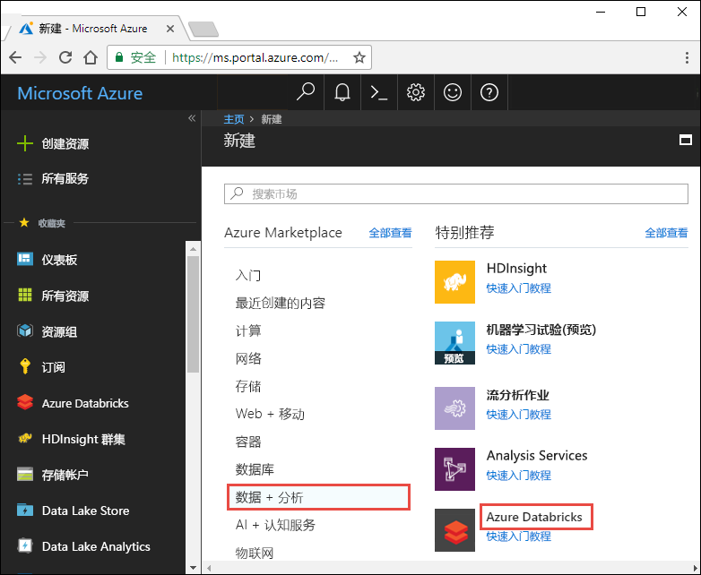
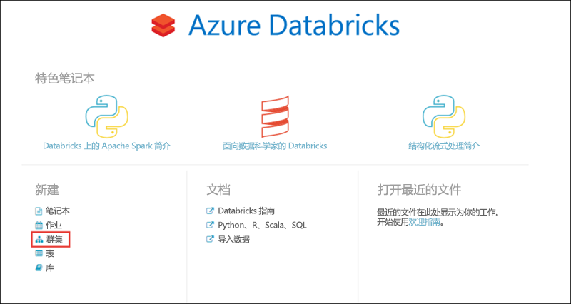
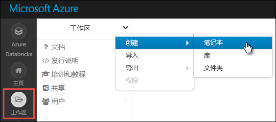
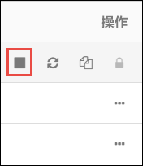

# <a name="tutorial-sentiment-analysis-on-streaming-data-using-azure-databricks"></a>教程：使用 Azure Databricks 针对流数据执行情绪分析

本教程介绍如何使用 Azure Databricks 以接近实时的速度针对数据流运行情绪分析。 使用 Azure 事件中心设置数据引入系统。 使用 Spark 事件中心连接器将事件中心的消息用到 Azure Databricks 中。 最后，使用认知服务 API 对流数据运行情绪分析。

本教程结束时，你应该已经有了来自 Twitter 的流式处理的推文（其中包含“Azure”一词），并已对推文运行情绪分析。

下图演示了应用程序流：


本教程涵盖以下任务：

> [!div class="checklist"]
> * 创建 Azure Databricks 工作区
> * 在 Azure Databricks 中创建 Spark 群集
> * 创建用于访问流数据的 Twitter 应用
> * 在 Azure Databricks 中创建 Notebook
> * 附加事件中心和 Twitter API 的库
> * 创建认知服务帐户并检索访问密钥
> * 将推文发送到事件中心
> * 读取事件中心的推文
> * 对推文运行情绪分析

如果还没有 Azure 订阅，可以在开始前[创建一个免费帐户](https://azure.microsoft.com/free/?WT.mc_id=sparkeventhubs-docs-alehall)。

> [!Note]
> 不能使用 Azure 免费试用订阅完成本教程  。
> 如果你有免费帐户，请转到个人资料并将订阅更改为“即用即付”  。 有关详细信息，请参阅 [Azure 免费帐户](https://azure.microsoft.com/free/)。 然后，[移除支出限制](https://docs.microsoft.com/azure/billing/billing-spending-limit#remove-the-spending-limit-in-azure-portal)，并为你所在区域的 vCPU [请求增加配额](https://docs.microsoft.com/azure/azure-portal/supportability/resource-manager-core-quotas-request)。 创建 Azure Databricks 工作区时，可以选择“试用版(高级 - 14天免费 DBU)”  定价层，让工作区访问免费的高级 Azure Databricks DBU 14 天。

## <a name="prerequisites"></a>必备条件

在开始学习本教程之前，请确保满足以下要求：
- Azure 事件中心命名空间。
- 命名空间中的事件中心。
- 用于访问事件中心命名空间的连接字符串。 该连接字符串应采用类似于 `Endpoint=sb://<namespace>.servicebus.windows.net/;SharedAccessKeyName=<key name>;SharedAccessKey=<key value>` 的格式。
- 事件中心的共享访问策略名称和策略密钥。

完成[创建 Azure 事件中心命名空间和事件中心](../event-hubs/event-hubs-create.md)一文中的步骤即可满足这些要求。

## <a name="sign-in-to-the-azure-portal"></a>登录到 Azure 门户

登录 [Azure 门户](https://portal.azure.com/?WT.mc_id=sparkeventhubs-docs-alehall)。

## <a name="create-an-azure-databricks-workspace"></a>创建 Azure Databricks 工作区

在本部分，使用 Azure 门户创建 Azure Databricks 工作区。

1. 在 Azure 门户中，选择“创建资源”   >   “数据 + 分析” >   “Azure Databricks”。

    

3. 在“Azure Databricks 服务”  下，提供所需的值以创建 Databricks 工作区。

    

    提供以下值：

    |properties  |说明  |
    |---------|---------|
    |**工作区名称**     | 提供 Databricks 工作区的名称        |
    |**订阅**     | 从下拉列表中选择自己的 Azure 订阅。        |
    |**资源组**     | 指定是要创建新的资源组还是使用现有的资源组。 资源组是用于保存 Azure 解决方案相关资源的容器。 有关详细信息，请参阅 [Azure 资源组概述](../azure-resource-manager/management/overview.md)。 |
    |**位置**     | 选择“美国东部 2”。  有关其他可用区域，请参阅[各区域推出的 Azure 服务](https://azure.microsoft.com/regions/services/?WT.mc_id=sparkeventhubs-docs-alehall)。        |
    |**定价层**     |  选择“标准”或“高级”。   有关这些层的详细信息，请参阅 [Databricks 价格页](https://azure.microsoft.com/pricing/details/databricks/?WT.mc_id=sparkeventhubs-docs-alehall)。       |

    选择“固定到仪表板”  ，然后选择“创建”  。

4. 创建帐户需要几分钟时间。 在创建帐户过程中，门户会在右侧显示“正在提交 Azure Databricks 的部署”  磁贴。 可能需要在仪表板上向右滚动才能看到此磁贴。 另外，还会在屏幕顶部附近显示进度条。 你可以查看任一区域来了解进度。

    

## <a name="create-a-spark-cluster-in-databricks"></a>在 Databricks 中创建 Spark 群集

1. 在 Azure 门户中，转到所创建的 Databricks 工作区，然后选择“启动工作区”。 

2. 随后将会重定向到 Azure Databricks 门户。 在门户中选择“群集”。 

    

3. 在“新建群集”页中，提供用于创建群集的值。 

    

    除以下值外，接受其他所有默认值：

   * 输入群集的名称。
   * 在本文中，请创建运行时为 **6.0** 的群集。
   * 请务必选中**在不活动超过 \_\_ 分钟后终止**复选框。 提供一个持续时间（以分钟为单位），如果群集在这段时间内一直未被使用，则会将其终止。

   选择适合你的技术标准和[预算](https://azure.microsoft.com/pricing/details/databricks/?WT.mc_id=sparkeventhubs-docs-alehall)的群集辅助角色和驱动程序节点大小。

     选择“创建群集”。  群集运行后，可将笔记本附加到该群集，并运行 Spark 作业。

## <a name="create-a-twitter-application"></a>创建 Twitter 应用程序

若要接收推文流，请在 Twitter 中创建一个应用程序。 遵照说明创建一个 Twitter 应用程序，并记下稍后需要在本教程中使用的值。

1. 在 Web 浏览器中，转到[面向开发人员的 Twitter](https://developer.twitter.com/en/apps)，然后选择“创建应用”  。 可能会看到一条消息，指出你需要申请 Twitter 开发人员帐户。 可以随意执行此操作，在你的申请获得批准后，应该会看到一封确认电子邮件。 批准开发人员帐户可能需要几天时间。

    

2. 在“创建应用程序”  页中提供新应用的详细信息，然后选择“创建 Twitter 应用程序”  。

    

    

3. 在应用程序页中选择“密钥和令牌”  选项卡，复制“使用者 API 密钥”  和“使用者 API 密钥”  的值。 此外，在“访问令牌和访问令牌机密”下选择“创建”以生成访问令牌。 复制“访问令牌”  和  “访问令牌机密”的值。

    

保存 Twitter 应用程序的检索值。 稍后在本教程中需要用到这些值。

## <a name="attach-libraries-to-spark-cluster"></a>将库附加到 Spark 群集

本教程使用 Twitter API 将推文发送到事件中心。 也可以使用 [Apache Spark 事件中心连接器](https://github.com/Azure/azure-event-hubs-spark?WT.mc_id=sparkeventhubs-docs-alehall)在 Azure 事件中心读取和写入数据。 若要将这些 API 用作群集的一部分，请将其作为库添加到 Azure Databricks，然后将其与 Spark 群集相关联。 以下说明演示如何添加库。

1. 在 Azure Databricks 工作区中，选择“群集”  ，然后选择现有的 Spark 群集。 在群集菜单中，选择“库”  ，然后单击“新安装”  。

   

   

2. 在“新建库”  页中，选择“Maven”作为“源”  。 对于“坐标”  ，请单击“搜索包”  以查找要添加的包。 下面是本教程中使用的库的 Maven 坐标：

   * Spark 事件中心连接器 - `com.microsoft.azure:azure-eventhubs-spark_2.11:2.3.10`
   * Twitter API - `org.twitter4j:twitter4j-core:4.0.7`

     

     

3. 选择“安装”  。

4. 在群集菜单中，确保两个库均已正确安装和附加。

    

6. 针对 Twitter 包 `twitter4j-core:4.0.7` 重复上述步骤。

## <a name="get-a-cognitive-services-access-key"></a>获取认知服务访问密钥

本教程介绍如何使用 [Azure 认知服务文本分析 API](../cognitive-services/text-analytics/overview.md) 以接近实时的速度对推文流运行情绪分析。 在使用这些 API 之前，必须在 Azure 上创建 Azure 认知服务帐户，并检索使用文本分析 API 所需的访问密钥。

1. 登录 [Azure 门户](https://portal.azure.com/?WT.mc_id=sparkeventhubs-docs-alehall)。

2. 选择“+ 创建资源”。 

3. 在 Azure 市场下选择“AI + 认知服务”   >   “文本分析 API”。

    

4. 在“创建”  对话框中，提供以下值：

    

   - 为认知服务帐户输入一个名称。
   - 选择在其下创建帐户的 Azure 订阅。
   - 选择 Azure 位置。
   - 选择服务定价层。 有关认知服务定价的详细信息，请参阅[定价页](https://azure.microsoft.com/pricing/details/cognitive-services/?WT.mc_id=sparkeventhubs-docs-alehall)。
   - 指定是要创建新的资源组还是选择现有的资源组。

     选择“创建”  。

5. 创建帐户后，请从“概述”  选项卡中选择“显示访问密钥”  。

    

    另请复制终结点 URL 的一部分，如屏幕截图所示。 本教程会用到此 URL。

6. 在“管理密钥”  下针对要使用的密钥选择复制图标。

    

7. 保存终结点 URL 和访问密钥的值，这些值在此步骤中已检索。 本教程后面部分需要它。

## <a name="create-notebooks-in-databricks"></a>在 Databricks 中创建 Notebook

在本部分，请使用以下名称在 Databricks 工作区中创建两个 Notebook

- **SendTweetsToEventHub** - 用于从 Twitter 获取推文并将其流式传输到事件中心的生成者 Notebook。
- **AnalyzeTweetsFromEventHub** - 用于从事件中心读取推文并运行情绪分析的使用者 Notebook。

1. 在左窗格中选择“工作区”  。 在“工作区”下拉列表中选择“创建”，然后选择“Notebook”。   

    

2. 在“创建 Notebook”  对话框中输入 **SendTweetsToEventHub**，选择 **Scala** 作为语言，并选择前面创建的 Spark 群集。

    

    选择“创建”  。

3. 重复上述步骤，创建 **AnalyzeTweetsFromEventHub** Notebook。

## <a name="send-tweets-to-event-hubs"></a>将推文发送到事件中心

在 **SendTweetsToEventHub** 笔记本中粘贴以下代码，并将占位符替换为前面创建的事件中心命名空间和 Twitter 应用程序的值。 此 Notebook 会将包含关键字“Azure”的推文实时流式传输到事件中心。

> [!NOTE]
> Twitter API 有一定的请求限制和[配额](https://developer.twitter.com/en/docs/basics/rate-limiting.html)。 如果你对 Twitter API 中的标准速率限制不满意，可以在本例中不使用 Twitter API 生成文本内容。 为此，请将变量 **dataSource** 设置为 `test` 而不是 `twitter`，并使用首选测试输入填充列表 **testSource**。

```scala
    import scala.collection.JavaConverters._
    import com.microsoft.azure.eventhubs._
    import java.util.concurrent._
    import scala.collection.immutable._
    import scala.concurrent.Future
    import scala.concurrent.ExecutionContext.Implicits.global

    val namespaceName = "<EVENT HUBS NAMESPACE>"
    val eventHubName = "<EVENT HUB NAME>"
    val sasKeyName = "<POLICY NAME>"
    val sasKey = "<POLICY KEY>"
    val connStr = new ConnectionStringBuilder()
                .setNamespaceName(namespaceName)
                .setEventHubName(eventHubName)
                .setSasKeyName(sasKeyName)
                .setSasKey(sasKey)

    val pool = Executors.newScheduledThreadPool(1)
    val eventHubClient = EventHubClient.create(connStr.toString(), pool)

    def sleep(time: Long): Unit = Thread.sleep(time)

    def sendEvent(message: String, delay: Long) = {
      sleep(delay)
      val messageData = EventData.create(message.getBytes("UTF-8"))
      eventHubClient.get().send(messageData)
      System.out.println("Sent event: " + message + "\n")
    }

    // Add your own values to the list
    val testSource = List("Azure is the greatest!", "Azure isn't working :(", "Azure is okay.")

    // Specify 'test' if you prefer to not use Twitter API and loop through a list of values you define in `testSource`
    // Otherwise specify 'twitter'
    val dataSource = "test"

    if (dataSource == "twitter") {

      import twitter4j._
      import twitter4j.TwitterFactory
      import twitter4j.Twitter
      import twitter4j.conf.ConfigurationBuilder

      // Twitter configuration!
      // Replace values below with you

      val twitterConsumerKey = "<CONSUMER API KEY>"
      val twitterConsumerSecret = "<CONSUMER API SECRET>"
      val twitterOauthAccessToken = "<ACCESS TOKEN>"
      val twitterOauthTokenSecret = "<TOKEN SECRET>"

      val cb = new ConfigurationBuilder()
        cb.setDebugEnabled(true)
        .setOAuthConsumerKey(twitterConsumerKey)
        .setOAuthConsumerSecret(twitterConsumerSecret)
        .setOAuthAccessToken(twitterOauthAccessToken)
        .setOAuthAccessTokenSecret(twitterOauthTokenSecret)

      val twitterFactory = new TwitterFactory(cb.build())
      val twitter = twitterFactory.getInstance()

      // Getting tweets with keyword "Azure" and sending them to the Event Hub in realtime!
      val query = new Query(" #Azure ")
      query.setCount(100)
      query.lang("en")
      var finished = false
      while (!finished) {
        val result = twitter.search(query)
        val statuses = result.getTweets()
        var lowestStatusId = Long.MaxValue
        for (status <- statuses.asScala) {
          if(!status.isRetweet()){
            sendEvent(status.getText(), 5000)
          }
          lowestStatusId = Math.min(status.getId(), lowestStatusId)
        }
        query.setMaxId(lowestStatusId - 1)
      }

    } else if (dataSource == "test") {
      // Loop through the list of test input data
      while (true) {
        testSource.foreach {
          sendEvent(_,5000)
        }
      }

    } else {
      System.out.println("Unsupported Data Source. Set 'dataSource' to \"twitter\" or \"test\"")
    }

    // Closing connection to the Event Hub
    eventHubClient.get().close()
```

若要运行该 Notebook，请按 **SHIFT + ENTER**。 随后会显示类似于以下片段的输出： 输出中的每个事件是包含“Azure”一词的、已引入事件中心的推文。

    Sent event: @Microsoft and @Esri launch Geospatial AI on Azure https://t.co/VmLUCiPm6q via @geoworldmedia #geoai #azure #gis #ArtificialIntelligence

    Sent event: Public preview of Java on App Service, built-in support for Tomcat and OpenJDK
    https://t.co/7vs7cKtvah
    #cloudcomputing #Azure

    Sent event: 4 Killer #Azure Features for #Data #Performance https://t.co/kpIb7hFO2j by @RedPixie

    Sent event: Migrate your databases to a fully managed service with Azure SQL Database Managed Instance | #Azure | #Cloud https://t.co/sJHXN4trDk

    Sent event: Top 10 Tricks to #Save Money with #Azure Virtual Machines https://t.co/F2wshBXdoz #Cloud

    ...
    ...

## <a name="read-tweets-from-event-hubs"></a>读取事件中心的推文

在 **AnalyzeTweetsFromEventHub** Notebook 中粘贴以下代码，并将占位符替换为前面创建的 Azure 事件中心的值。 此 Notebook 读取前面使用 **SendTweetsToEventHub** Notebook 流式传输到事件中心的推文。

```scala

    import org.apache.spark.eventhubs._
    import com.microsoft.azure.eventhubs._

    // Build connection string with the above information
    val namespaceName = "<EVENT HUBS NAMESPACE>"
    val eventHubName = "<EVENT HUB NAME>"
    val sasKeyName = "<POLICY NAME>"
    val sasKey = "<POLICY KEY>"
    val connStr = new com.microsoft.azure.eventhubs.ConnectionStringBuilder()
                .setNamespaceName(namespaceName)
                .setEventHubName(eventHubName)
                .setSasKeyName(sasKeyName)
                .setSasKey(sasKey)

    val customEventhubParameters =
      EventHubsConf(connStr.toString())
      .setMaxEventsPerTrigger(5)

    val incomingStream = spark.readStream.format("eventhubs").options(customEventhubParameters.toMap).load()

    incomingStream.printSchema

    // Sending the incoming stream into the console.
    // Data comes in batches!
    incomingStream.writeStream.outputMode("append").format("console").option("truncate", false).start().awaitTermination()
```

将返回以下输出：


    root
     |-- body: binary (nullable = true)
     |-- offset: long (nullable = true)
     |-- seqNumber: long (nullable = true)
     |-- enqueuedTime: long (nullable = true)
     |-- publisher: string (nullable = true)
     |-- partitionKey: string (nullable = true)

    -------------------------------------------
    Batch: 0
    -------------------------------------------
    +------+------+--------------+---------------+---------+------------+
    |body  |offset|sequenceNumber|enqueuedTime   |publisher|partitionKey|
    +------+------+--------------+---------------+---------+------------+
    |[50 75 62 6C 69 63 20 70 72 65 76 69 65 77 20 6F 66 20 4A 61 76 61 20 6F 6E 20 41 70 70 20 53 65 72 76 69 63 65 2C 20 62 75 69 6C 74 2D 69 6E 20 73 75 70 70 6F 72 74 20 66 6F 72 20 54 6F 6D 63 61 74 20 61 6E 64 20 4F 70 65 6E 4A 44 4B 0A 68 74 74 70 73 3A 2F 2F 74 2E 63 6F 2F 37 76 73 37 63 4B 74 76 61 68 20 0A 23 63 6C 6F 75 64 63 6F 6D 70 75 74 69 6E 67 20 23 41 7A 75 72 65]                              |0     |0             |2018-03-09 05:49:08.86 |null     |null        |
    |[4D 69 67 72 61 74 65 20 79 6F 75 72 20 64 61 74 61 62 61 73 65 73 20 74 6F 20 61 20 66 75 6C 6C 79 20 6D 61 6E 61 67 65 64 20 73 65 72 76 69 63 65 20 77 69 74 68 20 41 7A 75 72 65 20 53 51 4C 20 44 61 74 61 62 61 73 65 20 4D 61 6E 61 67 65 64 20 49 6E 73 74 61 6E 63 65 20 7C 20 23 41 7A 75 72 65 20 7C 20 23 43 6C 6F 75 64 20 68 74 74 70 73 3A 2F 2F 74 2E 63 6F 2F 73 4A 48 58 4E 34 74 72 44 6B]            |168   |1             |2018-03-09 05:49:24.752|null     |null        |
    +------+------+--------------+---------------+---------+------------+

    -------------------------------------------
    Batch: 1
    -------------------------------------------
    ...
    ...

由于输出采用二进制模式，因此请使用以下代码片段将其转换为字符串。

```scala
    import org.apache.spark.sql.types._
    import org.apache.spark.sql.functions._

    // Event Hub message format is JSON and contains "body" field
    // Body is binary, so we cast it to string to see the actual content of the message
    val messages =
      incomingStream
      .withColumn("Offset", $"offset".cast(LongType))
      .withColumn("Time (readable)", $"enqueuedTime".cast(TimestampType))
      .withColumn("Timestamp", $"enqueuedTime".cast(LongType))
      .withColumn("Body", $"body".cast(StringType))
      .select("Offset", "Time (readable)", "Timestamp", "Body")

    messages.printSchema

    messages.writeStream.outputMode("append").format("console").option("truncate", false).start().awaitTermination()
```

现在，输出如以下代码片段所示：

    root
     |-- Offset: long (nullable = true)
     |-- Time (readable): timestamp (nullable = true)
     |-- Timestamp: long (nullable = true)
     |-- Body: string (nullable = true)

    -------------------------------------------
    Batch: 0
    -------------------------------------------
    +------+-----------------+----------+-------+
    |Offset|Time (readable)  |Timestamp |Body
    +------+-----------------+----------+-------+
    |0     |2018-03-09 05:49:08.86 |1520574548|Public preview of Java on App Service, built-in support for Tomcat and OpenJDK
    https://t.co/7vs7cKtvah
    #cloudcomputing #Azure          |
    |168   |2018-03-09 05:49:24.752|1520574564|Migrate your databases to a fully managed service with Azure SQL Database Managed Instance | #Azure | #Cloud https://t.co/sJHXN4trDk    |
    |0     |2018-03-09 05:49:02.936|1520574542|@Microsoft and @Esri launch Geospatial AI on Azure https://t.co/VmLUCiPm6q via @geoworldmedia #geoai #azure #gis #ArtificialIntelligence|
    |176   |2018-03-09 05:49:20.801|1520574560|4 Killer #Azure Features for #Data #Performance https://t.co/kpIb7hFO2j by @RedPixie                                                    |
    +------+-----------------+----------+-------+
    -------------------------------------------
    Batch: 1
    -------------------------------------------
    ...
    ...

现在已通过适用于 Apache Spark 的事件中心连接器接近实时地将数据从 Azure 事件中心流式传输到 Azure Databricks 中。 有关如何使用适用于 Spark 的事件中心连接器的详细信息，请参阅[连接器文档](https://github.com/Azure/azure-event-hubs-spark/tree/master/docs?WT.mc_id=sparkeventhubs-docs-alehall)。

## <a name="run-sentiment-analysis-on-tweets"></a>对推文运行情绪分析

在此部分，请对使用 Twitter API 接收到的推文运行情绪分析。 对于此部分，请将代码片段添加到同一 **AnalyzeTweetsFromEventHub** Notebook。

一开始请将新的代码单元格添加到 Notebook 中，然后粘贴下面提供的代码片段。 此代码片段定义的数据类型适用于语言和情绪 API。

```scala
import java.io._
import java.net._
import java.util._

case class Language(documents: Array[LanguageDocuments], errors: Array[Any]) extends Serializable
case class LanguageDocuments(id: String, detectedLanguages: Array[DetectedLanguages]) extends Serializable
case class DetectedLanguages(name: String, iso6391Name: String, score: Double) extends Serializable

case class Sentiment(documents: Array[SentimentDocuments], errors: Array[Any]) extends Serializable
case class SentimentDocuments(id: String, score: Double) extends Serializable

case class RequestToTextApi(documents: Array[RequestToTextApiDocument]) extends Serializable
case class RequestToTextApiDocument(id: String, text: String, var language: String = "") extends Serializable
```

添加新的代码单元格，然后粘贴下面提供的代码片段。 此代码片段定义的对象包含各种函数，用于调用文本分析 API，以便运行语言检测和情绪分析。 确保将占位符 `<PROVIDE ACCESS KEY HERE>` 替换为针对认知服务帐户检索到的值。

```scala
import javax.net.ssl.HttpsURLConnection
import com.google.gson.Gson
import com.google.gson.GsonBuilder
import com.google.gson.JsonObject
import com.google.gson.JsonParser
import scala.util.parsing.json._

object SentimentDetector extends Serializable {

    // Cognitive Services API connection settings
    val accessKey = "<PROVIDE ACCESS KEY HERE>"
    val host = "https://cognitive-docs.cognitiveservices.azure.com/"
    val languagesPath = "/text/analytics/v2.1/languages"
    val sentimentPath = "/text/analytics/v2.1/sentiment"
    val languagesUrl = new URL(host+languagesPath)
    val sentimenUrl = new URL(host+sentimentPath)
    val g = new Gson

    def getConnection(path: URL): HttpsURLConnection = {
        val connection = path.openConnection().asInstanceOf[HttpsURLConnection]
        connection.setRequestMethod("POST")
        connection.setRequestProperty("Content-Type", "text/json")
        connection.setRequestProperty("Ocp-Apim-Subscription-Key", accessKey)
        connection.setDoOutput(true)
        return connection
    }

    def prettify (json_text: String): String = {
        val parser = new JsonParser()
        val json = parser.parse(json_text).getAsJsonObject()
        val gson = new GsonBuilder().setPrettyPrinting().create()
        return gson.toJson(json)
    }

    // Handles the call to Cognitive Services API.
    def processUsingApi(request: RequestToTextApi, path: URL): String = {
        val requestToJson = g.toJson(request)
        val encoded_text = requestToJson.getBytes("UTF-8")
        val connection = getConnection(path)
        val wr = new DataOutputStream(connection.getOutputStream())
        wr.write(encoded_text, 0, encoded_text.length)
        wr.flush()
        wr.close()

        val response = new StringBuilder()
        val in = new BufferedReader(new InputStreamReader(connection.getInputStream()))
        var line = in.readLine()
        while (line != null) {
            response.append(line)
            line = in.readLine()
        }
        in.close()
        return response.toString()
    }

    // Calls the language API for specified documents.
    def getLanguage (inputDocs: RequestToTextApi): Option[Language] = {
        try {
            val response = processUsingApi(inputDocs, languagesUrl)
            // In case we need to log the json response somewhere
            val niceResponse = prettify(response)
            // Deserializing the JSON response from the API into Scala types
            val language = g.fromJson(niceResponse, classOf[Language])
            if (language.documents(0).detectedLanguages(0).iso6391Name == "(Unknown)")
                return None
            return Some(language)
        } catch {
            case e: Exception => return None
        }
    }

    // Calls the sentiment API for specified documents. Needs a language field to be set for each of them.
    def getSentiment (inputDocs: RequestToTextApi): Option[Sentiment] = {
        try {
            val response = processUsingApi(inputDocs, sentimenUrl)
            val niceResponse = prettify(response)
            // Deserializing the JSON response from the API into Scala types
            val sentiment = g.fromJson(niceResponse, classOf[Sentiment])
            return Some(sentiment)
        } catch {
            case e: Exception => return None
        }
    }
}
```

添加另一个单元格，定义用于确定情绪的 Spark UDF（用户定义函数）。

```scala
// User Defined Function for processing content of messages to return their sentiment.
val toSentiment =
    udf((textContent: String) =>
        {
            val inputObject = new RequestToTextApi(Array(new RequestToTextApiDocument(textContent, textContent)))
            val detectedLanguage = SentimentDetector.getLanguage(inputObject)
            detectedLanguage match {
                case Some(language) =>
                    if(language.documents.size > 0) {
                        inputObject.documents(0).language = language.documents(0).detectedLanguages(0).iso6391Name
                        val sentimentDetected = SentimentDetector.getSentiment(inputObject)
                        sentimentDetected match {
                            case Some(sentiment) => {
                                if(sentiment.documents.size > 0) {
                                    sentiment.documents(0).score.toString()
                                }
                                else {
                                    "Error happened when getting sentiment: " + sentiment.errors(0).toString
                                }
                            }
                            case None => "Couldn't detect sentiment"
                        }
                    }
                    else {
                        "Error happened when getting language" + language.errors(0).toString
                    }
                case None => "Couldn't detect language"
            }
        }
    )
```

添加一个最终代码单元格，以便使用推文的内容以及与推文相关联的情绪来准备数据帧。

```scala
// Prepare a dataframe with Content and Sentiment columns
val streamingDataFrame = incomingStream.selectExpr("cast (body as string) AS Content").withColumn("Sentiment", toSentiment($"Content"))

// Display the streaming data with the sentiment
streamingDataFrame.writeStream.outputMode("append").format("console").option("truncate", false).start().awaitTermination()
```

应该看到输出如以下代码片段所示：

    -------------------------------------------
    Batch: 0
    -------------------------------------------
    +--------------------------------+------------------+
    |Content                         |Sentiment         |
    +--------------------------------+------------------+
    |Public preview of Java on App Service, built-in support for Tomcat and OpenJDK
    https://t.co/7vs7cKtvah   #cloudcomputing #Azure          |0.7761918306350708|
    |Migrate your databases to a fully managed service with Azure SQL Database Managed Instance | #Azure | #Cloud https://t.co/sJHXN4trDk    |0.8558163642883301|
    |@Microsoft and @Esri launch Geospatial AI on Azure https://t.co/VmLUCiPm6q via @geoworldmedia #geoai #azure #gis #ArtificialIntelligence|0.5               |
    |4 Killer #Azure Features for #Data #Performance https://t.co/kpIb7hFO2j by @RedPixie                                                    |0.5               |
    +--------------------------------+------------------+

在“情绪”列中，值接近于 **1** 表明  Azure 体验很好。 值接近于 **0** 表明用户在使用 Microsoft Azure 时遇到问题。

就这么简单！ 现已成功使用 Azure Databricks 以接近实时的速度将数据流式传输到 Azure 事件中心，通过事件中心连接器使用了流数据，然后对流数据运行了情绪分析。

## <a name="clean-up-resources"></a>清理资源

运行完本教程后，可以终止群集。 为此，请在 Azure Databricks 工作区的左窗格中选择“群集”  。 针对想要终止的群集，将光标移到“操作”  列下面的省略号上，选择“终止”  图标。



如果不手动终止群集，但在创建群集时选中了“在不活动 \_\_ 分钟后终止”复选框，则该群集会自动停止。 在这种情况下，如果群集保持非活动状态超过指定的时间，则会自动停止。

## <a name="next-steps"></a>后续步骤
本教程介绍了如何使用 Azure Databricks 将数据流式传输到 Azure 事件中心，然后从事件中心实时读取流数据。 你已了解如何执行以下操作：
> [!div class="checklist"]
> * 创建 Azure Databricks 工作区
> * 在 Azure Databricks 中创建 Spark 群集
> * 创建用于访问流数据的 Twitter 应用
> * 在 Azure Databricks 中创建 Notebook
> * 添加和附加事件中心和 Twitter API 的库
> * 创建 Microsoft 认知服务帐户并检索访问密钥
> * 将推文发送到事件中心
> * 读取事件中心的推文
> * 对推文运行情绪分析

请继续学习下一教程，了解如何使用 Azure Databricks 执行机器学习任务。

> [!div class="nextstepaction"]
>[使用 Azure Databricks 进行机器学习](/azure/databricks/applications/machine-learning/mllib/decision-trees)

