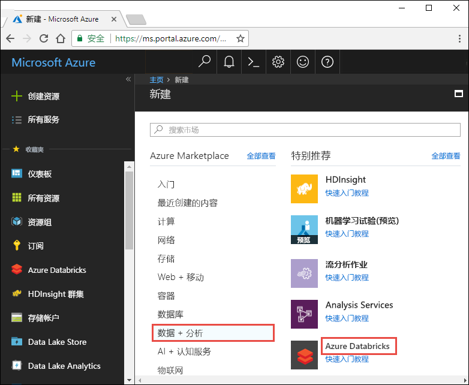
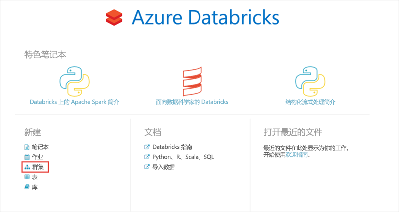
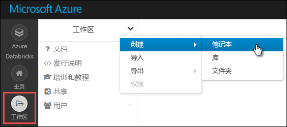
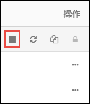

# <a name="tutorial-stream-data-into-azure-databricks-using-event-hubs"></a>教程：使用事件中心将数据流式传输到 Azure Databricks

在本教程中，我们要将数据引入系统连接到 Azure Databricks，以便以近乎实时的速度将数据流式传输到 Apache Spark 群集。 我们将使用 Azure 事件中心设置数据引入系统，然后将此系统连接到 Azure Databricks 以处理传入的消息。 若要访问数据流，可以使用 Twitter API 将推文引入事件中心。 在 Azure Databricks 中准备好数据后，可以运行分析作业来进一步分析数据。 

本教程结束时，应会收到来自 Twitter 的流式传输推文（其中包含“Azure”一词），并可以在 Azure Databricks 中阅读推文。

下图演示了应用程序流：


本教程涵盖以下任务：

> [!div class="checklist"]
> * 创建 Azure Databricks 工作区
> * 在 Azure Databricks 中创建 Spark 群集
> * 创建用于访问流数据的 Twitter 应用
> * 在 Azure Databricks 中创建 Notebook
> * 附加事件中心和 Twitter API 的库
> * 将推文发送到事件中心
> * 读取事件中心的推文

如果还没有 Azure 订阅，可以在开始前[创建一个免费帐户](https://azure.microsoft.com/free/)。

## <a name="prerequisites"></a>先决条件

在开始学习本教程之前，请确保满足以下要求：
- Azure 事件中心命名空间。
- 命名空间中的事件中心。
- 用于访问事件中心命名空间的连接字符串。 该连接字符串应采用类似于 `Endpoint=sb://<namespace>.servicebus.windows.net/;SharedAccessKeyName=<key name>;SharedAccessKey=<key value>` 的格式。
- 事件中心的共享访问策略名称和策略密钥。

完成[创建 Azure 事件中心命名空间和事件中心](../event-hubs/event-hubs-create.md)一文中的步骤即可满足这些要求。

## <a name="log-in-to-the-azure-portal"></a>登录到 Azure 门户

登录到 [Azure 门户](https://portal.azure.com/)。

## <a name="create-an-azure-databricks-workspace"></a>创建 Azure Databricks 工作区

在本部分，使用 Azure 门户创建 Azure Databricks 工作区。

1. 在 Azure 门户中，选择“创建资源” > “数据 + 分析” > “Azure Databricks”。

    

3. 在“Azure Databricks 服务”下，提供所需的值以创建 Databricks 工作区。

    

    提供以下值：

    |属性  |说明  |
    |---------|---------|
    |**工作区名称**     | 提供 Databricks 工作区的名称        |
    |**订阅**     | 从下拉列表中选择自己的 Azure 订阅。        |
    |**资源组**     | 指定是要创建新的资源组还是使用现有的资源组。 资源组是用于保存 Azure 解决方案相关资源的容器。 有关详细信息，请参阅 [Azure 资源组概述](../azure-resource-manager/resource-group-overview.md)。 |
    |**位置**     | 选择“美国东部 2”。 有关其他可用区域，请参阅[各区域推出的 Azure 服务](https://azure.microsoft.com/regions/services/)。        |
    |**定价层**     |  选择“标准”或“高级”。 有关这些层的详细信息，请参阅 [Databricks 价格页](https://azure.microsoft.com/pricing/details/databricks/)。       |

    选择“固定到仪表板”，然后选择“创建”。

4. 创建帐户需要几分钟时间。 在创建帐户过程中，门户会在右侧显示“正在提交 Azure Databricks 的部署”磁贴。 可能需要在仪表板上向右滚动才能看到此磁贴。 另外，还会在屏幕顶部附近显示进度条。 你可以查看任一区域来了解进度。

    

## <a name="create-a-spark-cluster-in-databricks"></a>在 Databricks 中创建 Spark 群集

1. 在 Azure 门户中，转到所创建的 Databricks 工作区，然后选择“启动工作区”。

2. 随后将会重定向到 Azure Databricks 门户。 在门户中选择“群集”。

    

3. 在“新建群集”页中，提供用于创建群集的值。

    

    除以下值外，接受其他所有默认值：

    * 输入群集的名称。
    * 在本文中，请创建运行时为 **4.0** 的群集。
    * 请务必选中**在不活动超过 ____ 分钟后终止**复选框。 提供一个持续时间（以分钟为单位），如果群集在这段时间内一直未被使用，则会将其终止。

    选择“创建群集”。 群集运行后，可将笔记本附加到该群集，并运行 Spark 作业。

## <a name="create-a-twitter-application"></a>创建 Twitter 应用程序

若要接收推文流，请在 Twitter 中创建一个应用程序。 遵照说明创建一个 Twitter 应用程序，并记下稍后需要在本教程中使用的值。

1. 在 Web 浏览器中，转到[Twitter 应用程序管理](https://apps.twitter.com/)，选择**创建新应用**。

    

2. 在“创建应用程序”页中提供新应用的详细信息，然后选择“创建 Twitter 应用程序”。

    

3. 在应用程序页中选择“密钥和访问令牌”选项卡，复制“使用密钥”和“使用者机密”的值。 此外，请选择“创建我的访问令牌”以生成访问令牌。 复制“访问令牌”和“访问令牌机密”的值。

    

保存 Twitter 应用程序的检索值。 稍后在本教程中需要用到这些值。

## <a name="attach-libraries-to-spark-cluster"></a>将库附加到 Spark 群集

本教程使用 Twitter API 将推文发送到事件中心。 也可以使用 [Apache Spark 事件中心连接器](https://github.com/Azure/azure-event-hubs-spark)在 Azure 事件中心读取和写入数据。 若要将这些 API 用作群集的一部分，请将其作为库添加到 Azure Databricks，然后将其与 Spark 群集相关联。 以下说明介绍如何将库添加到工作区中的 **Shared** 文件夹。

1.  在 Azure Databricks 工作区中选择“工作区”，然后右键单击“共享”。 从上下文菜单中选择“创建” > “库”。

    

2. 在“新建库”页中，为“源”选择“Maven 坐标”。 对于“坐标”，请输入要添加的包的坐标。 下面是本教程中使用的库的 Maven 坐标：

    * Spark 事件中心连接器 - `com.microsoft.azure:azure-eventhubs-spark_2.11:2.3.1`
    * Twitter API - `org.twitter4j:twitter4j-core:4.0.6`

    

3. 选择“创建库”。

4. 选择库添加到的文件夹，然后选择库名称。

    

5. 在库页上，选择要在其中使用该库的群集。 将库成功关联到群集后，状态会立即更改为“已附加”。

    

6. 针对 Twitter 包 `twitter4j-core:4.0.6` 重复上述步骤。

## <a name="create-notebooks-in-databricks"></a>在 Databricks 中创建笔记本

在本部分，我们将使用以下名称在 Databricks 工作区中创建两个笔记本：

- **SendTweetsToEventHub** - 用于从 Twitter 获取推文并将其流式传输到事件中心的生成者笔记本。
- **ReadTweetsFromEventHub** - 用于从事件中心读取推文的使用者笔记本。

1. 在左窗格中选择**工作区**。 在**工作区**下拉列表中，选择**创建** > **笔记本**。

    

2. 在“创建 Notebook”对话框中输入 **SendTweetsToEventHub**，选择 **Scala** 作为语言，并选择前面创建的 Spark 群集。

    

    选择**创建**。

3. 重复上述步骤创建 **ReadTweetsFromEventHub** 笔记本。

## <a name="send-tweets-to-event-hubs"></a>将推文发送到事件中心

在 **SendTweetsToEventHub** 笔记本中粘贴以下代码，并将占位符替换为前面创建的事件中心命名空间和 Twitter 应用程序的值。 此笔记本会将包含关键字“Azure”的推文实时流式传输到事件中心。

```scala
    import java.util._
    import scala.collection.JavaConverters._
    import com.microsoft.azure.eventhubs._
    import java.util.concurrent._

    val namespaceName = "<EVENT HUBS NAMESPACE>"
    val eventHubName = "<EVENT HUB NAME>"
    val sasKeyName = "<POLICY NAME>"
    val sasKey = "<POLICY KEY>"
    val connStr = new ConnectionStringBuilder()
                .setNamespaceName(namespaceName)
                .setEventHubName(eventHubName)
                .setSasKeyName(sasKeyName)
                .setSasKey(sasKey)

    val pool = Executors.newFixedThreadPool(1)
    val eventHubClient = EventHubClient.create(connStr.toString(), pool)

    def sendEvent(message: String) = {
      val messageData = EventData.create(message.getBytes("UTF-8"))
      eventHubClient.get().send(messageData)
      System.out.println("Sent event: " + message + "\n")
    }

    import twitter4j._
    import twitter4j.TwitterFactory
    import twitter4j.Twitter
    import twitter4j.conf.ConfigurationBuilder

    // Twitter configuration!
    // Replace values below with yours

    val twitterConsumerKey = "<CONSUMER KEY>"
    val twitterConsumerSecret = "<CONSUMER SECRET>"
    val twitterOauthAccessToken = "<ACCESS TOKEN>"
    val twitterOauthTokenSecret = "<TOKEN SECRET>"

    val cb = new ConfigurationBuilder()
      cb.setDebugEnabled(true)
      .setOAuthConsumerKey(twitterConsumerKey)
      .setOAuthConsumerSecret(twitterConsumerSecret)
      .setOAuthAccessToken(twitterOauthAccessToken)
      .setOAuthAccessTokenSecret(twitterOauthTokenSecret)

    val twitterFactory = new TwitterFactory(cb.build())
    val twitter = twitterFactory.getInstance()

    // Getting tweets with keyword "Azure" and sending them to the Event Hub in realtime!

    val query = new Query(" #Azure ")
    query.setCount(100)
    query.lang("en")
    var finished = false
    while (!finished) {
      val result = twitter.search(query)
      val statuses = result.getTweets()
      var lowestStatusId = Long.MaxValue
      for (status <- statuses.asScala) {
        if(!status.isRetweet()){
          sendEvent(status.getText())
        }
        lowestStatusId = Math.min(status.getId(), lowestStatusId)
        Thread.sleep(2000)
      }
      query.setMaxId(lowestStatusId - 1)
    }

    // Closing connection to the Event Hub
    eventHubClient.get().close()
```

若要运行该笔记本，请按 **SHIFT + ENTER**。 随后会显示类似于以下片段的输出： 输出中的每个事件是包含“Azure”一词的、已引入事件中心的推文。

    Sent event: @Microsoft and @Esri launch Geospatial AI on Azure https://t.co/VmLUCiPm6q via @geoworldmedia #geoai #azure #gis #ArtificialIntelligence

    Sent event: Public preview of Java on App Service, built-in support for Tomcat and OpenJDK
    https://t.co/7vs7cKtvah
    #cloudcomputing #Azure

    Sent event: 4 Killer #Azure Features for #Data #Performance https://t.co/kpIb7hFO2j by @RedPixie

    Sent event: Migrate your databases to a fully managed service with Azure SQL Database Managed Instance | #Azure | #Cloud https://t.co/sJHXN4trDk

    Sent event: Top 10 Tricks to #Save Money with #Azure Virtual Machines https://t.co/F2wshBXdoz #Cloud

    ...
    ...

## <a name="read-tweets-from-event-hubs"></a>读取事件中心的推文

在 **ReadTweetsFromEventHub** 笔记本中粘贴以下代码，并将占位符替换为前面创建的 Azure 事件中心的值。 此笔记本读取前面已使用 **SendTweetsToEventHub** 笔记本流式传输到事件中心的推文。

```scala
    import org.apache.spark.eventhubs._

    // Build connection string with the above information
    val connectionString = ConnectionStringBuilder("<EVENT HUBS CONNECTION STRING>")
      .setEventHubName("<EVENT HUB NAME>")
      .build

    val customEventhubParameters =
      EventHubsConf(connectionString)
      .setMaxEventsPerTrigger(5)

    val incomingStream = spark.readStream.format("eventhubs").options(customEventhubParameters.toMap).load()

    incomingStream.printSchema

    // Sending the incoming stream into the console.
    // Data comes in batches!
    incomingStream.writeStream.outputMode("append").format("console").option("truncate", false).start().awaitTermination()
```

将返回以下输出：


    root
     |-- body: binary (nullable = true)
     |-- offset: long (nullable = true)
     |-- seqNumber: long (nullable = true)
     |-- enqueuedTime: long (nullable = true)
     |-- publisher: string (nullable = true)
     |-- partitionKey: string (nullable = true)

    -------------------------------------------
    Batch: 0
    -------------------------------------------
    +------+------+--------------+---------------+---------+------------+
    |body  |offset|sequenceNumber|enqueuedTime   |publisher|partitionKey|
    +------+------+--------------+---------------+---------+------------+
    |[50 75 62 6C 69 63 20 70 72 65 76 69 65 77 20 6F 66 20 4A 61 76 61 20 6F 6E 20 41 70 70 20 53 65 72 76 69 63 65 2C 20 62 75 69 6C 74 2D 69 6E 20 73 75 70 70 6F 72 74 20 66 6F 72 20 54 6F 6D 63 61 74 20 61 6E 64 20 4F 70 65 6E 4A 44 4B 0A 68 74 74 70 73 3A 2F 2F 74 2E 63 6F 2F 37 76 73 37 63 4B 74 76 61 68 20 0A 23 63 6C 6F 75 64 63 6F 6D 70 75 74 69 6E 67 20 23 41 7A 75 72 65]                              |0     |0             |2018-03-09 05:49:08.86 |null     |null        |
    |[4D 69 67 72 61 74 65 20 79 6F 75 72 20 64 61 74 61 62 61 73 65 73 20 74 6F 20 61 20 66 75 6C 6C 79 20 6D 61 6E 61 67 65 64 20 73 65 72 76 69 63 65 20 77 69 74 68 20 41 7A 75 72 65 20 53 51 4C 20 44 61 74 61 62 61 73 65 20 4D 61 6E 61 67 65 64 20 49 6E 73 74 61 6E 63 65 20 7C 20 23 41 7A 75 72 65 20 7C 20 23 43 6C 6F 75 64 20 68 74 74 70 73 3A 2F 2F 74 2E 63 6F 2F 73 4A 48 58 4E 34 74 72 44 6B]            |168   |1             |2018-03-09 05:49:24.752|null     |null        |
    +------+------+--------------+---------------+---------+------------+

    -------------------------------------------
    Batch: 1
    -------------------------------------------
    ...
    ...

由于输出采用二进制模式，因此请使用以下代码片段将其转换为字符串。

```scala
    import org.apache.spark.sql.types._
    import org.apache.spark.sql.functions._

    // Event Hub message format is JSON and contains "body" field
    // Body is binary, so we cast it to string to see the actual content of the message
    val messages =
      incomingStream
      .withColumn("Offset", $"offset".cast(LongType))
      .withColumn("Time (readable)", $"enqueuedTime".cast(TimestampType))
      .withColumn("Timestamp", $"enqueuedTime".cast(LongType))
      .withColumn("Body", $"body".cast(StringType))
      .select("Offset", "Time (readable)", "Timestamp", "Body")

    messages.printSchema

    messages.writeStream.outputMode("append").format("console").option("truncate", false).start().awaitTermination()
```

现在，输出如以下代码片段所示：

    root
     |-- Offset: long (nullable = true)
     |-- Time (readable): timestamp (nullable = true)
     |-- Timestamp: long (nullable = true)
     |-- Body: string (nullable = true)

    -------------------------------------------
    Batch: 0
    -------------------------------------------
    +------+-----------------+----------+-------+
    |Offset|Time (readable)  |Timestamp |Body
    +------+-----------------+----------+-------+
    |0     |2018-03-09 05:49:08.86 |1520574548|Public preview of Java on App Service, built-in support for Tomcat and OpenJDK
    https://t.co/7vs7cKtvah
    #cloudcomputing #Azure          |
    |168   |2018-03-09 05:49:24.752|1520574564|Migrate your databases to a fully managed service with Azure SQL Database Managed Instance | #Azure | #Cloud https://t.co/sJHXN4trDk    |
    |0     |2018-03-09 05:49:02.936|1520574542|@Microsoft and @Esri launch Geospatial AI on Azure https://t.co/VmLUCiPm6q via @geoworldmedia #geoai #azure #gis #ArtificialIntelligence|
    |176   |2018-03-09 05:49:20.801|1520574560|4 Killer #Azure Features for #Data #Performance https://t.co/kpIb7hFO2j by @RedPixie                                                    |
    +------+-----------------+----------+-------+
    -------------------------------------------
    Batch: 1
    -------------------------------------------
    ...
    ...

就这么简单！ 现已成功使用 Azure Databricks 以近乎实时的速度将数据流式传输到 Azure 事件中心。 接下来，可以通过适用于 Apache Spark 的事件中心连接器来使用流数据。 有关如何使用适用于 Spark 的事件中心连接器的详细信息，请参阅[连接器文档](https://github.com/Azure/azure-event-hubs-spark/tree/master/docs)。

## <a name="clean-up-resources"></a>清理资源

运行完本教程后，可以终止群集。 为此，请在 Azure Databricks 工作区的左窗格中选择“群集”。 针对想要终止的群集，将光标移到“操作”列下面的省略号上，选择“终止”图标。



如果不手动终止群集，但在创建群集时选中了“在不活动 __ 分钟后终止”复选框，则该群集会自动停止。 在这种情况下，如果群集保持非活动状态超过指定的时间，则会自动停止。

## <a name="next-steps"></a>后续步骤
本教程介绍了如何：

> [!div class="checklist"]
> * 创建 Azure Databricks 工作区
> * 在 Azure Databricks 中创建 Spark 群集
> * 创建用于生成流数据的 Twitter 应用
> * 在 Azure Databricks 中创建笔记本
> * 添加事件中心和 Twitter API 的库
> * 将推文发送到事件中心
> * 读取事件中心内的推文

继续学习下一教程，了解如何使用 Azure Databricks 和 [Microsoft 认知服务 API](../cognitive-services/text-analytics/overview.md) 针对流数据执行情绪分析。

> [!div class="nextstepaction"]
>[使用 Azure Databricks 针对流数据执行情绪分析](databricks-sentiment-analysis-cognitive-services.md)
