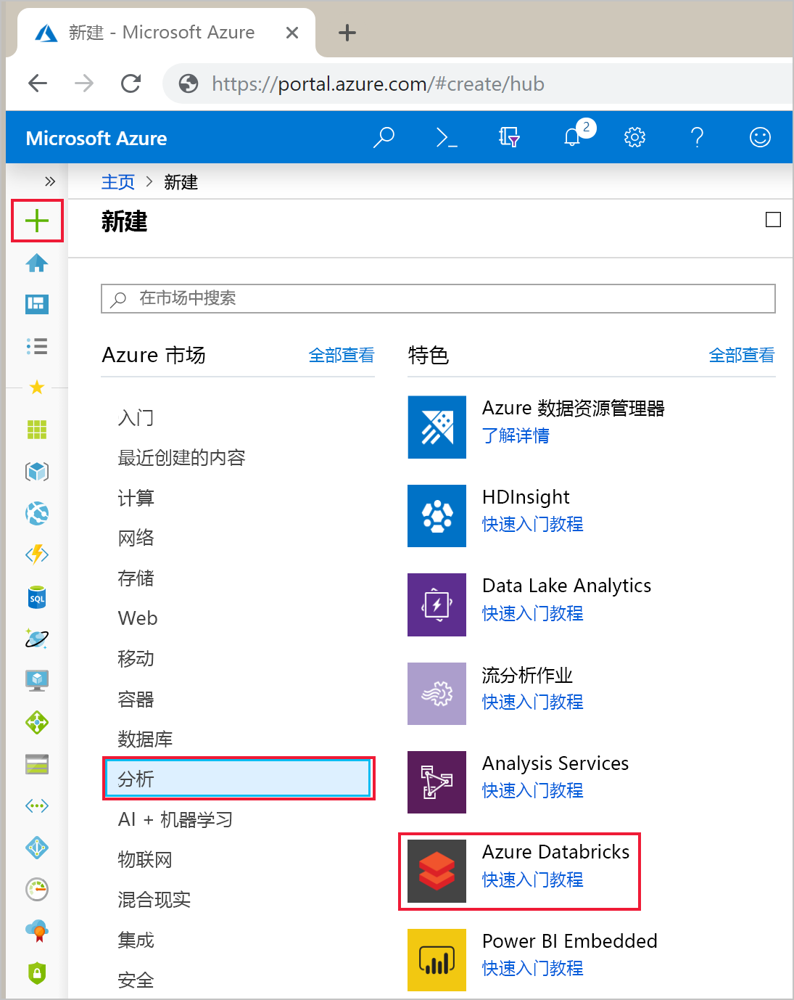
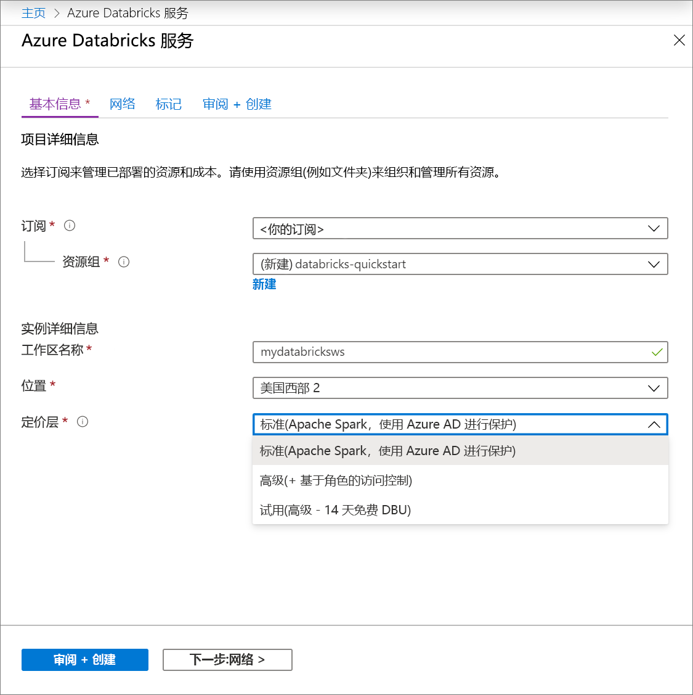
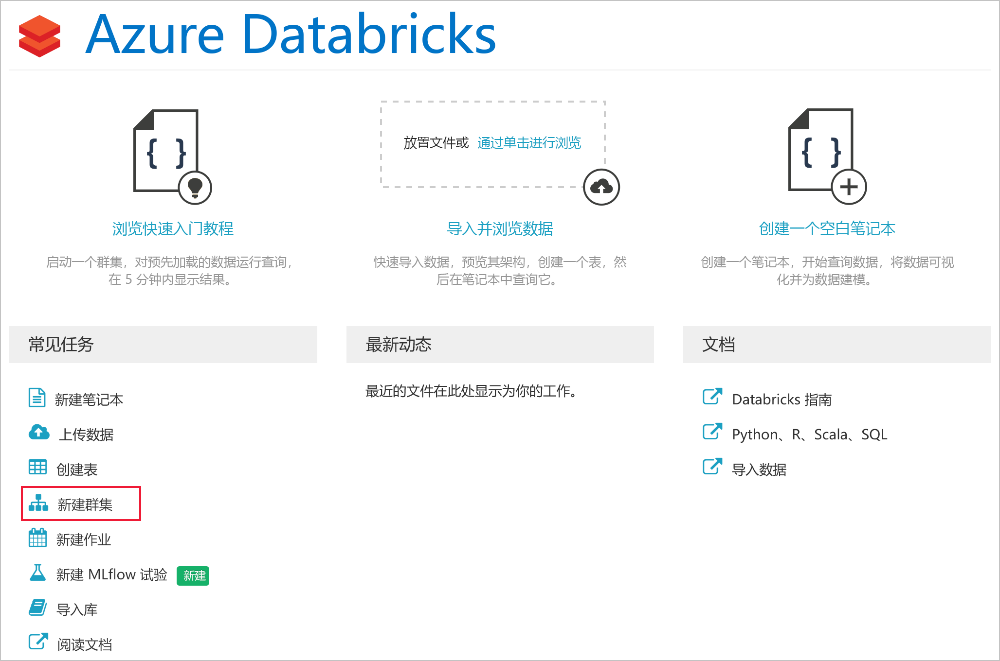
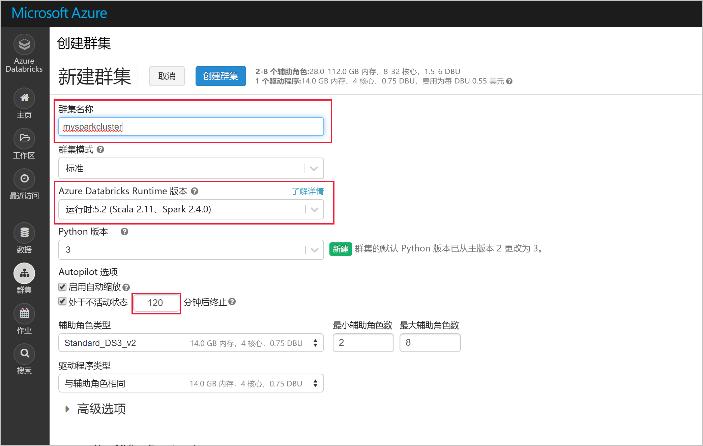
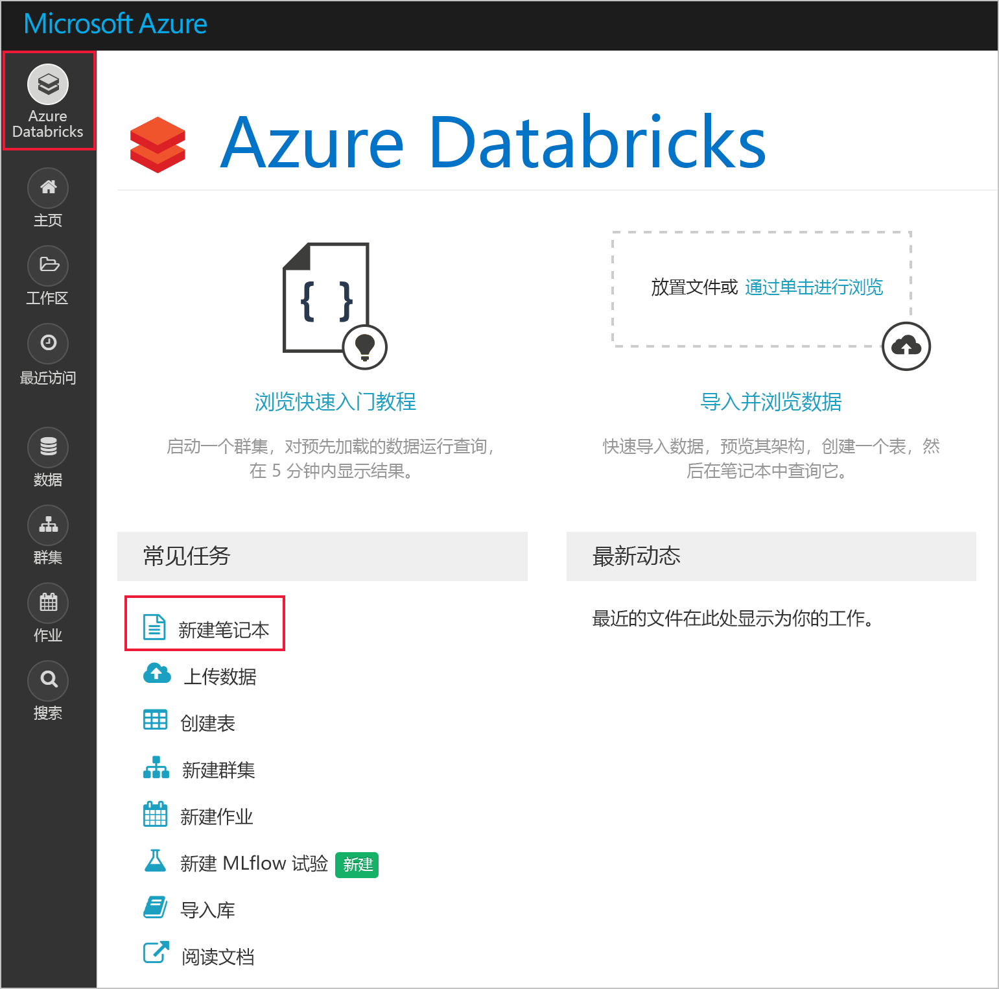
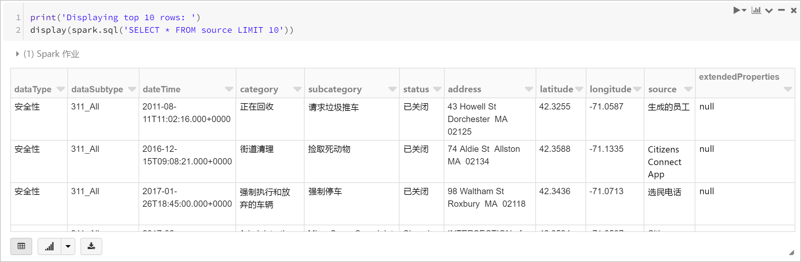
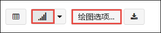
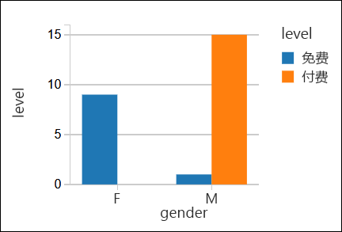
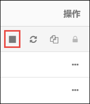

# <a name="quickstart-run-a-spark-job-on-azure-databricks-using-the-azure-portal"></a>快速入门：使用 Azure 门户在 Azure Databricks 上运行 Spark 作业

本快速入门介绍如何创建一个 Azure Databricks 工作区，并在该工作区中创建一个 Apache Spark 群集。 最后，介绍如何在 Databricks 群集中运行 Spark 作业。 有关 Azure Databricks 的详细信息，请参阅[什么是 Azure Databricks？](what-is-azure-databricks.md)

## <a name="log-in-to-the-azure-portal"></a>登录到 Azure 门户

登录到 [Azure 门户](https://portal.azure.com)。

## <a name="create-a-databricks-workspace"></a>创建 Databricks 工作区

在本部分，使用 Azure 门户创建 Azure Databricks 工作区。 

1. 在 Azure 门户中，依次单击 **+**、“数据 + 分析”、“Azure Databricks (预览)”。 

    

2. 在“Azure Databricks (预览版)”下，单击“创建”。

    > [!NOTE]
    > Azure Databricks 目前以受限预览版提供。 如果希望我们考虑将你的 Azure 订阅列入预览版的白名单，必须填写[注册表单](https://databricks.azurewebsites.net/)。

2. 在“Azure Databricks 服务”下提供以下值：

    

    * 对于“工作区名称”，请提供 Databricks 工作区的名称。
    * 对于“订阅”，请从下拉列表中选择自己的 Azure 订阅。
    * 对于“资源组”，指定是要创建新的资源组还是使用现有资源组。 资源组是用于保存 Azure 解决方案相关资源的容器。 有关详细信息，请参阅 [Azure 资源组概述](../azure-resource-manager/resource-group-overview.md)。
    * 对于“位置”，请选择“美国东部 2”。 有关其他可用区域，请参阅[各区域推出的 Azure 服务](https://azure.microsoft.com/regions/services/)。

3. 单击“创建” 。

## <a name="create-a-spark-cluster-in-databricks"></a>在 Databricks 中创建 Spark 群集

1. 在 Azure 门户中，转到所创建的 Databricks 工作区，单击“初始化工作区”。

2. 随后将会重定向到 Azure Databricks 门户。 在该门户中，单击“群集”。

    

3. 在“新建群集”页中，提供用于创建群集的值。

    

    * 输入群集的名称。
    * 请务必选中“在活动超过 ___ 分钟后终止”复选框。 提供一个持续时间（以分钟为单位），如果群集在这段时间内一直未被使用，则会将其终止。
    * 接受其他所有默认值。 
    * 单击“创建群集”。 群集运行后，可将笔记本附加到该群集，并运行 Spark 作业。

有关创建群集的详细信息，请参阅[在 Azure Databricks 中创建 Spark 群集](https://docs.azuredatabricks.net/user-guide/clusters/create.html)。

## <a name="run-a-spark-sql-job"></a>运行 Spark SQL 作业

开始学习本部分之前，必须完成以下操作：

* [创建 Azure 存储帐户](../storage/common/storage-create-storage-account.md#create-a-storage-account)。 
* [从 Github](https://github.com/Azure/usql/blob/master/Examples/Samples/Data/json/radiowebsite/small_radio_json.json) 下载示例 JSON 文件。 
* 将示例 JSON 文件上传到所创建的 Azure 存储帐户。 可以使用 [Microsoft Azure 存储资源管理器](../vs-azure-tools-storage-manage-with-storage-explorer.md)上传该文件。

执行以下步骤在 Databricks 中创建笔记本、将该笔记本配置为从 Azure Blob 存储帐户读取数据，然后针对这些数据运行 Spark SQL 作业。

1. 在左窗格中，单击“工作区”。 在“工作区”下拉列表中，依次单击“创建”、“笔记本”。

    

2. 在“创建笔记本”对话框中输入一个名称，选择“Scala”作为语言，并选择前面创建的 Spark 群集。

    

    单击“创建” 。

3. 在以下代码片段中，请将 `{YOUR STORAGE ACCOUNT NAME}` 替换为所创建的 Azure 存储帐户名称，将 `{YOUR STORAGE ACCOUNT ACCESS KEY}` 替换为存储帐户访问密钥。 在笔记本上的某个空白单元中粘贴该代码片段，并按 SHIFT + ENTER 运行该代码单元。 此代码片段会将笔记本配置为从 Azure Blob 存储读取数据。

       spark.conf.set("fs.azure.account.key.{YOUR STORAGE ACCOUNT NAME}.blob.core.windows.net", "{YOUR STORAGE ACCOUNT ACCESS KEY}")
    
    有关如何检索存储帐户密钥的说明，请参阅[管理存储访问密钥](../storage/common/storage-create-storage-account.md#manage-your-storage-account)。

    > [!NOTE]
    > 还可以对 Azure Databricks 中的 Spark 群集使用 Azure Data Lake Store。 有关说明，请参阅[对 Azure Databricks 使用 Data Lake Store](https://docs.azuredatabricks.net/spark/latest/data-sources/azure/azure-storage.html#azure-data-lake-store)。

4. 运行一条 SQL 语句，以使用示例 JSON 数据文件 **small_radio_json.json** 中的数据创建一个临时表。 在以下代码片段中，请将占位符值替换为容器名称和存储帐户名称。 在笔记本上的某个空白单元中粘贴该代码片段，并按 SHIFT + ENTER。 在该代码片段中，`path` 表示已上传到 Azure 存储帐户的示例 JSON 文件所在的位置。

    ```sql
    %sql 
    CREATE TEMPORARY TABLE radio_sample_data
    USING json
    OPTIONS (
     path "wasbs://{YOUR CONTAINER NAME}@{YOUR STORAGE ACCOUNT NAME}.blob.core.windows.net/small_radio_json.json"
    )
    ```

    成功完成命令后，Databricks 群集中将以表的形式列出 JSON 文件中的所有数据。

    使用 `%sql` 语言魔法 (magic) 命令可从笔记本运行 SQL 代码，即使该笔记本采用另一种类型。 有关详细信息，请参阅[在笔记本中混合使用语言](https://docs.azuredatabricks.net/user-guide/notebooks/index.html#mixing-languages-in-a-notebook)。

5. 让我们看看示例 JSON 数据的快照，以便更好地了解所运行的查询。 将以下代码片段粘贴到代码单元中，并按 **SHIFT + ENTER**。

    ```sql
    %sql 
    SELECT * from radio_sample_data
    ```

6. 随后将会看到以下屏幕截图中所示的表格输出（此处只显示了一部分列）：

    

    在其他详细信息中，示例数据捕获了无线电频道的听众的性别（列名为“性别”），以及这些听众的订阅是免费还是付费的（列名为“级别”）。

7. 现在创建这些数据的可视表示形式，以显示每种性别、有多少用户使用免费帐户和多少用户是付费的订户。 在表格输出的底部，单击“条形图”图标，再单击“绘图选项”。

    

8. 在“自定义绘图”中，按屏幕截图中所示拖放值。

    

    * 将“键”设置为“性别”。
    * 将“序列分组”设置为“级别”。
    * 将“值”设置为“级别”。
    * 将“聚合”设置为“计数”。

    单击“应用” 。

9. 输出将显示以下屏幕截图中所示的可视表示形式：

     

## <a name="clean-up-resources"></a>清理资源

如果在创建 Spark 群集时选中了复选框“活动超过 ___ 分钟后终止”，在处于非活动状态达到指定的时间后，该群集会自动终止。

如果未选中该复选框，则必须手动终止群集。 为此，请在 Azure Databricks 工作区的左窗格中，单击“群集”。 针对想要终止的群集，将光标移到“操作”列下面的省略号上，单击“终止”图标。



## <a name="next-steps"></a>后续步骤

在本文中，我们已在 Azure Databricks 中创建一个 Spark 群集，并使用 Azure 存储中的数据运行了一个 Spark 作业。 我们还可以查看 [Spark 数据源](https://docs.azuredatabricks.net/spark/latest/data-sources/index.html)，了解如何将其他数据源中的数据导入 Azure Databricks。 请继续学习下一篇文章，了解如何对 Azure Databricks 使用 Azure Data Lake Store。

> [!div class="nextstepaction"]
>[对 Azure Databricks 使用 Data Lake Store](https://docs.azuredatabricks.net/spark/latest/data-sources/azure/azure-storage.html#azure-data-lake-store)