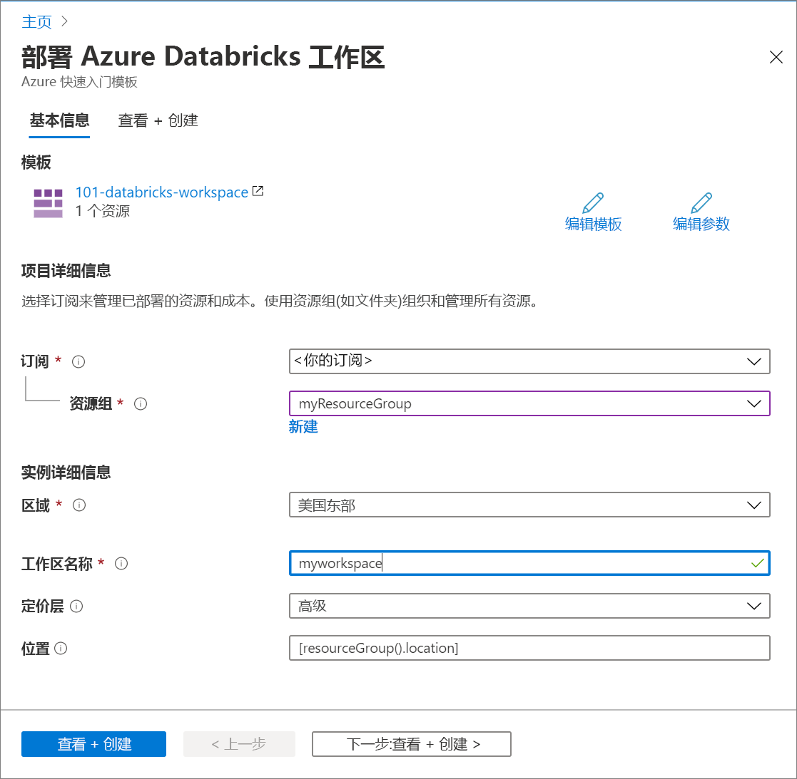

# <a name="quickstart-create-an-azure-databricks-workspace-by-using-the-azure-resource-manager-template"></a>快速入门：通过使用 Azure 资源管理器模板创建 Azure Databricks 工作区

在本快速入门中，将使用 Azure 资源管理器模板创建 Azure Databricks 工作区。 创建工作区后，将验证部署。

[!INCLUDE [About Azure Resource Manager](../../includes/resource-manager-quickstart-introduction.md)]

## <a name="prerequisites"></a>先决条件

若要完成本文，需要做好以下准备：

* 拥有 Azure 订阅 - [免费创建订阅](https://azure.microsoft.com/free/)

## <a name="create-an-azure-databricks-workspace"></a>创建 Azure Databricks 工作区

### <a name="review-the-template"></a>查看模板

本快速入门中使用的模板来自 [Azure 快速入门模板](https://github.com/Azure/azure-quickstart-templates/tree/master/101-databricks-workspace)。

:::code language="json" source="~/quickstart-templates/101-databricks-workspace/azuredeploy.json" range="1-53":::

模板中定义的 Azure 资源是 Microsoft.Databricks/workspaces：创建 Azure Databricks 工作区。 

## <a name="deploy-the-template"></a>部署模板

在本部分，我们将使用 Azure 资源管理器模板创建 Azure Databricks 工作区。

1. 选择下图登录到 Azure 并打开一个模板。 模板将创建 Azure Databricks 工作区。

   [](https://portal.azure.com/#create/Microsoft.Template/uri/https%3A%2F%2Fraw.githubusercontent.com%2FAzure%2Fazure-quickstart-templates%2Fmaster%2F101-databricks-workspace%2Fazuredeploy.json)

2. 提供所需的值以创建 Azure Databricks 工作区

   

   提供以下值：

   |properties  |说明  |
   |---------|---------|
   |**订阅**     | 从下拉列表中选择自己的 Azure 订阅。        |
   |**资源组**     | 指定是要创建新的资源组还是使用现有的资源组。 资源组是用于保存 Azure 解决方案相关资源的容器。 有关详细信息，请参阅 [Azure 资源组概述](../azure-resource-manager/management/overview.md)。 |
   |**位置**     | 选择“美国东部 2”。 有关其他可用区域，请参阅[各区域推出的 Azure 服务](https://azure.microsoft.com/regions/services/)。        |
   |**工作区名称**     | 提供 Databricks 工作区的名称        |
   |**定价层**     |  选择“标准”或“高级”。  有关这些层的详细信息，请参阅 [Databricks 价格页](https://azure.microsoft.com/pricing/details/databricks/)。       |

3. 选择“查看 + 创建”，然后选择“创建” 。

4. 创建工作区需要几分钟时间。 当工作区部署失败时，仍然会在失败状态下创建工作区。 删除失败的工作区，并创建一个解决部署错误的新工作区。 删除失败的工作区时，托管资源组和任何成功部署的资源也将被删除。

## <a name="review-deployed-resources"></a>查看已部署的资源

可以使用 Azure 门户检查 Azure Databricks 工作区，或者使用以下 Azure CLI 或 Azure PowerShell 脚本来列出资源。

### <a name="azure-cli"></a>Azure CLI

```azurecli-interactive
echo "Enter your Azure Databricks workspace name:" &&
read databricksWorkspaceName &&
echo "Enter the resource group where the Azure Databricks workspace exists:" &&
read resourcegroupName &&
az databricks workspace show -g $resourcegroupName -n $databricksWorkspaceName
```

### <a name="azure-powershell"></a>Azure PowerShell

```azurepowershell-interactive
$resourceGroupName = Read-Host -Prompt "Enter the resource group name where your Azure Databricks workspace exists"
(Get-AzResource -ResourceType "Microsoft.Databricks/workspaces" -ResourceGroupName $resourceGroupName).Name
 Write-Host "Press [ENTER] to continue..."
```

## <a name="clean-up-resources"></a>清理资源

如果打算继续学习后续教程，可能需要保留这些资源。 如果不再需要资源组，可以将其删除，这将删除 Azure Databricks 工作区和相关的受管理资源。 使用 Azure CLI 或 Azure PowerShell 删除资源组：

### <a name="azure-cli"></a>Azure CLI

```azurecli-interactive
echo "Enter the Resource Group name:" &&
read resourceGroupName &&
az group delete --name $resourceGroupName &&
echo "Press [ENTER] to continue ..."
```

### <a name="azure-powershell"></a>Azure PowerShell

```azurepowershell-interactive
$resourceGroupName = Read-Host -Prompt "Enter the Resource Group name"
Remove-AzResourceGroup -Name $resourceGroupName
Write-Host "Press [ENTER] to continue..."
```

## <a name="next-steps"></a>后续步骤

在本快速入门中，你通过使用 Azure 资源管理器模板创建了 Azure Databricks 工作区，并验证了部署。 请继续学习下一篇文章，了解如何使用 Azure Databricks 执行 ETL（提取、转换和加载数据）操作。

> [!div class="nextstepaction"]
> [使用 Azure Databricks 提取、转换和加载数据](databricks-extract-load-sql-data-warehouse.md)
