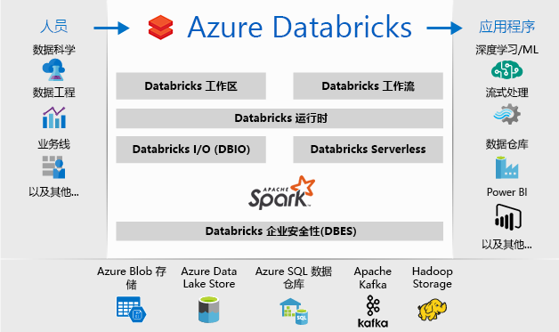
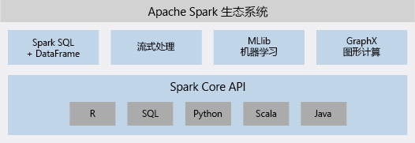

# 什么是 Azure Databricks？

Azure Databricks 是基于 Apache Spark 的分析平台，已针对 Microsoft Azure 云服务平台进行优化。 我们与 Apache Spark 的创建者一起设计了 Databricks，并将其与 Azure 集成以提供一键式安装程序、简化的工作流程以及交互式工作区，从而使数据科学家、数据工程师和业务分析员之间可以进行合作。

## 基于 Apache Spark 的分析平台

Azure Databricks 包括配套的开源 Apache Spark 群集技术和功能。 Azure Databricks 中的 Spark 包括以下组件：

* **Spark SQL 和数据帧**：Spark SQL 是用于处理结构化数据的 Spark 模块。 数据帧是已组织成命名列的分布式数据集合。 它在概念上相当于关系型数据库中的表，或 R/Python 中的数据帧。

* **流式处理**：针对分析与交互式应用程序的实时数据处理和分析。 与 HDFS、Flume 和 Kafka 集成。

* **MLib**：由常见学习算法和实用工具（包括分类、回归、聚集、协作筛选、维数约简以及底层优化基元）组成的机器学习库。

* **GraphX**：针对从认知分析到数据浏览的广泛范围显示图形和执行图形计算。

* **Spark Core API**：包含对 R、SQL、Python、Scala 和 Java 的支持。

## Azure Databricks 中的 Apache Spark

Azure Databricks 构建在 Spark 功能的基础之上，提供一个无管理云平台，其中包括：

- 完全托管的 Spark 群集
- 用于浏览和可视化数据的交互工作区
- 为基于 Spark 的偏好应用程序提供动力的平台

### 完全在云中托管的 Apache Spark 群集

Azure Databricks 在云中拥有安全可靠的生产环境，由 Spark 专家进行管理和提供支持。 可以：

* 在几秒钟内创建群集。
* 动态自动扩展和缩减群集（包括无服务器群集）并在团队中共享群集。 
* 通过 REST API 以编程方式使用群集。 
* 使用基于 Spark 的安全数据集成功能，在无需集中化的情况下统一数据。 
* 即时访问每个版本中的最新 Apache Spark 功能。

### Databricks 运行时
Databricks 运行时构建在 Apache Spark 的基础之上，原生针对 Azure 云构建。 

与“无服务器”选项一样，Azure Databricks 完全消除了设置和配置数据基础结构所存在的基础结构复杂性以及所需的专业知识。 “无服务器”选项可帮助数据科学家以团队形式快速迭代。

对于关注生产作业性能的数据工程师而言，Azure Databricks 通过 I/O 层和处理层 (Databricks I/O) 的各种优化提供一个更快速、更高效的 Spark 引擎。

### 实现协作的工作区

通过协作和集成式环境，Azure Databricks 简化了在 Spark 中浏览数据、制作原型和运行数据驱动的应用程序的过程。

* 通过简单的数据浏览确定如何使用数据。
* 在以 R、Python、Scala 或 SQL 编写的笔记本中记录进度。
* 单击几下鼠标将数据可视化，可使用熟悉的工具，例如 Matplotlib、ggoplot 或 d3。
* 使用交互式仪表板创建动态报告。
* 在使用 Spark 的同时与数据交互。

## 企业安全性

Azure Databricks 提供企业级的 Azure 安全性，包括 Azure Active Directory 集成、基于角色的控制，以及可保护数据和业务的 SLA。

* 与 Azure Active Directory 集成后，可以使用 Azure Databricks 运行基于 Azure 的完整解决方案。
* 使用 Azure Databricks 基于角色的访问可以精细地向用户授予对笔记本、群集、作业和数据的权限。
* 企业级 SLA。 

## 与 Azure 服务集成

Azure Databricks 与以下 Azure 数据库和存储深度集成：SQL 数据仓库、Cosmos DB、Data Lake Store 和 Blob 存储。 

## 与 Power BI 集成
通过与 Power BI 的多样化集成，可在 Azure Databricks 中快速轻松地发现和共享有影响力的见解。 还可以通过 JDBC/ODBC 群集终结点使用其他 BI 工具，例如 Tableau 软件。

## 后续步骤

* [快速入门：在 Azure Databricks 上运行 Spark 作业](quickstart-create-databricks-workspace-portal.md)
* [使用 Spark 群集](https://docs.azuredatabricks.net/user-guide/clusters/index.html)
* [使用笔记本](https://docs.azuredatabricks.net/user-guide/notebooks/index.html)
* [创建 Spark 作业](https://docs.azuredatabricks.net/user-guide/jobs.html)

 

