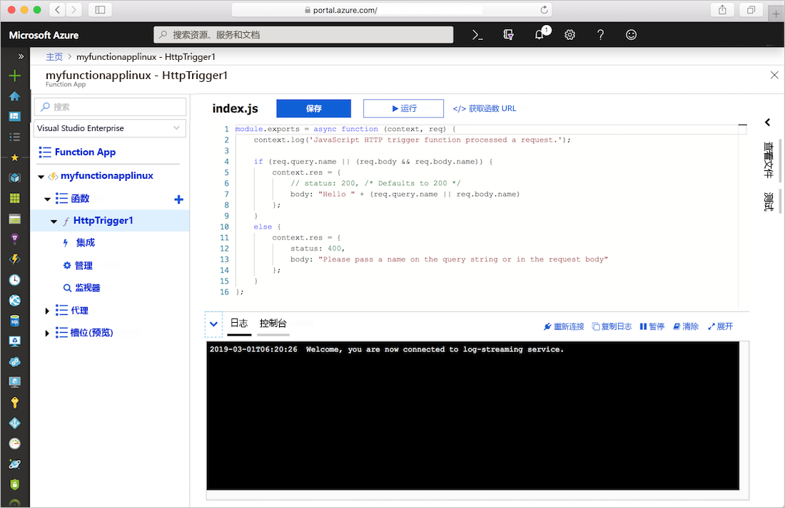
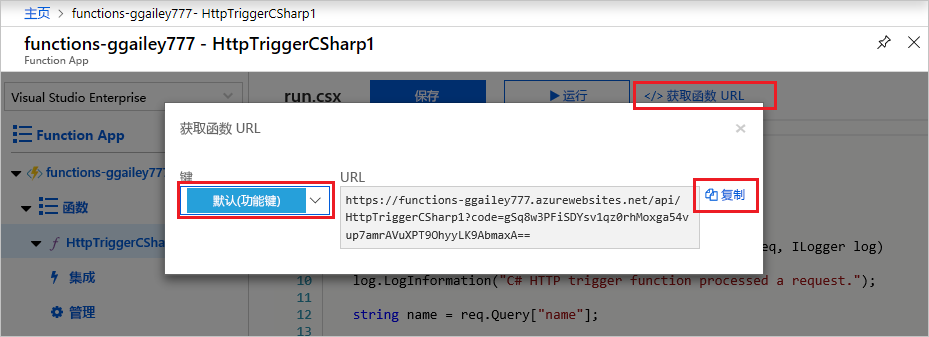
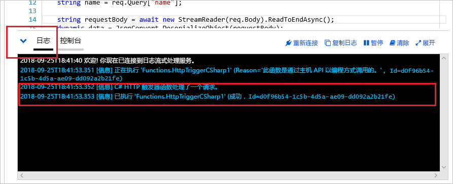

# 在 Azure 应用服务计划中创建 Linux 上的函数应用

使用 Azure Functions 可将函数托管在 Linux 上的默认 Azure 应用服务容器中。 本文逐步讲解如何使用 [Azure 门户](https://portal.azure.com)创建一个在[应用服务计划](functions-scale.md#app-service-plan)中运行的由 Linux 托管的函数应用。 还可以[自带自定义的容器](functions-create-function-linux-custom-image.md)。

[!INCLUDE [quickstarts-free-trial-note](../../includes/quickstarts-free-trial-note.md)]

## 登录 Azure

使用 Azure 帐户登录到 <https://portal.azure.com> 的 Azure 门户。

## 创建函数应用

必须使用函数应用在 Linux 上托管函数的执行。 函数应用提供一个用于执行函数代码的环境。 可以使用它将函数分组为一个逻辑单元，以便更轻松地管理、部署、缩放和共享资源。 在本文中，我们将在创建函数应用时创建应用服务计划。

1. 在 Azure 门户菜单或“主页”页中，选择“创建资源” 。

1. 在“新建”页面，选择“计算” > “函数应用”  。

    :::image type="content" source="./media/create-function-app-linux-app-service-plan/function-app-create-flow.png" alt-text="在 Azure 门户中创建函数应用":::

1. 在“基本信息”页上，使用下表中指定的函数应用设置。

    | 设置      | 建议的值  | 说明 |
    | ------------ | ---------------- | ----------- |
    | **订阅** | 订阅 | 要在其下创建此新函数应用的订阅。 |
    | [资源组](../azure-resource-manager/management/overview.md) |  *myResourceGroup* | 要在其中创建 Function App 的新资源组的名称。 |
    | **函数应用名称** | 全局唯一名称 | 用于标识新 Function App 的名称。 有效字符为 `a-z`（不区分大小写）、`0-9` 和 `-`。  |
    |**发布**| “代码”（默认值） | 用于发布代码文件或 Docker 容器的选项。 |
    | **运行时堆栈** | 首选语言 | 选择支持你喜欢的函数编程语言的运行时。 对于 C# 和 F# 函数，选择 **.NET Core**。 |
    |**版本**| 版本号 | 选择已安装的运行时的版本。  |
    |**区域**| 首选区域 | 选择离你近或离函数访问的其他服务近的[区域](https://azure.microsoft.com/regions/)。 |

    :::image type="content" source="./media/create-function-app-linux-app-service-plan/function-app-create-basics-linux.png" alt-text="“基本信息”页":::

1. **选择“下一步:** 托管”。 在“托管”页上，输入以下设置。

    | 设置      | 建议的值  | 说明 |
    | ------------ | ---------------- | ----------- |
    | [存储帐户](../storage/common/storage-account-create.md) |  全局唯一名称 |  创建函数应用使用的存储帐户。 存储帐户名称必须为 3 到 24 个字符，并且只能包含数字和小写字母。 也可使用现有帐户，但该帐户必须符合[存储帐户要求](../azure-functions/functions-scale.md#storage-account-requirements)。 |
    |**操作系统**| **Linux** | 系统会根据你的运行时堆栈选择为你预先选择一个操作系统，但你可以根据需要更改该设置。 |
    | **[计划](../azure-functions/functions-scale.md)** | **消耗(无服务器)** | 定义如何将资源分配给 Function App 的托管计划。 在默认的**消耗**计划中，根据函数需求动态添加资源。 在此[无服务器](https://azure.microsoft.com/overview/serverless-computing/)托管中，只需为函数运行时间付费。 按应用服务计划运行时，必须管理[函数应用的缩放](../azure-functions/functions-scale.md)。  |

    :::image type="content" source="./media/create-function-app-linux-app-service-plan/function-app-create-hosting-linux.png" alt-text="“托管”页":::

1. **选择“下一步:** 监视”。 在“监视”页上，输入以下设置。

    | 设置      | 建议的值  | 说明 |
    | ------------ | ---------------- | ----------- |
    | **[Application Insights](../azure-functions/functions-monitoring.md)** | “是”（默认值） | 在最近的受支持的区域中，创建一个具有相同应用名称的 Application Insights 资源。 通过展开此设置或选择“新建”，可以更改 Application Insights 名称或在 [Azure 地理位置](https://azure.microsoft.com/global-infrastructure/geographies/)中选择要存储数据的其他区域。 |

   :::image type="content" source="./media/create-function-app-linux-app-service-plan/function-app-create-monitoring-linux.png" alt-text="“监视”页":::

1. 选择“查看 + 创建”，以便查看应用配置选择。

1. 在“查看 + 创建”页上查看设置，然后选择“创建”来预配并部署函数应用 。

1. 选择门户右上角的“通知”图标，留意是否显示了“部署成功”消息。 

1. 选择“转到资源”，查看新的函数应用。 还可选择“固定到仪表板”。 固定可以更轻松地从仪表板返回此函数应用资源。

    

    即使函数应用可用，它也可能需要花费几分钟时间才能完全初始化。

接下来，在新的 Function App 中创建一个函数。

## 创建 HTTP 触发器函数

本部分介绍如何使用门户在新的函数应用中创建函数。

> [!NOTE]
> 可以在门户开发体验中试用 Azure Functions。 对于大多数方案，请考虑在本地开发函数，然后使用 [Visual Studio Code](functions-create-first-function-vs-code.md#create-an-azure-functions-project) 或 [Azure Functions Core Tools](functions-run-local.md#create-a-local-functions-project) 将项目发布到函数应用。  

1. 从“Functions”窗口的左侧菜单中选择“Functions”，然后从顶部菜单中选择“添加”。 
 
1. 在“新建函数”窗口中，选择“Http 触发器”。

    

1. 在“新建函数”窗口中，接受新函数的默认名称，或输入新名称。 

1. 从“授权级别”下拉列表中选择“匿名”，然后选择“创建函数”。

    Azure 会创建该 HTTP 触发器函数。 现在，可以通过发送 HTTP 请求来运行新函数了。

## 测试函数

1. 在新的 HTTP 触发器函数中，从左侧菜单中选择“代码 + 测试”"，然后从顶部菜单中选择“获取函数 URL”。

    

1. 在“获取函数 URL”对话框的下拉列表中选择“默认值”，然后选择“复制到剪贴板”图标。 

    

1. 将函数 URL 粘贴到浏览器的地址栏中。 将查询字符串值 `?name=<your_name>` 添加到该 URL 尾部，然后按 Enter 来运行请求。 

    以下示例显示了浏览器中的响应：

    

    请求 URL 包含通过 HTTP 访问函数默认所需的密钥。

1. 运行函数时，会在日志中写入跟踪信息。 若要查看跟踪输出，请返回到门户中的“代码 + 测试”页，并展开页面底部的“日志”箭头。

   

## 清理资源

[!INCLUDE [Clean-up resources](../../includes/functions-quickstart-cleanup.md)]

## 后续步骤

你已使用简单的 HTTP 触发器函数创建了一个函数应用。  

[!INCLUDE [Next steps note](../../includes/functions-quickstart-next-steps.md)]

有关详细信息，请参阅 [Azure Functions HTTP 绑定](functions-bindings-http-webhook.md)。
