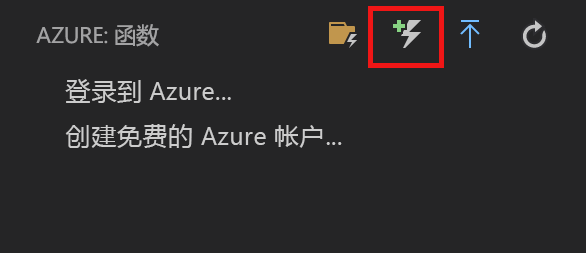
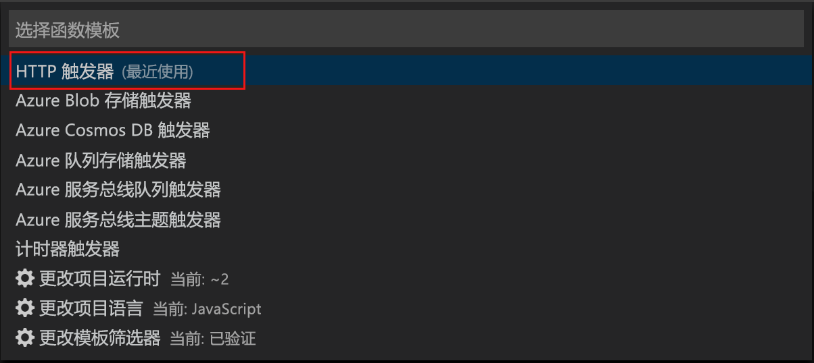
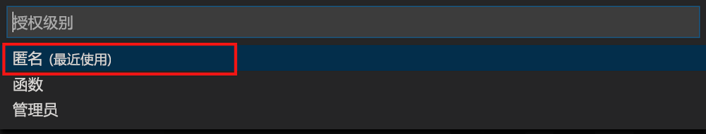
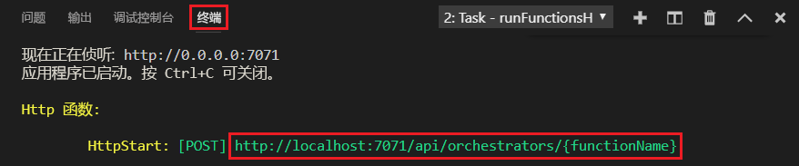

# <a name="create-your-first-durable-function-in-javascript"></a>使用 JavaScript 创建你的第一个持久函数

*Durable Functions* 是 [Azure Functions](../functions-overview.md) 的一个扩展，可用于在无服务器环境中编写有状态函数。 该扩展可用于管理状态、检查点和重启。

[!INCLUDE [v1-note](../../../includes/functions-durable-v1-tutorial-note.md)]

本文介绍了如何使用 Visual Studio Code Azure Functions 扩展在本地创建并测试“hello world”持久函数。  此函数将协调对其他函数的调用并将其链接在一起。 然后将函数代码发布到 Azure。


## <a name="prerequisites"></a>先决条件

完成本教程：

* 安装 [Visual Studio Code](https://code.visualstudio.com/download)。

* 请确保安装了最新版本的 [Azure Functions Core Tools](../functions-run-local.md)。

* 在 Windows 计算机上，验证 [Azure 存储模拟器](../../storage/common/storage-use-emulator.md)是否已安装且正在运行。 在 Mac 或 Linux 计算机上，必须使用实际的 Azure 存储帐户。

* 请确保安装 8.0 版或更高版本的 [Node.js](https://nodejs.org/)。

[!INCLUDE [quickstarts-free-trial-note](../../../includes/quickstarts-free-trial-note.md)]

[!INCLUDE [functions-install-vs-code-extension](../../../includes/functions-install-vs-code-extension.md)]

[!INCLUDE [functions-create-function-app-vs-code](../../../includes/functions-create-function-app-vs-code.md)]

## <a name="install-the-durable-functions-npm-package"></a>安装 Durable Functions npm 包

1. 通过运行函数应用的根目录中的 `npm install durable-functions` 来安装 `durable-functions` npm 包。

## <a name="creating-your-functions"></a>创建函数

我们现在将创建开始使用 Durable Functions 所需的三个函数：HTTP 初学者、业务流程协调程序和活动函数。 HTTP 初学者将启动整个解决方案，并且业务流程协调程序会将工作分派给各个活动函数。

### <a name="http-starter"></a>HTTP 初学者

首先，创建一个 HTTP 触发的函数，用以启动持久函数业务流程。

1. 从 *Azure：Functions* 中，选择“创建函数”  图标。

    

2. 选择包含函数应用项目的文件夹，然后选择“Durable Functions HTTP 初学者”  函数模板。

    

3. 保留默认名称为 `DurableFunctionsHttpStart` 并按“Enter”，然后选择“匿名”  身份验证。

    

我们现在已创建了我们的持久函数的一个入口点。 让我们添加一个业务流程协调程序。

### <a name="orchestrator"></a>业务流程协调程序

现在，我们将创建一个业务流程协调程序来协调活动函数。

1. 从 *Azure：Functions* 中，选择“创建函数”  图标。

    

2. 选择包含函数应用项目的文件夹，然后选择“Durable Functions 业务流程协调程序”  函数模板。 将名称保留为默认值“DurableFunctionsOrchestrator”

    

我们已添加了一个业务流程协调程序来协调活动函数。 现在让我们添加一个引用的活动函数。

### <a name="activity"></a>活动

现在，我们将创建一个活动函数来实际执行解决方案的工作。

1. 从 *Azure：Functions* 中，选择“创建函数”  图标。

    

2. 选择包含函数应用项目的文件夹，然后选择“Durable Functions 活动”  函数模板。 将名称保留为默认值“Hello”。

    

我们已添加了启动业务流程并将活动函数链接在一起所需的所有组件。

## <a name="test-the-function-locally"></a>在本地测试函数

使用 Azure Functions Core Tools 可以在本地开发计算机上运行 Azure Functions 项目。 首次从 Visual Studio Code 启动某个函数时，系统会提示你安装这些工具。

1. 在 Windows 计算机上，启动 Azure 存储模拟器并确保将 local.settings.json 的 AzureWebJobsStorage  属性设置为 `UseDevelopmentStorage=true`  。

    对于存储模拟器 5.8，请确保将 local.settings.json 的 **AzureWebJobsSecretStorageType** 属性设置为 `files`。 在 Mac 或 Linux 计算机上，必须将 **AzureWebJobsStorage** 属性设置为现有 Azure 存储帐户的连接字符串。 本文中稍后将创建一个存储帐户。

2. 若要测试函数，请在函数代码中设置断点并按 F5 启动函数应用项目。 来自 Core Tools 的输出会显示在“终端”  面板中。 如果这是你首次使用 Durable Functions，则会安装 Durable Functions 扩展并且生成可能需要几秒钟时间。

    > [!NOTE]
    > JavaScript Durable Functions 需要 1.7.0 版或更高版本的 Microsoft.Azure.WebJobs.Extensions.DurableTask 扩展   。 从你的 Azure Functions 应用的根文件夹运行以下命令来安装 Durable Functions 扩展 `func extensions install -p Microsoft.Azure.WebJobs.Extensions.DurableTask -v 1.7.0`

3. 在“终端”  面板中，复制 HTTP 触发的函数的 URL 终结点。

    

4. 将 `{functionName}` 替换为 `DurableFunctionsOrchestrator`。

5. 使用 [Postman](https://www.getpostman.com/) 或 [cURL](https://curl.haxx.se/) 之类的工具向 URL 终结点发送一个 HTTP POST 请求。

   响应是来自 HTTP 函数的初始结果，让我们知道持久业务流程已成功启动。 它还不是业务流程的最终结果。 响应中包括了几个有用的 URL。 现在，让我们查询业务流程的状态。

6. 复制 `statusQueryGetUri` 的 URL 值，将其粘贴到浏览器的地址栏中并执行请求。 或者也可以继续使用 Postman 发出 GET 请求。

   请求将查询业务流程实例的状态。 你应该会得到一个最终响应，它显示实例已经完成，并包含持久函数的输出或结果。 输出如下所示： 

    ```json
    {
        "instanceId": "d495cb0ac10d4e13b22729c37e335190",
        "runtimeStatus": "Completed",
        "input": null,
        "customStatus": null,
        "output": [
            "Hello Tokyo!",
            "Hello Seattle!",
            "Hello London!"
        ],
        "createdTime": "2018-11-08T07:07:40Z",
        "lastUpdatedTime": "2018-11-08T07:07:52Z"
    }
    ```

7. 若要停止调试，请在 VS Code 中按 **Shift + F5**。

确认该函数可以在本地计算机上正确运行以后，即可将项目发布到 Azure。

[!INCLUDE [functions-create-function-app-vs-code](../../../includes/functions-sign-in-vs-code.md)]

[!INCLUDE [functions-publish-project-vscode](../../../includes/functions-publish-project-vscode.md)]

## <a name="test-your-function-in-azure"></a>在 Azure 中测试函数

1. 从“输出”  面板复制 HTTP 触发器的 URL。 调用 HTTP 触发的函数的 URL 应采用以下格式：

        http://<functionappname>.azurewebsites.net/orchestrators/<functionname>

2. 将 HTTP 请求的这个新 URL 粘贴到浏览器的地址栏中。 你应当会得到与之前使用已发布的应用时相同的状态响应。

## <a name="next-steps"></a>后续步骤

你已使用 Visual Studio Code 创建并发布了一个 JavaScript 持久函数应用。

> [!div class="nextstepaction"]
> [了解常见的持久函数模式](durable-functions-overview.md#application-patterns)