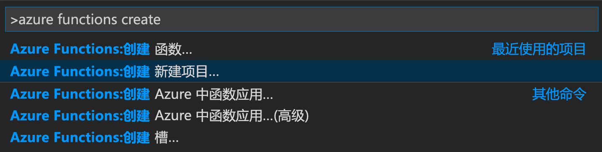
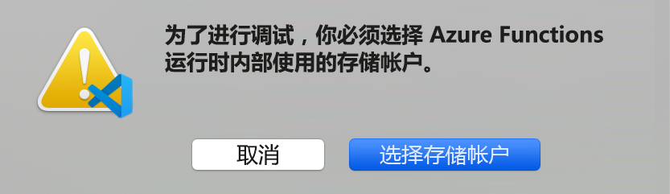

# <a name="create-your-first-durable-function-in-python"></a>使用 Python 创建你的第一个持久函数

*Durable Functions* 是 [Azure Functions](../functions-overview.md) 的一个扩展，可用于在无服务器环境中编写有状态函数。 该扩展可用于管理状态、检查点和重启。

本文介绍了如何使用 Visual Studio Code Azure Functions 扩展在本地创建并测试“hello world”持久函数。  此函数将协调对其他函数的调用并将其链接在一起。 然后将函数代码发布到 Azure。


## <a name="prerequisites"></a>先决条件

为完成此教程：

* 安装 [Visual Studio Code](https://code.visualstudio.com/download)。

* 安装 [Azure Functions](https://marketplace.visualstudio.com/items?itemName=ms-azuretools.vscode-azurefunctions) VS Code 扩展。

* 请确保安装了最新版本的 [Azure Functions Core Tools](../functions-run-local.md)。

* Durable Functions 需要一个 Azure 存储帐户。 需要一个 Azure 订阅。

* 确保已安装 [Python](https://www.python.org/) 版本 3.6、3.7 或 3.8。

[!INCLUDE [quickstarts-free-trial-note](../../../includes/quickstarts-free-trial-note.md)]

## <a name="create-your-local-project"></a><a name="create-an-azure-functions-project"></a>创建本地项目 

在本部分，你将使用 Visual Studio Code 创建一个本地 Azure Functions 项目。 

1. 在 Visual Studio Code 中，按 F1（或 Ctrl/命令键+Shift+P）打开命令面板。 在命令面板中，搜索并选择 `Azure Functions: Create New Project...`。

    

1. 为项目选择一个空文件夹位置，然后选择“选择”。

1. 按照提示提供以下信息：

    | Prompt | 值 | 说明 |
    | ------ | ----- | ----------- |
    | 选择函数应用项目的语言 | Python | 创建本地 Python Functions 项目。 |
    | 选择版本 | Azure Functions v3 | 仅当尚未安装 Core Tools 时，才会出现此选项。 在本例中，当你首次运行应用时即已安装 Core Tools。 |
    | Python 版本 | Python 3.6、3.7 或 3.8 | VS Code 将使用所选版本创建虚拟环境。 |
    | 为项目的第一个函数选择模板 | 暂时跳过 | |
    | 选择打开项目的方式 | 在当前窗口中打开 | 在所选的文件夹中重新打开 VS Code。 |

Visual Studio Code 会根据需要安装 Azure Functions Core Tools。 它还会在某个文件夹中创建一个函数应用项目。 此项目包含 [host.json](../functions-host-json.md) 和 [local.settings.json](../functions-run-local.md#local-settings-file) 配置文件。

此外，还会在根文件夹中创建 requirements.txt 文件。 它指定运行函数应用所需的 Python 包。

## <a name="install-azure-functions-durable-from-pypi"></a>从 PyPI 安装 azure-functions-durable

创建项目时，Azure Functions VS Code 扩展会自动使用所选的 Python 版本创建虚拟环境。 你将在终端中激活该虚拟环境，并安装 Azure Functions 和 Durable Functions 所需的某些依赖项。

1. 在编辑器中打开 `requirements.txt` 文件，并更改其内容，如下所示：

    ```
    azure-functions
    azure-functions-durable>=1.0.0b6
    ```

1. 打开当前文件夹中编辑器的集成终端 (`` Ctrl-Shift-` ``)。

1. 在集成终端中，激活当前文件夹中的虚拟环境：

    **Linux 或 macOS**

    ```bash
    source .venv/bin/activate
    ```

    **Windows**

    ```powershell
    .venv\scripts\activate
    ```

    

1. 在已激活虚拟环境的集成终端中，使用 pip 安装之前定义的包：

    ```bash
    python -m pip install -r requirements.txt
    ```

## <a name="create-your-functions"></a>创建自己的函数

基本的 Durable Functions 应用包含三个函数：

* *业务流程协调程序函数* - 描述用于协调其他函数的工作流。
* *活动函数* - 由业务流程协调程序函数调用，它会执行工作并选择性地返回一个值。
* *客户端函数* - 用于启动业务流程协调程序函数的常规 Azure 函数。 本示例使用 HTTP 触发的函数。

### <a name="orchestrator-function"></a>业务流程协调程序函数

你将使用一个模板在项目中创建持久函数代码。

1. 在命令面板中，搜索并选择 `Azure Functions: Create Function...`。

1. 按照提示提供以下信息：

    | Prompt | 值 | 说明 |
    | ------ | ----- | ----------- |
    | 选择函数的模板 | Durable Functions 业务流程协调程序 | 创建 Durable Functions 业务流程 |
    | 提供函数名称 | HelloOrchestrator | 持久函数的名称 |

现已添加一个业务流程协调程序来协调活动函数。 打开 HelloOrchestrator/\_\_init__.py 查看业务流程协调程序函数。 每次调用 `context.call_activity` 都会调用名为 `Hello` 的活动函数。

接下来，添加引用的 `Hello` 活动函数。

### <a name="activity-function"></a>活动函数

1. 在命令面板中，搜索并选择 `Azure Functions: Create Function...`。

1. 按照提示提供以下信息：

    | Prompt | 值 | 说明 |
    | ------ | ----- | ----------- |
    | 选择函数的模板 | Durable Functions 活动 | 创建活动函数 |
    | 提供函数名称 | 你好 | 活动函数的名称 |

现已添加业务流程协调程序调用的 `Hello` 活动函数。 打开 Hello/\_\_init__.py，可以看到，该函数采用某个名称作为输入，并返回一句问候语。 将在活动函数中执行操作，例如，发出数据库调用或执行计算。

最后，添加一个启动业务流程的 HTTP 触发的函数。

### <a name="client-function-http-starter"></a>客户端函数（HTTP 启动器）

1. 在命令面板中，搜索并选择 `Azure Functions: Create Function...`。

1. 按照提示提供以下信息：

    | Prompt | 值 | 说明 |
    | ------ | ----- | ----------- |
    | 选择函数的模板 | Durable Functions HTTP 启动器 | 创建 HTTP 启动器函数 |
    | 提供函数名称 | DurableFunctionsHttpStart | 活动函数的名称 |
    | 授权级别 | 匿名 | 出于演示目的，请允许在不进行身份验证的情况下调用函数 |

现已添加一个启动业务流程的 HTTP 触发的函数。 打开 DurableFunctionsHttpStart/\_\_init__.py，可以看到，该函数使用 `client.start_new` 启动新的业务流程。 然后，它使用 `client.create_check_status_response` 返回 HTTP 响应，其中包含可用于监视和管理新业务流程的 URL。

现已创建一个可在本地运行并可部署到 Azure 的 Durable Functions 应用。

## <a name="test-the-function-locally"></a>在本地测试函数

使用 Azure Functions Core Tools 可以在本地开发计算机上运行 Azure Functions 项目。 首次从 Visual Studio Code 启动某个函数时，系统会提示你安装这些工具（若尚未安装）。

1. 若要测试函数，请在 `Hello` 活动函数代码 (Hello/\_\_init__.py) 中设置断点。 按 F5 或者在命令面板中选择 `Debug: Start Debugging` 以启动函数应用项目。 来自 Core Tools 的输出会显示在“终端”面板中。

    > [!NOTE]
    > 有关调试的详细信息，请参阅 [Durable Functions 诊断](durable-functions-diagnostics.md#debugging)。

1. Durable Functions 需要一个 Azure 存储帐户才能运行。 当 VS Code 提示选择存储帐户时，请选择“选择存储帐户”。

    

1. 按照提示提供以下信息，以在 Azure 中创建新的存储帐户。

    | Prompt | 值 | 说明 |
    | ------ | ----- | ----------- |
    | 选择订阅 | *订阅的名称* | 选择 Azure 订阅 |
    | 选择存储帐户 | 新建存储帐户 |  |
    | 输入新存储帐户的名称 | *唯一名称* | 要创建的存储帐户的名称 |
    | 选择资源组 | *唯一名称* | 要创建的资源组名称 |
    | 选择一个位置 | *region* | 选择离你较近的区域 |

1. 在“终端”面板中，复制 HTTP 触发的函数的 URL 终结点。

    

1. 使用浏览器或者 [Postman](https://www.getpostman.com/) 或 [cURL](https://curl.haxx.se/) 之类的工具向 URL 终结点发送一个 HTTP 请求。 将最后一个段替换为业务流程协调程序函数的名称 (`HelloOrchestrator`)。 URL 应类似于 `http://localhost:7071/api/orchestrators/HelloOrchestrator`。

   响应是来自 HTTP 函数的初始结果，告知持久业务流程已成功启动。 它还不是业务流程的最终结果。 响应中包括了几个有用的 URL。 现在，让我们查询业务流程的状态。

1. 复制 `statusQueryGetUri` 的 URL 值，将其粘贴到浏览器的地址栏中并执行请求。 或者也可以继续使用 Postman 发出 GET 请求。

   请求将查询业务流程实例的状态。 你应该会得到一个最终响应，它显示实例已经完成，并包含持久函数的输出或结果。 输出如下所示： 

    ```json
    {
        "name": "HelloOrchestrator",
        "instanceId": "9a528a9e926f4b46b7d3deaa134b7e8a",
        "runtimeStatus": "Completed",
        "input": null,
        "customStatus": null,
        "output": [
            "Hello Tokyo!",
            "Hello Seattle!",
            "Hello London!"
        ],
        "createdTime": "2020-03-18T21:54:49Z",
        "lastUpdatedTime": "2020-03-18T21:54:54Z"
    }
    ```

1. 若要停止调试，请在 VS Code 中按 **Shift + F5**。

确认该函数可以在本地计算机上正确运行以后，即可将项目发布到 Azure。

[!INCLUDE [functions-create-function-app-vs-code](../../../includes/functions-sign-in-vs-code.md)]

[!INCLUDE [functions-publish-project-vscode](../../../includes/functions-publish-project-vscode.md)]

## <a name="test-your-function-in-azure"></a>在 Azure 中测试函数

1. 从“输出”面板复制 HTTP 触发器的 URL。 调用 HTTP 触发的函数的 URL 应采用此格式：`http://<functionappname>.azurewebsites.net/orchestrators/HelloOrchestrator`

2. 将 HTTP 请求的这个新 URL 粘贴到浏览器的地址栏中。 你应当会得到与之前使用已发布的应用时相同的状态响应。

## <a name="next-steps"></a>后续步骤

你已使用 Visual Studio Code 创建并发布了一个 Python 持久函数应用。

> [!div class="nextstepaction"]
> [了解常见的持久函数模式](durable-functions-overview.md#application-patterns)
