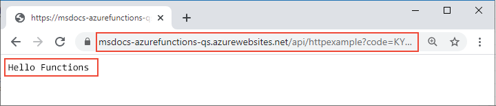

# <a name="connect-azure-functions-to-azure-storage-using-command-line-tools"></a>使用命令行工具将 Azure Functions 连接到 Azure 存储

本文介绍如何将 Azure 存储队列与在[前一篇快速入门](functions-create-first-azure-function-azure-cli.md)中创建的函数和存储帐户相集成。 可以使用一个输出绑定来实现这种集成。该绑定可将 HTTP 请求中的数据写入队列中的消息。  除了在前一篇快速入门中提到的几美分费用以外，完成本文不会产生其他费用。 有关绑定的详细信息，请参阅 [Azure Functions 触发器和绑定的概念](functions-triggers-bindings.md)。

## <a name="configure-your-local-environment"></a>配置本地环境

在开始之前，必须完成文章[快速入门：从命令行创建 Azure Functions 项目](functions-create-first-azure-function-azure-cli.md)。 如果在该文章结束时清理了资源，请再次执行相应的步骤，以在 Azure 中重新创建函数应用和相关资源。

## <a name="retrieve-the-azure-storage-connection-string"></a>检索 Azure 存储连接字符串

当你参考前一篇快速入门在 Azure 中创建函数应用时，同时已创建了一个存储帐户。 此帐户的连接字符串安全存储在 Azure 中的应用设置内。 将设置下载到 *local.settings.json* 文件中后，在本地运行函数时，可以在同一帐户中使用该连接写入存储队列。 

1. 在项目的根目录中运行以下命令（请将 `<APP_NAME>` 替换为前一篇快速入门中所用的函数应用名称）。 此命令将覆盖该文件中的任何现有值。

    ```
    func azure functionapp fetch-app-settings <APP_NAME>
    ```
    
1. 打开 *local.settings.json*，找到名为 `AzureWebJobsStorage` 的值，即存储帐户连接字符串。 在本文的其他部分，将使用名称 `AzureWebJobsStorage` 和该连接字符串。

> [!IMPORTANT]
> 由于 *local.settings.json* 包含从 Azure 下载的机密，因此请始终从源代码管理中排除此文件。 连同本地函数项目一起创建的 *.gitignore* 文件默认会排除该文件。

[!INCLUDE [functions-register-storage-binding-extension-csharp](../../includes/functions-register-storage-binding-extension-csharp.md)]

## <a name="add-an-output-binding-definition-to-the-function"></a>将输出绑定定义添加到函数

尽管一个函数只能有一个触发器，但它可以有多个输入和输出绑定，因此，你无需编写自定义集成代码，就能连接到其他 Azure 服务和资源。 

::: zone pivot="programming-language-python,programming-language-javascript,programming-language-powershell,programming-language-typescript"  
在函数文件夹中的 *function.json* 文件内声明这些绑定。 在前一篇快速入门中，*HttpExample* 文件夹中的 *function.json* 文件在 `bindings` 集合中包含两个绑定：  
::: zone-end

::: zone pivot="programming-language-javascript,programming-language-typescript"  
:::code language="json" source="~/functions-quickstart-templates/Functions.Templates/Templates/HttpTrigger-JavaScript/function.json" range="2-18":::  
::: zone-end

::: zone pivot="programming-language-python"  
:::code language="json" source="~/functions-quickstart-templates/Functions.Templates/Templates/HttpTrigger-Python/function.json" range="2-18":::  
::: zone-end

::: zone pivot="programming-language-powershell"  
:::code language="json" source="~/functions-quickstart-templates/Functions.Templates/Templates/HttpTrigger-PowerShell/function.json" range="2-18":::
::: zone-end  

::: zone pivot="programming-language-python,programming-language-javascript, programming-language-powershell, programming-language-typescript"  
每个绑定至少有一个类型、一个方向和一个名称。 在以上示例中，第一个绑定的类型为 `httpTrigger`，方向为 `in`。 对于 `in` 方向，`name` 指定在触发器调用函数时，要发送到该函数的输入参数的名称。  
::: zone-end

::: zone pivot="programming-language-javascript,programming-language-typescript"  
集合中的第二个绑定名为 `res`。 此 `http` 绑定是用于写入 HTTP 响应的输出绑定 (`out`)。 

若要从此函数写入 Azure 存储队列，请添加类型为 `queue`、名称为 `msg` 的 `out` 绑定，如以下代码所示：

:::code language="json" source="~/functions-docs-javascript/functions-add-output-binding-storage-queue-cli/HttpExample/function.json" range="3-26":::
::: zone-end  

::: zone pivot="programming-language-python"  
集合中第二个绑定的类型为 `http`，方向为 `out`，在本例中，`$return` 的特殊 `name` 指示此绑定使用函数的返回值，而不是提供输入参数。

若要从此函数写入 Azure 存储队列，请添加类型为 `queue`、名称为 `msg` 的 `out` 绑定，如以下代码所示：

:::code language="json" source="~/functions-docs-python/functions-add-output-binding-storage-queue-cli/HttpExample/function.json" range="3-26":::
::: zone-end  

::: zone pivot="programming-language-powershell"  
集合中的第二个绑定名为 `res`。 此 `http` 绑定是用于写入 HTTP 响应的输出绑定 (`out`)。 

若要从此函数写入 Azure 存储队列，请添加类型为 `queue`、名称为 `msg` 的 `out` 绑定，如以下代码所示：

:::code language="json" source="~/functions-docs-powershell/functions-add-output-binding-storage-queue-cli/HttpExample/function.json" range="3-26":::
::: zone-end  

::: zone pivot="programming-language-python,programming-language-javascript,programming-language-powershell,programming-language-typescript"  
在这种情况下，`msg` 将作为输出参数提供给函数。 对于 `queue` 类型，还必须在 `queueName` 中指定队列的名称，并在 `connection` 中提供 Azure 存储连接的名称（来自 *local.settings.json*）。  
::: zone-end  

::: zone pivot="programming-language-csharp"  
[!INCLUDE [functions-add-storage-binding-csharp-library](../../includes/functions-add-storage-binding-csharp-library.md)]  
::: zone-end  

有关绑定的详细信息，请参阅 [Azure Functions 触发器和绑定的概念](functions-triggers-bindings.md)和[队列输出配置](functions-bindings-storage-queue-output.md#configuration)。

## <a name="add-code-to-use-the-output-binding"></a>添加使用输出绑定的代码

在 *function.json* 中指定队列绑定后，可以更新函数，以接收 `msg` 输出参数并将消息写入队列。

::: zone pivot="programming-language-python"     
[!INCLUDE [functions-add-output-binding-python](../../includes/functions-add-output-binding-python.md)]
::: zone-end  

::: zone pivot="programming-language-javascript"  
[!INCLUDE [functions-add-output-binding-js](../../includes/functions-add-output-binding-js.md)]
::: zone-end  

::: zone pivot="programming-language-typescript"  
[!INCLUDE [functions-add-output-binding-ts](../../includes/functions-add-output-binding-ts.md)]
::: zone-end  

::: zone pivot="programming-language-powershell"  
[!INCLUDE [functions-add-output-binding-powershell](../../includes/functions-add-output-binding-powershell.md)]  
::: zone-end

::: zone pivot="programming-language-csharp"  
[!INCLUDE [functions-add-storage-binding-csharp-library-code](../../includes/functions-add-storage-binding-csharp-library-code.md)]
::: zone-end 

请注意，不需要编写任何用于身份验证、获取队列引用或写入数据的代码。  在 Azure Functions 运行时和队列输出绑定中可以方便地处理所有这些集成任务。

[!INCLUDE [functions-run-function-test-local-cli](../../includes/functions-run-function-test-local-cli.md)]

[!INCLUDE [functions-extension-bundles-info](../../includes/functions-extension-bundles-info.md)]

## <a name="view-the-message-in-the-azure-storage-queue"></a>查看 Azure 存储队列中的消息

可以在 [Azure 门户](../storage/queues/storage-quickstart-queues-portal.md)或 [Microsoft Azure 存储资源管理器](https://storageexplorer.com/)中查看队列。 也可以按以下步骤中所述，在 Azure CLI 中查看队列：

1. 打开函数项目的 *local.setting.json* 文件，并复制连接字符串值。 在终端或命令窗口中运行以下命令，以创建名为 `AZURE_STORAGE_CONNECTION_STRING` 的环境变量（请在 `<MY_CONNECTION_STRING>` 位置粘贴特定的连接字符串）。 （创建此环境变量后，无需在使用 `--connection-string` 参数的每个后续命令中提供连接字符串。）

    # <a name="bash"></a>[bash](#tab/bash)
    
    ```bash
    AZURE_STORAGE_CONNECTION_STRING="<MY_CONNECTION_STRING>"
    ```
    
    # <a name="powershell"></a>[PowerShell](#tab/powershell)
    
    ```powershell
    $env:AZURE_STORAGE_CONNECTION_STRING = "<MY_CONNECTION_STRING>"
    ```
    
    # <a name="cmd"></a>[Cmd](#tab/cmd)
    
    ```cmd
    set AZURE_STORAGE_CONNECTION_STRING="<MY_CONNECTION_STRING>"
    ```
    
    ---
    
1. （可选）使用 [`az storage queue list`](/cli/azure/storage/queue#az-storage-queue-list) 命令查看帐户中的存储队列。 此命令的输出应包含名为 `outqueue` 的队列，该队列是函数将其第一条消息写入该队列时创建的。
    
    ```azure-cli
    az storage queue list --output tsv
    ```

1. 使用 [`az storage message get`](/cli/azure/storage/message#az-storage-message-get) 命令读取此队列中的消息，队列名称应是前面在测试函数时使用的名称。 该命令读取再删除该队列中的第一条消息。 

    # <a name="bash"></a>[bash](#tab/bash)
    
    ```bash
    echo `echo $(az storage message get --queue-name outqueue -o tsv --query '[].{Message:content}') | base64 --decode`
    ```
    
    # <a name="powershell"></a>[PowerShell](#tab/powershell)
    
    ```powershell
    [System.Text.Encoding]::UTF8.GetString([System.Convert]::FromBase64String($(az storage message get --queue-name outqueue -o tsv --query '[].{Message:content}')))
    ```
    
    # <a name="cmd"></a>[Cmd](#tab/cmd)
    
    ```cmd
    az storage message get --queue-name outqueue -o tsv --query [].{Message:content} > %TEMP%out.b64 && certutil -decode -f %TEMP%out.b64 %TEMP%out.txt > NUL && type %TEMP%out.txt && del %TEMP%out.b64 %TEMP%out.txt /q
    ```

    此脚本使用 certutil 解码本地临时文件中的 base64 编码消息集合。 如果没有任何输出，请尝试从脚本中删除 `> NUL`，以阻止在出错时隐藏 certutil 输出。 
    
    ---
    
    由于消息正文是以 [base64 编码](functions-bindings-storage-queue-trigger.md#encoding)格式存储的，因此，必须解码消息才能显示消息。 执行 `az storage message get` 后，该消息将从队列中删除。 如果 `outqueue` 中只有一条消息，则再次运行此命令时不会检索到消息，而是收到错误。

## <a name="redeploy-the-project-to-azure"></a>将项目重新部署到 Azure

在本地验证函数已将消息写入 Azure 存储队列后，接下来可以重新部署项目以更新 Azure 上运行的终结点。

1. 在 *LocalFunctionsProj* 文件夹中，使用 [`func azure functionapp publish`](functions-run-local.md#project-file-deployment) 命令重新部署项目（请将 `<APP_NAME>` 替换为你的应用的名称）。

    ```
    func azure functionapp publish <APP_NAME>
    ```
    
1. 像在上一篇快速入门中一样，使用浏览器或 CURL 来测试重新部署的函数。

    # <a name="browser"></a>[浏览器](#tab/browser)
    
    将 publish 命令的输出中显示的完整“调用 URL”复制到浏览器的地址栏，并追加查询参数 `&name=Functions`。  浏览器显示的输出应与本地运行函数时显示的输出类似。

    

    # <a name="curl"></a>[curl](#tab/curl)
    
    结合“调用 URL”运行 [`curl`](https://curl.haxx.se/)，并追加参数 `&name=Functions`。  该命令的输出应是文本“Hello Functions”。
    
    

    --- 

1. 按上一部分所述再次检查存储队列，验证它是否包含已写入到其中的新消息。

## <a name="clean-up-resources"></a>清理资源

完成后，请使用以下命令删除资源组及其包含的所有资源，以免产生额外的费用。

```azurecli
az group delete --name AzureFunctionsQuickstart-rg
```

## <a name="next-steps"></a>后续步骤

现已更新 HTTP 触发的函数，使其将数据写入存储队列。 现在，可以详细了解如何使用 Core Tools 和 Azure CLI 通过命令行进行 Functions 开发：

+ [使用 Azure Functions Core Tools](functions-run-local.md)  

::: zone pivot="programming-language-csharp"  
+ [C# 中完整函数项目的示例](/samples/browse/?products=azure-functions&languages=csharp)。

+ [Azure Functions C# 开发人员参考](functions-dotnet-class-library.md)  
::: zone-end 
::: zone pivot="programming-language-javascript"  
+ [JavaScript 中完整函数项目的示例](/samples/browse/?products=azure-functions&languages=javascript)。

+ [Azure Functions JavaScript 开发人员指南](functions-reference-node.md)  
::: zone-end  
::: zone pivot="programming-language-typescript"  
+ [TypeScript 中完整函数项目的示例](/samples/browse/?products=azure-functions&languages=typescript)。

+ [Azure Functions TypeScript 开发人员指南](functions-reference-node.md#typescript)  
::: zone-end  
::: zone pivot="programming-language-python"  
+ [Python 中完整函数项目的示例](/samples/browse/?products=azure-functions&languages=python)。

+ [Azure Functions Python 开发人员指南](functions-reference-python.md)  
::: zone-end  
::: zone pivot="programming-language-powershell"  
+ [PowerShell 中完整函数项目的示例](/samples/browse/?products=azure-functions&languages=azurepowershell)。

+ [Azure Functions PowerShell 开发人员指南](functions-reference-powershell.md) 
::: zone-end
+ [Azure Functions 触发器和绑定](functions-triggers-bindings.md)

+ [Functions 定价页](https://azure.microsoft.com/pricing/details/functions/)

+ [估算消耗计划成本](functions-consumption-costs.md) 
