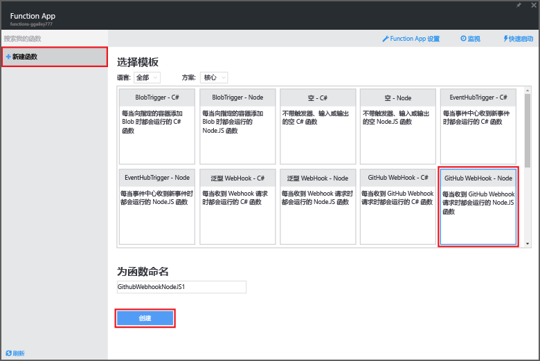
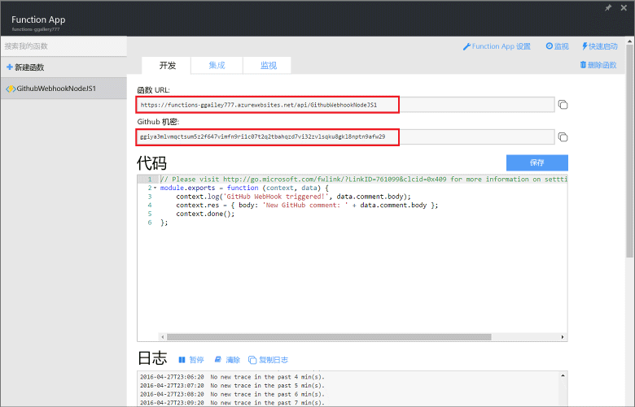
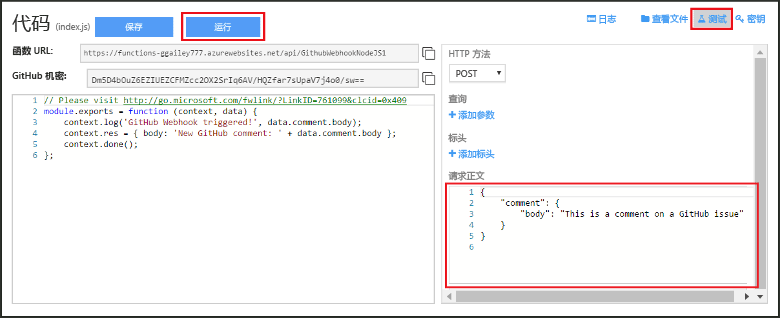
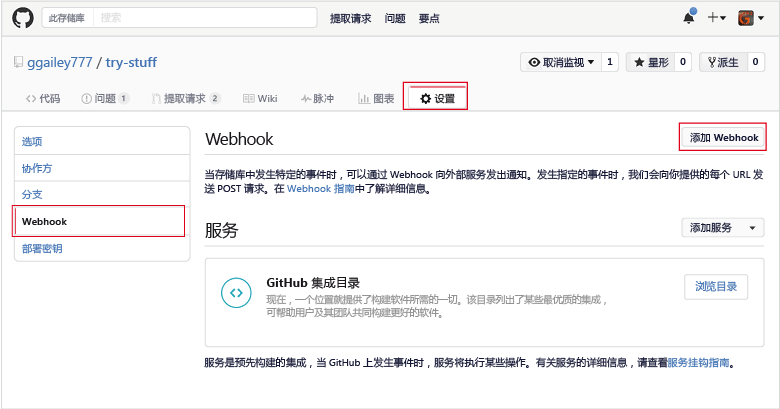
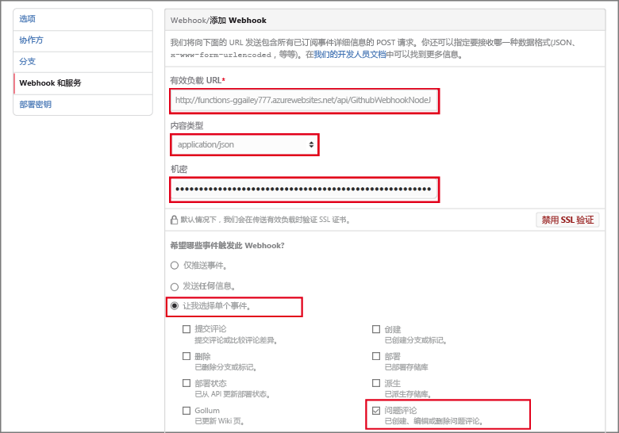

# 创建 Webhook 或 API Azure 函数
Azure Functions 提供事件驱动、按需计算体验，让用户能够创建以各种编程语言实现的计划或触发代码单元。 若要了解有关 Azure Functions 的详细信息，请参阅 [Azure Functions 概述](functions-overview.md)。

本主题演示如何创建由 GitHub Webhook 调用的 JavaScript 函数。 新函数基于 Azure Functions 门户中的预定义模板创建。 还可观看简短视频，了解如何在门户中执行这些步骤。

也可使用本教程中的常规步骤在 C# 或 F# 而不是 JavaScript 中创建函数。 

## 观看视频
以下视频演示如何执行本教程中的基本步骤 

>[!VIDEO https://channel9.msdn.com/Series/Windows-Azure-Web-Sites-Tutorials/Create-a-Web-Hook-or-API-Azure-Function/player]
>
>

## 先决条件

若要完成本教程，需要满足以下条件：

+ 有效的 Azure 帐户。 如果还没有帐户，可以[注册免费的 Azure 帐户](https://azure.microsoft.com/free/)。  
 也可利用[尝试函数](https://functions.azure.com/try)体验完成本教程，不需 Azure 帐户。
+ 一个 GitHub 帐户。 可以[注册免费 GitHub 帐户](https://github.com/join)（如果还没有）。 

## 通过模板创建 Webhook 触发函数
Function App 在 Azure 中托管函数的执行。 

1. 转到 [Azure Functions 门户](https://functions.azure.com/signin) ，然后使用你的 Azure 帐户登录。

2. 如果存在要使用的现有 Function App，请从“函数应用”中选择它，然后单击“打开”。 若要创建 Function App，请为新的 Function App 键入唯一的**名称**或接受生成的名称，选择首选“区域”，然后单击“创建 + 开始使用”。 

3. 在函数应用中，单击“+ 新建函数” > “GitHub Webhook - JavaScript” > “创建”。 此步骤基于指定模板创建具有默认名称的函数。 也可以创建 C# 或 F# 函数。
   
     

4. 在“开发”中，注意“代码”窗口中的示例 express.js 函数。 此函数从问题注释 Webhook 接收 GitHub 请求、记录问题文本并将响应作为 `New GitHub comment: <Your issue comment text>`发送到 Webhook。

     

1. 复制并保存“函数 URL”和“GitHub 机密”值。 将在下一部分使用这些值来配置 GitHub 中的 webhook。 

2. 单击“测试”，注意请求正文中问题注释的预定义 JSON 正文，然后单击“运行”。 

    
   
    > [!NOTE]
    > 只要提供任意预期正文 JSON 数据，然后单击“运行”按钮，就可以在“开发”选项卡中直接测试基于模板的新函数。 在这种情况下，模板具有问题注释的预定义正文。 

接下来，将在 GitHub 存储库中实际创建 Webhook。

## 配置 Webhook
1. 在 GitHub 中，导航到自己的存储库。 还可以使用已分叉的任何存储库。
 
2. 单击“设置” > “Webhook 和服务” > “添加 Webhook”。
   
       

3. 将函数的 URL 和机密粘贴到“有效负载 URL”和“机密”中，然后选择“应用程序/json”作为“内容类型”。

4. 单击“让我选择各个事件”，然后选择“问题注释”并单击“添加 webhook”。
   
     

此时，GitHub Webhook 配置为在添加新问题注释时触发函数。  
现在，请对它进行测试。

## 测试函数
1. 在 GitHub 存储库的新浏览器窗口中，打开“问题”选项卡。

2. 在新窗口中，单击“新建问题”，键入标题，然后单击“提交新问题”。 也可以打开现有问题。

2. 在问题中键入注释，然后单击“注释” 。 

3. 在另一 GitHub 窗口中，单击新 webhook 旁边的“编辑”，向下滚动到“最近交付项”，验证是否已发送 webhook 请求，以及响应正文是否为 `New GitHub comment: <Your issue comment text>`。

3. 回到 Functions 门户，向下滚动到日志，可以看到已触发的函数，且值 `New GitHub comment: <Your issue comment text>` 已写入流式处理日志。

## 后续步骤
请参阅以下主题，获取有关 Azure Functions 的详细信息。

* [Azure Functions 开发人员参考](functions-reference.md)  
  ，用于编码函数的程序员参考。
* [测试 Azure Functions](functions-test-a-function.md)  
  介绍可用于测试函数的各种工具和技巧。
* [如何缩放 Azure Functions](functions-scale.md)  
  讨论 Azure Functions 提供的服务计划（包括使用托管计划）以及如何选择合适的计划。  

[!INCLUDE [Getting Started Note](../../includes/functions-get-help.md)]

<!--HONumber=Feb17_HO1-->

