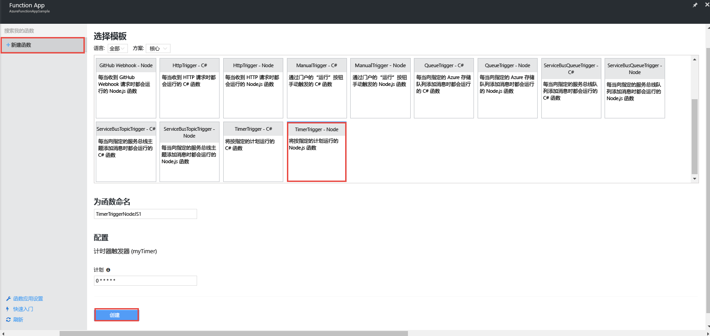
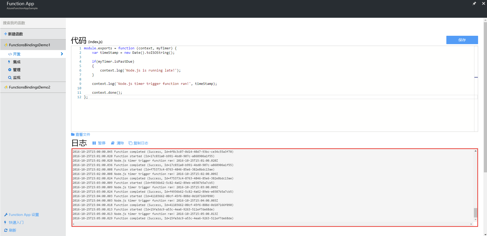
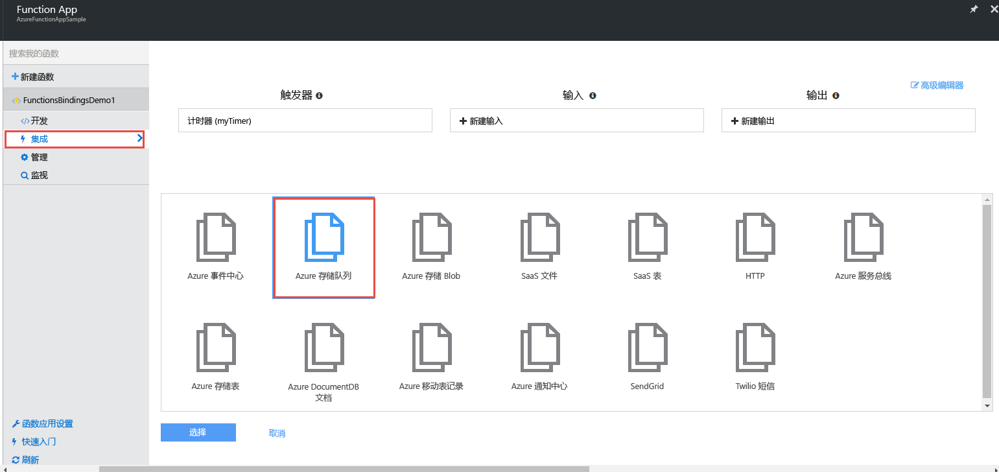
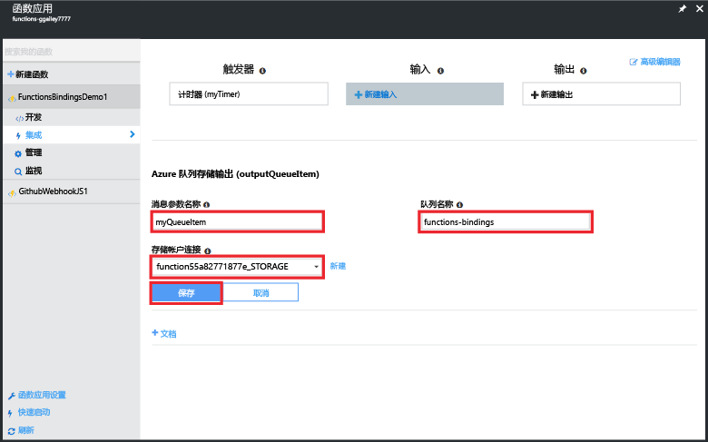
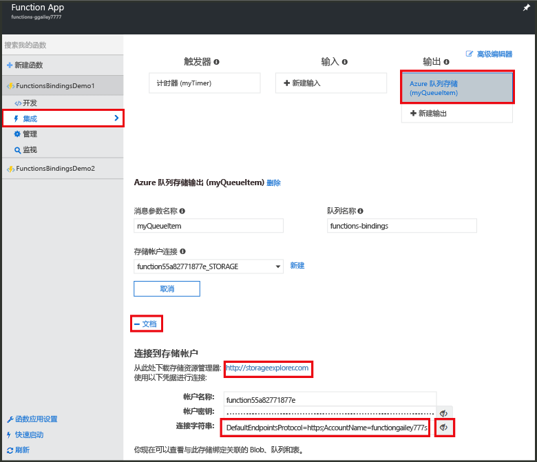
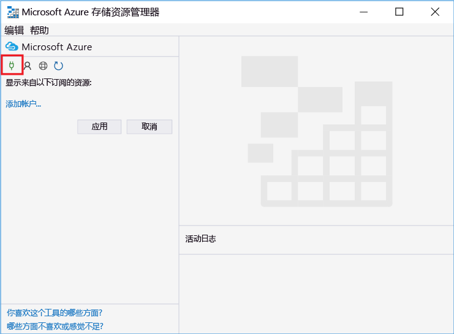
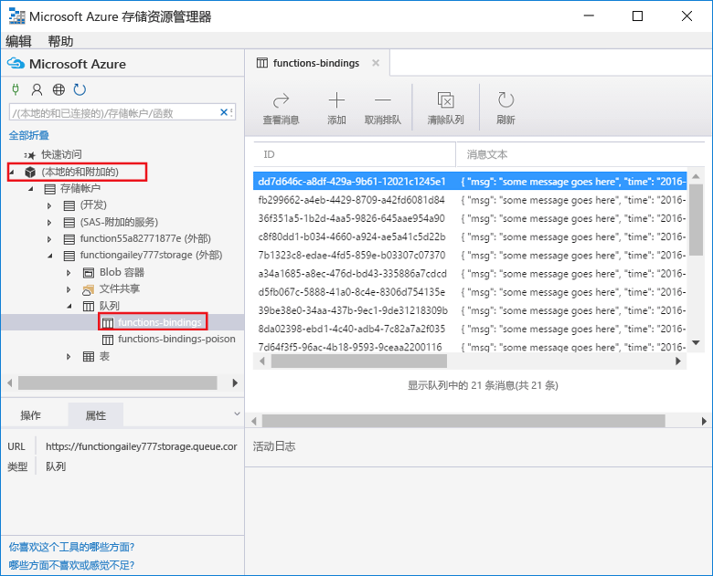
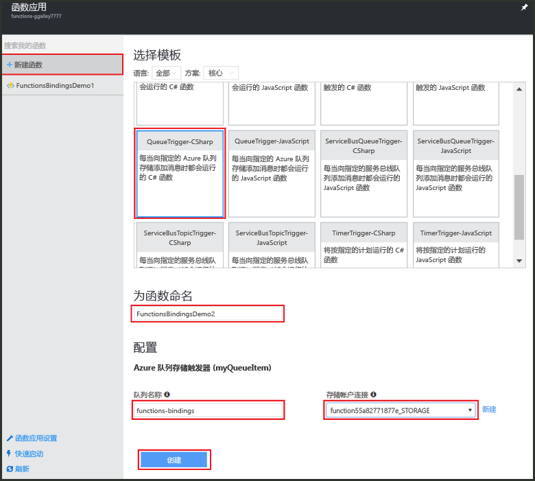
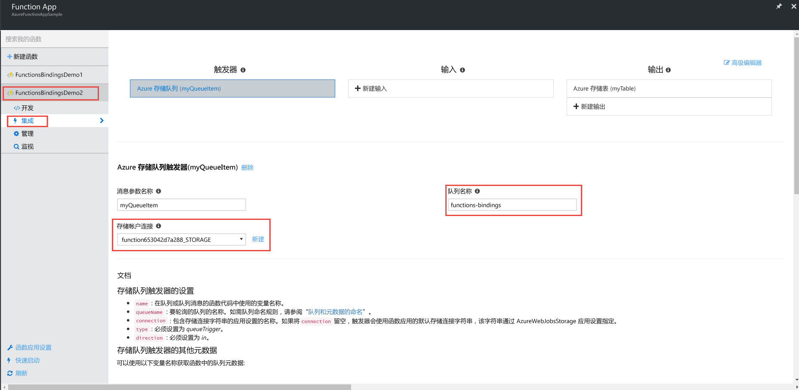
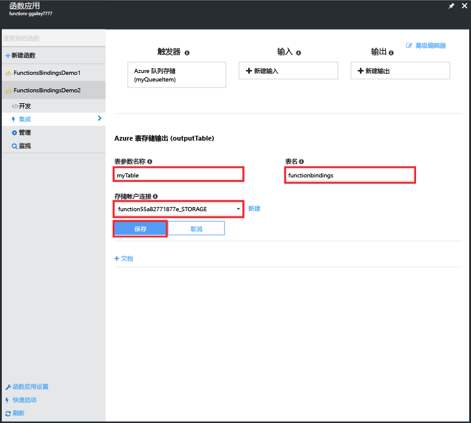

# <a name="use-azure-functions-to-create-a-function-that-connects-to-other-azure-services"></a>使用 Azure Functions 可以创建与其他 Azure 服务相连接的函数。

本主题说明如何在 Azure Functions 中创建一个函数，用于侦听 Azure 队列中的消息，并将这些消息复制到 Azure 存储表中的行。 一个计时器触发的函数用于将消息载入队列。 另一个函数从队列中读取消息，并将消息写入表中。 该队列和表是 Azure Functions 根据绑定定义创建的。 

为了使讲解内容丰富有趣，本主题中的一个函数是用 JavaScript 编写的，另一个函数则是用 C# 脚本编写的， 目的是演示 Function App 如何支持以不同语言编写的函数。 

可以在[第 9 频道视频](https://channel9.msdn.com/Series/Windows-Azure-Web-Sites-Tutorials/Create-an-Azure-Function-which-binds-to-an-Azure-service/player)上观看此方案的演示。

## <a name="create-a-function-that-writes-to-the-queue"></a>创建一个向队列写入数据的函数

在连接到存储队列之前，需要创建一个函数用于加载消息队列。 此 JavaScript 函数使用计时器触发器每隔 10 秒将消息写入队列。 如果尚未创建 Azure 帐户，请查看 [Try Azure Functions](https://functions.azure.com/try)（试用 Azure Functions）主题，或[免费创建一个 Azure 帐户](https://azure.microsoft.com/free/)。

1. 转到 Azure 门户并找到你的函数应用。

2. 单击“新建函数” > “TimerTrigger - JavaScript”。 

3. 将函数命名为 **FunctionsBindingsDemo1**，为“计划”输入 cron 表达式值 `0/10 * * * * *`，然后单击“创建”。
   
    

    现已创建一个每隔 10 秒运行的计时器触发的函数。

5. 在“开发”选项卡上，单击“日志”并查看日志中的活动。 系统每隔 10 秒就会写入一条日志。
   
    

## <a name="add-a-message-queue-output-binding"></a>添加消息队列输出绑定

1. 在“集成”选项卡上，选择“新建输出” > “Azure 队列存储” > “选择”。

    

2. 在“消息参数名称”中输入 `myQueueItem`，在“队列名称”中输入 `functions-bindings`，选择现有的**存储帐户连接**或单击“新建”创建一个存储帐户连接，然后单击“保存”。  

    

1. 返回“开发”选项卡，在函数的后面追加以下代码：
   
    ```javascript
   
    function myQueueItem() 
    {
        return {
            msg: "some message goes here",
            time: "time goes here"
        }
    }
   
    ```
2. 在函数第 9 行附近找到 *if* 语句，并将该语句的后面插入以下代码。
   
    ```javascript
   
    var toBeQed = myQueueItem();
    toBeQed.time = timeStamp;
    context.bindings.myQueueItem = toBeQed;
   
    ```  
   
    此代码创建 **myQueueItem** 并将其 **time** 属性设置为当前的时间戳。 然后，它会将新队列项添加到上下文的 **myQueueItem** 绑定。

3. 单击“保存并运行”。

## <a name="view-storage-updates-by-using-storage-explorer"></a>使用存储资源管理器查看存储更新
可以通过查看所创建的队列中的消息来确认函数是否正常运行。  可以使用 Visual Studio 中的 Cloud Explorer 连接到存储队列。 但是，在门户中，可以使用 Microsoft Azure 存储资源管理器轻松连接到存储帐户。

1. 在“集成”选项卡上，单击队列输出绑定，选择“文档”，然后取消隐藏存储帐户的连接字符串并复制该值。 可以使用此值连接到存储帐户。

    


2. 如果尚未这样做，请下载并安装 [Microsoft Azure 存储资源管理器](http://storageexplorer.com)。 
 
3. 在存储资源管理器中，单击“连接到 Azure 存储”图标，在字段中粘贴连接字符串，然后完成向导。

    

4. 在“本地和附加的存储”下面，展开“存储帐户”> 你的存储帐户 >“队列” > “函数绑定”，然后确认消息是否已写入队列。

    

    如果队列不存在或为空，则很可能是函数绑定或代码出现了问题。

## <a name="create-a-function-that-reads-from-the-queue"></a>创建从队列读取数据的函数

现在，消息已开始添加到队列，接下来可以创建另一个函数，用于从队列中读取消息并将其永久写入 Azure 存储表。

1. 单击“新建函数” > “QueueTrigger-CSharp”。 
 
2. 将函数命名为 `FunctionsBindingsDemo2`，在“队列名称”字段中输入 **functions-bindings**，选择现有的存储帐户或新建一个存储帐户，然后单击“创建”。

     

3. （可选）可以像前面一样通过查看存储资源管理器中的新队列来确认新函数是否正常运行。 也可以使用 Visual Studio 中的 Cloud Explorer。  

4. （可选）刷新 **functions-bindings** 排队，然后可以看到项已从队列中删除。 之所以发生删除操作，是因为该函数已作为输入触发器绑定到 **functions-bindings** 队列，而该函数会读取该队列。 
 
## <a name="add-a-table-output-binding"></a>添加表输出绑定

1. 在 FunctionsBindingsDemo2 中，单击“集成” > “建新输出” > “Azure 表存储” > “选择”。

     

2. 在“表名称”中输入 `functionbindings`，在“表参数名称”中输入 `myTable`，选择“存储帐户连接”或创建一个新连接，然后单击“保存”。

    
   
3. 在“开发”选项卡中，将现有函数代码替换为以下内容：
   
    ```cs
    
    using System;
    
    public static void Run(QItem myQueueItem, ICollector<TableItem> myTable, TraceWriter log)
    {    
        TableItem myItem = new TableItem
        {
            PartitionKey = "key",
            RowKey = Guid.NewGuid().ToString(),
            Time = DateTime.Now.ToString("hh.mm.ss.ffffff"),
            Msg = myQueueItem.Msg,
            OriginalTime = myQueueItem.Time    
        };
        
        // Add the item to the table binding collection.
        myTable.Add(myItem);
    
        log.Verbose($"C# Queue trigger function processed: {myItem.RowKey} | {myItem.Msg} | {myItem.Time}");
    }
    
    public class TableItem
    {
        public string PartitionKey {get; set;}
        public string RowKey {get; set;}
        public string Time {get; set;}
        public string Msg {get; set;}
        public string OriginalTime {get; set;}
    }
    
    public class QItem
    {
        public string Msg { get; set;}
        public string Time { get; set;}
    }
    ```
    **TableItem** 类表示存储表中的某行。应该将项添加到 **TableItem** 对象的 `myTable` 集合。 只有设置了 **PartitionKey** 和 **RowKey** 属性才能在表中插入数据。

4. 单击“保存”。  最后，可以通过查看存储资源管理器或 Visual Studio Cloud Explorer 中的表来确认函数是否正常运行。

5. （可选）在存储资源管理器中的存储帐户内，展开“表” > “functionsbindings”，然后确认行是否已添加到表中。 在 Visual Studio 的 Cloud Explorer 中也可以执行上述操作。

    

    如果表不存在或为空，则很可能是函数绑定或代码出现了问题。 
 
[!INCLUDE [More binding information](../../includes/functions-bindings-next-steps.md)]

## <a name="next-steps"></a>后续步骤
有关 Azure Functions 的详细信息，请参阅以下主题：

* [Azure Functions 开发人员参考](functions-reference.md)  
  ，用于编码函数和定义触发器及绑定的程序员参考。
* [测试 Azure Functions](functions-test-a-function.md)  
  介绍可用于测试函数的各种工具和技巧。
* [如何缩放 Azure Functions](functions-scale.md)  
  讨论 Azure Functions 提供的服务计划（包括使用托管计划）以及如何选择合适的计划。 

[!INCLUDE [Getting help note](../../includes/functions-get-help.md)]


