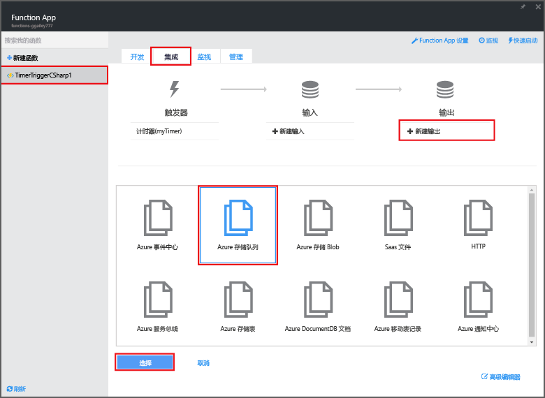
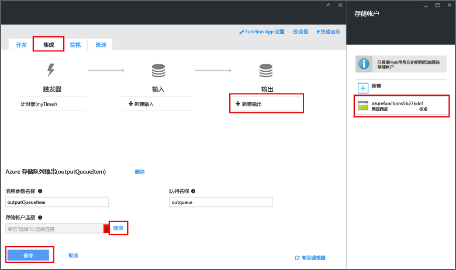

# 创建事件处理 Azure 函数
Azure Functions 提供事件驱动、按需计算体验，让你能够创建以各种编程语言实现的计划或触发代码单元。若要了解有关 Azure Functions 的详细信息，请参阅 [Azure Functions 概述](functions-overview.md)。

本主题将介绍如何通过 C# 创建基于事件计时器执行的新函数，以便将消息添加到存储队列中。

## 先决条件
必须先具有一个有效的 Azure 帐户，然后才能创建函数。如果还没有 Azure 帐户，[可以使用免费帐户](https://azure.microsoft.com/free/)。

## 通过模板创建计时器触发的函数
Function App 在 Azure 中托管函数的执行。必须先具有一个有效的 Azure 帐户，然后才能创建函数。如果还没有 Azure 帐户，[可以使用免费帐户](https://azure.microsoft.com/free/)。

1. 转到 [Azure Functions 门户](https://functions.azure.com/signin)，然后使用你的 Azure 帐户登录。
2. 如果存在要使用的现有 Function App，请从“**你的 Function App**”中选择它，然后单击“**打开**”。若要创建新的 Function App，请键入新 Function App 的唯一“**名称**”或接受生成的名称，选择首选“**区域**”，然后单击“**创建 + 开始使用**”。
3. 在 Function App 中，单击“**+ 新建函数**”>“**TimerTrigger - C#**”>“**创建**”。这样可以创建一个使用默认名称的函数，该函数按默认计划每隔一分钟运行一次。
   
    
4. 在新建函数中，单击“**集成**”选项卡>“**新建输出**”>“**Azure 存储队列**”>“**选择**”。
   
    
5. 在“**Azure 存储队列输出**”中，请单击“**存储帐户连接**”旁边的“**选择**”，选择现有的存储帐户或新建一个，然后单击“**保存**”。
   
    
6. 返回“**开发**”选项卡，将“**代码**”窗口中现有的 C# 脚本替换为以下代码：
   
        using System;
   
        public static void Run(TimerInfo myTimer, out string outputQueueItem, TraceWriter log)
        {
            // Add a new scheduled message to the queue.
            outputQueueItem = $"Ping message added to the queue at: {DateTime.Now}.";
   
            // Also write the message to the logs.
            log.Info(outputQueueItem);
        }
   
    执行函数时，此代码将新消息添加到当前日期和时间的队列。
7. 单击“**保存**”，观察下次执行函数时的“**日志**”窗口。
8. （可选）导航到存储帐户并确认正将消息添加到队列。
9. 返回“**集成**”选项卡并将“计划字段更改为 `0 0 * * * *`。该函数现在每隔一小时运行一次。

这是非常简单的计时器触发器和存储队列输出绑定示例。有关详细信息，请参阅 [Azure Functions 计时器触发器](functions-bindings-timer.md)以及 [Azure 存储的 Azure 函数触发器和绑定](functions-bindings-storage.md)主题。

## 后续步骤
请参阅以下主题，获取有关 Azure Functions 的详细信息。

* [Azure Functions 开发人员参考](functions-reference.md)用于编码函数和定义触发器及绑定的程序员参考。
* [测试 Azure Functions](functions-test-a-function.md)介绍可用于测试函数的各种工具和技巧。
* [如何缩放 Azure Functions](functions-scale.md)讨论 Azure Functions 提供的服务计划（包括动态服务计划）以及如何选择合适的计划。

[!INCLUDE [入门笔记](../../includes/functions-get-help.md)]

<!---HONumber=AcomDC_0921_2016-->