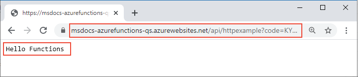

# <a name="quickstart-create-a-function-in-azure-that-responds-to-http-requests"></a>快速入门：在 Azure 中创建用于响应 HTTP 请求的函数

::: zone pivot="programming-language-csharp"  
在本文中，我们使用命令行工具创建一个响应 HTTP 请求的基于 C# 类库的函数。 在本地测试代码后，将代码部署到 Azure Functions 的无服务器环境。 
::: zone-end  
::: zone pivot="programming-language-javascript"
在本文中，我们使用命令行工具创建一个响应 HTTP 请求的 JavaScript 函数。 在本地测试代码后，将代码部署到 Azure Functions 的无服务器环境。 
::: zone-end
::: zone pivot="programming-language-typescript"
在本文中，我们使用命令行工具创建一个响应 HTTP 请求的 TypeScript 函数。 在本地测试代码后，将代码部署到 Azure Functions 的无服务器环境。 
::: zone-end   
::: zone pivot="programming-language-powershell"
在本文中，我们使用命令行工具创建一个响应 HTTP 请求的 PowerShell 函数。 在本地测试代码后，将代码部署到 Azure Functions 的无服务器环境。 
::: zone-end  
::: zone pivot="programming-language-python" 
在本文中，你将使用命令行工具创建响应 HTTP 请求的 Python 函数。 在本地测试代码后，将代码部署到 Azure Functions 的无服务器环境。 
::: zone-end  
::: zone pivot="programming-language-java" 
在本文中，我们使用命令行工具创建一个响应 HTTP 请求的 Java 函数。 在本地测试代码后，将代码部署到 Azure Functions 的无服务器环境。 
::: zone-end

完成本快速入门会从你的 Azure 帐户中扣取最多几美分的费用。

::: zone pivot="programming-language-csharp,programming-language-javascript,programming-language-typescript,programming-language-powershell,programming-language-python"  
本文还提供了[基于 Visual Studio 代码的版本](functions-create-first-function-vs-code.md)。
::: zone-end  
::: zone pivot="programming-language-java"  
> [!NOTE]
> 如果 Maven 不是你的首选开发工具，请查看面向使用 [Gradle](/azure/azure-functions/functions-create-first-java-gradle)、[IntelliJ IDEA](/azure/developer/java/toolkit-for-intellij/quickstart-functions) 和 [Visual Studio Code](/azure/azure-functions/functions-create-first-function-vs-code?pivots=programming-language-java) 的 Java 开发人员的类似教程。
::: zone-end  

[!INCLUDE [functions-requirements-cli](../../includes/functions-requirements-cli.md)]

[!INCLUDE [functions-cli-verify-prereqs](../../includes/functions-cli-verify-prereqs.md)]

[!INCLUDE [functions-cli-create-venv](../../includes/functions-cli-create-venv.md)]

## <a name="create-a-local-function-project"></a>创建本地函数项目

在 Azure Functions 中，有一个函数项目是一个或多个单独函数（每个函数响应特定的触发器）的容器。 项目中的所有函数共享相同的本地和宿主配置。 在本部分，你将创建包含单个函数的函数项目。

::: zone pivot="programming-language-csharp,programming-language-javascript,programming-language-typescript,programming-language-powershell,programming-language-python"  
按如下所示运行 `func init` 命令，在名为 LocalFunctionProj 的文件夹中创建使用指定运行时的函数项目：   
::: zone-end  
::: zone pivot="programming-language-python"  
```
func init LocalFunctionProj --python
```
::: zone-end  
::: zone pivot="programming-language-csharp"  
```
func init LocalFunctionProj --dotnet
```
::: zone-end  
::: zone pivot="programming-language-javascript"  
```
func init LocalFunctionProj --javascript
```
::: zone-end  
::: zone pivot="programming-language-typescript"  
```
func init LocalFunctionProj --typescript
```
::: zone-end  
::: zone pivot="programming-language-powershell"  
```
func init LocalFunctionProj --powershell
```
::: zone-end    
::: zone pivot="programming-language-java"  
在空的文件夹中，运行以下命令以从 [Maven archetype](https://maven.apache.org/guides/introduction/introduction-to-archetypes.html) 生成 Functions 项目。

# <a name="bash"></a>[bash](#tab/bash)
```bash
mvn archetype:generate -DarchetypeGroupId=com.microsoft.azure -DarchetypeArtifactId=azure-functions-archetype 
```
# <a name="powershell"></a>[PowerShell](#tab/powershell)
```powershell
mvn archetype:generate "-DarchetypeGroupId=com.microsoft.azure" "-DarchetypeArtifactId=azure-functions-archetype" 
```
# <a name="cmd"></a>[Cmd](#tab/cmd)
```cmd
mvn archetype:generate "-DarchetypeGroupId=com.microsoft.azure" "-DarchetypeArtifactId=azure-functions-archetype" 
```
---

Maven 会请求你提供所需的值，以在部署上完成项目的生成。   
系统提示时提供以下值：

| Prompt | 值 | 说明 |
| ------ | ----- | ----------- |
| **groupId** | `com.fabrikam` | 一个值，用于按照 Java 的[包命名规则](https://docs.oracle.com/javase/specs/jls/se6/html/packages.html#7.7)在所有项目中标识你的项目。 |
| **artifactId** | `fabrikam-functions` | 一个值，该值是 jar 的名称，没有版本号。 |
| **version** | `1.0-SNAPSHOT` | 选择默认值。 |
| **package** | `com.fabrikam.functions` | 一个值，该值是所生成函数代码的 Java 包。 使用默认值。 |

键入 `Y` 或按 Enter 进行确认。

Maven 在名为 artifactId  的新文件夹（在此示例中为 `fabrikam-functions`）中创建项目文件。 
::: zone-end  
导航到项目文件夹：

::: zone pivot="programming-language-csharp,programming-language-javascript,programming-language-typescript,programming-language-powershell,programming-language-python"  
```
cd LocalFunctionProj
```
::: zone-end  
::: zone pivot="programming-language-java"  
```
cd fabrikam-functions
```
::: zone-end  
此文件夹包含项目的各个文件，其中包括名为 [local.settings.json](functions-run-local.md#local-settings-file) 和 [host.json](functions-host-json.md) 的配置文件。 由于 *local.settings.json* 可以包含从 Azure 下载的机密，因此，默认情况下，该文件会从 *.gitignore* 文件的源代码管理中排除。

[!INCLUDE [functions-cli-add-function](../../includes/functions-cli-add-function.md)]

### <a name="optional-examine-the-file-contents"></a>（可选）检查文件内容

如果需要，可以跳到[在本地运行函数](#run-the-function-locally)并稍后再检查文件内容。

::: zone pivot="programming-language-csharp"
#### <a name="httpexamplecs"></a>HttpExample.cs

*HttpExample.cs* 包含一个接收 `req` 变量中的请求数据的 `Run` 方法，该变量是使用 HttpTriggerAttribute  **修饰的 [HttpRequest](/dotnet/api/microsoft.aspnetcore.http.httprequest)** ，用于定义触发器行为。 

:::code language="csharp" source="~/functions-docs-csharp/http-trigger-template/HttpExample.cs":::

返回对象是 [ActionResult](/dotnet/api/microsoft.aspnetcore.mvc.actionresult)，它将响应消息作为 [OkObjectResult](/dotnet/api/microsoft.aspnetcore.mvc.okobjectresult) (200) 或 [BadRequestObjectResult](/dotnet/api/microsoft.aspnetcore.mvc.badrequestobjectresult) (400) 返回。 要了解详细信息，请参阅 [Azure Functions HTTP 触发器和绑定](/azure/azure-functions/functions-bindings-http-webhook?tabs=csharp)。
::: zone-end

::: zone pivot="programming-language-java"
#### <a name="functionjava"></a>Function.java
Function.java 包含一个接收 `request` 变量中的请求数据的 `run` 方法，该变量是使用 [HttpTrigger](/java/api/com.microsoft.azure.functions.annotation.httptrigger) 注释修饰的 [HttpRequestMessage](/java/api/com.microsoft.azure.functions.httprequestmessage)，用于定义触发器行为。  

:::code language="java" source="~/functions-quickstart-java/functions-add-output-binding-storage-queue/src/main/java/com/function/Function.java":::

响应消息由 [HttpResponseMessage.Builder](/java/api/com.microsoft.azure.functions.httpresponsemessage.builder) API 生成。

#### <a name="pomxml"></a>pom.xml

为托管应用而创建的 Azure 资源的设置在插件的 configuration 元素中使用生成的 pom.xml 文件中 `com.microsoft.azure` 的 groupId 定义。   例如，以下 configuration 元素指示基于 Maven 的部署在 `westus` 区域中的 `java-functions-group` 资源组内创建一个函数应用。 该函数应用本身在 Windows 上运行，后者托管在 `java-functions-app-service-plan` 计划（默认情况下是一个无服务器消耗计划）中。    

:::code language="java" source="~/functions-quickstart-java/functions-add-output-binding-storage-queue/pom.xml" range="116-155":::

若要控制在 Azure 中创建资源的方式，可以更改这些设置，例如，在初始部署之前将 `runtime.os` 从 `windows` 更改为 `linux`。 有关 Maven 插件支持的设置的完整列表，请参阅[配置详细信息](https://github.com/microsoft/azure-maven-plugins/wiki/Azure-Functions:-Configuration-Details)。

#### <a name="functiontestjava"></a>FunctionTest.java

原型还会为函数生成单元测试。 更改函数以便在项目中添加绑定或新函数时，也需要修改 FunctionTest.java 文件中的测试。 
::: zone-end  
::: zone pivot="programming-language-python"
#### <a name="__init__py"></a>\_\_init\_\_.py

*\_\_init\_\_.py* 包含一个根据 *function.json* 中的配置触发的 `main()` Python 函数。

:::code language="python" source="~/functions-quickstart-templates/Functions.Templates/Templates/HttpTrigger-Python/__init__.py":::

对于 HTTP 触发器，该函数将接收 *function.json* 中定义的变量 `req` 中的请求数据。 `req` 是 [azure.functions.HttpRequest 类](/python/api/azure-functions/azure.functions.httprequest)的实例。 在 *function.json* 中定义为 `$return` 的返回对象是 [azure.functions.HttpResponse 类](/python/api/azure-functions/azure.functions.httpresponse)的一个实例。 要了解详细信息，请参阅 [Azure Functions HTTP 触发器和绑定](/azure/azure-functions/functions-bindings-http-webhook?tabs=python)。
::: zone-end

::: zone pivot="programming-language-javascript"
#### <a name="indexjs"></a>index.js

*index.js* 导出一个根据 *function.json* 中的配置触发的函数。

:::code language="javascript" source="~/functions-quickstart-templates/Functions.Templates/Templates/HttpTrigger-JavaScript/index.js":::

对于 HTTP 触发器，该函数将接收 *function.json* 中定义的变量 `req` 中的请求数据。 在 *function.json* 中定义为 `$return` 的返回对象是响应。 要了解详细信息，请参阅 [Azure Functions HTTP 触发器和绑定](/azure/azure-functions/functions-bindings-http-webhook?tabs=javascript)。
::: zone-end

::: zone pivot="programming-language-typescript"
#### <a name="indexts"></a>index.ts

*index.ts* 导出一个根据 *function.json* 中的配置触发的函数。

:::code language="typescript" source="~/functions-quickstart-templates/Functions.Templates/Templates/HttpTrigger-TypeScript/index.ts":::

对于 HTTP 触发器，该函数将接收 *function.json* 中定义的 **HttpRequest** 类型的变量 `req` 中的请求数据。 在 *function.json* 中定义为 `$return` 的返回对象是响应。 
::: zone-end

::: zone pivot="programming-language-powershell"
#### <a name="runps1"></a>run.ps1

*run.ps1* 定义一个根据 *function.json* 中的配置触发的函数脚本。

:::code language="powershell" source="~/functions-quickstart-templates/Functions.Templates/Templates/HttpTrigger-PowerShell/run.ps1":::

对于 HTTP 触发器，该函数将接收传递给 *function.json* 中定义的 `$Request` 参数的请求数据。 在 *function.json* 中定义为 `Response` 的返回对象将作为响应传递给 `Push-OutputBinding` cmdlet。 
::: zone-end

::: zone pivot="programming-language-javascript,programming-language-typescript,programming-language-python,programming-language-powershell"
#### <a name="functionjson"></a>function.json

*function.json* 是一个配置文件，其中定义了函数的输入和输出 `bindings`，包括触发器类型。 
::: zone-end

::: zone pivot="programming-language-python"
如果需要，可以更改 `scriptFile` 以调用不同的 Python 文件。

:::code language="json" source="~/functions-quickstart-templates/Functions.Templates/Templates/HttpTrigger-Python/function.json":::
::: zone-end

::: zone pivot="programming-language-javascript,programming-language-typescript"
:::code language="json" source="~/functions-quickstart-templates/Functions.Templates/Templates/HttpTrigger-JavaScript/function.json":::
::: zone-end

::: zone pivot="programming-language-powershell"
:::code language="json" source="~/functions-quickstart-templates/Functions.Templates/Templates/HttpTrigger-PowerShell/function.json":::
::: zone-end

::: zone pivot="programming-language-javascript,programming-language-typescript,programming-language-python,programming-language-powershell"  
每个绑定都需要一个方向、类型和唯一的名称。 HTTP 触发器具有类型为 [`httpTrigger`](functions-bindings-http-webhook-trigger.md) 的输入绑定和类型为 [`http`](functions-bindings-http-webhook-output.md) 的输出绑定。
::: zone-end  

[!INCLUDE [functions-run-function-test-local-cli](../../includes/functions-run-function-test-local-cli.md)]

::: zone pivot="programming-language-javascript,programming-language-typescript,programming-language-python,programming-language-powershell,programming-language-csharp"    
## <a name="create-supporting-azure-resources-for-your-function"></a>创建函数的支持性 Azure 资源

在将函数代码部署到 Azure 之前，需要创建三个资源：

- 一个资源组：相关资源的逻辑容器。
- 一个存储帐户：维护有关项目的状态和其他信息。
- 一个函数应用：提供用于执行函数代码的环境。 函数应用映射到本地函数项目，可让你将函数分组为一个逻辑单元，以便更轻松地管理、部署和共享资源。

使用以下 Azure CLI 命令创建这些项。 完成后，每个命令将提供 JSON 输出。

使用 [az login](/cli/azure/reference-index#az-login) 命令登录到 Azure（如果尚未这样做）：

```azurecli
az login
```
    
使用“[az group create](/cli/azure/group#az-group-create)”命令创建资源组。 以下示例在 `westeurope` 区域中创建名为 `AzureFunctionsQuickstart-rg` 的资源组。 （通常，你会在 `az account list-locations` 命令输出的、与你靠近的某个可用区域中创建资源组和资源。）

```azurecli
az group create --name AzureFunctionsQuickstart-rg --location westeurope
```

> [!NOTE]
> 不能在同一资源组中托管 Linux 和 Windows 应用。 如果名为 `AzureFunctionsQuickstart-rg` 的现有资源组有 Windows 函数应用或 Web 应用，必须使用其他资源组。
 
    
使用 [az storage account create](/cli/azure/storage/account#az-storage-account-create) 命令在资源组和区域中创建常规用途存储帐户。 在以下示例中，请将 `<STORAGE_NAME>` 替换为适合自己的全局唯一名称。 名称只能包含 3 到 24 个数字和小写字母字符。 `Standard_LRS` 指定 [Functions 支持](storage-considerations.md#storage-account-requirements)的常规用途帐户。

```azurecli
az storage account create --name <STORAGE_NAME> --location westeurope --resource-group AzureFunctionsQuickstart-rg --sku Standard_LRS
```

在本快速入门中使用的存储帐户只会产生几美分的费用。
    
使用 [az functionapp create](/cli/azure/functionapp#az-functionapp-create) 命令创建函数应用。 在以下示例中，请将 `<STORAGE_NAME>` 替换为在上一步骤中使用的帐户的名称，并将 `<APP_NAME>` 替换为适合自己的全局唯一名称。 `<APP_NAME>` 也是函数应用的默认 DNS 域。 
::: zone-end  

::: zone pivot="programming-language-python"  
如果使用的是 Python 3.8，请将 `--runtime-version` 更改为 `3.8`，并将 `--functions_version` 更改为 `3`。

如果使用的是 Python 3.6，请将 `--runtime-version` 更改为 `3.6`。

```azurecli
az functionapp create --resource-group AzureFunctionsQuickstart-rg --os-type Linux --consumption-plan-location westeurope --runtime python --runtime-version 3.7 --functions-version 2 --name <APP_NAME> --storage-account <STORAGE_NAME>
```
::: zone-end  

::: zone pivot="programming-language-javascript,programming-language-typescript"  
如果使用 Node.js 8，请同时将 `--runtime-version` 更改为 `8`。


```azurecli
az functionapp create --resource-group AzureFunctionsQuickstart-rg --consumption-plan-location westeurope --runtime node --runtime-version 10 --functions-version 2 --name <APP_NAME> --storage-account <STORAGE_NAME>
```
::: zone-end  

::: zone pivot="programming-language-csharp"  
```azurecli
az functionapp create --resource-group AzureFunctionsQuickstart-rg --consumption-plan-location westeurope --runtime dotnet --functions-version 2 --name <APP_NAME> --storage-account <STORAGE_NAME>
```
::: zone-end  

::: zone pivot="programming-language-powershell"  
```azurecli
az functionapp create --resource-group AzureFunctionsQuickstart-rg --consumption-plan-location westeurope --runtime powershell --functions-version 2 --name <APP_NAME> --storage-account <STORAGE_NAME>
```
::: zone-end  

::: zone pivot="programming-language-javascript,programming-language-typescript,programming-language-python,programming-language-powershell,programming-language-csharp"  
此命令将创建一个函数应用，该应用在 [Azure Functions 消耗计划](functions-scale.md#consumption-plan)下指定的语言运行时中运行，根据本教程产生的用量，此操作是免费的。 该命令还会在同一资源组中预配关联的 Azure Application Insights 实例，可以使用它来监视函数应用和查看日志。 有关详细信息，请参阅[监视 Azure Functions](functions-monitoring.md)。 该实例在激活之前不会产生费用。
    
## <a name="deploy-the-function-project-to-azure"></a>将函数项目部署到 Azure
::: zone-end  

::: zone pivot="programming-language-typescript"  
使用 Core Tools 将项目部署到 Azure 之前，请从 TypeScript 源文件创建一个生产就绪的 JavaScript 文件版本。

以下命令可以准备要部署的 TypeScript 项目：

```
npm run build:production 
```
::: zone-end  

::: zone pivot="programming-language-javascript,programming-language-typescript,programming-language-python,programming-language-powershell,programming-language-csharp"  
准备好所需的资源后，便可以使用 [func azure functionapp publish](functions-run-local.md#project-file-deployment) 命令将本地函数项目部署到 Azure 中的函数应用。 在以下示例中，请将 `<APP_NAME>` 替换为你的应用的名称。

```
func azure functionapp publish <APP_NAME>
```

如果看到错误“找不到名为...的应用”，请等待几秒后重试，因为在执行上一 `az functionapp create` 命令后，Azure 可能尚未完全初始化该应用。

publish 命令显示类似于以下输出的结果（为简洁起见，示例中的结果已截断）：

<pre>
...

Getting site publishing info...
Creating archive for current directory...
Performing remote build for functions project.

...

Deployment successful.
Remote build succeeded!
Syncing triggers...
Functions in msdocs-azurefunctions-qs:
    HttpExample - [httpTrigger]
        Invoke url: https://msdocs-azurefunctions-qs.azurewebsites.net/api/httpexample?code=KYHrydo4GFe9y0000000qRgRJ8NdLFKpkakGJQfC3izYVidzzDN4gQ==
</pre>

::: zone-end  
::: zone pivot="programming-language-java"  
## <a name="deploy-the-function-project-to-azure"></a>将函数项目部署到 Azure

首次部署函数项目时，会在 Azure 中创建一个函数应用和相关的资源。 为托管应用而创建的 Azure 资源的设置在 [pom.xml 文件](#pomxml)中定义。 在本文中，我们将接受默认值。

> [!TIP]
> 若要创建在 Linux 而不是 Windows 上运行的函数应用，请将 pom.xml 文件中的 `runtime.os` 元素从 `windows` 更改为 `linux`。 [这些区域](https://github.com/Azure/azure-functions-host/wiki/Linux-Consumption-Regions)支持在消耗计划中运行 Linux。 不能在同一个资源组中同时创建在 Linux 上运行的应用和在 Windows 上运行的应用。

在部署之前，必须使用 [az login](/cli/azure/authenticate-azure-cli) Azure CLI 命令登录到 Azure 订阅。 

```azurecli
az login
```

使用以下命令将项目部署到新的函数应用。 

```
mvn azure-functions:deploy
```

这会在 Azure 中创建以下资源：

+ 资源组。 命名为 java-functions-group。 
+ 存储帐户。 Functions 所需。 此名称根据存储帐户名称要求随机生成。
+ 托管计划。 在 westus 区域中为函数应用提供无服务器托管。  名称为 java-functions-app-service-plan。 
+ 函数应用。 函数应用是函数的部署和执行单元。 名称根据 artifactId 随机生成，其后面追加了一个随机生成的数字。  

部署会打包项目文件，并使用 [zip 部署](functions-deployment-technologies.md#zip-deploy)将其部署到新的函数应用。 此代码从 Azure 中的部署包运行。
::: zone-end

## <a name="invoke-the-function-on-azure"></a>在 Azure 上调用函数

由于函数使用 HTTP 触发器，因此，可以通过在浏览器中或使用 curl 等工具，向此函数的 URL 发出 HTTP 请求来调用它。 在这两种情况下，`code` URL 参数都是唯一的[函数密钥](functions-bindings-http-webhook-trigger.md#authorization-keys)，用于授权函数终结点的调用。

# <a name="browser"></a>[浏览器](#tab/browser)

将 publish 命令的输出中显示的完整“调用 URL”复制到浏览器的地址栏，并追加查询参数 `&name=Functions`。  浏览器显示的输出应与本地运行函数时显示的输出类似。




# <a name="curl"></a>[curl](#tab/curl)

结合“调用 URL”运行 [`curl`](https://curl.haxx.se/)，并追加参数 `&name=Functions`。  该命令的输出应是文本“Hello Functions”。


---

> [!TIP]
> 若要查看已发布的函数应用的准实时日志，请使用 [Application Insights 实时指标流](functions-monitoring.md#streaming-logs)。

## <a name="clean-up-resources"></a>清理资源

若要继续执行下一步骤[添加 Azure 存储队列输出绑定](functions-add-output-binding-storage-queue-cli.md)，请保留到目前为止构建的所有资源。

否则，请使用以下命令删除资源组及其包含的所有资源，以免产生额外的费用。

::: zone pivot="programming-language-javascript,programming-language-typescript,programming-language-python,programming-language-powershell,programming-language-csharp" 
```azurecli
az group delete --name AzureFunctionsQuickstart-rg
```
::: zone-end
::: zone pivot="programming-language-java"
```azurecli
az group delete --name java-functions-group
```
::: zone-end

## <a name="next-steps"></a>后续步骤

> [!div class="nextstepaction"]
> [连接到 Azure 存储队列](functions-add-output-binding-storage-queue-cli.md)
