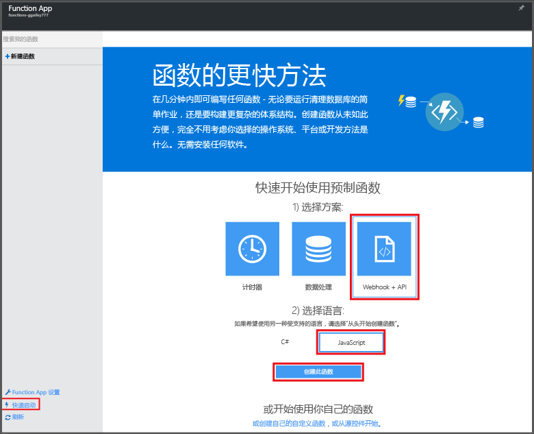

# 在 Azure 门户中创建第一个函数

本主题演示如何创建由 HTTP 请求调用的简单“hello world”Azure 函数。 在 Azure 门户中创建函数前，必须在 Azure 应用服务中创建 Function App，用于托管函数的执行。

若要完成本快速入门，必须具有一个 Azure 帐户。 提供[免费帐户](https://azure.microsoft.com/free/)。 还可以[试用 Azure Functions](https://azure.microsoft.com/try/app-service/functions/)，无需注册 Azure。

## 创建 Function App

[!INCLUDE [functions-create-function-app-portal](../../includes/functions-create-function-app-portal.md)]

有关详细信息，请参阅[通过 Azure 门户创建 Function App](functions-create-function-app-portal.md)。

## 创建函数
这些步骤通过使用 Azure Functions 快速入门在新的 Function App 中创建函数。

1. 在“快速入门”选项卡中，单击“WebHook + API”，选择函数的语言，然后单击“创建函数”。 此时会在选择的语言中创建新的预定义函数。  
   
    

4. （可选）此时，在快速入门中，可以选择在门户内进行 Azure Functions 功能快速浏览。 完成或跳过浏览后，可以通过发送 HTTP 请求来测试新函数。

## 测试函数
[!INCLUDE [Functions quickstart test](../../includes/functions-quickstart-test.md)]

## 后续步骤
[!INCLUDE [Functions quickstart next steps](../../includes/functions-quickstart-next-steps.md)]

[!INCLUDE [Getting Started Note](../../includes/functions-get-help.md)]

