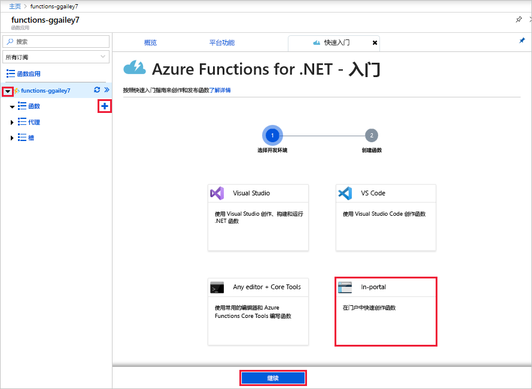

# 在 Azure 门户中创建第一个函数

Azure Functions 用于在[无服务器](https://azure.microsoft.com/solutions/serverless/)环境中执行代码，无需先创建 VM 或发布 Web 应用程序。 在本文中，你将了解如何使用 Functions 在 Azure 门户中创建“hello world”函数。

[!INCLUDE [quickstarts-free-trial-note](../../includes/quickstarts-free-trial-note.md)]

> [!NOTE]
> C# 开发人员应考虑[在 Visual Studio 2019 中创建第一个函数](functions-create-your-first-function-visual-studio.md)，而不要在门户中这样做。 

## 登录 Azure

使用 Azure 帐户登录到 <https://portal.azure.com> 的 Azure 门户。

## 创建函数应用

必须使用函数应用托管函数的执行。 函数应用可将函数分组为一个逻辑单元，以便更轻松地管理、部署和共享资源。 

[!INCLUDE [Create function app Azure portal](../../includes/functions-create-function-app-portal.md)]

接下来，在新的 Function App 中创建一个函数。

## 创建 HTTP 触发的函数

1. 展开新的函数应用，然后选择 **Functions** 旁边的 **+** 按钮，选择“门户中”  ，然后选择“继续”  。

    

1. 选择“WebHook + API”  ，然后选择“创建”  。

    

此时将使用 HTTP 触发的函数的特定于语言模板创建函数。

现在，可以通过发送 HTTP 请求来运行新函数了。

## 测试函数

1. 在新函数中，单击右上角的“</> 获取函数 URL”，选择“默认(函数密钥)”，然后单击“复制”    。 

    

2. 将函数 URL 粘贴到浏览器的地址栏中。 将查询字符串值 `&name=<yourname>` 添加到该 URL 尾部，然后按键盘上的 `Enter` 键来执行请求。 此时会看到函数返回的响应显示在浏览器中。  

    以下示例显示了浏览器中的响应：

    

    请求 URL 包含通过 HTTP 访问函数默认所需的密钥。

3. 运行函数时，会在日志中写入跟踪信息。 若要查看上次执行的跟踪输出，请返回到门户中的函数，并单击屏幕底部的箭头以展开“日志”  。

   

## 清理资源

[!INCLUDE [Clean-up resources](../../includes/functions-quickstart-cleanup.md)]

## 后续步骤

你已使用 HTTP 触发的简单函数创建了一个函数应用。  

[!INCLUDE [Next steps note](../../includes/functions-quickstart-next-steps.md)]

有关详细信息，请参阅 [Azure Functions HTTP 绑定](functions-bindings-http-webhook.md)。
