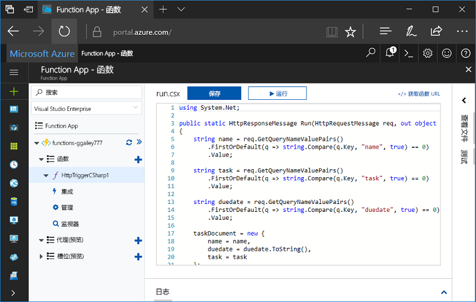
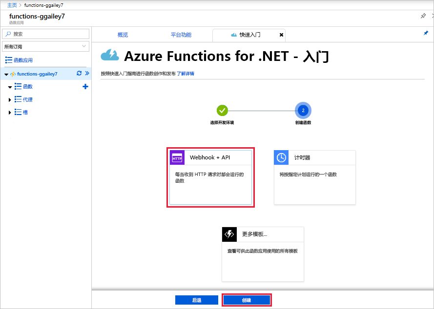
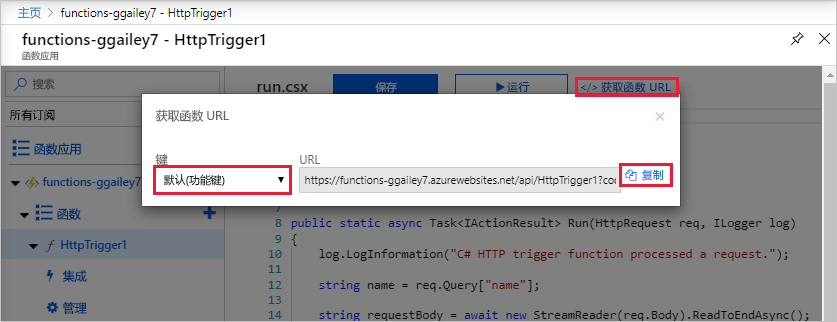
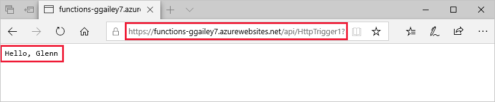
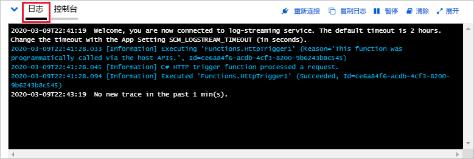

# 在 Azure 门户中创建第一个函数

Azure Functions 可让你在无服务器环境中执行代码，而无需先创建 VM 或发布 Web 应用程序。 在本主题中，了解如何使用 Functions 在 Azure 门户中创建“hello world”函数。

[!INCLUDE [quickstarts-free-trial-note](../../includes/quickstarts-free-trial-note.md)]

## 登录 Azure

登录到 [Azure 门户](https://portal.azure.com/)。

## 创建 Function App

必须使用 Function App 托管函数的执行。 Function App 可让你将函数分组为一个逻辑单元，以便更轻松地管理、部署和共享资源。 

[!INCLUDE [Create function app Azure portal](../../includes/functions-create-function-app-portal.md)]

[!INCLUDE [functions-portal-favorite-function-apps](../../includes/functions-portal-favorite-function-apps.md)]

接下来，在新的 Function App 中创建一个函数。

## 创建 HTTP 触发的函数

1. 展开新的 Function App，然后单击 **Functions** 旁边的 **+** 按钮。

2.  在“快速入门”页上，选择“WebHook + API”，选择函数的语言，然后单击“创建此函数”。 
   
    

使用 HTTP 触发函数模板，采用所选语言创建函数。 可以通过发送 HTTP 请求来运行新函数。

## 测试函数

1. 在新函数中，单击“</> 获取函数 URL”，选择“默认(函数密钥)”，然后单击“复制”。 

    

2. 将 HTTP 请求的 URL 粘贴到浏览器的地址栏中。 将查询字符串 `&name=<yourname>` 追加到此 URL 并执行请求。 下面演示浏览器中函数返回的对 GET 请求的响应：

    

    请求 URL 包含通过 HTTP 访问函数默认所需的密钥。   

## 查看函数日志 

运行函数时，会在日志中写入跟踪信息。 若要查看上次执行的跟踪输出，请返回到门户中的函数，然后单击屏幕底部的向上箭头以展开“日志”。 

## 清理资源

[!INCLUDE [Clean up resources](../../includes/functions-quickstart-cleanup.md)]

## 后续步骤

已使用简单的 HTTP 触发函数创建 Function App。  

[!INCLUDE [Next steps note](../../includes/functions-quickstart-next-steps.md)]

有关详细信息，请参阅 [Azure Functions HTTP 和 webhook 绑定](functions-bindings-http-webhook.md)。

