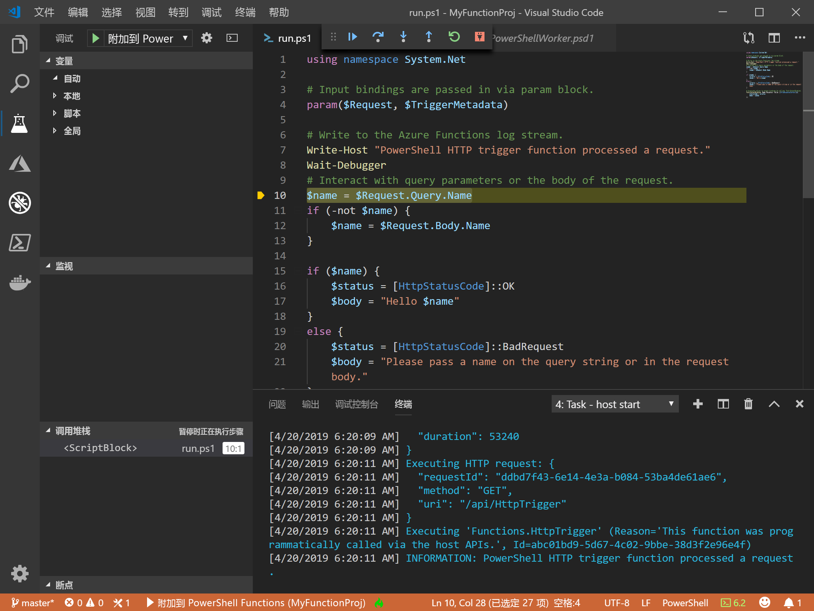
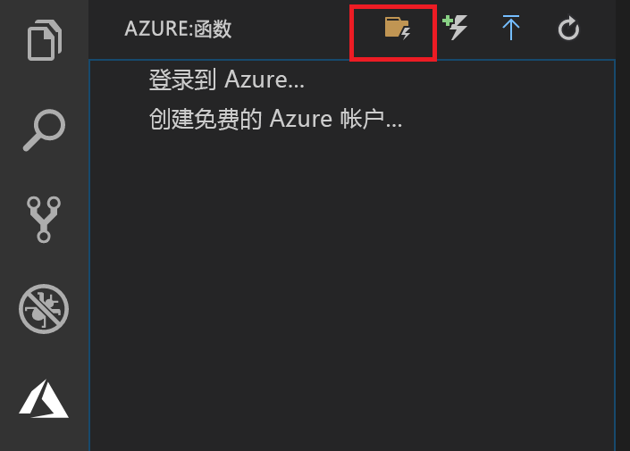

# <a name="create-your-first-powershell-function-in-azure"></a>在 Azure 中创建首个 PowerShell 函数

本快速入门文章逐步说明如何使用 Visual Studio Code 创建第一个[无服务器](https://azure.com/serverless) PowerShell 函数。



可以使用[适用于 Visual Studio Code 的 Azure Functions 扩展]在本地创建 PowerShell 函数，然后将其部署到 Azure 中的新函数应用。 此扩展目前为预览版。 若要了解详细信息，请参阅[适用于 Visual Studio Code 的 Azure Functions 扩展]页。

支持在 macOS、Windows 和基于 Linux 的操作系统上执行以下步骤。

## <a name="prerequisites"></a>必备条件

完成本快速入门教程需要：

* 安装 [PowerShell Core](/powershell/scripting/install/installing-powershell-core-on-windows)

* 在某一[受支持的平台](https://code.visualstudio.com/docs/supporting/requirements#_platforms)上安装 [Visual Studio Code](https://code.visualstudio.com/)。 

* 安装[适用于 Visual Studio Code 的 PowerShell 扩展](https://marketplace.visualstudio.com/items?itemName=ms-vscode.PowerShell)。

* 安装 [.NET Core SDK 2.2+](https://www.microsoft.com/net/download)（Azure Functions Core Tools 需要它，可在所有支持的平台上使用）。

* 安装 [Azure Functions Core Tools](functions-run-local.md#v2) 版本 2.x。

* 还需要一个有效的 Azure 订阅。

[!INCLUDE [quickstarts-free-trial-note](../../includes/quickstarts-free-trial-note.md)]

[!INCLUDE [functions-install-vs-code-extension](../../includes/functions-install-vs-code-extension.md)] 

## <a name="create-a-function-app-project"></a>创建函数应用项目

使用 Visual Studio Code 中的 Azure Functions 项目模板可创建一个项目，该项目可发布到 Azure 中的函数应用。 函数应用可将函数分组为逻辑单元，以便更轻松地管理、部署、缩放和共享资源。

1. 在 Visual Studio Code 中，选择 Azure 徽标以显示“Azure:  Functions”区域，然后选择“创建新项目”图标。

    

1. 选择 Functions 项目工作区的位置，然后选择“选择”  。

    > [!NOTE]
    > 本文已设计为在工作区之外完成。 在这种情况下，请不要选择属于工作区内的项目文件夹。

1. 选择“Powershell”作为函数应用项目的语言，然后选择“Azure Functions v2”   。

1. 选择“HTTP 触发器”作为第一个函数的模板，使用 `HTTPTrigger` 作为函数名称，然后选择授权级别“函数”。  

    > [!NOTE]
    > 在 Azure 中调用函数终结点时，[函数](functions-bindings-http-webhook.md#authorization-keys) 授权级别需要“函数密钥”值。  这样可以增大任何人调用你的函数的难度。

1. 出现提示时，选择“添加到工作区”  。

Visual Studio Code 将在新的工作区中创建 PowerShell 函数应用项目。 此项目包含 [host.json](functions-host-json.md) 和 [local.settings.json](functions-run-local.md#local-settings-file) 配置文件，这些文件将应用到项目中的所有函数。 此 [PowerShell 项目](functions-reference-powershell.md#folder-structure)与 Azure 中运行的函数应用相同。

[!INCLUDE [functions-run-function-test-local-vs-code-ps](../../includes/functions-run-function-test-local-vs-code-ps.md)]

[!INCLUDE [functions-publish-project-vscode](../../includes/functions-publish-project-vscode.md)]

## <a name="test"></a>在 Azure 中运行函数

若要验证发布的函数是否在 Azure 中运行，请执行以下 PowerShell 命令（请将 `Uri` 参数替换为上一步骤所述的 HTTPTrigger 函数的 URL）。 与前面一样，请将查询字符串 `&name=<yourname>` 追加到 URL，如以下示例所示：

```powershell
PS > Invoke-WebRequest -Method Get -Uri "https://glengatest-vscode-powershell.azurewebsites.net/api/HttpTrigger?code=nrY05eZutfPqLo0som...&name=PowerShell"

StatusCode        : 200
StatusDescription : OK
Content           : Hello PowerShell
RawContent        : HTTP/1.1 200 OK
                    Content-Length: 16
                    Content-Type: text/plain; charset=utf-8
                    Date: Thu, 25 Apr 2019 16:01:22 GMT

                    Hello PowerShell
Forms             : {}
Headers           : {[Content-Length, 16], [Content-Type, text/plain; charset=utf-8], [Date, Thu, 25 Apr 2019 16:01:22 GMT]}
Images            : {}
InputFields       : {}
Links             : {}
ParsedHtml        : mshtml.HTMLDocumentClass
RawContentLength  : 16
```

## <a name="next-steps"></a>后续步骤

你已使用 Visual Studio Code 通过简单的 HTTP 触发函数创建了一个 PowerShell 函数应用。 我们建议你详细了解如何使用 Azure Functions Core Tools [在本地调试 PowerShell 函数](functions-debug-powershell-local.md)。 查看 [Azure Functions PowerShell 开发人员指南](functions-reference-powershell.md)。

> [!div class="nextstepaction"]
> [启用 Application Insights 集成](functions-monitoring.md#manually-connect-an-app-insights-resource)

[Azure portal]: https://portal.azure.com
[Azure Functions Core Tools]: functions-run-local.md
[适用于 Visual Studio Code 的 Azure Functions 扩展]: https://marketplace.visualstudio.com/items?itemName=ms-azuretools.vscode-azurefunctions
[`Wait-Debugger`]: /powershell/module/microsoft.powershell.utility/wait-debugger?view=powershell-6
