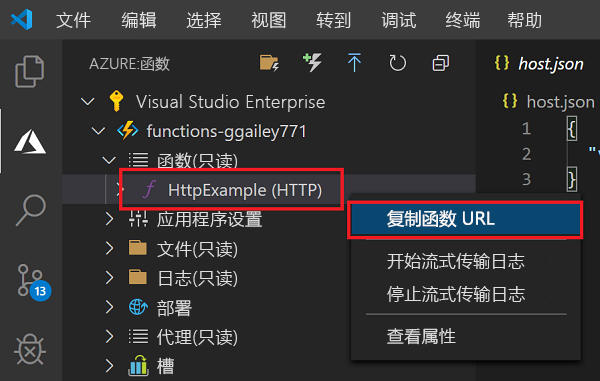
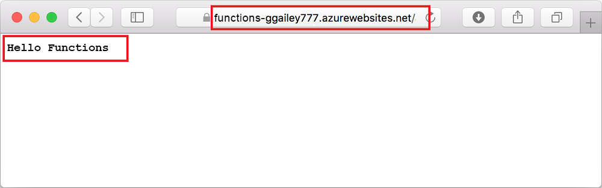

# 快速入门：在 Azure 中使用 Visual Studio Code 创建函数

::: zone pivot="programming-language-csharp"  
在本文中，我们使用 Visual Studio Code 来创建一个响应 HTTP 请求的基于 C# 类库的函数。 在本地测试代码后，将代码部署到 Azure Functions 的无服务器环境。 
::: zone-end  
::: zone pivot="programming-language-javascript"
在本文中，我们使用 Visual Studio Code 来创建一个响应 HTTP 请求的 JavaScript 函数。 在本地测试代码后，将代码部署到 Azure Functions 的无服务器环境。 
::: zone-end
::: zone pivot="programming-language-typescript"
在本文中，我们使用 Visual Studio Code 来创建一个响应 HTTP 请求的 TypeScript 函数。 在本地测试代码后，将代码部署到 Azure Functions 的无服务器环境。 
::: zone-end   
::: zone pivot="programming-language-powershell"
在本文中，我们使用 Visual Studio Code 来创建一个响应 HTTP 请求的 PowerShell 函数。 在本地测试代码后，将代码部署到 Azure Functions 的无服务器环境。 
::: zone-end  
::: zone pivot="programming-language-python" 
在本文中，我们使用 Visual Studio Code 来创建一个响应 HTTP 请求的 Python 函数。 在本地测试代码后，将代码部署到 Azure Functions 的无服务器环境。 
::: zone-end  
::: zone pivot="programming-language-java" 
在本文中，我们使用 Visual Studio Code 来创建一个响应 HTTP 请求的 Java 函数。 在本地测试代码后，将代码部署到 Azure Functions 的无服务器环境。 
::: zone-end

完成本快速入门会从你的 Azure 帐户中扣取最多几美分的费用。 

::: zone pivot="programming-language-csharp,programming-language-javascript,programming-language-typescript,programming-language-powershell,programming-language-python"
本文还有一个[基于 CLI 的版本](functions-create-first-azure-function-azure-cli.md)。
::: zone-end
::: zone pivot="programming-language-java"  
> [!NOTE]
> 如果 Visual Studio Code 不是首选开发工具，请查看面向使用 [Maven](/azure/azure-functions/functions-create-first-azure-function-azure-cli?pivots=programming-language-java)、[Gradle](/azure/azure-functions/functions-create-first-java-gradle) 和 [IntelliJ IDEA](/azure/developer/java/toolkit-for-intellij/quickstart-functions) 的 Java 开发人员的类似教程。
::: zone-end  

## 配置环境

在开始之前，请确保已满足下列要求：

+ 具有活动订阅的 Azure 帐户。 [免费创建帐户](https://azure.microsoft.com/free/?ref=microsoft.com&utm_source=microsoft.com&utm_medium=docs&utm_campaign=visualstudio)。

::: zone pivot="programming-language-csharp,programming-language-powershell,programming-language-python"  
+ [Node.js](https://nodejs.org/)，在 Windows 上使用 npm 时所必需的。 仅限[活动 LTS 和维护 LTS 版本](https://nodejs.org/about/releases/)。 可以使用 `node --version` 命令检查你的版本。
    对于 macOS 和 Linux 上的本地开发而言，这不是必需的。   
::: zone-end  
::: zone pivot="programming-language-javascript,programming-language-typescript"  
+ [Node.js](https://nodejs.org/)，活动 LTS 和维护 LTS 版本（建议使用 10.14.1）。 可以使用 `node --version` 命令检查你的版本。
::: zone-end 
::: zone pivot="programming-language-python"
+ Azure Functions (x64) 支持 [Python 3.8](https://www.python.org/downloads/release/python-381/)、[Python 3.7](https://www.python.org/downloads/release/python-375/)、[Python 3.6](https://www.python.org/downloads/release/python-368/)。
::: zone-end   
::: zone pivot="programming-language-powershell"
+ [PowerShell Core](/powershell/scripting/install/installing-powershell-core-on-windows)

+ [.NET Core SDK 2.2+](https://www.microsoft.com/net/download)  
::: zone-end  
::: zone pivot="programming-language-java"  
+ [Java 开发人员工具包](https://aka.ms/azure-jdks)版本 8。

+ [Apache Maven](https://maven.apache.org) 3.0 或更高版本。
::: zone-end  
+ 安装在某个[受支持的平台](https://code.visualstudio.com/docs/supporting/requirements#_platforms)上的 [Visual Studio Code](https://code.visualstudio.com/)。  
::: zone pivot="programming-language-csharp"  
+ Visual Studio Code 的 [C# 扩展](https://marketplace.visualstudio.com/items?itemName=ms-dotnettools.csharp)。  
::: zone-end  
::: zone pivot="programming-language-python"
+ Visual Studio Code 的 [Python 扩展](https://marketplace.visualstudio.com/items?itemName=ms-python.python)。  
::: zone-end  
::: zone pivot="programming-language-powershell"
+ [Visual Studio Code 的 PowerShell 扩展](https://marketplace.visualstudio.com/items?itemName=ms-vscode.PowerShell)。 
::: zone-end  
::: zone pivot="programming-language-java"  
+ [Java 扩展包](https://marketplace.visualstudio.com/items?itemName=vscjava.vscode-java-pack)
::: zone-end  

+ Visual Studio Code 的 [Azure Functions 扩展](https://marketplace.visualstudio.com/items?itemName=ms-azuretools.vscode-azurefunctions)。 

## 创建本地项目 

在本部分，你将使用 Visual Studio Code 以所选语言创建一个本地 Azure Functions 项目。 稍后在本文中，你要将函数代码发布到 Azure。 

1. 在活动栏中选择“Azure”图标，然后在“Azure:  函数”区域中选择“创建新项目...”图标。 

    

1. 为项目工作区选择目录位置，然后选择“选择”  。

    > [!NOTE]
    > 这些步骤已设计为在工作区之外完成。 在这种情况下，请不要选择属于工作区内的项目文件夹。

1. 根据提示提供以下信息：

    ::: zone pivot="programming-language-csharp"
    + **选择函数项目的语言**：选择`C#`。
    ::: zone-end
    ::: zone pivot="programming-language-javascript"
    + **选择函数项目的语言**：选择`JavaScript`。
    ::: zone-end
    ::: zone pivot="programming-language-typescript"
    + **选择函数项目的语言**：选择`TypeScript`。
    ::: zone-end
    ::: zone pivot="programming-language-powershell"
    + **选择函数项目的语言**：选择`PowerShell`。
    ::: zone-end
    ::: zone pivot="programming-language-python"
    + **选择函数项目的语言**：选择`Python`。

    + **选择一个 Python 别名以创建虚拟环境**：选择 Python 解释器的位置。 如果该位置未显示，请键入 Python 二进制文件的完整路径。  
    ::: zone-end

    ::: zone pivot="programming-language-java"  
    + **选择函数项目的语言**：选择`Java`。

    + **提供组 ID**：选择`com.function`。

    + **提供项目 ID**：选择`myFunction`。

    + **提供版本**：选择`1.0-SNAPSHOT`。

    + **提供包名称**：选择`com.function`。

    + **提供应用名称**：选择`myFunction-12345`。
    ::: zone-end  
    ::: zone pivot="programming-language-csharp,programming-language-javascript,programming-language-typescript,programming-language-powershell,programming-language-python"
    + **为项目的第一个函数选择模板**：选择`HTTP trigger`。
    
    + **提供函数名称**：键入 `HttpExample`。
    ::: zone-end  
    ::: zone pivot="programming-language-csharp"
    + **提供命名空间**：键入 `My.Functions`。 
    ::: zone-end  
    ::: zone pivot="programming-language-csharp,programming-language-javascript,programming-language-typescript,programming-language-powershell,programming-language-python"
    + **授权级别**：选择 `Anonymous`，这使任何人都可以调用你的函数终结点。 若要了解授权级别，请参阅[授权密钥](functions-bindings-http-webhook-trigger.md#authorization-keys)。
    ::: zone-end  
    + **选择打开项目的方式**：选择`Add to workspace`。

1. Visual Studio Code 将使用此信息生成一个包含 HTTP 触发器的 Azure Functions 项目。 可以在资源管理器中查看本地项目文件。 若要详细了解所创建的文件，请参阅[生成的项目文件](functions-develop-vs-code.md#generated-project-files)。 

::: zone pivot="programming-language-csharp,programming-language-javascript,programming-language-python,programming-language-java"

[!INCLUDE [functions-run-function-test-local-vs-code](../../includes/functions-run-function-test-local-vs-code.md)]

::: zone-end

::: zone pivot="programming-language-powershell"

[!INCLUDE [functions-run-function-test-local-vs-code-ps](../../includes/functions-run-function-test-local-vs-code-ps.md)]

::: zone-end

确认该函数可以在本地计算机上正确运行以后，可以使用 Visual Studio Code 将项目直接发布到 Azure。 

[!INCLUDE [functions-sign-in-vs-code](../../includes/functions-sign-in-vs-code.md)]

[!INCLUDE [functions-publish-project-vscode](../../includes/functions-publish-project-vscode.md)]

## 在 Azure 中运行函数

1. 返回到“Azure：函数”  函数”区域，在你的订阅下展开新的函数应用。 展开“函数”，在“HttpExample”中右键单击“(Windows)”或者在按住 Ctrl 的同时单击“(macOS)”，然后选择“复制函数 URL”。   

    

1. 将 HTTP 请求的此 URL 粘贴到浏览器的地址栏中，将 `name` 查询字符串以 `?name=Functions` 形式添加到此 URL 的末尾，然后执行请求。 调用 HTTP 触发的函数的 URL 应采用以下格式：

        http://<functionappname>.azurewebsites.net/api/httpexample?name=Functions 
        
    以下示例演示浏览器中函数返回的对远程 GET 请求的响应： 

    

## 清理资源

若要继续执行下一步骤[将 Azure 存储队列绑定添加到函数](functions-add-output-binding-storage-queue-vs-code.md)，需要保留到目前为止构建的所有资源。

否则，可以使用以下步骤删除函数应用及其相关资源，以免产生任何额外的费用。

[!INCLUDE [functions-cleanup-resources-vs-code.md](../../includes/functions-cleanup-resources-vs-code.md)]

若要详细了解 Functions 的费用，请参阅[估算消耗计划成本](functions-consumption-costs.md)。

## 后续步骤

你已使用 Visual Studio Code 通过简单的 HTTP 触发函数创建了函数应用。 在下一篇文章中，将通过添加输出绑定来扩展该函数。 此绑定将 HTTP 请求中的字符串写入 Azure 队列存储队列中的消息。 

> [!div class="nextstepaction"]
> [将 Azure 存储队列绑定添加到函数](functions-add-output-binding-storage-queue-vs-code.md)

[Azure Functions Core Tools]: functions-run-local.md
[Azure Functions extension for Visual Studio Code]: https://marketplace.visualstudio.com/items?itemName=ms-azuretools.vscode-azurefunctions
