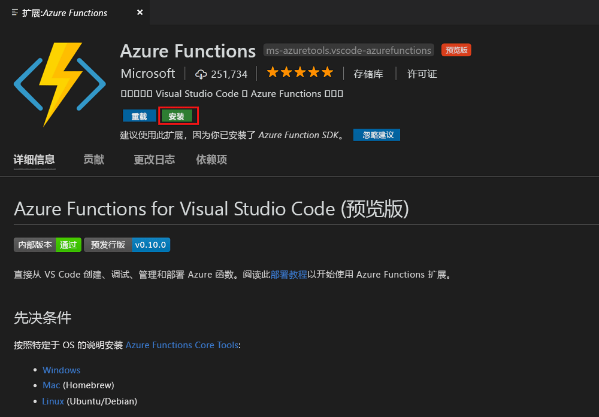
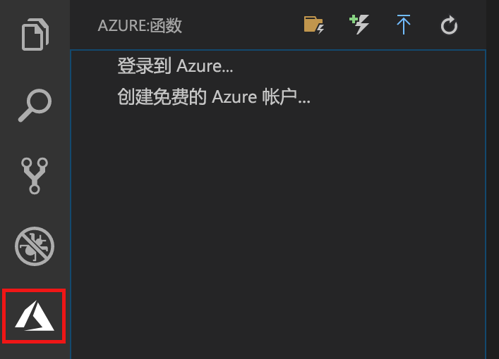
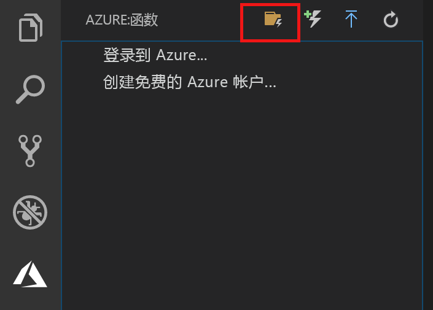
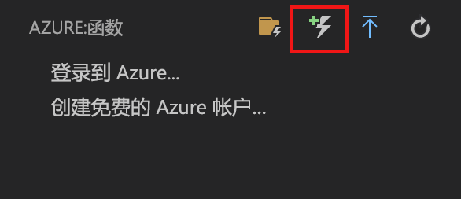
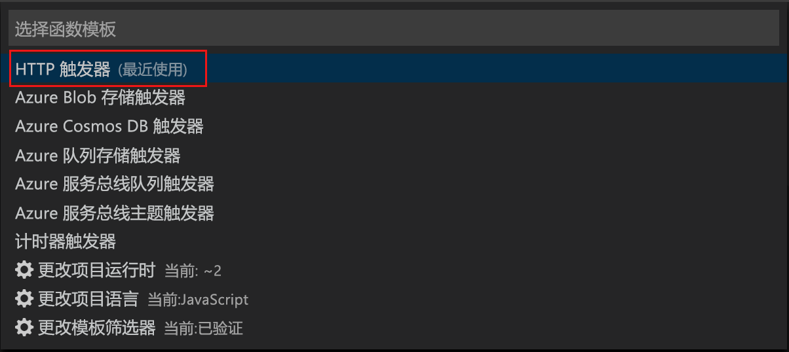
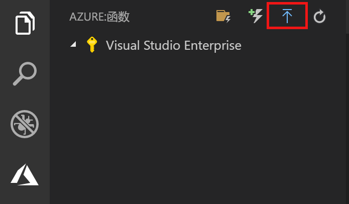
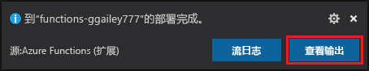
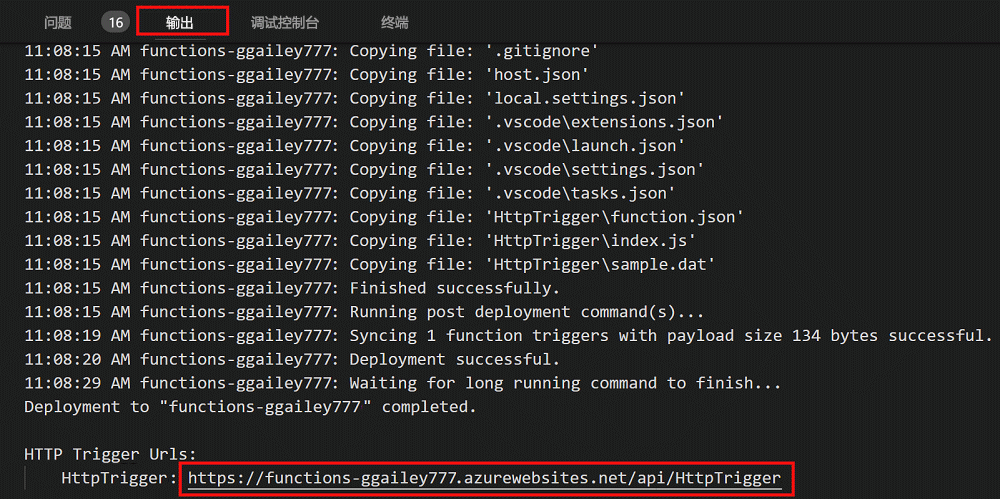

# 使用 Visual Studio Code 创建你的第一个函数

Azure Functions 用于在[无服务器](https://azure.microsoft.com/solutions/serverless/)环境中执行代码，无需先创建 VM 或发布 Web 应用程序。

本文介绍了如何使用[适用于 Visual Studio Code 的 Azure Functions 扩展]来通过 Microsoft Visual Studio Code 在本地计算机上创建和测试“hello world”函数。 然后说明了如何将函数代码从 Visual Studio Code 发布到 Azure。

该扩展当前支持 C#、JavaScript 和 Java 函数。 本文中的步骤可能会因你为 Azure Functions 项目所选的语言而异。 此扩展目前为预览版。 若要了解详细信息，请参阅[适用于 Visual Studio Code 的 Azure Functions 扩展]页。

## 先决条件

完成本快速入门教程：

* 在某一[受支持的平台](https://code.visualstudio.com/docs/supporting/requirements#_platforms)上安装 [Visual Studio Code](https://code.visualstudio.com/)。 本文是在运行 macOS (High Sierra) 的设备上开发并测试的。

* 安装 [Azure Functions Core Tools](functions-run-local.md#v2) 的 2.x 版（仍为预览版）。

* 针对所选语言安装特定必需组件：

    | 语言 | 分机 |
    | -------- | --------- |
    | **C#** | [适用于 Visual Studio Code 的 C#](https://marketplace.visualstudio.com/items?itemName=ms-vscode.csharp) [.NET Core CLI 工具](https://docs.microsoft.com/dotnet/core/tools/?tabs=netcore2x)*   |
    | **Java** | [Debugger for Java](https://marketplace.visualstudio.com/items?itemName=vscjava.vscode-java-debug) [Java 8](https://aka.ms/azure-jdks) [Maven 3+](https://maven.apache.org/) |
    | **JavaScript** | [Node 8.0+](https://nodejs.org/)  |

    \* 也是 Core Tools 所必需的。

[!INCLUDE [quickstarts-free-trial-note](../../includes/quickstarts-free-trial-note.md)]

## 安装 Azure Functions 扩展

Azure Functions 扩展用于创建、测试函数以及将函数部署到 Azure。

1. 在 Visual Studio Code 中打开“扩展”并搜索 `azure functions`，或者[在 Visual Studio Code 中打开此链接](vscode:extension/ms-azuretools.vscode-azurefunctions)。

1. 选择“安装”将扩展安装到 Visual Studio Code。 

    

1. 重新启动 Visual Studio Code，然后选择“活动”栏上的 Azure 图标。 此时侧边栏中应显示 Azure Functions 区域。

    

## 创建 Azure Functions 项目

使用 Visual Studio Code 中的 Azure Functions 项目模板可创建一个项目，该项目可发布到 Azure 中的函数应用。 函数应用可将函数分组为一个逻辑单元，以用于管理、部署和共享资源。

1. 在 Visual Studio Code 中，选择 Azure 徽标以显示“Azure: Functions”区域，然后选择“创建新项目”图标。

    

1. 为项目工作区选择位置，然后选择“选择”。

    > [!NOTE]
    > 本文已设计为在工作区之外完成。 在这种情况下，请不要选择属于工作区内的项目文件夹。

1. 选择函数应用项目的语言。 在本文中将使用 JavaScript。
    

1. 出现提示时，选择“添加到工作区”。

Visual Studio Code 将在新的工作区中创建函数应用项目。 此项目包含 [host.json](functions-host-json.md) 和 [local.settings.json](functions-run-local.md#local-settings-file) 配置文件以及任何特定于语言的项目文件。 在项目文件夹中还会有新的 Git 存储库。

## 创建 HTTP 触发的函数

1. 从“Azure: Functions”区域中选择“创建函数”图标。

    

1. 选择包含函数应用项目的文件夹，然后选择“HTTP 触发器”函数模板。

    

1. 键入 `HTTPTrigger` 作为函数名称，然后按 Enter，然后选择“匿名”身份验证。

    

    此时将使用 HTTP 触发的函数的模板，以所选语言创建函数。

    

可以通过修改 function.json 文件，将输入和输出绑定添加到函数。 有关详细信息，请参阅 [Azure Functions 触发器和绑定概念](functions-triggers-bindings.md)。

创建函数项目和 HTTP 触发的函数后，可以在本地计算机上对其进行测试。

## 在本地测试函数

使用 Azure Functions Core Tools 可以在本地开发计算机上运行 Azure Functions 项目。 首次从 Visual Studio Code 启动某个函数时，系统会提示你安装这些工具。  

1. 若要测试函数，请在函数代码中设置断点并按 F5 启动函数应用项目。 来自 Core Tools 的输出会显示在“终端”面板中。

1. 在“终端”面板中，复制 HTTP 触发的函数的 URL 终结点。

    

1. 将 HTTP 请求的 URL 粘贴到浏览器的地址栏中。 将查询字符串 `?name=<yourname>` 追加到此 URL 并执行请求。 执行将在命中断点时暂停。

    

1. 下面显示了当继续执行时浏览器中对 GET 请求的响应：

    

1. 若要停止调试，请按 Shift + F1。

确认该函数可以在本地计算机上正确运行以后，即可将项目发布到 Azure。

## 登录 Azure

在发布应用之前，必须先登录到 Azure。

1. 在“Azure: Functions”区域中，选择“登录到 Azure...”。如果没有帐户，可以**创建一个免费 Azure 帐户**。

    

1. 出现提示时，选择“复制并打开”，或者复制显示的代码并在浏览器中打开 <https://aka.ms/devicelogin>。

1. 将复制的代码粘贴到“设备登录”页中，验证 Visual Studio Code 的登录信息，然后选择“继续”。  

1. 使用 Azure 帐户凭据完成登录。 成功登录后，可以关闭浏览器。

## 将项目发布到 Azure

使用 Visual Studio Code 可以将函数项目直接发布到 Azure。 在此过程中，将在 Azure 订阅中创建函数应用和相关的资源。 函数应用为函数提供了执行上下文。 该项目将打包并部署到 Azure 订阅中的新函数应用。 

本文假定你要创建新的函数应用。 发布到现有函数应用将覆盖该应用在 Azure 中的内容。

1. 在“Azure: Functions”区域中，选择“部署到函数应用”图标。

    

1. 选择项目文件夹（即当前工作区）。

1. 如果有多个订阅，请选择要承载函数应用的订阅，然后选择“+ 创建新的函数应用”。

1. 键入用于标识函数应用的全局唯一名称，然后按 Enter。 函数应用名称的有效字符包括 `a-z`、`0-9` 和 `-`。

1. 选择“+ 创建新的资源组”，键入资源组名称（如 `myResourceGroup`），然后按 Enter。 也可以使用现有资源组。

1. 选择“+ 创建新的存储帐户”，键入函数应用使用的新存储帐户的全局唯一名称，然后按 Enter。 存储帐户名称必须为 3 到 24 个字符，并且只能包含数字和小写字母。 也可以使用现有帐户。

1. 选择离你近或离函数访问的其他服务近的[区域](https://azure.microsoft.com/regions/)中的位置。

    选择位置后，创建函数应用将会开始。 创建函数应用并应用了部署包之后，会显示一个通知。

1. 在通知中选择“查看输出”以查看创建和部署结果，其中包括你创建的 Azure 资源。

    

1. 记下 Azure 中的新函数应用的 URL。 在该项目发布到 Azure 之后将使用此 URL 来测试函数。

    

1. 回到“Azure: Functions”区域中，你将看到订阅下显示了新的函数应用。 展开此节点时，可以看到函数应用中的函数，以及应用程序设置和函数代理。

    

    从函数应用节点中，按住 Ctrl 并单击（右键单击）可选择要在 Azure 中针对该函数应用执行的各种管理和配置任务。 还可以选择在 Azure 门户中查看该函数应用。

## 在 Azure 中测试函数

1. 从“输出”面板复制 HTTP 触发器的 URL。 与前面一样，请确保将查询字符串 `?name=<yourname>` 添加到此 URL 的末尾并执行请求。

    调用 HTTP 触发的函数的 URL 应采用以下格式：

        http://<functionappname>.azurewebsites.net/api/<functionname>?name=<yourname> 

1. 将 HTTP 请求的这个新 URL 粘贴到浏览器的地址栏中。 下面演示浏览器中函数返回的对远程 GET 请求的响应： 

    

## 后续步骤

你已使用 Visual Studio Code 通过简单的 HTTP 触发函数创建了函数应用。 若要了解有关以特定语言开发函数的详细信息，请参阅 [JavaScript](functions-reference-node.md)、[.NET](functions-dotnet-class-library.md) 或[Java](functions-reference-java.md) 的语言参考指南。

接下来你可能想要了解有关使用 Azure Functions Core Tools 从终端或命令提示符下进行本地测试和调试的详细信息。

> [!div class="nextstepaction"]
> [在本地编写代码并测试](functions-run-local.md)

[Azure Functions Core Tools]: functions-run-local.md
[适用于 Visual Studio Code 的 Azure Functions 扩展]: https://marketplace.visualstudio.com/items?itemName=ms-azuretools.vscode-azurefunctions
