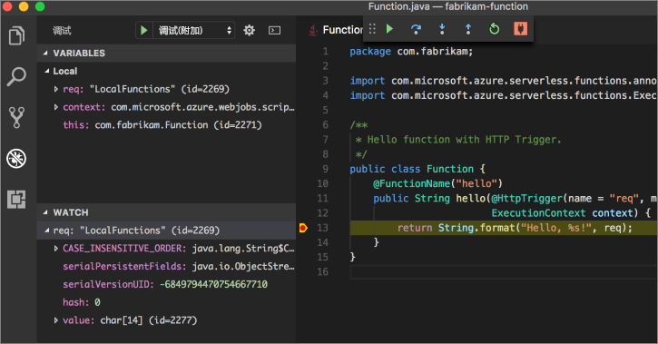

# <a name="create-your-first-function-with-java-and-maven-preview"></a>通过 Java 和 Maven 创建你的第一个函数（预览版）

> [!NOTE] 
> 用于 Azure Functions 的 Java 当前为预览版。

本快速入门可指导通过 Maven 创建[无服务器](https://azure.microsoft.com/overview/serverless-computing/)函数项目，在本地对其进行测试，并将其部署到 Azure Functions。 完成后，可在 Azure 中运行 HTTP 触发的函数应用。


[!INCLUDE [quickstarts-free-trial-note](../../includes/quickstarts-free-trial-note.md)]

## <a name="prerequisites"></a>先决条件
若要通过 Java 开发函数应用，必须安装以下软件：

-  [Java 开发人员工具包](https://www.azul.com/downloads/zulu/)，版本 8。
-  [Apache Maven](https://maven.apache.org) 3.0 或更高版本。
-  [Azure CLI](https://docs.microsoft.com/cli/azure)

> [!IMPORTANT] 
> JAVA_HOME 环境变量必须设置为 JDK 的安装位置，以完成本快速入门。

## <a name="install-the-azure-functions-core-tools"></a>安装 Azure Functions Core Tools

Azure Functions Core Tools 为从终端或命令提示符编写、运行和调试 Azure Functions 提供了本地开发环境。 

在继续操作前，请在本地计算机上安装 [Core Tools 版本 2](functions-run-local.md#v2)。

## <a name="generate-a-new-functions-project"></a>生成新的 Functions 项目

在空的文件夹中，运行以下命令以从 [Maven archetype](https://maven.apache.org/guides/introduction/introduction-to-archetypes.html) 生成 Functions 项目。

### <a name="linuxmacos"></a>Linux/MacOS

```bash
mvn archetype:generate \
    -DarchetypeGroupId=com.microsoft.azure \
    -DarchetypeArtifactId=azure-functions-archetype 
```

### <a name="windows-cmd"></a>Windows (CMD)
```cmd
mvn archetype:generate ^
    -DarchetypeGroupId=com.microsoft.azure ^
    -DarchetypeArtifactId=azure-functions-archetype
```

Maven 会请求你提供所需的值以完成项目的生成。 有关 groupId、artifactId 和 version 值，请参阅 [Maven 命名约定](https://maven.apache.org/guides/mini/guide-naming-conventions.html)参考。 AppName 值在 Azure 中必须唯一，以便 Maven 基于以前输入的 artifactId 生成默认应用名称。 PackageName 值确定所生成函数代码的 Java 包。

下面的 `com.fabrikam.functions` 和 `fabrikam-functions` 标识符用作示例，目的是使本快速入门中后面的步骤更易读。 建议你在此步骤中向 Maven 提供你自己的值。

```Output
Define value for property 'groupId': com.fabrikam.functions
Define value for property 'artifactId' : fabrikam-functions
Define value for property 'version' 1.0-SNAPSHOT : 
Define value for property 'package': com.fabrikam.functions
Define value for property 'appName' fabrikam-functions-20170927220323382:
Confirm properties configuration: Y
```

在此示例 `fabrikam-functions` 中，Maven 在新文件夹中创建名为 artifactId 的项目文件 项目中生成的可以运行的代码是一个简单的回显请求正文的 [HTTP 触发](/azure/azure-functions/functions-bindings-http-webhook)函数：

```java
public class Function {
    /**
     * This function listens at endpoint "/api/hello". Two ways to invoke it using "curl" command in bash:
     * 1. curl -d "HTTP Body" {your host}/api/hello
     * 2. curl {your host}/api/hello?name=HTTP%20Query
     */
    @FunctionName("hello")
    public HttpResponseMessage<String> hello(
            @HttpTrigger(name = "req", methods = {"get", "post"}, authLevel = AuthorizationLevel.ANONYMOUS) HttpRequestMessage<Optional<String>> request,
            final ExecutionContext context) {
        context.getLogger().info("Java HTTP trigger processed a request.");

        // Parse query parameter
        String query = request.getQueryParameters().get("name");
        String name = request.getBody().orElse(query);

        if (name == null) {
            return request.createResponse(400, "Please pass a name on the query string or in the request body");
        } else {
            return request.createResponse(200, "Hello, " + name);
        }
    }
}

```

## <a name="run-the-function-locally"></a>在本地运行函数

将目录更改为新创建的项目文件夹，并通过 Maven 生成和运行此函数：

```
cd fabrikam-functions
mvn clean package 
mvn azure-functions:run
```

> [!NOTE]
> 如果在使用 Java 9 时遇到 `javax.xml.bind.JAXBException` 异常，请参阅 [GitHub](https://github.com/jOOQ/jOOQ/issues/6477) 上的解决方法。

当函数在本地系统上运行并且做好响应 HTTP 请求的准备时，将显示以下输出：

```Output
Listening on http://localhost:7071
Hit CTRL-C to exit...

Http Functions:

   hello: http://localhost:7071/api/hello
```

使用 curl 在新的终端窗口中从命令行触发函数：

```
curl -w '\n' -d LocalFunction http://localhost:7071/api/hello
```

```Output
Hello LocalFunction!
```

在终端中使用 `Ctrl-C` 停止函数代码。

## <a name="deploy-the-function-to-azure"></a>将函数部署到 Azure

部署到 Azure Functions 的过程中会使用 Azure CLI 中的帐户凭据。 在继续操作之前[使用 Azure CLI 登录](/cli/azure/authenticate-azure-cli?view=azure-cli-latest)。

```azurecli
az login
```

使用 `azure-functions:deploy` Maven 目标将代码部署到新的函数应用。

```
mvn azure-functions:deploy
```

部署完成后，将显示可用于访问你的 Azure 函数应用的 URL：

```output
[INFO] Successfully deployed Function App with package.
[INFO] Deleting deployment package from Azure Storage...
[INFO] Successfully deleted deployment package fabrikam-function-20170920120101928.20170920143621915.zip
[INFO] Successfully deployed Function App at https://fabrikam-function-20170920120101928.azurewebsites.net
[INFO] ------------------------------------------------------------------------
```

使用 `cURL` 测试在 Azure 上运行的函数应用。 需更改以下示例中的 URL，使之与前一步骤中你自己的函数应用的已部署 URL 匹配。

```
curl -w '\n' https://fabrikam-functions-20170920120101928.azurewebsites.net/api/hello -d AzureFunctions
```

```Output
Hello AzureFunctions!
```

## <a name="next-steps"></a>后续步骤

已使用简单的 HTTP 触发器创建了 Java 函数应用，并将其部署到了 Azure Functions。

- 有关开发 Java 函数的详细信息，请查看 [Java 函数开发人员指南](functions-reference-java.md)。
- 使用 `azure-functions:add` Maven 目标将具有不同触发器的其他函数添加到你的项目。
- 使用 Visual Studio Code 在本地调试函数。 安装 [Java 扩展包](https://marketplace.visualstudio.com/items?itemName=vscjava.vscode-java-pack)且在 Visual Studio Code 中打开 Functions 项目后，[将调试器附加](https://code.visualstudio.com/Docs/editor/debugging#_launch-configurations)到端口 5005。 然后，在编辑器中设置断点，并在本地运行函数时触发函数：
- 使用 Visual Studio Code 远程调试函数。 查看[编写无服务器 Java 应用程序](https://code.visualstudio.com/docs/java/java-serverless#_remote-debug-functions-running-in-the-cloud)文档中的说明。
