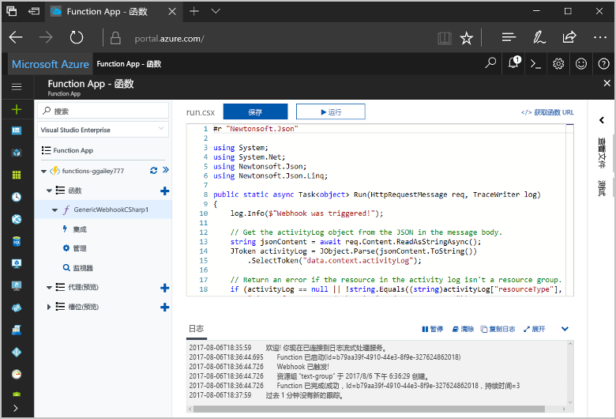
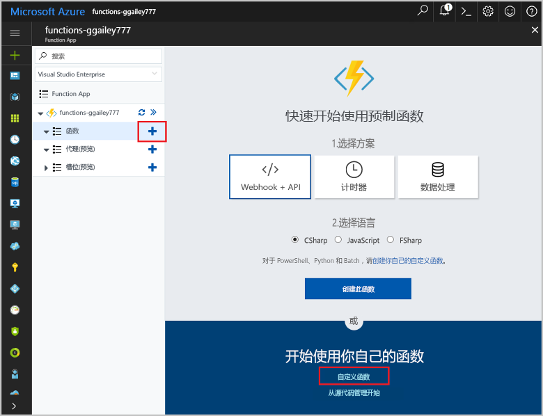
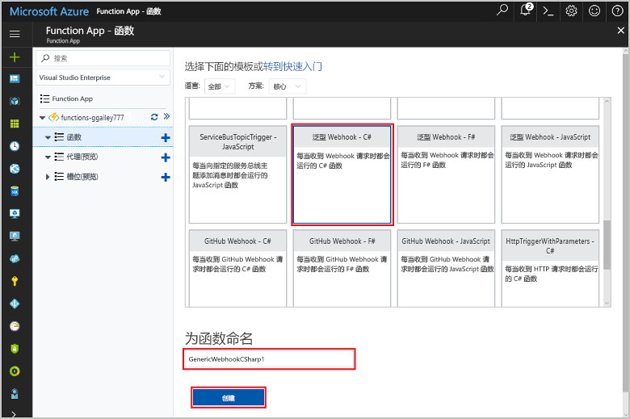
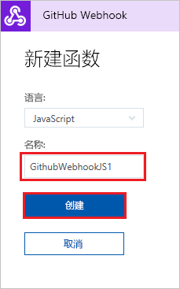
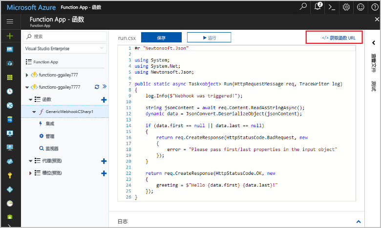
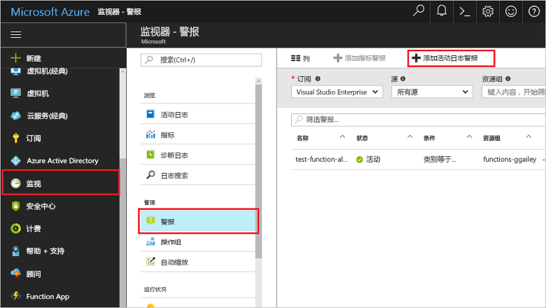
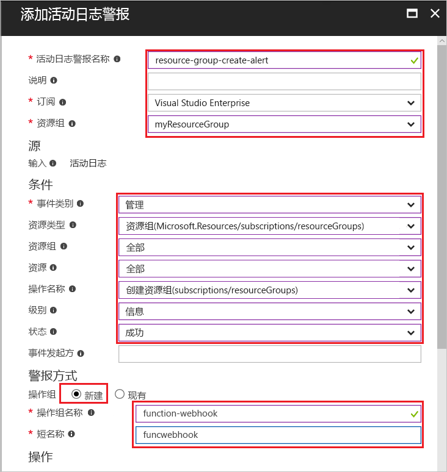
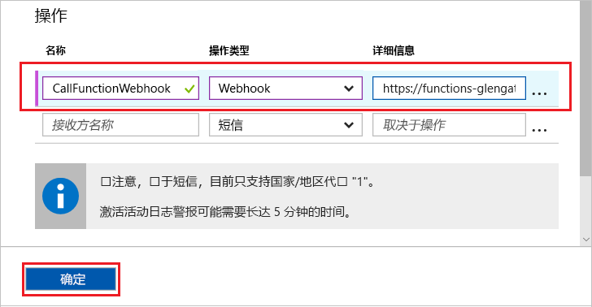
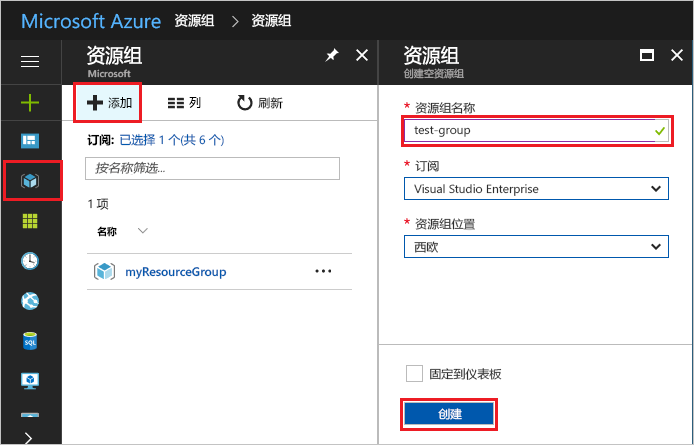
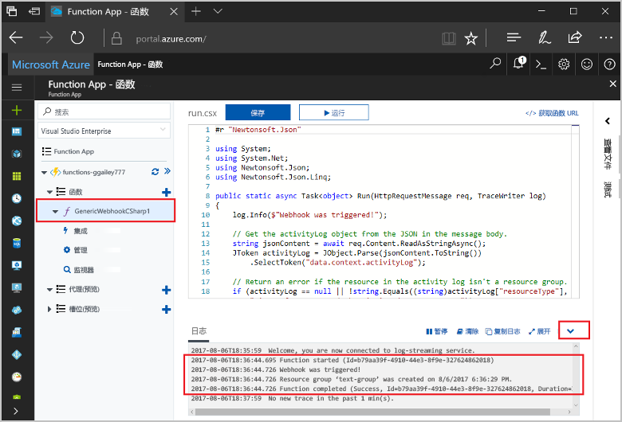

# <a name="create-a-function-triggered-by-a-generic-webhook"></a>创建由通用 webhook 触发的函数

Azure Functions 用于在无服务器环境中执行代码，无需先创建 VM 或发布 Web 应用程序。 例如，你可以配置用于通过 Azure Monitor 发出的警报触发的函数。 本主题将介绍如何在将资源组添加到订阅时执行 C# 代码。   



## <a name="prerequisites"></a>先决条件 

完成本教程：

+ 如果你还没有 Azure 订阅，可以在开始前创建一个 [免费帐户](https://azure.microsoft.com/free/?WT.mc_id=A261C142F)。

## <a name="create-an-azure-function-app"></a>创建 Azure Function App

[!INCLUDE [Create function app Azure portal](../../includes/functions-create-function-app-portal.md)]

接下来，在新的 Function App 中创建一个函数。

## <a name="create-function"></a>创建通用 webhook 触发的函数

1. 展开 Function App，单击“Functions”旁边的 + 按钮。 如果这是函数应用中的第一个函数，请选择“自定义函数”。 此时将显示函数模板的完整集合。

    

2. 在搜索栏中键入 `generic`，然后选择需要用于泛型 Webhook 触发器模板的语言。 本主题使用 C# 函数。

     

2. 为函数键入一个**名称**，然后选择“创建”。 

      

2. 在新函数中，单击“</> 获取函数 URL”，并复制和保存相关值。 此值将用于配置 webhook。 

    
         
接下来，可以在 Azure Monitor 的活动日志警报中创建 webhook 终结点。 

## <a name="create-an-activity-log-alert"></a>创建活动日志警报

1. 在 Azure 门户中，导航到“监视器”服务，选择“警报”，然后单击“添加活动日志警报”。   

    

2. 使用表中指定的设置：

    

    | 设置      |  建议的值   | 说明                              |
    | ------------ |  ------- | -------------------------------------------------- |
    | **活动日志警报名称** | resource-group-create-alert | 活动日志警报名称。 |
    | **订阅** | 订阅 | 本教程中使用的订阅。 | 
    |  **资源组** | myResourceGroup | 向其部署警报资源的资源组。 使用与函数应用相同的资源组，以便于在完成本教程后进行清理。 |
    | **事件类别** | 管理 | 此类别包括对 Azure 资源所做的更改。  |
    | **资源类型** | 资源组 | 筛选面向资源组活动的警报。 |
    | **资源组**<br/>和**资源** | 全部 | 监视所有资源。 |
    | **操作名称** | 创建资源组 | 筛选创建操作的警报。 |
    | **级别** | 信息性 | 包括信息性级别的警报。 | 
    | **Status** | 已成功 | 筛选已成功完成操作的警报。 |
    | **操作组** | 新建 | 创建一个新操作组，定义引发警报时所执行的操作。 |
    | **操作组名称** | function-webhook | 用于标识操作组的名称。  | 
    | **短名称** | funcwebhook | 操作组的短名称。 |  

3. 在“操作”中，使用表中指定的设置添加操作： 

    

    | 设置      |  建议的值   | 说明                              |
    | ------------ |  ------- | -------------------------------------------------- |
    | **Name** | CallFunctionWebhook | 操作的名称。 |
    | **操作类型** | Webhook | 对警报的响应是调用 Webhook URL。 |
    | **详细信息** | 函数 URL | 粘贴先前复制的函数的 webhook URL。 |v

4. 单击“确定”以创建警报和操作组。  

在订阅中创建资源组时，现在将调用 webhook。 接下来，更新函数中代码以处理请求正文中的 JSON 日志数据。   

## <a name="update-the-function-code"></a>更新函数代码

1. 在门户中导航回到函数应用，并展开函数。 

2. 在门户中函数内的 C# 脚本代码替换为以下代码：

    ```csharp
    #r "Newtonsoft.Json"
    
    using System;
    using System.Net;
    using Newtonsoft.Json;
    using Newtonsoft.Json.Linq;
    
    public static async Task<object> Run(HttpRequestMessage req, TraceWriter log)
    {
        log.Info($"Webhook was triggered!");
    
        // Get the activityLog object from the JSON in the message body.
        string jsonContent = await req.Content.ReadAsStringAsync();
        JToken activityLog = JObject.Parse(jsonContent.ToString())
            .SelectToken("data.context.activityLog");
    
        // Return an error if the resource in the activity log isn't a resource group. 
        if (activityLog == null || !string.Equals((string)activityLog["resourceType"], 
            "Microsoft.Resources/subscriptions/resourcegroups"))
        {
            log.Error("An error occurred");
            return req.CreateResponse(HttpStatusCode.BadRequest, new
            {
                error = "Unexpected message payload or wrong alert received."
            });
        }
    
        // Write information about the created resource group to the streaming log.
        log.Info(string.Format("Resource group '{0}' was {1} on {2}.",
            (string)activityLog["resourceGroupName"],
            ((string)activityLog["subStatus"]).ToLower(), 
            (DateTime)activityLog["submissionTimestamp"]));
    
        return req.CreateResponse(HttpStatusCode.OK);    
    }
    ```

现在，你可以通过在订阅中创建新资源组来测试该函数。

## <a name="test-the-function"></a>测试函数

1. 单击 Azure 门户左侧的资源组图标，选择“+ 添加”，键入“资源组名称”，然后选择“创建”以创建空资源组。
    
    

2. 返回到函数并展开“日志”窗口。 创建资源组后，活动日志警报会触发 webhook，并将执行函数。 你会看到写入日志的新资源组的名称。  

    

3. （可选）请返回并删除你创建的资源组。 请注意，此活动不会触发该函数。 这是因为删除操作由警报筛选出来的。 

## <a name="clean-up-resources"></a>清理资源

[!INCLUDE [Next steps note](../../includes/functions-quickstart-cleanup.md)]

## <a name="next-steps"></a>后续步骤

已创建从通用 webhook 收到请求时运行的函数。 

[!INCLUDE [Next steps note](../../includes/functions-quickstart-next-steps.md)]

有关 Webhook 触发器的详细信息，请参阅 [Azure Functions HTTP 和 Webhook 绑定](functions-bindings-http-webhook.md)。 若要了解有关以 C# 开发函数的详细信息，请参阅 [Azure Functions C# 脚本开发人员参考](functions-reference-csharp.md)。

