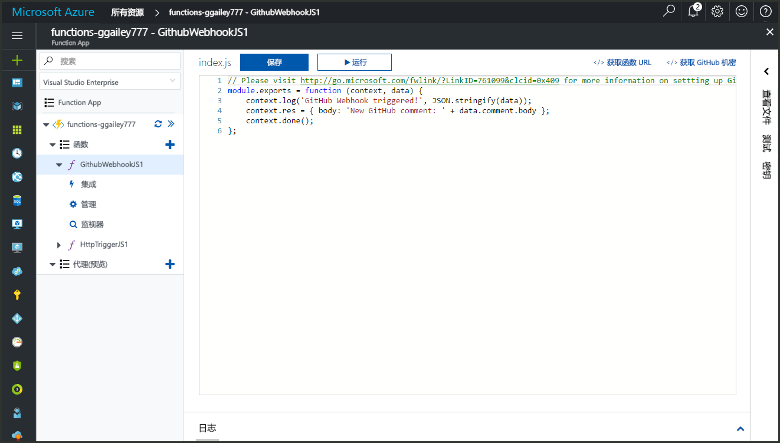
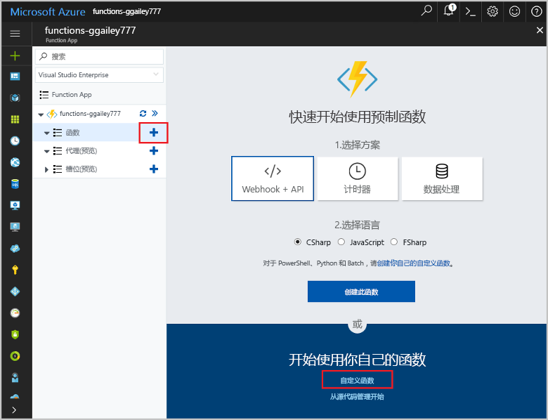
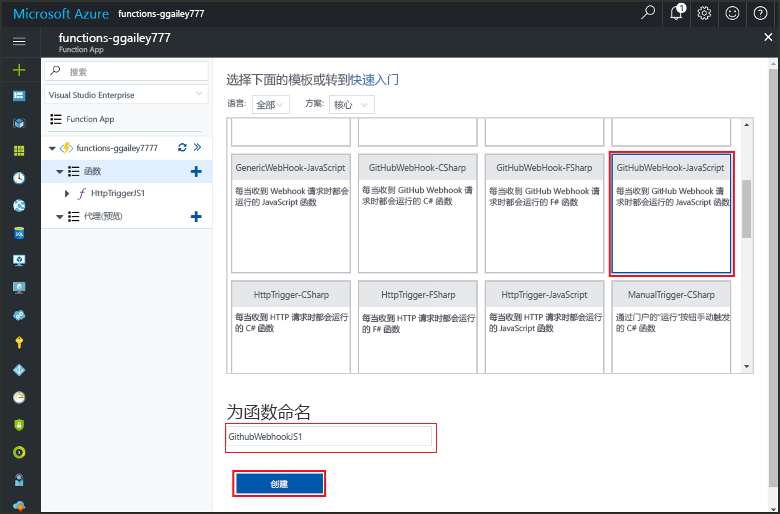
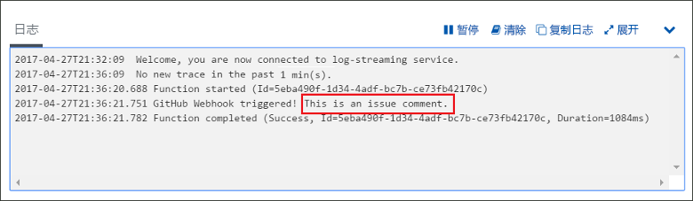

# 创建由 GitHub Webhook 触发的函数

了解如何创建由带有 GitHub 特定有效负载的 HTTP webhook 请求触发的函数。

## 先决条件

+ 一个至少包含一个项目的 GitHub 帐户。
+ Azure 订阅。 如果还没有该订阅，可以在开始前创建一个[免费帐户](https://azure.microsoft.com/free/?WT.mc_id=A261C142F)。

[!INCLUDE [functions-portal-favorite-function-apps](../../includes/functions-portal-favorite-function-apps.md)]

## 创建 Azure Function App

[!INCLUDE [Create function app Azure portal](../../includes/functions-create-function-app-portal.md)]

接下来，在新的 Function App 中创建一个函数。

## 创建 GitHub webhook 触发函数

1. 展开 Function App，单击“Functions”旁边的 + 按钮。 如果这是 Function App 中的第一个函数，请选择“自定义函数”。 此时将显示函数模板的完整集合。

    

2. 为所需语言选择 GitHubWebHook 模板。 为函数命名，然后选择“创建”。

      

3. 在新函数中，单击“</> 获取函数 URL”，然后复制并保存相关值。 针对“</> 获取 GitHub 机密”执行相同的操作。 请使用这些值在 GitHub 中配置 Webhook。

    

接下来，在 GitHub 存储库中创建 Webhook。

## 配置 Webhook

1. 在 GitHub 中，导航到自己的存储库。 还可以使用已分叉的任何存储库。 如果需要分叉存储库，请使用 <https://github.com/Azure-Samples/functions-quickstart>。

1. 依次单击“设置”、“Webhook”和“添加 Webhook”。

    

1. 使用表中指定的设置，然后单击“添加 webhook”。

    

| 设置 | 建议的值 | 说明 |
|---|---|---|
| **有效负载 URL** | 复制的值 | 使用“</> 获取函数 URL”返回的值。 |
| **机密**   | 复制的值 | 使用“</> 获取 GitHub 机密”返回的值。 |
| **内容类型** | application/json | 该函数需要 JSON 有效负载。 |
| 事件触发器 | 让我选择单个事件 | 我们只想在发生问题注释事件时触发。  |
| | 问题注释 |  |

现在，Webhook 配置为在添加新问题注释时触发函数。

## 测试函数

1. 在 GitHub 存储库的新浏览器窗口中，打开“问题”选项卡。

1. 在新窗口中，单击“新建问题”，键入标题，然后单击“提交新问题”。

1. 在问题中键入注释，然后单击“注释” 。

    

1. 返回到门户并查看日志。 你应看到包含新注释文本的跟踪项。

     

## 清理资源

[!INCLUDE [Next steps note](../../includes/functions-quickstart-cleanup.md)]

## 后续步骤

已创建从 GitHub webhook 收到请求时运行的函数。

[!INCLUDE [Next steps note](../../includes/functions-quickstart-next-steps.md)]

有关 Webhook 触发器的详细信息，请参阅 [Azure Functions HTTP 和 Webhook 绑定](functions-bindings-http-webhook.md)。

