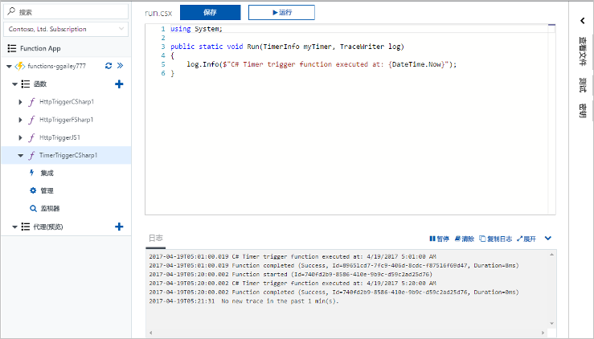
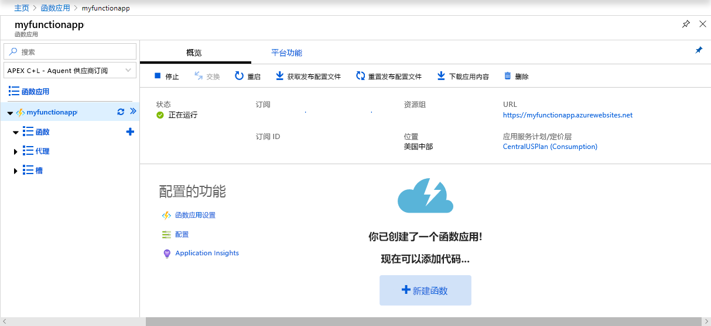
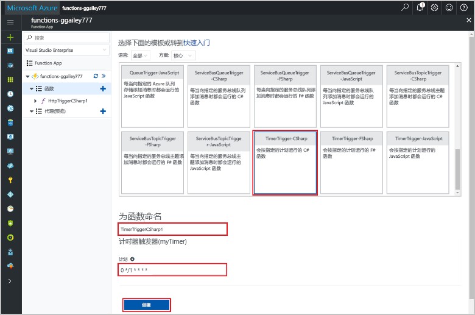
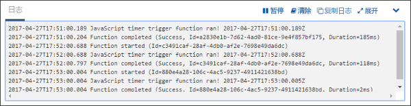
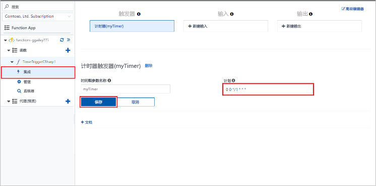

# 在 Azure 中创建由计时器触发的函数

了解如何使用 Azure Functions 创建根据你定义的计划运行的函数。

## 先决条件

如果你还没有 Azure 订阅，可以在开始前创建一个 [免费帐户](https://azure.microsoft.com/free/?WT.mc_id=A261C142F) 。

[!INCLUDE [functions-portal-favorite-function-apps](../../includes/functions-portal-favorite-function-apps.md)]

## 创建 Azure Function App

[!INCLUDE [Create function app Azure portal](../../includes/functions-create-function-app-portal.md)]

接下来，在新的 Function App 中创建一个函数。

## 创建计时器触发的函数

1. 展开 Function App，依次单击“函数”旁边的 **+** 按钮、与所需语言相对应的 **TimerTrigger** 模板。 然后使用表中指定的设置：

    

    | 设置 | 建议的值 | 说明 |
    |---|---|---|
    | **为函数命名** | TimerTriggerCSharp1 | 定义计时器触发的函数的名称。 |
    | **[计划](http://en.wikipedia.org/wiki/Cron#CRON_expression)** | 0 \*/1 \* \* \* \* | 六字段 [CRON 表达式](http://en.wikipedia.org/wiki/Cron#CRON_expression)，计划函数每分钟运行一次。 |

2. 单击“创建” 。 将使用所选语言创建一个每分钟运行一次的函数。

3. 通过查看写入日志的跟踪信息来验证执行情况。

    

现在，可以更改函数的计划，减少其运行频率，例如每小时运行一次。 

## 更新计时器计划

1. 展开函数，然后单击“集成”。 可在此处定义函数的输入和输出绑定，还可以设置计划。 

2. 输入新**计划**值（`0 0 */1 * * *`），然后单击“保存”。  

现在已获得一个每小时运行一次的函数。 

## 清理资源

[!INCLUDE [Next steps note](../../includes/functions-quickstart-cleanup.md)]

## 后续步骤

已创建一个按计划运行的函数。

[!INCLUDE [Next steps note](../../includes/functions-quickstart-next-steps.md)]

有关计时器触发器的详细信息，请参阅[使用 Azure Functions 计划代码执行](functions-bindings-timer.md)。
