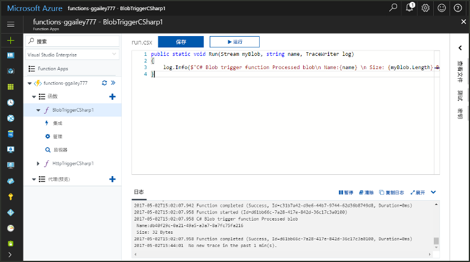
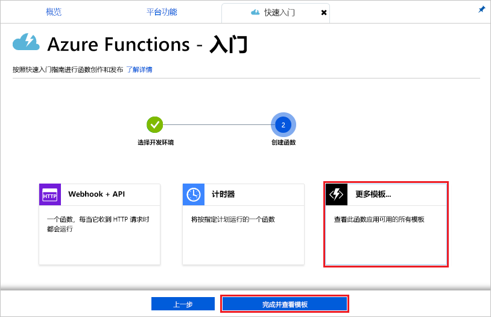
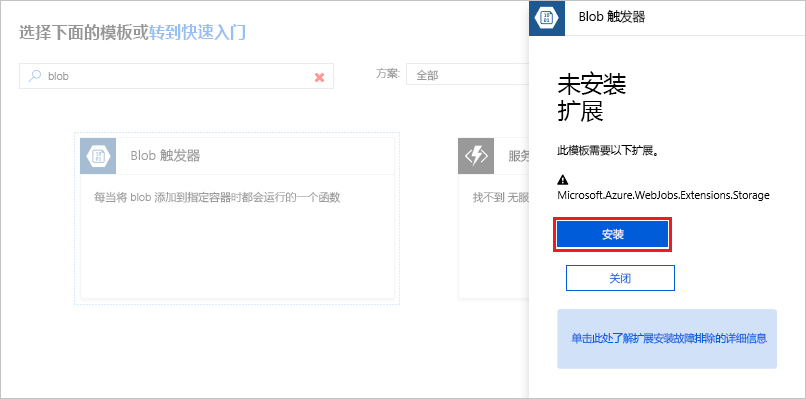
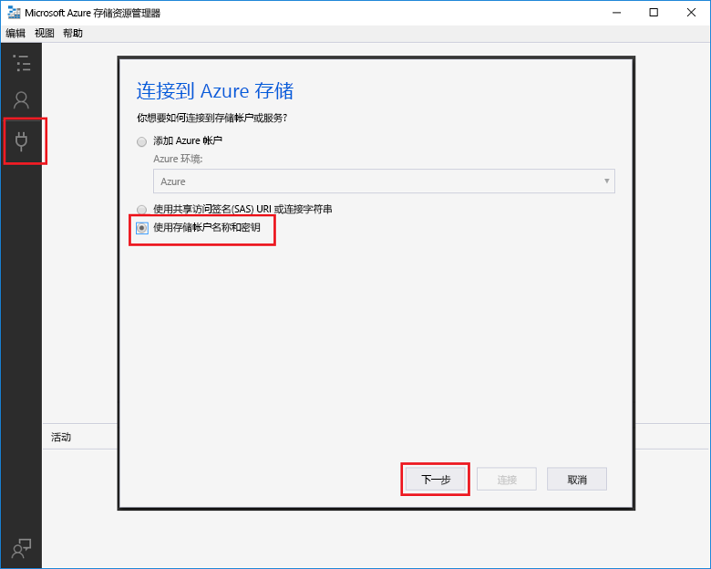
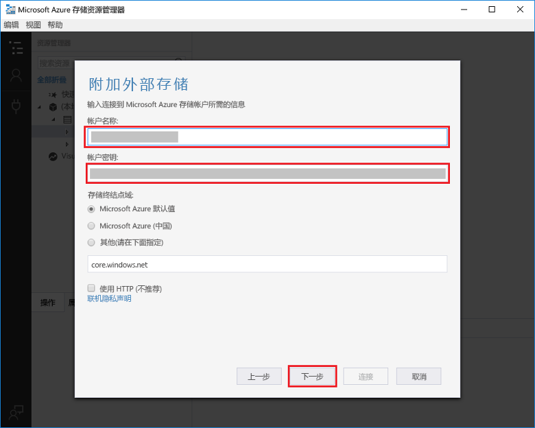
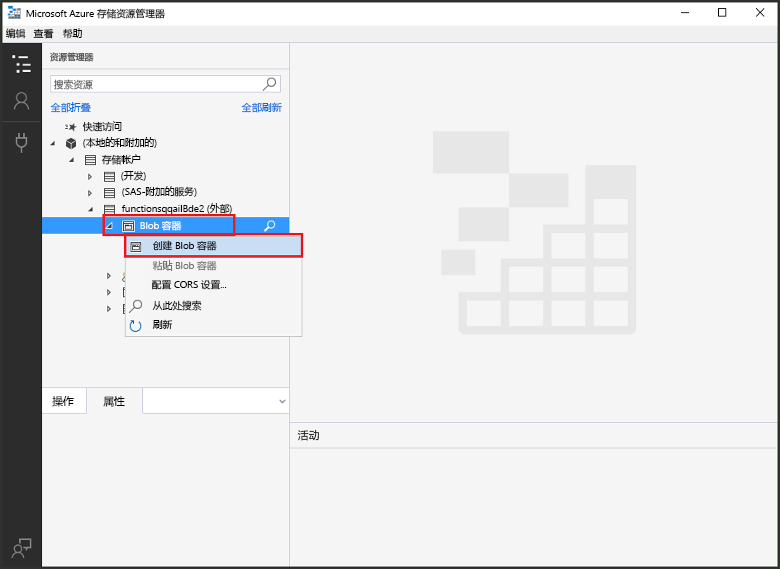
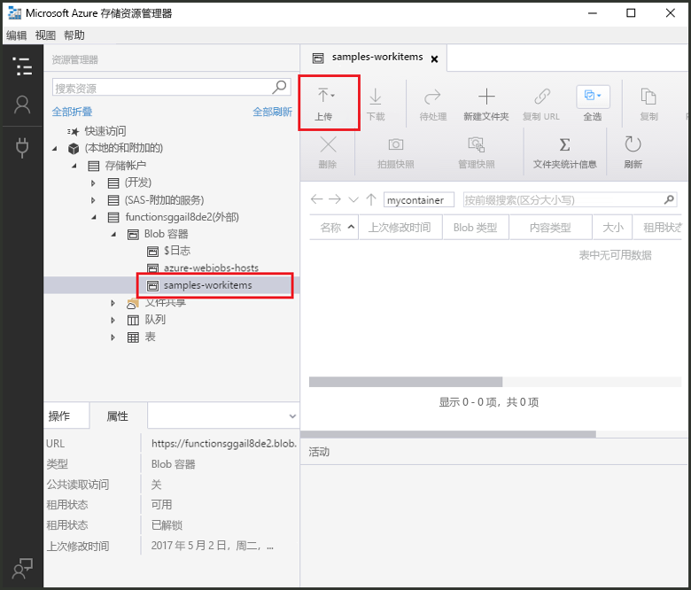
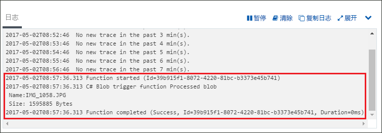

# 创建由 Azure Blob 存储触发的函数

了解如何创建在文件上传到 Azure Blob 存储或在 Azure Blob 存储中更新时触发的函数。

## 先决条件

+ 下载并安装 [Microsoft Azure 存储资源管理器](http://storageexplorer.com/)。
+ Azure 订阅。 如果还没有该订阅，可以在开始前创建一个[免费帐户](https://azure.microsoft.com/free/?WT.mc_id=A261C142F)。

[!INCLUDE [functions-portal-favorite-function-apps](../../includes/functions-portal-favorite-function-apps.md)]

## 创建 Azure Function App

[!INCLUDE [Create function app Azure portal](../../includes/functions-create-function-app-portal.md)]

接下来，在新的 Function App 中创建一个函数。

## 创建 Blob 存储触发的函数

1. 展开 Function App，单击“Functions”旁边的 + 按钮。 如果这是 Function App 中的第一个函数，请选择“自定义函数”。 此时将显示函数模板的完整集合。

    

2. 选择适用于所需语言的“BlobTrigger”模板，然后使用表中指定的设置。

    

    | 设置 | 建议的值 | 说明 |
    |---|---|---|
    | **路径**   | mycontainer/{name}    | 所监视的 Blob 存储中的位置。 blob 的文件名将作为 _name_ 参数传入绑定。  |
    | **存储帐户连接** | AzureWebJobStorage | 可以使用 Function App 已在使用的存储帐户连接，也可以创建一个新的存储帐户连接。  |
    | **为函数命名** | 在 Function App 中唯一 | 此 Blob 触发函数的名称。 |

3. 单击“创建”以创建函数。

接下来，连接到 Azure 存储帐户并创建 **mycontainer** 容器。

## 创建容器

1. 在函数中，单击“集成”，展开“文档”，并复制**帐户名称**和**帐户密钥**。 使用这些凭据连接到存储帐户。 如果已连接存储帐户，请跳到步骤 4。

    

1. 运行 [Microsoft Azure 存储资源管理器](http://storageexplorer.com/)工具，单击左侧的“连接”图标，选择“使用存储帐户名称和密钥”，然后单击“下一步”。

    

1. 输入步骤 1 中的**帐户名称**和**帐户密钥**，单击“下一步”，然后单击“连接”。 

    

1. 展开附加的存储帐户，右键单击“Blob 容器”，单击“创建 blob 容器”，键入 `mycontainer`，然后按 Enter。

    

现在已有 blob 容器，可以通过将文件上传到该容器来测试函数。

## 测试函数

1. 返回到 Azure 门户中，浏览到你的函数，展开页面底部的“日志”并确保日志流式处理未暂停。

1. 在存储资源管理器中，依次展开你的存储帐户、“Blob 容器”和 **mycontainer**。 依次单击“上传”、“上传文件...”。

    

1. 在“上传文件”对话框中，单击“文件”字段。 浏览到本地计算机上的文件（如图像文件），选择它并单击“打开”，然后单击“上传”。

1. 返回到函数日志并验证是否已读取 blob。

   

    >[!NOTE]
    > 当 Function App 在默认消耗计划中运行时，添加或更新 blob 与触发函数之间可能会有多达几分钟的延迟。 如果需要在 blob 触发的函数中降低延迟，请考虑在应用服务计划中运行 Function App。

## 清理资源

[!INCLUDE [Next steps note](../../includes/functions-quickstart-cleanup.md)]

## 后续步骤

已创建在 Blob 存储中添加或更新 blob 时运行的函数。 

[!INCLUDE [Next steps note](../../includes/functions-quickstart-next-steps.md)]

有关 Blob 存储触发器的详细信息，请参阅 [Azure Functions Blob 存储绑定](functions-bindings-storage-blob.md)。

