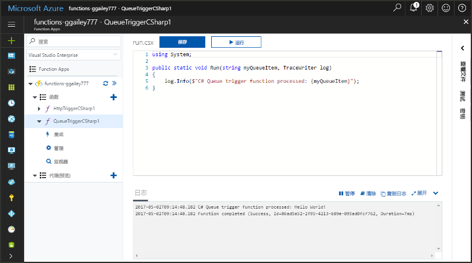
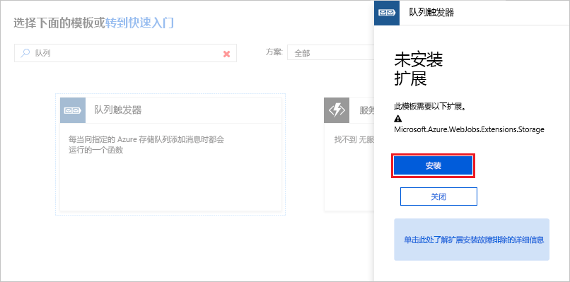
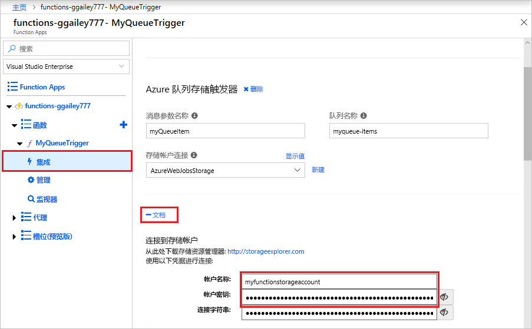
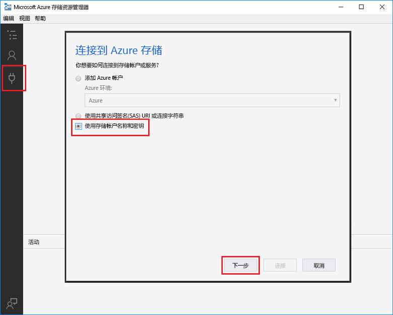
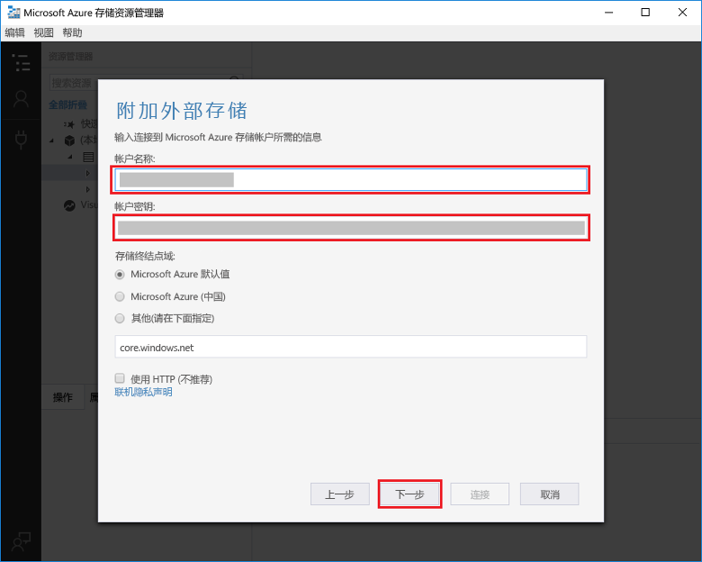
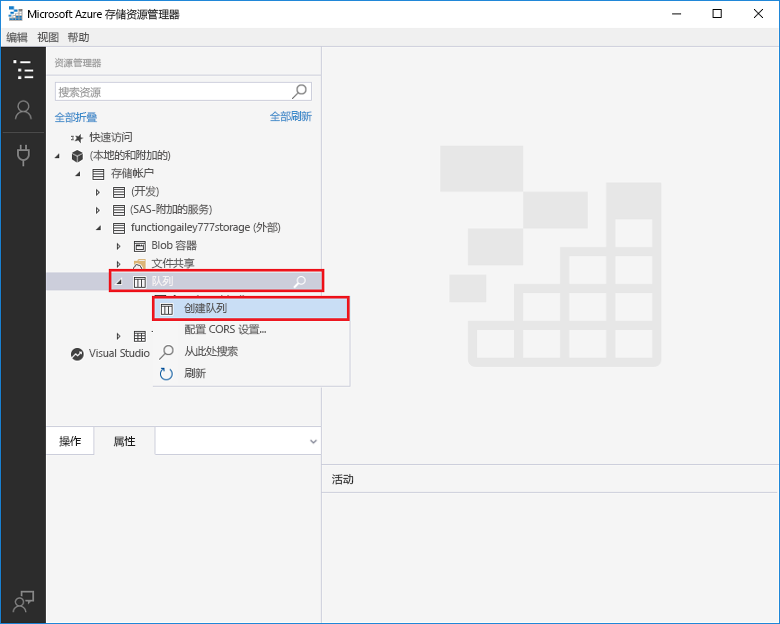
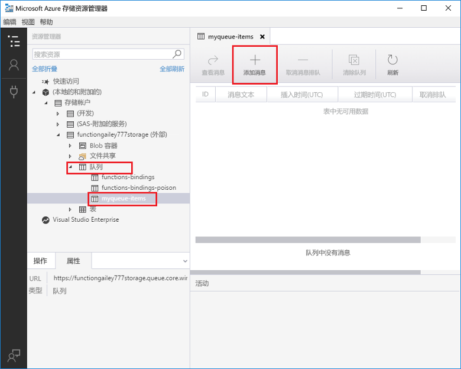
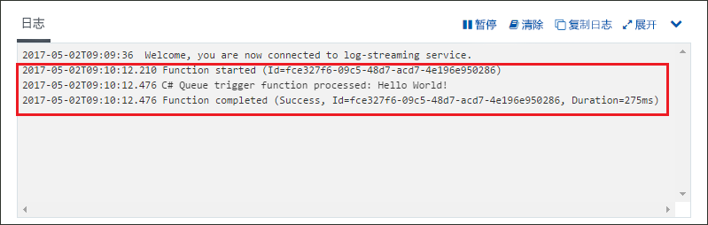

# 创建由 Azure 队列存储触发的函数

了解如何创建在将消息提交到 Azure 存储队列时触发的函数。

完成本主题中的所有步骤应该不需要五分钟。

## 先决条件

运行此示例之前，必须已执行以下事项：

- 下载并安装 [Microsoft Azure 存储资源管理器](http://storageexplorer.com/)。

如果你还没有 Azure 订阅，可以在开始前创建一个 [免费帐户](https://azure.microsoft.com/free/?WT.mc_id=A261C142F) 。

[!INCLUDE [functions-portal-favorite-function-apps](../../includes/functions-portal-favorite-function-apps.md)]

## 创建 Azure Function App

[!INCLUDE [Create function app Azure portal](../../includes/functions-create-function-app-portal.md)]

接下来，在新的 Function App 中创建一个函数。

## 创建队列触发的函数

展开 Function App，依次单击“函数”旁边的 **+** 按钮、与所需语言相对应的 **QueueTrigger** 模板。 然后，使用表中指定的设置，并单击“创建”。

| 设置 | 建议的值 | 说明 |
|---|---|---|
| **队列名称**   | myqueue-items    | 要连接到存储帐户中的队列的名称。 |
| **存储帐户连接** | AzureWebJobStorage | 可以使用 Function App 已在使用的存储帐户连接，也可以创建一个新的存储帐户连接。  |
| **为函数命名** | 在 Function App 中唯一 | 此队列触发函数的名称。 |

接下来，连接到 Azure 存储帐户并创建 **myqueue-items** 存储队列。

## 创建队列

1. 在函数中，单击“集成”，展开“文档”，并复制**帐户名称**和**帐户密钥**。 使用这些凭据连接到存储帐户。 如果已连接存储帐户，请跳到步骤 4。

    v

1. 运行 [Microsoft Azure 存储资源管理器](http://storageexplorer.com/)工具，单击左侧的“连接”图标，选择“使用存储帐户名称和密钥”，然后单击“下一步”。

    

1. 输入步骤 1 中的**帐户名称**和**帐户密钥**，单击“下一步”，然后单击“连接”。

    

1. 展开附加的存储帐户，右键单击“队列”，单击“创建队列”，键入 `myqueue-items`，然后按 Enter。

    

现在已有存储队列，可以通过将消息添加到队列来测试函数。

## 测试函数

1. 返回到 Azure 门户中，浏览到你的函数，展开页面底部的“日志”并确保日志流式处理未暂停。

1. 在存储资源管理器中，依次展开你的存储帐户、“队列”和 **myqueue-items**，然后单击“添加消息”。

    

1. 将“Hello World!” 消息键入到“消息文本”中，然后单击“确定”。

1. 等待几秒钟，然后返回到函数日志并验证是否已从队列中读取新消息。

    

1. 返回到存储资源管理器中，单击“刷新”，然后验证该消息是否已处理且不再在队列中。

## 清理资源

[!INCLUDE [Next steps note](../../includes/functions-quickstart-cleanup.md)]

## 后续步骤

已创建将消息添加到存储队列时运行的函数。

[!INCLUDE [Next steps note](../../includes/functions-quickstart-next-steps.md)]

有关队列存储触发器的详细信息，请参阅 [Azure Functions 存储队列绑定](functions-bindings-storage-queue.md)。
