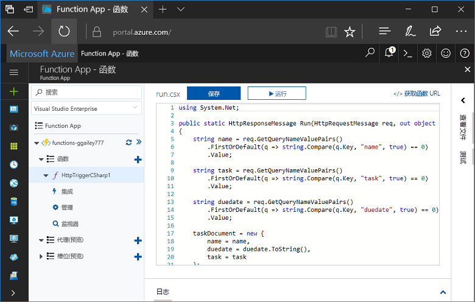
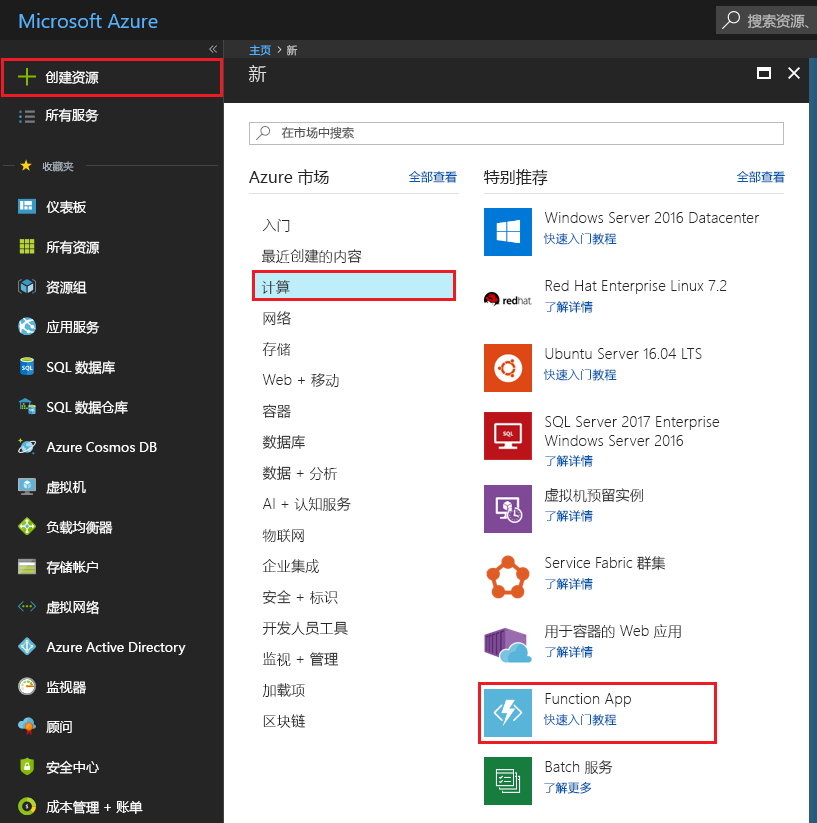
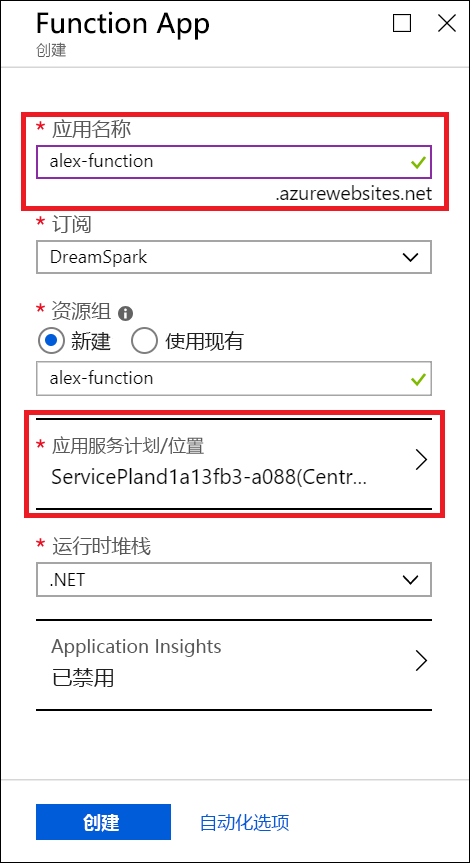
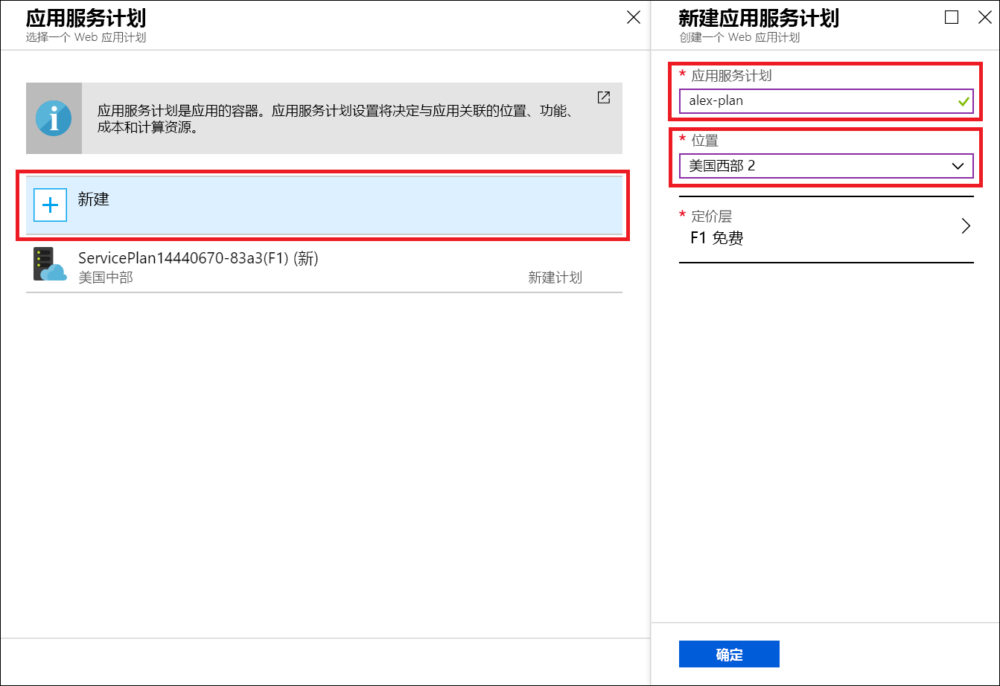
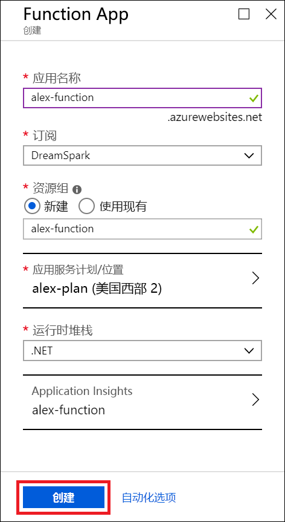
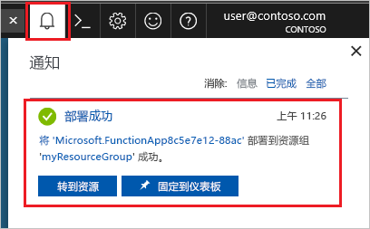
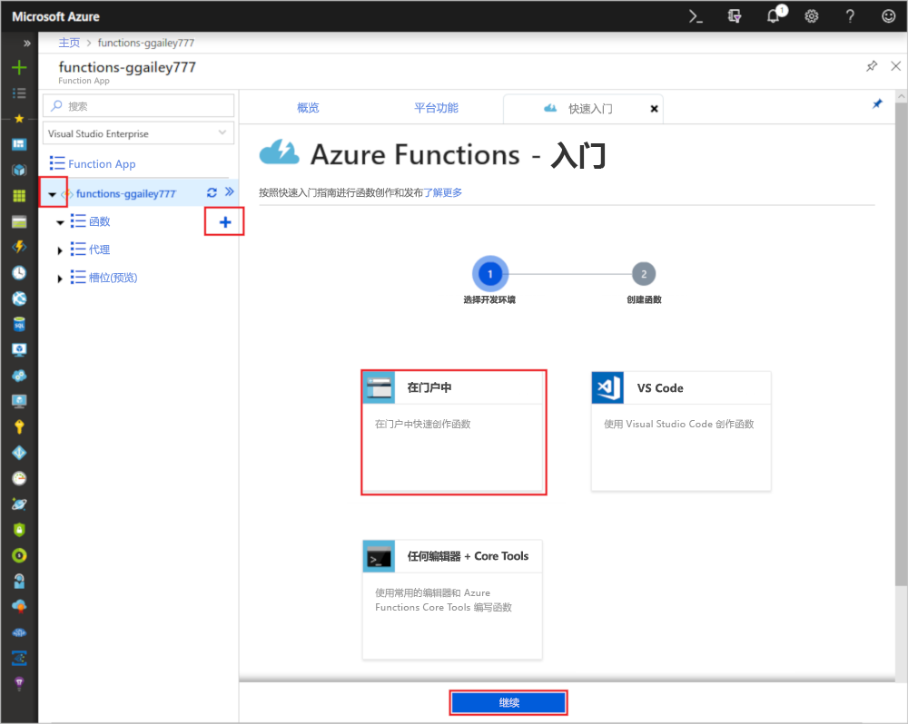
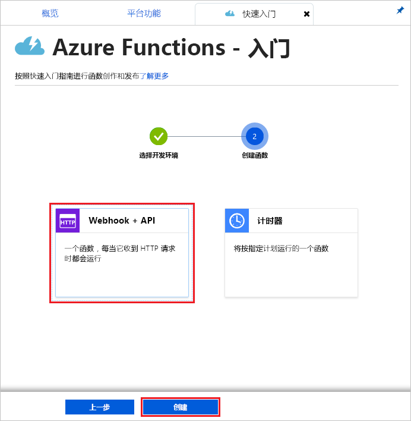
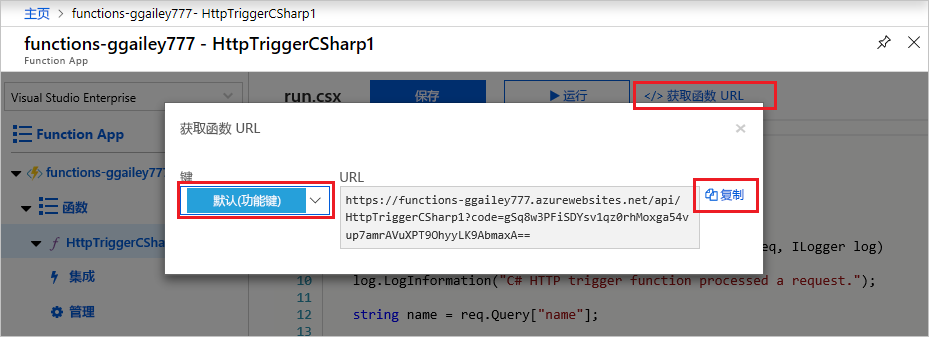
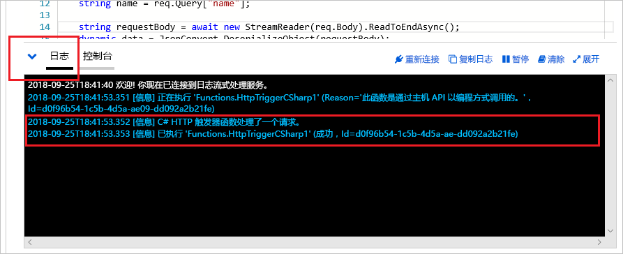

# 使用面向学生的 Azure 入门版创建函数

在本教程中，我们将在面向学生的 Azure 入门版订阅中创建一个 hello world HTTP 函数。 此外，我们还将演练 Azure Functions 在此类订阅中的功能。

借助面向学生的 Microsoft Azure 入门版，可以免费体验在云中进行开发所需的 Azure 产品。  [在此处详细了解此产品/服务。](https://azure.microsoft.com/offers/ms-azr-0144p/)

Azure Functions 用于在[无服务器](https://azure.microsoft.com/solutions/serverless/)环境中执行代码，无需先创建 VM 或发布 Web 应用程序。 [在此处详细了解 Functions。](./functions-overview.md)

## 创建函数

 本主题介绍如何在 Azure 门户中使用 Functions 创建 HTTP 触发的“hello world”函数。

## 登录 Azure

使用 Azure 帐户登录到 <https://portal.azure.com> 的 Azure 门户。

## 创建函数应用

必须使用函数应用托管函数的执行。 函数应用可将函数分组为一个逻辑单元，以便更轻松地管理、部署和共享资源。 

1. 选择 Azure 门户左上角的“新建”按钮，然后选择“计算” > “Function App”。   

    

2. 使用图像下面的表格中指定的函数应用设置。

    

    | 设置      | 建议的值  | 说明                                        |
    | ------------ |  ------- | -------------------------------------------------- |
    | **应用名称** | 全局唯一名称 | 用于标识新 Function App 的名称。 有效的字符是 `a-z`、`0-9` 和 `-`。  | 
    | **订阅** | 订阅 | 要在其下创建此新函数应用的订阅。 | 
    |  [资源组](../azure-resource-manager/resource-group-overview.md) |  myResourceGroup | 要在其中创建 Function App 的新资源组的名称。 |
   | **[应用服务计划/位置](./functions-scale.md)** | 新建 | 用于控制函数应用所要部署到的区域和资源密度的托管计划。 部署到同一计划的多个函数应用将共享同一个免费实例。 这是面向学生的入门版计划的限制。 [此处介绍](./functions-scale.md)了所有托管选项。|
    | **运行时堆栈** | 首选语言 | 选择支持你喜欢的函数编程语言的运行时。 对于 C# 和 F# 函数，选择 **.NET**。 |
    |**[Application Insights](./functions-monitoring.md)**| 已启用 | Application Insights 用于存储和分析函数应用的日志。 如果选择了支持 Application Insights 的位置，则默认会启用 Application Insights。 可以通过手动选择用于部署 Application Insights 的附近区域，来为任何函数启用 Application Insights。 如果不使用 Application Insights，则只能查看实时传送视频流日志。

3. 选择上述“应用服务计划/位置”以选择不同的位置 

4. 选择“新建”，然后为计划指定唯一的名称。 

5. 选择最靠近你的位置。 [在此处查看完整的 Azure 区域地图。](https://azure.microsoft.com/global-infrastructure/regions/) 

    

6. 选择“创建”  以预配和部署函数应用。

    

7. 选择门户右上角的“通知”图标，留意是否显示“部署成功”消息。 

    

8. 选择“转到资源”  ，查看新的函数应用。

接下来，在新的 Function App 中创建一个函数。

## 创建 HTTP 触发的函数

1. 展开新的函数应用，然后选择 **Functions** 旁边的 **+** 按钮，选择“门户中”  ，然后选择“继续”  。

    

1. 选择“WebHook + API”  ，然后选择“创建”  。

    

此时将使用 HTTP 触发的函数的特定于语言模板创建函数。

现在，可以通过发送 HTTP 请求来运行新函数了。

## 测试函数

1. 在新函数中，单击右上角的“</> 获取函数 URL”，选择“默认(函数密钥)”，然后单击“复制”    。 

    

2. 将函数 URL 粘贴到浏览器的地址栏中。 将查询字符串值 `&name=<yourname>` 添加到该 URL 尾部，然后按键盘上的 `Enter` 键来执行请求。 此时会看到函数返回的响应显示在浏览器中。  

    以下示例显示了浏览器中的响应：

    

    请求 URL 包含通过 HTTP 访问函数默认所需的密钥。

3. 运行函数时，会在日志中写入跟踪信息。 若要查看上次执行的跟踪输出，请返回到门户中的函数，并单击屏幕底部的箭头以展开“日志”  。

   

## 清理资源

[!INCLUDE [Clean-up resources](../../includes/functions-quickstart-cleanup.md)]

## 面向学生的 Azure 入门版支持的功能

在面向学生的 Azure 入门版中，可以访问 Azure Functions 运行时的大部分功能，但也存在下面所列的一些重要限制：

* HTTP 触发器是唯一受支持的触发器类型。
    * 支持所有输入和所有输出绑定！ [在此处查看完整列表。](functions-triggers-bindings.md)
* 支持的语言： 
    * C# (.NET Core 2)
    * Javascript（Node.js 8 和 10）
    * F# (.NET Core 2)
    * [在此处查看更高级计划中支持的语言](supported-languages.md)
* Windows 是唯一受支持的操作系统。
* 缩放限制为每天最长运行 60 分钟的[一个免费层实例](https://azure.microsoft.com/pricing/details/app-service/windows/)。 收到 HTTP 流量时，将以无服务器的方式从 0 个实例扩展到 1 个实例，但无法扩展到更多的实例。
* 仅支持 [2.x 运行时](functions-versions.md)。
* 支持使用所有开发人员工具来编辑和发布函数。 这包括 VS Code、Visual Studio、Azure CLI 和 Azure 门户。 若要使用除门户以外的任何工具，首先需要在门户中创建一个应用，然后在首选的工具中选择该应用作为部署目标。

## 后续步骤

现已使用 HTTP 触发的简单函数创建了一个函数应用！ 接下来，可以探索本地工具、其他语言以及监视和集成功能。

 * [使用 Visual Studio 创建你的第一个函数](./functions-create-your-first-function-visual-studio.md)
 * [使用 Visual Studio Code 创建第一个函数](./functions-create-first-function-vs-code.md)
 * [Azure Functions JavaScript 开发人员指南](./functions-reference-node.md)
 * [使用 Azure Functions 连接到 Azure SQL 数据库](./functions-scenario-database-table-cleanup.md)
 * [详细了解 Azure Functions HTTP 绑定](./functions-bindings-http-webhook.md)。
 * [监视 Azure Functions](./functions-monitoring.md)
