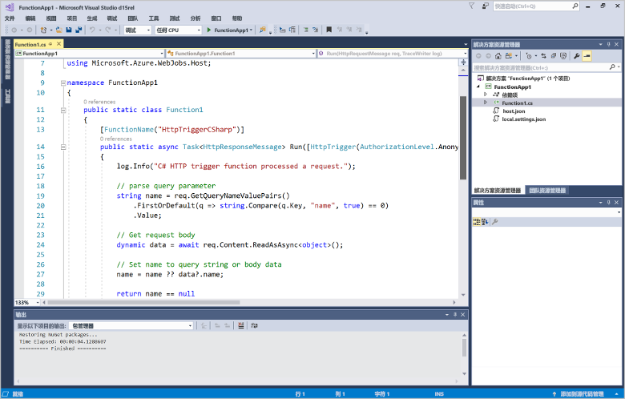
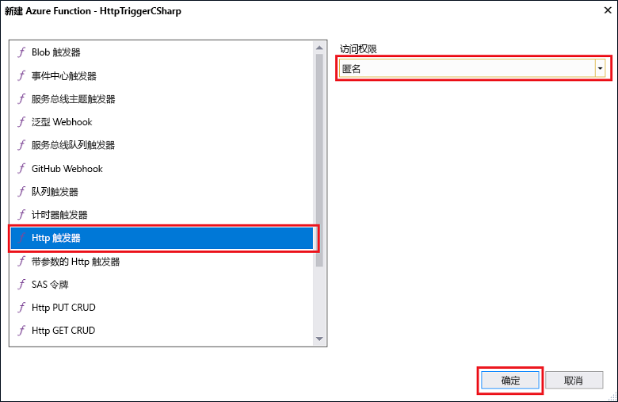
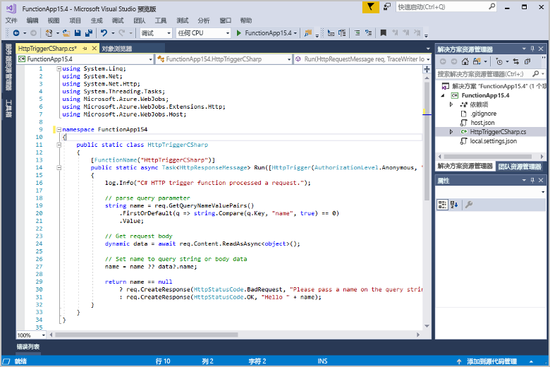

# 使用 Visual Studio 创建你的第一个函数

Azure Functions 用于在[无服务器](https://azure.microsoft.com/overview/serverless-computing/)环境中执行代码，无需先创建 VM 或发布 Web 应用程序。

本主题介绍如何使用 Azure Functions 的 Visual Studio 2017 工具在本地创建并测试“hello world”函数。 然后将函数代码发布到 Azure。 这些工具包含在 Visual Studio 2017 版本 15.3 或更高版本的 Azure 开发工作负荷中。

如果你愿意，可以改为[观看视频](#watch-the-video)。

## 先决条件

若要完成本教程，请安装：

* [Visual Studio 2017 版本 15.4](https://www.visualstudio.com/vs/) 或更高版本，包括 Azure 开发工作负荷。

    
    
[!INCLUDE [quickstarts-free-trial-note](../../includes/quickstarts-free-trial-note.md)] 

## 在 Visual Studio 中创建 Azure Functions 项目

[!INCLUDE [Create a project using the Azure Functions template](../../includes/functions-vstools-create.md)]

创建项目以后，即可创建你的第一个函数。

## 创建函数

1. 在“解决方案资源管理器”中，右键单击项目节点，然后选择“添加” > “新建项”。 选择“Azure Function”，在“名称”处输入 `HttpTriggerCSharp.cs`，再单击“添加”。

2. 选择“HttpTrigger”，再对“访问权限”选择“匿名”，然后单击“确定”。 创建的函数可以通过 HTTP 请求从任何客户端访问。 

    

    代码文件将添加到项目，其中包含实现函数代码的类。 此代码基于一个模板，该模板会接收名称值并将其回显。 FunctionName 属性设置函数的名称。 HttpTrigger 属性指示触发该函数的消息。 

    

创建 HTTP 触发的函数以后，即可在本地计算机上对其进行测试。

## 在本地测试函数

Azure Functions Core Tools 允许在本地开发计算机上运行 Azure Functions 项目。 首次从 Visual Studio 启动某个函数时，系统会提示你安装这些工具。  

1. 若要测试函数，请按 F5。 如果系统提示，请按 Visual Studio 的请求下载和安装 Azure Functions Core (CLI) 工具。  可能还需启用一个防火墙例外，以便这些工具能够处理 HTTP 请求。

2. 从 Azure Functions 运行时输出复制函数的 URL。  

    

3. 将 HTTP 请求的 URL 粘贴到浏览器的地址栏中。 将查询字符串 `?name=<yourname>` 追加到此 URL 并执行请求。 下面演示浏览器中函数返回的对本地 GET 请求的响应： 

    

4. 若要停止调试，请单击 Visual Studio 工具栏中的“停止”按钮。

验证该函数可以在本地计算机上正确运行以后，即可将项目发布到 Azure。

## 将项目发布到 Azure

必须在 Azure 订阅中有一个函数应用，然后才能发布项目。 可以直接从 Visual Studio 创建函数应用。

[!INCLUDE [Publish the project to Azure](../../includes/functions-vstools-publish.md)]

## 在 Azure 中测试函数

1. 从“发布”配置文件页复制函数应用的基 URL。 将 URL 的 `localhost:port` 部分（在本地测试函数时使用）替换为新的基 URL。 与前面一样，请确保将查询字符串 `?name=<yourname>` 追加到此 URL 并执行请求。

    调用 HTTP 触发的函数的 URL 如下所示：

        http://<functionappname>.azurewebsites.net/api/<functionname>?name=<yourname> 

2. 将 HTTP 请求的这个新 URL 粘贴到浏览器的地址栏中。 下面演示浏览器中函数返回的对远程 GET 请求的响应： 

    

## 观看视频

> [!VIDEO https://www.youtube-nocookie.com/embed/DrhG-Rdm80k]

## 后续步骤

你已使用简单的 HTTP 触发函数通过 Visual Studio 创建 C# 函数应用。 

+ 若要了解如何配置项目，使之支持其他类型的触发器和绑定，请参阅 [Azure Functions Tools for Visual Studio](functions-develop-vs.md) 中的[配置进行本地开发的项目](functions-develop-vs.md#configure-the-project-for-local-development)部分。
+ 若要详细了解如何使用 Azure Functions Core Tools 进行本地测试和调试，请参阅[在本地进行 Azure Functions 的编码和测试](functions-run-local.md)。 
+ 若要详细了解如何将函数作为 .NET 类库进行开发，请参阅[搭配使用 Azure Functions 和 .Net 类库](functions-dotnet-class-library.md)。 

