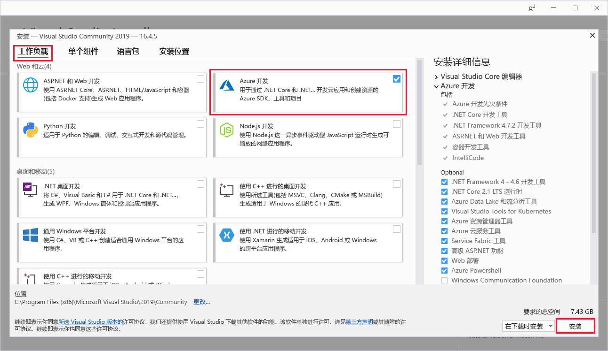
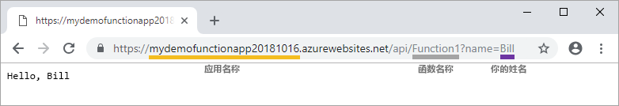

# 快速入门：使用 Visual Studio 在 Azure 中创建第一个函数

使用 Azure Functions，可以在无服务器环境中运行代码，而无需先创建 VM 或发布 Web 应用程序。

本快速入门介绍如何使用 Visual Studio 2019 在本地创建并测试“hello world” HTTP 触发器 C# 函数应用，然后将其发布到 Azure。 

本快速入门专为 Visual Studio 2019 设计。 

## 先决条件

若要完成本教程，请先安装 [Visual Studio 2019](https://azure.microsoft.com/downloads/)。 请确保在安装过程中选择“Azure 开发”  工作负载。 若要改为使用 Visual Studio 2017 创建 Azure Functions 项目，则必须先安装[最新的 Azure Functions 工具](functions-develop-vs.md#check-your-tools-version)。

如果还没有 [Azure 订阅](../guides/developer/azure-developer-guide.md#understanding-accounts-subscriptions-and-billing)，可以在开始前创建一个[免费帐户](https://azure.microsoft.com/free/dotnet/)。

## 创建函数应用项目

[!INCLUDE [Create a project using the Azure Functions template](../../includes/functions-vstools-create.md)]

Visual Studio 将创建一个项目和一个包含 HTTP 触发器函数类型样本代码的类。 `FunctionName` 方法属性设置函数的名称（默认情况下为 `Function1`）。 `HttpTrigger` 属性指定该函数将由某个 HTTP 请求触发。 样本代码发送 HTTP 响应，其中包含来自请求正文或查询字符串的值。

使用输入和输出绑定来扩展函数的功能，具体的做法是将适当的属性应用于方法。 有关详细信息，请参阅 [Azure Functions C# 开发人员参考](functions-dotnet-class-library.md)的[触发器和绑定](functions-dotnet-class-library.md#triggers-and-bindings)部分。

创建函数项目和 HTTP 触发器函数后，可以在本地计算机上对其进行测试。

## 在本地运行函数

Visual Studio 与 Azure Functions Core Tools 集成，这样你便可使用完整的 Azure Functions 运行时在本地测试函数。  

[!INCLUDE [functions-run-function-test-local-vs](../../includes/functions-run-function-test-local-vs.md)]

确认该函数可以在本地计算机上正确运行以后，即可将项目发布到 Azure。

## 将项目发布到 Azure

必须在 Azure 订阅中有一个函数应用，然后才能发布项目。 Visual Studio 发布会在你首次发布项目时为你创建一个函数应用。

[!INCLUDE [Publish the project to Azure](../../includes/functions-vstools-publish.md)]

## 在 Azure 中测试函数

1. 从“发布”配置文件页复制函数应用的基 URL。  将 URL 的 `localhost:port` 部分（用于在本地测试函数）替换为新的基 URL。 将查询字符串 `?name=<YOUR_NAME>` 追加到此 URL 并运行请求。

    调用 HTTP 触发器函数的 URL 采用以下格式：

    `http://<APP_NAME>.azurewebsites.net/api/<FUNCTION_NAME>?name=<YOUR_NAME>`

2. 将 HTTP 请求的这个新 URL 粘贴到浏览器的地址栏中。 下图演示该函数在浏览器中返回的、对远程 GET 请求的响应：

    

## 清理资源

[!INCLUDE [Clean-up resources](../../includes/functions-quickstart-cleanup.md)]

## 后续步骤

在本快速入门中，你已使用 Visual Studio，在 Azure 中创建并发布了一个 C# 函数应用，其中包含一个简单的 HTTP 触发器函数。 

请转到下一篇文章，了解如何将一个 Azure 存储队列绑定添加到函数：
> [!div class="nextstepaction"]
> [将 Azure 存储队列绑定添加到函数](functions-add-output-binding-storage-queue-vs.md)

