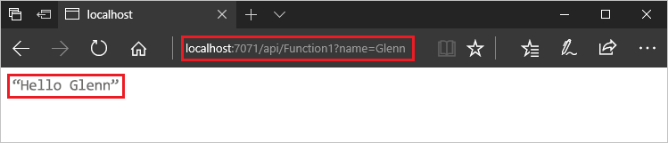
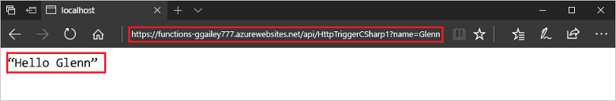

# 使用 Visual Studio 创建你的第一个函数

Azure Functions 用于在[无服务器](https://azure.microsoft.com/overview/serverless-computing/)环境中执行代码，无需先创建 VM 或发布 Web 应用程序。

本文介绍如何使用 Azure Functions 的 Visual Studio 2017 工具在本地创建并测试“hello world”函数。 然后将函数代码发布到 Azure。 Visual Studio 2017 中的 Azure 开发工作负荷已随附这些工具。

本主题包括[一部视频](#watch-the-video)，其中演示了相同的基本步骤。

## 先决条件

完成本教程：

* 安装 [Visual Studio 2017](https://azure.microsoft.com/downloads/)，并确保还安装了 **Azure 开发**工作负荷。

* 请确保你有[最新的 Azure Functions 工具](functions-develop-vs.md#check-your-tools-version)。

[!INCLUDE [quickstarts-free-trial-note](../../includes/quickstarts-free-trial-note.md)]

## 创建函数应用项目

[!INCLUDE [Create a project using the Azure Functions template](../../includes/functions-vstools-create.md)]

Visual Studio 将创建一个项目，并在该项目中创建一个包含所选函数类型的样本代码的类。 方法中的 **FunctionName** 属性设置函数的名称。 **HttpTrigger** 属性指定该函数将由某个 HTTP 请求触发。 样本代码发送 HTTP 响应，其中包含请求正文或查询字符串中的值。 可以通过向方法应用相应的属性，将输入和输出绑定添加到函数。 有关详细信息，请参阅 [Azure Functions C# 开发人员参考](functions-dotnet-class-library.md)的[触发器和绑定](functions-dotnet-class-library.md#triggers-and-bindings)部分。

创建函数项目和 HTTP 触发的函数后，可以在本地计算机上对其进行测试。

## 在本地测试函数

使用 Azure Functions Core Tools 可以在本地开发计算机上运行 Azure Functions 项目。 首次从 Visual Studio 启动某个函数时，系统会提示你安装这些工具。

1. 若要测试函数，请按 F5。 如果系统提示，请按 Visual Studio 的请求下载和安装 Azure Functions Core (CLI) 工具。 可能还需启用一个防火墙例外，以便这些工具能够处理 HTTP 请求。

2. 从 Azure Functions 运行时输出复制函数的 URL。

    

3. 将 HTTP 请求的 URL 粘贴到浏览器的地址栏中。 将查询字符串 `?name=<yourname>` 追加到此 URL 并执行请求。 下面演示浏览器中函数返回的对本地 GET 请求的响应： 

    

4. 若要停止调试，请按 Shift + F5。

验证该函数可以在本地计算机上正确运行以后，即可将项目发布到 Azure。

## 将项目发布到 Azure

必须在 Azure 订阅中有一个函数应用，然后才能发布项目。 可以直接从 Visual Studio 创建函数应用。

[!INCLUDE [Publish the project to Azure](../../includes/functions-vstools-publish.md)]

## 在 Azure 中测试函数

1. 从“发布”配置文件页复制函数应用的基 URL。 将 URL 的 `localhost:port` 部分（在本地测试函数时使用）替换为新的基 URL。 与前面一样，请确保将查询字符串 `?name=<yourname>` 追加到此 URL 并执行请求。

    调用 HTTP 触发函数的 URL 应采用以下格式：

        http://<functionappname>.azurewebsites.net/api/<functionname>?name=<yourname> 

2. 将 HTTP 请求的这个新 URL 粘贴到浏览器的地址栏中。 下面演示浏览器中函数返回的对远程 GET 请求的响应：

    

## 观看视频

> [!VIDEO https://www.youtube-nocookie.com/embed/DrhG-Rdm80k]

## 后续步骤

你已使用简单的 HTTP 触发函数通过 Visual Studio 创建和发布 C# 函数应用。

* [了解如何添加与其他服务集成的输入和输出绑定。](functions-develop-vs.md#add-bindings)
* [详细了解如何使用 Azure Functions Core Tools 进行本地测试和调试。](functions-run-local.md#vs-debug)
* [详细了解如何将函数开发为 .NET 类库](functions-dotnet-class-library.md)。