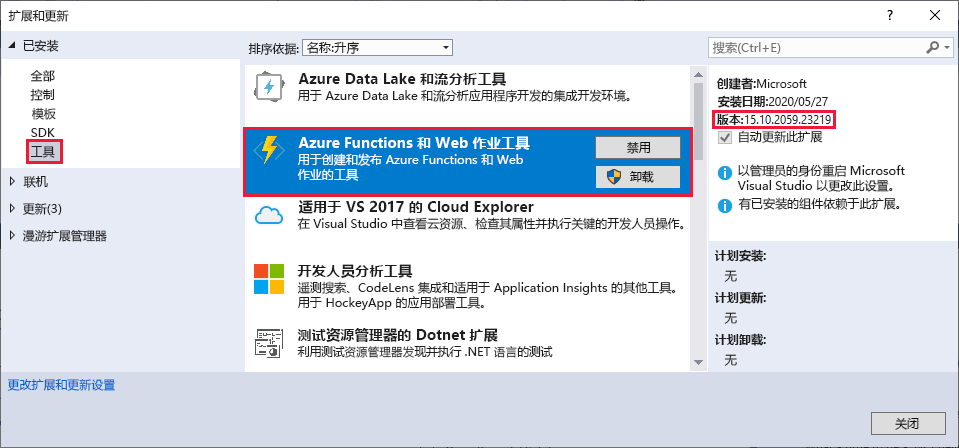
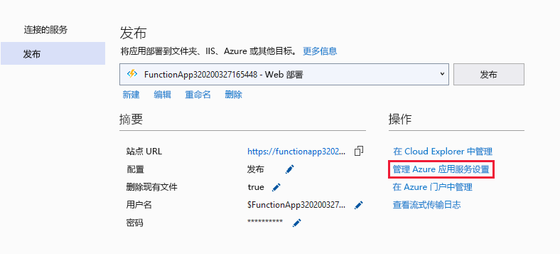
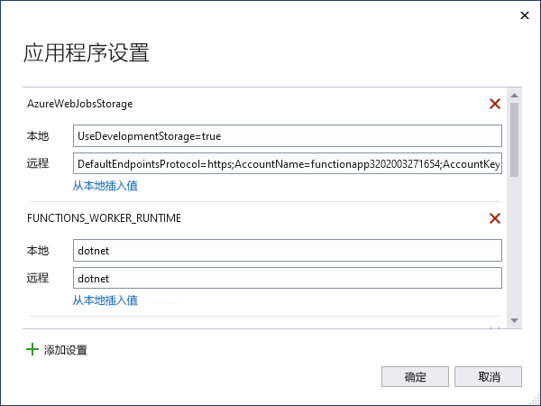

# <a name="azure-functions-tools-for-visual-studio"></a>用于 Visual Studio 的 Azure Functions 工具  

用于 Visual Studio 2017 的 Azure Functions 工具是 Visual Studio 的一个扩展，可用于开发、测试 C# 函数并将其部署到 Azure。 如果这是你第一次体验 Azure Functions，可以在 [Azure Functions 简介](functions-overview.md)中了解详细信息。

Azure Functions 工具提供以下优势： 

* 在本地开发计算机上编辑、生成和运行函数。 
* 将 Azure Functions 项目直接发布到 Azure。 
* 使用 Web 作业属性在 C# 代码中直接声明函数绑定，而无需单独维护绑定定义的 function.json。
* 开发和部署预先编译的 C# 函数。 与基于 C# 脚本的函数相比，预先编译的函数的冷启动性能更好。 
* 可以在 C# 中编写函数的代码，同时利用 Visual Studio 开发环境的所有优势。 

本文介绍如何使用用于 Visual Studio 2017 的 Azure Functions 工具在 C# 中开发函数。 此外，还介绍如何将项目作为 .NET 程序集发布到 Azure。

> [!IMPORTANT]
> 不要将本地开发和门户开发混合在同一函数应用中。 从本地项目发布到函数应用时，部署过程会覆盖在门户中开发的任何函数。

## <a name="prerequisites"></a>先决条件

Azure Functions 工具包含在 [Visual Studio 2017 版本 15.5](https://www.visualstudio.com/vs/) 或更高版本的 Azure 开发工作负荷中。 请确保你在安装 Visual Studio 2017 时随附了Azure 开发工作负荷：


请确保 Visual Studio 为最新版本，并且使用的是[最新版本](#check-your-tools-version)的 Azure Functions 工具。

### <a name="other-requirements"></a>其他要求

若要创建和部署函数，还需要：

* 一个有效的 Azure 订阅。 如果没有 Azure 订阅，可以使用[免费帐户](https://azure.microsoft.com/free/?WT.mc_id=A261C142F)。

* 一个 Azure 存储帐户。 若要创建存储帐户，请参阅[创建存储帐户](../storage/common/storage-create-storage-account.md#create-a-storage-account)。

### <a name="check-your-tools-version"></a>检查工具版本

1. 在“工具”菜单中，选择“扩展和更新”。 展开“已安装” > “工具”，选择“Azure Functions 和 Web 作业工具”。

    

2. 请注意已安装的**版本**。 可以将此版本与[发行说明](https://github.com/Azure/Azure-Functions/blob/master/VS-AzureTools-ReleaseNotes.md)中列出的最新版本进行比较。 

3. 如果你的版本较旧，可以在 Visual Studio 中更新工具，如以下部分中所示。

### <a name="update-your-tools"></a>更新工具

1. 在“扩展和更新”对话框中，展开“更新” > “Visual Studio Marketplace”，依次选择“Azure Functions 和 Web 作业工具”和“更新”。

       

2. 下载工具更新后，请关闭 Visual Studio 以触发使用 VSIX 安装程序的工具更新。

3. 在安装程序中，选择“确定”以启动，然后单击“修改”以更新工具。 

4. 更新完成后，请选择“关闭”并重启 Visual Studio。

## <a name="create-an-azure-functions-project"></a>创建 Azure Functions 项目

[!INCLUDE [Create a project using the Azure Functions](../../includes/functions-vstools-create.md)]

此项目模板创建 C# 项目，安装 `Microsoft.NET.Sdk.Functions` NuGet 包，并设置目标框架。 Functions 1.x 面向 .NET Framework，而 Functions 2.x 则面向 .NET Standard。 新项目包含以下文件：

* **host.json**：用于配置 Functions 主机。 在本地和 Azure 中运行时，都会应用这些设置。 有关详细信息，请参阅 [host.json 参考](functions-host-json.md)。

* **local.settings.json**：维护本地运行函数时使用的设置。 Azure 不使用这些设置，它们由 [Azure Functions 核心工具](functions-run-local.md)使用。 使用此文件为函数所需的变量指定应用设置。 针对项目中的函数绑定所需的每个连接，将新项添加到 **Values** 数组。 有关详细信息，请参阅“Azure Functions 核心工具”一文中的[本地设置文件](functions-run-local.md#local-settings-file)。

有关详细信息，请参阅 [Functions 类库项目](functions-dotnet-class-library.md#functions-class-library-project)。

## <a name="configure-the-project-for-local-development"></a>为本地开发配置项目

Functions 运行时在内部使用 Azure 存储帐户。 对于除 HTTP 和 Webhook 以外的所有触发器类型，必须将 **Values.AzureWebJobsStorage** 键设置为有效的 Azure 存储帐户连接字符串。 函数应用还可以在项目所需的 AzureWebJobsStorage 连接设置中使用 [Azure 存储模拟器](../storage/common/storage-use-emulator.md)。 若要使用模拟器，请将 AzureWebJobsStorage 的值设置为 `UseDevelopmentStorage=true`。 在部署之前，必须将此设置更改为实际的存储连接。

若要设置存储帐户连接字符串，请执行以下操作：

1. 在 Visual Studio 中，打开“Cloud Explorer”，展开“存储帐户” > “你的存储帐户”，然后选择“属性面板”并复制“主连接字符串”值。

2. 在项目内，打开 local.settings.json 项目文件，并将“AzureWebJobsStorage”键的值设置为复制的连接字符串。

3. 重复上述步骤，将唯一键添加到函数所需的其他任何连接的 **Values** 数组。

## <a name="create-a-function"></a>创建函数

在预先编译的函数中，可以通过在代码中应用属性来定义函数使用的绑定。 使用 Azure Functions 工具通过提供的模板创建函数时，系统会自动应用这些属性。 

1. 在“解决方案资源管理器”中，右键单击项目节点，然后选择“添加” > “新建项”。 选择“Azure 函数”，键入类的**名称**，然后单击“添加”。

2. 选择你的触发器，设置绑定属性，然后单击“创建”。 以下示例显示创建队列存储触发的函数时的设置。 

    

    此触发器示例使用具有名为 **QueueStorage** 的键的连接字符串。 必须在 [local.settings.json 文件](functions-run-local.md#local-settings-file)中定义此连接字符串设置。

3. 检查新添加的类。 将会看到一个静态 **Run** 方法，它已使用 **FunctionName** 属性设置了属性。 该属性指示该方法是函数的入口点。

    例如，以下 C# 类表示一个基本的队列存储触发的函数：

    ````csharp
    using System;
    using Microsoft.Azure.WebJobs;
    using Microsoft.Azure.WebJobs.Host;

    namespace FunctionApp1
    {
        public static class Function1
        {
            [FunctionName("QueueTriggerCSharp")]
            public static void Run([QueueTrigger("myqueue-items", Connection = "QueueStorage")]string myQueueItem, TraceWriter log)
            {
                log.Info($"C# Queue trigger function processed: {myQueueItem}");
            }
        }
    }
    ````
    已向提供给入口点方法的每个绑定参数提供了特定于绑定的属性。 该属性采用绑定信息作为参数。 在上例中，第一个参数具应用了 QueueTrigger 属性，表示触发了队列的函数。 队列名称和连接字符串设置名称作为参数传递到“QueueTrigger”属性。
    
可以使用上述过程向函数应用项目添加更多的函数。 项目中的每个函数可以有不同的触发器，但每个函数的触发器必须刚好一个。 有关详细信息，请参阅 [Azure Functions 触发器和绑定概念](functions-triggers-bindings.md)。

## <a name="add-bindings"></a>添加绑定

使用触发器时，输入和输出绑定是作为绑定属性添加到函数的。 向函数添加绑定，如下所示：

1. 确保已[为本地开发配置项目](#configure-the-project-for-local-development)。

2. 为特定绑定添加适当的 NuGet 扩展包。 有关详细信息，请参阅“触发器和绑定”一文中的[使用 Visual Studio 进行本地 C# 开发](functions-triggers-bindings.md#local-csharp)。 特定于绑定的 NuGet 包要求位于绑定的参考文章中。 例如，可以在[事件中心绑定参考文章](functions-bindings-event-hubs.md)中找到事件中心触发器的包要求。

3. 如果有绑定需要的应用设置，请将其添加到[本地设置文件](functions-run-local.md#local-settings-file)中的 **Values** 集合。 当函数在本地运行时，会使用这些值。 当函数在 Azure 的函数应用中运行时，会使用[函数应用设置](#function-app-settings)。

4. 将适当的绑定属性添加到方法签名。 在以下示例中，一条队列消息触发了该函数，而输出绑定则创建了一条新的队列消息，在不同的队列中使用了相同的文本。

    ```csharp
    public static class SimpleExampleWithOutput
    {
        [FunctionName("CopyQueueMessage")]
        public static void Run(
            [QueueTrigger("myqueue-items-source", Connection = "AzureWebJobsStorage")] string myQueueItem, 
            [Queue("myqueue-items-destination", Connection = "AzureWebJobsStorage")] out string myQueueItemCopy,
            TraceWriter log)
        {
            log.Info($"CopyQueueMessage function processed: {myQueueItem}");
            myQueueItemCopy = myQueueItem;
        }
    }
    ```
到队列存储的连接从 `AzureWebJobsStorage` 设置获取。 有关详细信息，请参阅特定绑定的参考文章。 

[!INCLUDE [Supported triggers and bindings](../../includes/functions-bindings.md)]

## <a name="testing-functions"></a>测试函数

Azure Functions Core Tools 允许在本地开发计算机上运行 Azure Functions 项目。 首次从 Visual Studio 启动某个函数时，系统会提示你安装这些工具。

若要测试函数，请按 F5。 如果系统提示，请按 Visual Studio 的请求下载和安装 Azure Functions Core (CLI) 工具。 可能还需启用一个防火墙例外，以便这些工具能够处理 HTTP 请求。

在运行项目时，可以像测试已部署的函数一样测试代码。 有关详细信息，请参阅[在 Azure Functions 中测试代码的策略](functions-test-a-function.md)。 在调试模式下运行时，断点将按预期命中 Visual Studio。 

有关如何测试队列触发的函数的示例，请参阅[队列触发的函数快速入门教程](functions-create-storage-queue-triggered-function.md#test-the-function)。  

若要详细了解如何使用 Azure Functions 核心工具，请参阅[在本地编写 Azure 函数代码并对其进行测试](functions-run-local.md)。

## <a name="publish-to-azure"></a>发布到 Azure

[!INCLUDE [Publish the project to Azure](../../includes/functions-vstools-publish.md)]

## <a name="function-app-settings"></a>函数应用设置

还必须将在 local.settings.json 中添加的任何设置添加到 Azure 函数应用中。 发布项目时，不会自动上传这些设置。

将所需设置上传到 Azure 中的函数应用的最简单方法是使用“管理应用程序设置...”链接（在成功发布项目之后显示）。 



这会显示用于函数应用的“应用程序设置”对话框，可以在其中添加新应用程序设置或修改现有设置。



还可以采用以下这些其他方法之一来管理应用程序设置：

* [使用 Azure 门户](functions-how-to-use-azure-function-app-settings.md#settings)。
* [使用 `--publish-local-settings` 发布 Azure Functions Core Tools 中的选项](functions-run-local.md#publish)。
* [使用 Azure CLI](/cli/azure/functionapp/config/appsettings#az_functionapp_config_appsettings_set)。 

## <a name="next-steps"></a>后续步骤

有关 Azure Functions 工具的详细信息，请参阅 [Visual Studio 2017 Tools for Azure Functions](https://blogs.msdn.microsoft.com/webdev/2017/05/10/azure-function-tools-for-visual-studio-2017/)（用于 Azure Functions 的 Visual Studio 2017 工具）博客文章中的“Common Questions”（常见问题）部分。

若要详细了解 Azure Functions 核心工具，请参阅[在本地编写 Azure 函数代码并对其进行测试](functions-run-local.md)。

若要了解有关以 .NET 类库开发函数的详细信息，请参阅 [Azure Functions C# 开发人员参考](functions-dotnet-class-library.md)。 本文还举例说明了如何使用属性来声明 Azure Functions 支持的各种类型的绑定。    
