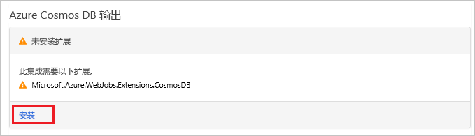

# <a name="store-unstructured-data-using-azure-functions-and-azure-cosmos-db"></a>使用 Azure Functions 和 Azure Cosmos DB 存储非结构化数据

[Azure Cosmos DB](https://azure.microsoft.com/services/cosmos-db/) 是存储非结构化数据和 JSON 数据的良好方式。 将 Cosmos DB 与 Azure Functions 结合使用，可以快速、轻松地存储数据，并且所需的代码也比在关系数据库中存储数据时所需的代码少得多。

> [!NOTE]
> 此时，Azure Cosmos DB 触发器、输入绑定和输出绑定仅可与 SQL API 和图形 API 帐户一起使用。

在 Azure Functions 中，输入和输出绑定提供从函数连接到外部服务数据的声明性方式。 本文介绍了如何更新现有的函数，以便添加输出绑定，在 Azure Cosmos DB 文档中存储非结构化数据。


## <a name="prerequisites"></a>先决条件

完成本教程：

[!INCLUDE [Previous quickstart note](../../includes/functions-quickstart-previous-topics.md)]

## <a name="create-an-azure-cosmos-db-account"></a>创建 Azure Cosmos DB 帐户

在创建输出绑定之前，必须已具有使用 SQL API 的 Azure Cosmos DB 帐户。

[!INCLUDE [cosmos-db-create-dbaccount](../../includes/cosmos-db-create-dbaccount.md)]

## <a name="add-an-output-binding"></a>添加输出绑定

1. 在门户中，导航到前面创建的函数应用，并展开你的函数应用和函数。

1. 在页面右上角选择“集成”和“+ 新建输出”。 选择“Azure Cosmos DB”，然后单击“选择”。

    

1. 如果收到“扩展未安装”消息，请选择“安装”以在函数应用中安装 Azure Cosmos DB 绑定扩展。 安装可能需要花费一到两分钟。

    

1. 根据表中的指定使用“Azure Cosmos DB 输出”设置：

    

    | 设置      | 建议的值  | 说明                                |
    | ------------ | ---------------- | ------------------------------------------ |
    | 文档参数名称 | taskDocument | 引用代码中的 Cosmos DB 对象的名称。 |
    | **数据库名称** | taskDatabase | 用于保存文档的数据库的名称。 |
    | 集合名称 | TaskCollection | 数据库集合的名称。 |
    | 如果为 true，则创建 Cosmos DB 数据库和集合 | 已选中 | 集合不存在，因此创建集合。 |
    | **Azure Cosmos DB 帐户连接** | 新设置 | 选择“新建”，选择你的**订阅**、你之前创建的**数据库帐户**，然后选择“选择”。 为帐户连接创建应用程序设置。 此设置由数据库连接的绑定使用。 |
    | **集合吞吐量** |400 RU| 如果想要减少延迟，以后可以增加吞吐量。 |

1. 选择“保存”以创建绑定。

## <a name="update-the-function-code"></a>更新函数代码

根据你选择的语言将现有函数代码替换为以下代码：

# <a name="ctabcsharp"></a>[C#](#tab/csharp)

将现有 C# 函数替换为以下代码：

```csharp
#r "Newtonsoft.Json"

using Microsoft.AspNetCore.Mvc;
using Microsoft.AspNetCore.Http;
using Microsoft.Extensions.Logging;

public static IActionResult Run(HttpRequest req, out object taskDocument, ILogger log)
{
    string name = req.Query["name"];
    string task = req.Query["task"];
    string duedate = req.Query["duedate"];

    // We need both name and task parameters.
    if (!string.IsNullOrEmpty(name) && !string.IsNullOrEmpty(task))
    {
        taskDocument = new
        {
            name,
            duedate,
            task
        };

        return (ActionResult)new OkResult();
    }
    else
    {
        taskDocument = null;
        return (ActionResult)new BadRequestResult();
    }
}
```

# <a name="javascripttabjavascript"></a>[JavaScript](#tab/javascript)

将现有 JavaScript 函数替换为以下代码：

```js
module.exports = async function (context, req) {

    // We need both name and task parameters.
    if (req.query.name && req.query.task) {

        // Set the output binding data from the query object.
        context.bindings.taskDocument = req.query;

        // Success.
        context.res = {
            status: 200
        };
    }
    else {
        context.res = {
            status: 400,
            body: "The query options 'name' and 'task' are required."
        };
    }
};
```
---

此代码示例读取 HTTP 请求查询字符串，并将其分配到 `taskDocument` 对象中的字段。 `taskDocument` 绑定从此绑定参数发送对象数据，该参数将存储在已绑定文档数据库中。 该数据库在首次运行函数时创建。

## <a name="test-the-function-and-database"></a>测试函数和数据库

1. 展开右侧窗口，然后选择“测试”。 在“查询”下单击“+ 添加参数”，然后将以下参数添加到查询字符串：

    + `name`
    + `task`
    + `duedate`

1. 单击“运行”并验证是否返回 200 状态。

    

1. 在 Azure 门户左侧展开图标栏，在搜索字段中键入 `cosmos`，然后选择“Azure Cosmos DB”。

    

1. 选择你的 Azure Cosmos DB 帐户，然后选择“数据资源管理器”。

1. 展开“集合”节点，选择新的文档，并确认该文档包含查询字符串值，以及一些其他的元数据。

    

你已成功地将绑定添加到 HTTP 触发器，用以在 Azure Cosmos DB 中存储非结构化数据。

[!INCLUDE [Clean-up section](../../includes/clean-up-section-portal.md)]

## <a name="next-steps"></a>后续步骤

若要详细了解如何绑定到 Cosmos DB 数据库，请参阅 [Azure Functions Cosmos DB 绑定](functions-bindings-cosmosdb.md)。

[!INCLUDE [functions-quickstart-next-steps](../../includes/functions-quickstart-next-steps-2.md)]
