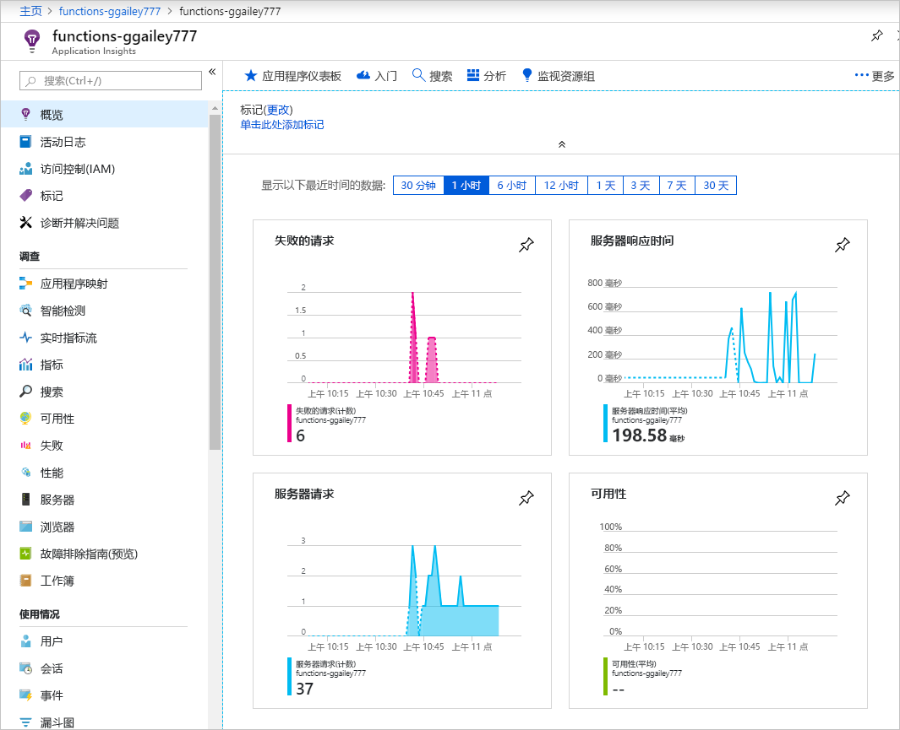
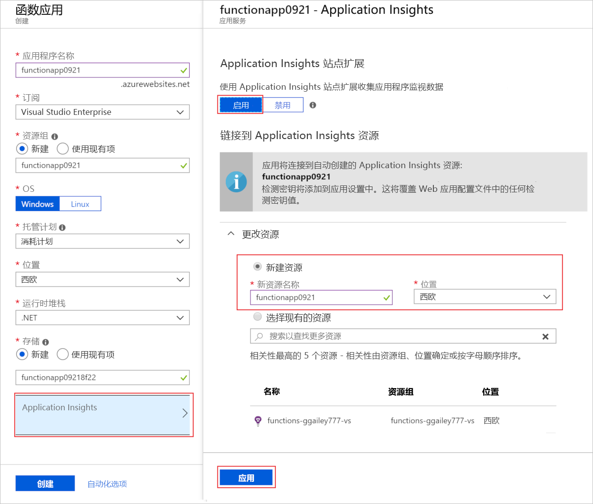
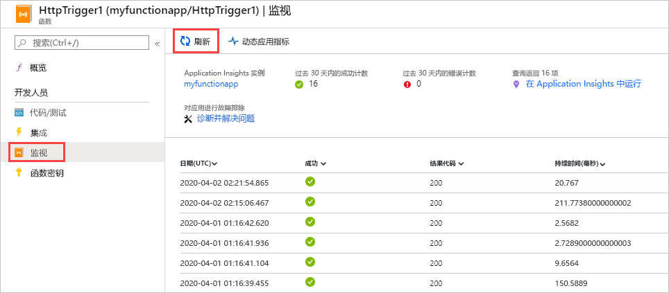
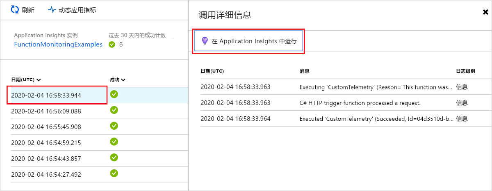
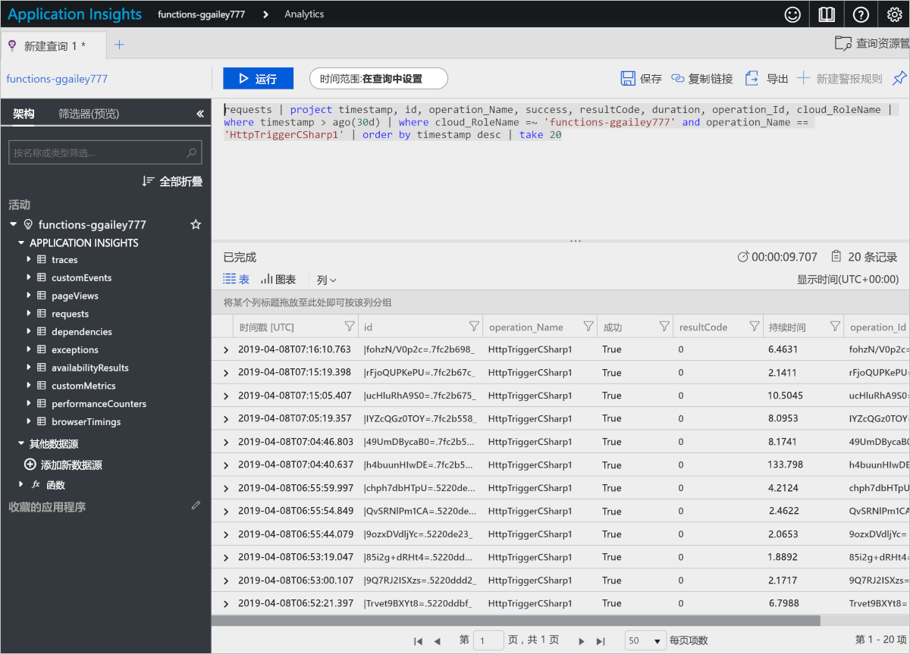
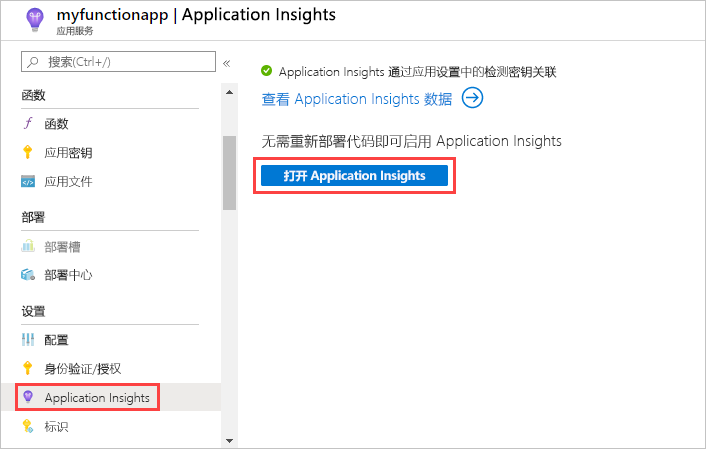
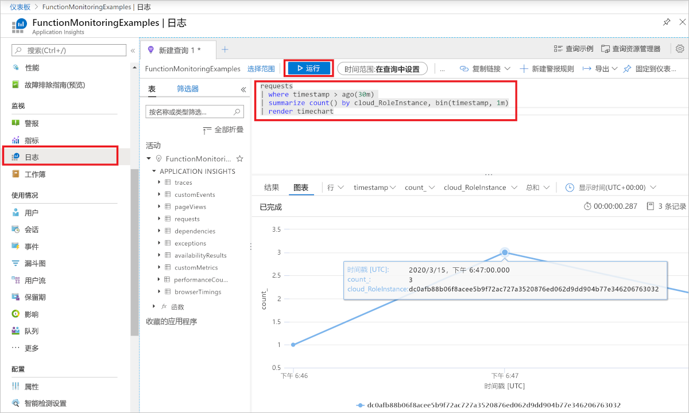
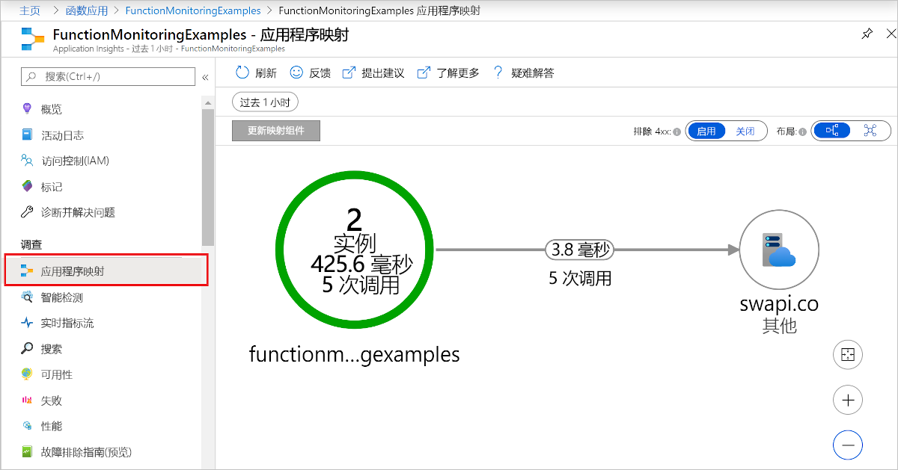

# <a name="monitor-azure-functions"></a>监视 Azure Functions

## <a name="overview"></a>概述 

[Azure Functions](functions-overview.md) 提供与 [Azure Application Insights](../application-insights/app-insights-overview.md) 的内置集成来监视函数。 本文演示如何配置 Functions 来将遥测数据发送到 Application Insights。



Functions 还具有[不使用 Application Insights 的内置监视](#monitoring-without-application-insights)。 我们建议使用 Application Insights，因为它提供更多的数据和更好的方式来分析数据。

## <a name="application-insights-pricing-and-limits"></a>Application Insights 定价和限制

可以免费试用 Application Insights 与函数应用的集成。 但是，每日可以免费处理的数据量有限制，在测试期间可能会达到该限制。 即将达到每日限制时，Azure 会提供门户和电子邮件通知。  但是，如果未收到这些警报并达到限制，则新日志不会显示在 Application Insights 查询中。 因此请注意限制，以免在故障排除上花费不必要的时间。 有关详细信息，请参阅[在 Application Insights 中管理定价和数据量](../application-insights/app-insights-pricing.md)。

## <a name="enable-app-insights-integration"></a>启用 App Insights 集成

对于将数据发送到 Application Insights 的函数应用，它需要知道 Application Insights 资源的检测密钥。 必须在名为 APPINSIGHTS_INSTRUMENTATIONKEY 的应用设置中提供该密钥。

可以在 [Azure 门户](https://portal.azure.com)中设置此连接：

* [为新函数应用自动连接](#new-function-app)
* [手动连接 App Insights 资源](#manually-connect-an-app-insights-resource)

### <a name="new-function-app"></a>新建函数应用

1. 转到函数应用的“创建”页。

1. 将 Application Insights开关设置为“打开”。

2. 选择一个 Application Insights 位置。

   在要将数据存储到的 [Azure 地理位置](https://azure.microsoft.com/global-infrastructure/geographies/)中，选择与函数应用所在区域最靠近的区域。

   

3. 输入其他所需信息。

1. 选择**创建**。

下一步是[禁用内置日志记录](#disable-built-in-logging)。

### <a name="manually-connect-an-app-insights-resource"></a>手动连接 App Insights 资源 

1. 创建 Application Insights 资源。 将应用程序类型设置为“常规”。

   

2. 从 Application Insights 资源的“概要”页复制检测密钥。 将鼠标悬停在显示的键值的末尾以获取“单击以复制”按钮。

   

1. 在函数应用的“应用程序设置”页上，单击“添加新设置”[添加应用设置](functions-how-to-use-azure-function-app-settings.md#settings)。 将新设置命名为 APPINSIGHTS_INSTRUMENTATIONKEY，并粘贴复制的检测密钥。

   

1. 单击“ **保存**”。

## <a name="disable-built-in-logging"></a>禁用内置日志记录

如果启用 Application Insights，我们建议你禁用[使用 Azure 存储的内置日志记录](#logging-to-storage)。 内置日志记录对于使用轻工作负荷测试非常有用，但不适合在高负载生产环境中使用。 对于生产监视，建议使用 Application Insights。 如果在生产环境中使用内置日志记录，日志记录可能因 Azure 存储限制而不完整。

若要禁用内置日志记录，请删除 `AzureWebJobsDashboard` 应用设置。 有关如何在 Azure 门户中删除应用设置的信息，请参阅[如何管理函数应用](functions-how-to-use-azure-function-app-settings.md#settings)的“应用程序设置”部分。 在删除应用设置之前，请确保同一函数应用中没有任何现有的函数将此设置用于 Azure 存储触发器或绑定。

## <a name="view-telemetry-in-monitor-tab"></a>在“监视”选项卡中查看遥测数据

如前面部分中所述设置 Application Insights 集成之后，可以在“监视”选项卡中查看遥测数据。

1. 在函数应用页中，选择在配置 Application Insights 之后至少运行过一次的函数，然后选择“监视”选项卡。

   

2. 定期选择“刷新”，直到显示函数调用列表。

   该列表最长可能需要在 5 分钟之后才显示，因为遥测客户端会通过某种方式批处理数据，以传输到服务器。 （这种延迟不适用于[实时指标流](../application-insights/app-insights-live-stream.md)。 加载页面时，该服务会连接到 Functions 主机，因此，日志会直接流向页面。）

   

2. 若要查看特定函数调用的日志，选择该调用对应的“日期”列链接。

   

   该调用的日志记录输出显示在新页中。

   

两个页面（调用列表和详细信息）链接到检索数据的 Application Insights Analytics 查询：




从这些查询中可以看到，调用列表限制为过去 30 天且不超过 20 行 (`where timestamp > ago(30d) | take 20`)，而调用详细信息列表针对过去 30 天且没有限制。

有关详细信息，请参阅本文稍后的[查询遥测数据](#query-telemetry-data)。

## <a name="view-telemetry-in-app-insights"></a>在 App Insights 中查看遥测数据

若要在 Azure 门户中从某个函数应用打开 Application Insights，请在该函数应用的“概述”页的“已配置的功能”中选择“Application Insights”链接。




有关如何使用 Application Insights 的信息，请参阅 [Application Insights 文档](https://docs.microsoft.com/azure/application-insights/)。 本部分介绍如何在 Application Insights 中查看数据的一些示例。 如果已经熟悉 Application Insights，则可以直接转到[有关配置和自定义遥测数据的部分](#configure-categories-and-log-levels)。

在[指标资源管理器](../application-insights/app-insights-metrics-explorer.md)中，可以基于指标（如函数调用次数、执行时间和成功率）来创建图表和警报。


在[失败](../application-insights/app-insights-asp-net-exceptions.md)选项卡上，可以基于函数失败和服务器异常来创建图表和警报。 操作名称是函数名称。 不显示依赖项中的失败，除非为依赖项实现了[自定义遥测](#custom-telemetry-in-c-functions)。


在[性能](../application-insights/app-insights-performance-counters.md)选项卡上，可以分析性能问题。


“服务器”选项卡显示资源利用率和每个服务器的吞吐量。 在函数阻碍基础资源的调试方案下，此数据非常有用。 服务器被称为云角色实例。


[实时指标流](../application-insights/app-insights-live-stream.md)选项卡显示指标数据，因为该数据是实时创建的。


## <a name="query-telemetry-data"></a>查询遥测数据

借助 [Application Insights Analytics](../application-insights/app-insights-analytics.md) 可以访问数据库中以表形式存储的所有遥测数据。 Analytics 提供了一种用于提取、处理和可视化数据的查询语言。




下面是一个查询示例。 本示例显示过去 30 分钟内每个辅助角色的请求分发。

```
requests
| where timestamp > ago(30m) 
| summarize count() by cloud_RoleInstance, bin(timestamp, 1m)
| render timechart
```

可用的表会显示在左侧窗格的“架构”选项卡中。 可以在下表中找到由函数调用生成的数据：

* **traces** - 由运行时和函数代码创建的日志。
* **requests** - 一个请求用于一个函数调用。
* **exceptions** - 由运行时引发的任何异常。
* **customMetrics** - 成功和失败调用的计数、成功率、持续时间。
* **customEvents** - 由运行时跟踪的事件，例如：触发函数的 HTTP 请求。
* **performanceCounters** - 有关运行函数的服务器的性能的信息。

其他表适用于可用性测试以及客户端/浏览器遥测。 可以实现自定义遥测以向其中添加数据。

在每个表内，一些函数特定的数据位于 `customDimensions` 字段。  例如，以下查询检索所有具有日志级别 `Error` 的跟踪。

```
traces 
| where customDimensions.LogLevel == "Error"
```

运行时提供 `customDimensions.LogLevel` 和 `customDimensions.Category`。 可以在日志中提供在函数代码中编写的其他字段。 请参阅本文后面部分中的[结构化日志记录](#structured-logging)。

## <a name="configure-categories-and-log-levels"></a>配置类别和日志级别

无需进行任何自定义配置即可使用 Application Insights，但默认配置可能会导致大量数据。 如果使用的是 Visual Studio Azure 订阅，可能会达到 Application Insights 的数据上限。 本文的剩余部分将演示如何配置和自定义函数发送到 Application Insights 的数据。

### <a name="categories"></a>类别

对于每个日志，Azure Functions 记录器都包含一个类别。 类别指示运行时代码或函数代码的哪个部分编写日志。 

Functions 运行时创建具有以“Host”开头的类别的日志。 例如，“函数已启动”、“函数已执行”和“函数已完成”日志具有类别“Host.Executor”。 

如果在函数代码中编写日志，则其类别为“Function”。

### <a name="log-levels"></a>日志级别

此外，对于每个日志，Azure Functions 记录器都会包含一个日志级别。 [LogLevel](https://docs.microsoft.com/aspnet/core/api/microsoft.extensions.logging.loglevel#Microsoft_Extensions_Logging_LogLevel) 是一个枚举，整数代码指示相对重要性：

|LogLevel    |代码|
|------------|---|
|跟踪       | 0 |
|调试       | 1 |
|信息 | 2 |
|警告     | 3 |
|错误       | 4 |
|严重    | 5 |
|无        | 6 |

日志级别 `None` 将在下一节中进行介绍。 

### <a name="configure-logging-in-hostjson"></a>配置 Host.json 中的日志记录

Host.json 文件配置函数应用发送到 Application Insights 的日志记录数量。 对于每个类别，均可以指示要发送的最小日志级别。 下面是一个示例：

```json
{
  "logger": {
    "categoryFilter": {
      "defaultLevel": "Information",
      "categoryLevels": {
        "Host.Results": "Error",
        "Function": "Error",
        "Host.Aggregator": "Information"
      }
    }
  }
}
```

此示例设置以下规则：

1. 对于类别为“Host.Results”或“Function”的日志，仅向 Application Insights 发送 `Error` 级别及更高级别。 `Warning` 级别及以下级别的日志将被忽略。
2. 对于类别为“Host.Aggregator”的日志， 仅向 Application Insights 发送 `Information` 级别及更高级别。 `Debug` 级别及以下级别的日志将被忽略。
3. 对于所有其他日志，仅向 Application Insights 发送 `Information` 级别及更高级别。

host.json 中的类别值控制所有以相同值开头的类别的日志记录。 例如，host.json 中的“Host”控制“Host.General”、“Host.Executor”、“Host.Results”等的日志记录。

如果 host.json 包含以相同字符串开头的多个类别，则先匹配较长的类别。 例如，假设想要让运行时中除“Host.Aggregator”之外的所有内容都在 `Error` 级别记录，而“Host.Aggregator”在 `Information` 级别记录：

```json
{
  "logger": {
    "categoryFilter": {
      "defaultLevel": "Information",
      "categoryLevels": {
        "Host": "Error",
        "Function": "Error",
        "Host.Aggregator": "Information"
      }
    }
  }
}
```

若要禁止类别的所有日志，可以使用日志级别 `None`。 没有使用该类别编写的日志，该类别上也没有日志级别。

以下各部分描述了运行时创建的日志的主要类别。 

### <a name="category-hostresults"></a>类别 Host.Results

这些日志在 Application Insights 中显示为“requests”。 它们指示函数的成功或失败。


所有这些日志在 `Information` 级别编写，因此，如果在 `Warning` 或更高级别进行筛选，将看不到任何此类数据。

### <a name="category-hostaggregator"></a>类别 Host.Aggregator

这些日志在一段[可配置](#configure-the-aggregator)的时间内提供函数调用的计数和平均值。 默认时段为 30 秒或 1,000 个结果，以先满足的条件为准。 

日志位于 Application Insights 中的 **customMetrics** 表内。 示例包括运行数、成功率和持续时间。


所有这些日志在 `Information` 级别编写，因此，如果在 `Warning` 或更高级别进行筛选，将看不到任何此类数据。

### <a name="other-categories"></a>其他类别

除了已经列出的类别，其余类别的所有日志在 Application Insights 的 **traces** 表中提供。


由 Functions 运行时编写以“Host”开头的类别的所有日志。 “函数已启动”和“函数已完成”日志的类别为“Host.Executor”。 对于成功运行，这些日志是 `Information` 级别；异常在 `Error` 级别进行记录。 运行时还创建 `Warning` 级别日志，例如：已发送到病毒邮件队列的队列邮件。

由函数代码编写的日志类别为“Function”，并且可以是任何日志级别。

## <a name="configure-the-aggregator"></a>配置聚合器

如前一部分中所述，运行时聚合一段时间内有关函数执行的数据。 默认时段为 30 秒或 1,000 次运行，以先满足的条件为准。 可以在 host.json 文件中配置此设置。  下面是一个示例：

```json
{
    "aggregator": {
      "batchSize": 1000,
      "flushTimeout": "00:00:30"
    }
}
```

## <a name="configure-sampling"></a>配置采样

Application Insights 具有[采样](../application-insights/app-insights-sampling.md)功能，可以防止在峰值负载时生成太多的遥测数据。 当遥测项的数目超过指定的速率时，Application Insights 开始随机忽略某些传入项。 默认的每秒最大项数设置为 5。 可以在 host.json 中配置采样。  下面是一个示例：

```json
{
  "applicationInsights": {
    "sampling": {
      "isEnabled": true,
      "maxTelemetryItemsPerSecond" : 5
    }
  }
}
```

## <a name="write-logs-in-c-functions"></a>在 C# 函数中编写日志

可以在 Application Insights 中显示为 traces 的函数代码中编写日志。

### <a name="ilogger"></a>ILogger

在函数中使用 [ILogger](https://docs.microsoft.com/aspnet/core/api/microsoft.extensions.logging.ilogger) 参数，而不是 `TraceWriter` 参数。 通过使用 `TraceWriter` 创建的日志会转到 Application Insights，但借助 `ILogger` 可执行[结构化日志记录](https://softwareengineering.stackexchange.com/questions/312197/benefits-of-structured-logging-vs-basic-logging)。

使用 `ILogger` 对象，可以调用 `Log<level>` [ILogger 上的扩展方法](https://docs.microsoft.com/aspnet/core/api/microsoft.extensions.logging.loggerextensions#Methods_)来创建日志。 例如，下面的代码编写类别为“Function”的 `Information` 日志。

```cs
public static async Task<HttpResponseMessage> Run(HttpRequestMessage req, ILogger logger)
{
    logger.LogInformation("Request for item with key={itemKey}.", id);
```

### <a name="structured-logging"></a>结构化日志记录

占位符的顺序（而不是其名称）确定日志消息中使用的参数。 例如，假设有以下代码：

```csharp
string partitionKey = "partitionKey";
string rowKey = "rowKey";
logger.LogInformation("partitionKey={partitionKey}, rowKey={rowKey}", partitionKey, rowKey);
```

如果保留相同的消息字符串并颠倒参数的顺序，则生成的消息文本将在错误的位置生成值。

以这种方式处理占位符，以便可以执行结构化日志记录。 Application Insights 存储除了消息字符串之外的参数名称值对。 结果是消息参数变为可以查询的字段。

例如，如果记录器方法调用类似于前面的示例，则可以查询字段 `customDimensions.prop__rowKey`。 添加 `prop__` 前缀以确保运行时添加的字段和函数代码添加的字段之间没有冲突。

此外，可以通过引用字段 `customDimensions.prop__{OriginalFormat}` 查询原始消息字符串。  

下面是 `customDimensions` 数据的示例 JSON 表示形式：

```json
{
  customDimensions: {
    "prop__{OriginalFormat}":"C# Queue trigger function processed: {message}",
    "Category":"Function",
    "LogLevel":"Information",
    "prop__message":"c9519cbf-b1e6-4b9b-bf24-cb7d10b1bb89"
  }
}
```

### <a name="logging-custom-metrics"></a>记录自定义指标  

在 C# 脚本函数中，可以使用 `ILogger` 上的 `LogMetric` 扩展方法来在 Application Insights 中创建自定义指标。 下面是示例方法调用：

```csharp
logger.LogMetric("TestMetric", 1234); 
```

此代码是一种替代方法，使用[适用于 .NET 的 Application Insights API](#custom-telemetry-in-c-functions) 调用 `TrackMetric`。

## <a name="write-logs-in-javascript-functions"></a>在 JavaScript 函数中写入日志

在 Node.js 函数中，使用 `context.log` 编写日志。 结构化日志记录未启用。

```
context.log('JavaScript HTTP trigger function processed a request.' + context.invocationId);
```

### <a name="logging-custom-metrics"></a>记录自定义指标  

在 Node.js 函数中，可以使用 `context.log.metric` 方法来在 Application Insights 中创建自定义指标。 下面是示例方法调用：

```javascript
context.log.metric("TestMetric", 1234); 
```

此代码是一种替代方法，使用[适用于 Application Insights 的 Node.js SDK](#custom-telemetry-in-javascript-functions) 调用 `trackMetric`。

## <a name="custom-telemetry-in-c-functions"></a>C# 函数中的自定义遥测

可以使用 [Microsoft.ApplicationInsights](https://www.nuget.org/packages/Microsoft.ApplicationInsights/) NuGet 程序包将自定义遥测数据发送到 Application Insights。

下面是一个 C# 代码的示例，使用[自定义遥测 API](../application-insights/app-insights-api-custom-events-metrics.md)。 示例针对的是 .NET 类库，但对于 C# 脚本，Application Insights 代码是相同的。

```cs
using System;
using System.Net;
using Microsoft.ApplicationInsights;
using Microsoft.ApplicationInsights.DataContracts;
using Microsoft.ApplicationInsights.Extensibility;
using Microsoft.Azure.WebJobs;
using System.Net.Http;
using System.Threading.Tasks;
using Microsoft.Azure.WebJobs.Extensions.Http;
using Microsoft.Extensions.Logging;
using System.Linq;

namespace functionapp0915
{
    public static class HttpTrigger2
    {
        private static string key = TelemetryConfiguration.Active.InstrumentationKey = 
            System.Environment.GetEnvironmentVariable(
                "APPINSIGHTS_INSTRUMENTATIONKEY", EnvironmentVariableTarget.Process);

        private static TelemetryClient telemetryClient = 
            new TelemetryClient() { InstrumentationKey = key };

        [FunctionName("HttpTrigger2")]
        public static async Task<HttpResponseMessage> Run(
            [HttpTrigger(AuthorizationLevel.Anonymous, "get", "post", Route = null)]
            HttpRequestMessage req, ExecutionContext context, ILogger log)
        {
            log.LogInformation("C# HTTP trigger function processed a request.");
            DateTime start = DateTime.UtcNow;

            // parse query parameter
            string name = req.GetQueryNameValuePairs()
                .FirstOrDefault(q => string.Compare(q.Key, "name", true) == 0)
                .Value;

            // Get request body
            dynamic data = await req.Content.ReadAsAsync<object>();

            // Set name to query string or body data
            name = name ?? data?.name;
         
            // Track an Event
            var evt = new EventTelemetry("Function called");
            UpdateTelemetryContext(evt.Context, context, name);
            telemetryClient.TrackEvent(evt);
            
            // Track a Metric
            var metric = new MetricTelemetry("Test Metric", DateTime.Now.Millisecond);
            UpdateTelemetryContext(metric.Context, context, name);
            telemetryClient.TrackMetric(metric);
            
            // Track a Dependency
            var dependency = new DependencyTelemetry
                {
                    Name = "GET api/planets/1/",
                    Target = "swapi.co",
                    Data = "https://swapi.co/api/planets/1/",
                    Timestamp = start,
                    Duration = DateTime.UtcNow - start,
                    Success = true
                };
            UpdateTelemetryContext(dependency.Context, context, name);
            telemetryClient.TrackDependency(dependency);
            
            return name == null
                ? req.CreateResponse(HttpStatusCode.BadRequest, 
                    "Please pass a name on the query string or in the request body")
                : req.CreateResponse(HttpStatusCode.OK, "Hello " + name);
        }
        
        // This correllates all telemetry with the current Function invocation
        private static void UpdateTelemetryContext(TelemetryContext context, ExecutionContext functionContext, string userName)
        {
            context.Operation.Id = functionContext.InvocationId.ToString();
            context.Operation.ParentId = functionContext.InvocationId.ToString();
            context.Operation.Name = functionContext.FunctionName;
            context.User.Id = userName;
        }
    }    
}
```

请勿调用 `TrackRequest` 或 `StartOperation<RequestTelemetry>`，因为你将看到函数调用的重复请求。  Functions 运行时自动跟踪请求。

不要设置 `telemetryClient.Context.Operation.Id`。 这是一种全局设置，在许多函数同时运行时，会导致不正确的关联。 请改为创建新的遥测实例（`DependencyTelemetry`、`EventTelemetry`）并修改其 `Context` 属性。 然后将遥测实例传入到 `TelemetryClient` 的相应 `Track` 方法（`TrackDependency()`、`TrackEvent()`）。 这可确保遥测具有当前函数调用的正确关联详细信息。

## <a name="custom-telemetry-in-javascript-functions"></a>JavaScript 函数中的自定义遥测

[Application Insights Node.js SDK](https://www.npmjs.com/package/applicationinsights) 当前为 beta 版本。 下面是一些可将自定义遥测发送到 Application Insights 的示例代码：

```javascript
const appInsights = require("applicationinsights");
appInsights.setup();
const client = appInsights.defaultClient;

module.exports = function (context, req) {
    context.log('JavaScript HTTP trigger function processed a request.');

    client.trackEvent({name: "my custom event", tagOverrides:{"ai.operation.id": context.invocationId}, properties: {customProperty2: "custom property value"}});
    client.trackException({exception: new Error("handled exceptions can be logged with this method"), tagOverrides:{"ai.operation.id": context.invocationId}});
    client.trackMetric({name: "custom metric", value: 3, tagOverrides:{"ai.operation.id": context.invocationId}});
    client.trackTrace({message: "trace message", tagOverrides:{"ai.operation.id": context.invocationId}});
    client.trackDependency({target:"http://dbname", name:"select customers proc", data:"SELECT * FROM Customers", duration:231, resultCode:0, success: true, dependencyTypeName: "ZSQL", tagOverrides:{"ai.operation.id": context.invocationId}});
    client.trackRequest({name:"GET /customers", url:"http://myserver/customers", duration:309, resultCode:200, success:true, tagOverrides:{"ai.operation.id": context.invocationId}});

    if (req.query.name || (req.body && req.body.name)) {
        context.res = {
            // status: 200, /* Defaults to 200 */
            body: "Hello " + (req.query.name || req.body.name)
        };
    }
    else {
        context.res = {
            status: 400,
            body: "Please pass a name on the query string or in the request body"
        };
    }
    context.done();
};
```

`tagOverrides` 参数将 `operation_Id` 设置为函数的调用 ID。 通过此设置，可为给定的函数调用关联所有自动生成的遥测和自定义遥测。

## <a name="known-issues"></a>已知问题

### <a name="dependencies"></a>依赖项

函数与其他服务之间的依赖关系不会自动显示，但可以编写自定义代码来显示依赖项。 [C# 自定义遥测部分](#custom-telemetry-in-c-functions)中的示例代码显示相关方式。 该示例代码会导致 Application Insights 中出现如下所示的应用程序映射：



### <a name="report-issues"></a>报告问题

若要报告 Functions 中的 Application Insights 集成问题，或提出建议或请求，请[在 GitHub 中创建问题](https://github.com/Azure/Azure-Functions/issues/new)。

## <a name="monitoring-without-application-insights"></a>不使用 Application Insights 进行监视

我们建议使用 Application Insights 监视函数，因为它提供更多的数据和更好的方式来分析数据。 但是，如果你偏爱使用 Azure 存储的内置日志记录系统，可以继续使用它。

### <a name="logging-to-storage"></a>记录到存储

内置日志记录使用 `AzureWebJobsDashboard` 应用设置中的连接字符串所指定的存储帐户。 在函数应用页中选择某个函数，然后选择“监视”选项卡，并选择将此函数保留在经典视图中。


 获取函数执行列表。 选择某个函数执行可查看持续时间、输入数据、错误和关联的日志文件。

如果以前启用了 Application Insights，但现在想要恢复使用内置日志记录，请手动禁用 Application Insights，然后选择“监视”选项卡。若要禁用 Application Insights 集成，请删除 APPINSIGHTS_INSTRUMENTATIONKEY 应用设置。

即使“监视”选项卡显示 Application Insights 数据，但如果未[禁用内置日志记录](#disable-built-in-logging)，也仍会看到文件系统中的日志数据。 在“存储”资源中，转到“文件”，选择函数的文件服务，然后转到 `LogFiles > Application > Functions > Function > your_function` 来查看日志文件。

### <a name="real-time-monitoring"></a>实时监视

可在本地工作站上使用 [Azure 命令行接口 (CLI) 2.0](/cli/azure/install-azure-cli) 或 [Azure PowerShell](/powershell/azure/overview) 将日志文件流式传输到命令行会话。  

对于 Azure CLI 2.0，使用以下命令登录，选择订阅并流式传输日志文件：

```
az login
az account list
az account set <subscriptionNameOrId>
az appservice web log tail --resource-group <resource group name> --name <function app name>
```

对于 Azure PowerShell，使用以下命令添加 Azure 帐户，选择订阅并流式传输日志文件：

```
PS C:\> Add-AzureAccount
PS C:\> Get-AzureSubscription
PS C:\> Get-AzureSubscription -SubscriptionName "<subscription name>" | Select-AzureSubscription
PS C:\> Get-AzureWebSiteLog -Name <function app name> -Tail
```

有关详细信息，请参阅[如何流式传输日志](../app-service/web-sites-enable-diagnostic-log.md#streamlogs)。

### <a name="viewing-log-files-locally"></a>在本地查看日志文件

[!INCLUDE [functions-local-logs-location](../../includes/functions-local-logs-location.md)]

## <a name="next-steps"></a>后续步骤

有关详细信息，请参阅以下资源：

* [Application Insights](/azure/application-insights/)
* [ASP.NET Core 日志记录](/aspnet/core/fundamentals/logging/)
