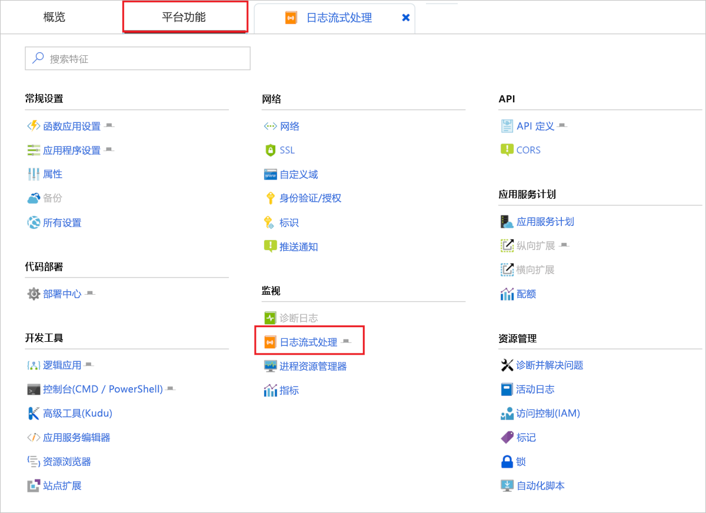
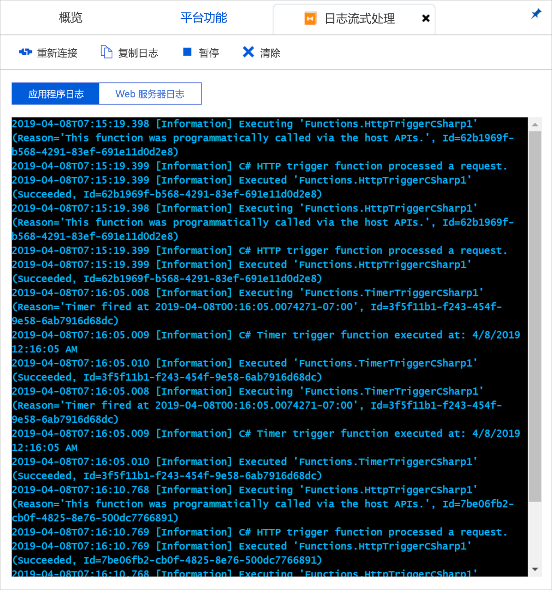
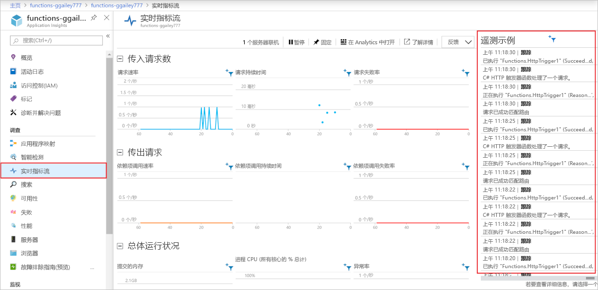

# <a name="monitor-azure-functions"></a>监视 Azure Functions

[Azure Functions](functions-overview.md)提供内置与[Azure 应用程序 Insights](../azure-monitor/app/app-insights-overview.md)的集成来监视函数。 本文介绍如何配置 Azure Functions 以将系统生成的日志文件发送到 Application Insights。

建议使用 Application Insights, 因为它收集日志、性能和错误数据。 它会自动检测性能异常, 并提供强大的分析工具来帮助你诊断问题并了解函数的使用方式。 Application Insights 有助于持续提高性能与可用性。 你甚至可以在本地函数应用项目开发过程中使用 Application Insights。 有关详细信息, 请参阅[什么是 Application Insights？](../azure-monitor/app/app-insights-overview.md)。

由于所需的 Application Insights 检测内置于 Azure Functions 中, 你只需一个有效的检测密钥即可将函数应用连接到 Application Insights 资源。

## <a name="application-insights-pricing-and-limits"></a>Application Insights 定价和限制

可以免费试用 Application Insights 与函数应用的集成。 每日限制可免费处理的数据量。 在测试期间, 你可能会遇到此限制。 当你达到每日限制时，Azure 会提供门户和电子邮件通知。 如果错过了这些警报并达到了限制, 则新日志不会出现在 Application Insights 查询中。 请注意限制, 以避免不必要的故障排除时间。 有关详细信息，请参阅[在 Application Insights 中管理定价和数据量](../azure-monitor/app/pricing.md)。

## <a name="enable-application-insights-integration"></a>启用 Application Insights 集成

对于将数据发送到 Application Insights 的函数应用，它需要知道 Application Insights 资源的检测密钥。 该密钥必须位于名为 **APPINSIGHTS_INSTRUMENTATIONKEY** 的应用设置中。

### <a name="new-function-app-in-the-portal"></a>门户中的新函数应用

[在 Azure 门户中创建函数应用](functions-create-first-azure-function.md)时, 默认情况下会启用 Application Insights 集成。 Application Insights 资源具有与 function app 相同的名称, 并且它是在同一区域或最近的区域中创建的。

若要查看正在创建的 Application Insights 资源, 请选择它以展开 " **Application Insights** " 窗口。 你可以更改**新的资源名称**, 或在要存储数据的[Azure 地理](https://azure.microsoft.com/global-infrastructure/geographies/)位置中选择其他**位置**。


选择 "**创建**" 时, 将创建一个 Application Insights 资源, 其中包含 "应用程序设置`APPINSIGHTS_INSTRUMENTATIONKEY` " 中的 "设置"。 一切准备就绪。

<a id="manually-connect-an-app-insights-resource"></a>
### <a name="add-to-an-existing-function-app"></a>添加到现有函数应用 

使用[Azure CLI](functions-create-first-azure-function-azure-cli.md)、 [Visual Studio](functions-create-your-first-function-visual-studio.md)或[Visual Studio Code](functions-create-first-function-vs-code.md)创建 function app 时, 必须创建 Application Insights 资源。 然后, 你可以在 function app 中添加该资源的检测密钥作为应用程序设置。

[!INCLUDE [functions-connect-new-app-insights.md](../../includes/functions-connect-new-app-insights.md)]

早期版本的函数使用了内置监视功能, 这不再推荐使用。 为此类函数应用启用 Application Insights 集成时, 还必须[禁用内置日志记录](#disable-built-in-logging)。  

## <a name="view-telemetry-in-monitor-tab"></a>在“监视”选项卡中查看遥测数据

[启用 Application Insights 集成](#enable-application-insights-integration)后, 可以在 "**监视**" 选项卡中查看遥测数据。

1. 在 "函数应用" 页中, 选择在配置 Application Insights 后至少运行一次的函数。 然后选择 "**监视**" 选项卡。

   

1. 选择 "定期**刷新**", 直到出现函数调用列表。

   在遥测客户端分批传输要传输到服务器的数据时, 可能需要长达五分钟的时间才会显示列表。 (延迟不适用于[实时指标流](../azure-monitor/app/live-stream.md)。 加载页面时，该服务会连接到 Functions 主机，因此，日志会直接流式传输到页面。）

   

1. 若要查看特定函数调用的日志，选择该调用对应的“日期”列链接。

   

   该调用的日志记录输出显示在新页中。

   

您可以看到, 这两个页面都有 "**运行于" Application Insights**链接到检索数据的 Application Insights Analytics 查询。


将显示以下查询。 你可以看到, 调用列表限制为过去30天。 此列表中显示的行数不超过`where timestamp > ago(30d) | take 20`20 行 ()。 "调用详细信息" 列表适用于过去30天, 无限制。


有关详细信息，请参阅本文稍后的[查询遥测数据](#query-telemetry-data)。

## <a name="view-telemetry-in-application-insights"></a>在 Application Insights 中查看遥测

若要从 Azure 门户中的函数应用打开 Application Insights, 请参阅函数应用的 "**概述**" 页。 在 "**已配置功能**" 下, 选择**Application Insights**。


有关如何使用 Application Insights 的信息，请参阅 [Application Insights 文档](https://docs.microsoft.com/azure/application-insights/)。 本部分介绍如何在 Application Insights 中查看数据的一些示例。 如果你已熟悉 Application Insights, 则可以直接参阅[有关如何配置和自定义遥测数据的部分](#configure-categories-and-log-levels)。


评估函数中的行为、性能和错误时, 以下 Application Insights 区域可能会有所帮助:

| Tab | 描述 |
| ---- | ----------- |
| **[故障](../azure-monitor/app/asp-net-exceptions.md)** |  根据函数失败和服务器异常来创建图表和警报。 操作名称是函数名称。 除非为依赖项实现自定义遥测, 否则不会显示依赖项中的故障。 |
| **[性能](../azure-monitor/app/performance-counters.md)** | 分析性能问题。 |
| **服务器** | 查看每个服务器的资源利用率和吞吐量。 在函数阻碍基础资源的调试方案下，此数据非常有用。 服务器被称为云角色实例。 |
| **[指标](../azure-monitor/app/metrics-explorer.md)** | 创建基于指标的图表和警报。 度量值包括函数调用数、执行时间和成功率。 |
| **[实时指标流](../azure-monitor/app/live-stream.md)** | 查看以实时方式创建的指标数据。 |

## <a name="query-telemetry-data"></a>查询遥测数据

[Application Insights 分析](../azure-monitor/app/analytics.md)提供了对数据库中的表形式的所有遥测数据的访问。 Analytics 提供了一种用于提取、处理和可视化数据的查询语言。


下面是一个查询示例，它显示过去 30 分钟内每个辅助角色的请求的分布。

```
requests
| where timestamp > ago(30m) 
| summarize count() by cloud_RoleInstance, bin(timestamp, 1m)
| render timechart
```

可用的表显示在左侧的 "**架构**" 选项卡中。 可以在下表中找到由函数调用生成的数据：

| 表 | 描述 |
| ----- | ----------- |
| **traces** | 由运行时和函数代码创建的日志。 |
| **requests** | 针对每个函数调用的一个请求。 |
| **异常** | 由运行时引发的任何异常。 |
| **customMetrics** | 成功和失败的调用、成功率和持续时间的计数。 |
| **customEvents** | 由运行时跟踪的事件, 例如:触发函数的 HTTP 请求。 |
| **performanceCounters** | 有关运行函数的服务器的性能的信息。 |

其他表适用于可用性测试和客户端和浏览器遥测。 可以实现自定义遥测以向其中添加数据。

在每个表内，一些函数特定的数据位于 `customDimensions` 字段。  例如，以下查询检索所有具有日志级别 `Error` 的跟踪。

```
traces 
| where customDimensions.LogLevel == "Error"
```

运行时提供`customDimensions.LogLevel`了和`customDimensions.Category`字段。 您可以在 "日志" 中提供您在函数代码中编写的其他字段。 请参阅本文后面部分中的[结构化日志记录](#structured-logging)。

## <a name="configure-categories-and-log-levels"></a>配置类别和日志级别

无需任何自定义配置即可使用 Application Insights。 默认配置可能会导致大量的数据。 如果使用的是 Visual Studio Azure 订阅，可能会达到 Application Insights 的数据上限。 本文稍后将介绍如何配置和自定义函数发送到 Application Insights 的数据。 对于函数应用, 请在[主机 json]文件中配置日志记录。

### <a name="categories"></a>Categories

对于每个日志，Azure Functions 记录器都包含一个类别。 类别指示运行时代码或函数代码的哪个部分编写日志。 

函数运行时创建具有以 "Host" 开头的类别的日志。 在版本1.x 中`function started`,、 `function executed`和`function completed`日志具有类别`Host.Executor`。 从版本2.x 开始, 这些日志具有类别`Function.<YOUR_FUNCTION_NAME>`。

如果在函数代码中编写日志, 则类别`Function`在函数运行时的版本1.x 中。 在版本2.x 中, 类别为`Function.<YOUR_FUNCTION_NAME>.User`。

### <a name="log-levels"></a>日志级别

Azure Functions 记录器还包括每个日志的*日志级别*。 [LogLevel](/dotnet/api/microsoft.extensions.logging.loglevel) 是一个枚举，整数代码指示相对重要性：

|LogLevel    |代码|
|------------|---|
|跟踪       | 0 |
|调试       | 1 |
|Information | 2 |
|警告     | 3 |
|Error       | 4 |
|关键    | 5 |
|无        | 6 |

日志级别 `None` 将在下一节中进行介绍。 

### <a name="log-configuration-in-hostjson"></a>Host json 中的日志配置

[主机 json] 文件配置函数应用发送到 Application Insights 的日志记录数量。 对于每个类别，均可以指示要发送的最小日志级别。 有两个示例: 第一个示例以[版本2.x 运行时](functions-versions.md#version-2x)(.net Core) 为目标, 第二个示例用于版本1.x 运行时。

### <a name="version-2x"></a>版本 2.x

v2.x 运行时使用 [.NET Core 日志记录筛选器层次结构](https://docs.microsoft.com/aspnet/core/fundamentals/logging/?view=aspnetcore-2.1#log-filtering)。 

```json
{
  "logging": {
    "fileLoggingMode": "always",
    "logLevel": {
      "default": "Information",
      "Host.Results": "Error",
      "Function": "Error",
      "Host.Aggregator": "Trace"
    }
  }
}
```

### <a name="version-1x"></a>版本 1.x

```json
{
  "logger": {
    "categoryFilter": {
      "defaultLevel": "Information",
      "categoryLevels": {
        "Host.Results": "Error",
        "Function": "Error",
        "Host.Aggregator": "Trace"
      }
    }
  }
}
```

此示例设置以下规则：

* 对于类别`Host.Results`为或`Function`的日志, 仅`Error`将级别和更高级别发送到 Application Insights。 `Warning` 级别及以下级别的日志将被忽略。
* 对于 `Host.Aggregator` 类别的日志，将所有日志发送到 Application Insights。 `Trace` 日志级别与某些记录器称为 `Verbose` 的日志级别相同，但在 [主机 json] 文件中请使用 `Trace`。
* 对于所有其他日志，仅向 Application Insights 发送 `Information` 级别及更高级别。

[主机 json] 中的类别值控制所有以相同值开头的类别的日志记录。 在 [主机 json] 中, `Host`会控制`Host.General`、`Host.Executor`、`Host.Results`等的日志记录。

如果 [主机 json] 包含以相同字符串开头的多个类别，则先匹配较长的类别。 假设你想要从运行时中`Host.Aggregator`除`Error`日志级别以外的所有内容, `Host.Aggregator`但`Information`想要在级别进行记录:

### <a name="version-2x"></a>版本 2.x 

```json
{
  "logging": {
    "fileLoggingMode": "always",
    "logLevel": {
      "default": "Information",
      "Host": "Error",
      "Function": "Error",
      "Host.Aggregator": "Information"
    }
  }
}
```

### <a name="version-1x"></a>版本 1.x 

```json
{
  "logger": {
    "categoryFilter": {
      "defaultLevel": "Information",
      "categoryLevels": {
        "Host": "Error",
        "Function": "Error",
        "Host.Aggregator": "Information"
      }
    }
  }
}
```

若要禁止某个类别的所有日志，可以使用日志级别 `None`。 没有与该类别一起写入的日志, 也没有日志级别。

以下各部分描述了运行时创建的日志的主要类别。 

### <a name="category-hostresults"></a>类别 Host.Results

这些日志在 Application Insights 中显示为“requests”。 它们指示函数的成功或失败。


所有这些日志都以`Information`级别编写。 如果你在`Warning`或更高版本中进行筛选, 你将看不到此数据。

### <a name="category-hostaggregator"></a>类别 Host.Aggregator

这些日志在一段[可配置](#configure-the-aggregator)的时间内提供函数调用的计数和平均值。 默认时段为 30 秒或 1,000 个结果，以先满足的条件为准。 

日志位于 Application Insights 中的 **customMetrics** 表内。 例如, 运行数、成功率和持续时间。


所有这些日志都以`Information`级别编写。 如果你在`Warning`或更高版本中进行筛选, 你将看不到此数据。

### <a name="other-categories"></a>其他类别

除了已经列出的类别，其余类别的所有日志在 Application Insights 的 **traces** 表中提供。


所有类别以开头`Host`的日志都由函数运行时写入。 "函数已启动" 和 "函数已完成" 日志具有`Host.Executor`类别。 如果成功运行, 则这些日志`Information`为 level。 在`Error`级别记录异常。 运行时还创建 `Warning` 级别日志，例如：已发送到病毒邮件队列的队列邮件。

函数代码编写的日志具有类别`Function` , 可以是任何日志级别。

## <a name="configure-the-aggregator"></a>配置聚合器

如前一部分中所述，运行时聚合一段时间内有关函数执行的数据。 默认时段为 30 秒或 1,000 次运行，以先满足的条件为准。 可以在 [主机 json] 文件中配置此设置。  以下是一个示例：

```json
{
    "aggregator": {
      "batchSize": 1000,
      "flushTimeout": "00:00:30"
    }
}
```

## <a name="configure-sampling"></a>配置采样

Application Insights 提供了一项[采样](../azure-monitor/app/sampling.md)功能, 可防止在负载高峰时为已完成的执行生成过多的遥测数据。 当传入执行速率超出指定阈值时, Application Insights 会开始随机忽略某些传入的执行。 每秒执行的最大次数的默认设置为 20 (版本1.x 中的5个)。 可以在 [主机 json] 中配置采样。  以下是一个示例：

### <a name="version-2x"></a>版本 2.x 

```json
{
  "logging": {
    "applicationInsights": {
      "samplingSettings": {
        "isEnabled": true,
        "maxTelemetryItemsPerSecond" : 20
      }
    }
  }
}
```

### <a name="version-1x"></a>版本 1.x 

```json
{
  "applicationInsights": {
    "sampling": {
      "isEnabled": true,
      "maxTelemetryItemsPerSecond" : 5
    }
  }
}
```

> [!NOTE]
> [采样](../azure-monitor/app/sampling.md)是默认启用的。 如果你似乎缺少数据, 则可能需要调整采样设置以适应特定的监视方案。

## <a name="write-logs-in-c-functions"></a>在 C# 函数中编写日志

可以在 Application Insights 中显示为 traces 的函数代码中编写日志。

### <a name="ilogger"></a>ILogger

在函数中使用 [ILogger](https://docs.microsoft.com/dotnet/api/microsoft.extensions.logging.ilogger) 参数，而不是 `TraceWriter` 参数。 使用`TraceWriter` "中转到 Application Insights" 创建的日志`ILogger` , 但允许您执行[结构化日志记录](https://softwareengineering.stackexchange.com/questions/312197/benefits-of-structured-logging-vs-basic-logging)。

使用 `ILogger` 对象，可以调用 `Log<level>`ILogger 上的 [ 扩展方法](https://docs.microsoft.com/dotnet/api/microsoft.extensions.logging.loggerextensions#methods)来创建日志。 下面的代码写入`Information`类别为 "Function" 的日志。

```cs
public static async Task<HttpResponseMessage> Run(HttpRequestMessage req, ILogger logger)
{
    logger.LogInformation("Request for item with key={itemKey}.", id);
```

### <a name="structured-logging"></a>结构化日志记录

占位符的顺序（而不是其名称）确定日志消息中使用的参数。 假设你有以下代码:

```csharp
string partitionKey = "partitionKey";
string rowKey = "rowKey";
logger.LogInformation("partitionKey={partitionKey}, rowKey={rowKey}", partitionKey, rowKey);
```

如果保留相同的消息字符串并颠倒参数的顺序，则生成的消息文本将在错误的位置生成值。

以这种方式处理占位符，以便可以执行结构化日志记录。 Application Insights 存储参数名称-值对和消息字符串。 结果是消息参数变为可以查询的字段。

如果记录器方法调用与前面的示例类似, 则可以查询该字段`customDimensions.prop__rowKey`。 添加`prop__`前缀以确保运行时添加的字段和函数代码添加的字段之间没有冲突。

此外，可以通过引用字段 `customDimensions.prop__{OriginalFormat}` 查询原始消息字符串。  

下面是 `customDimensions` 数据的示例 JSON 表示形式：

```json
{
  customDimensions: {
    "prop__{OriginalFormat}":"C# Queue trigger function processed: {message}",
    "Category":"Function",
    "LogLevel":"Information",
    "prop__message":"c9519cbf-b1e6-4b9b-bf24-cb7d10b1bb89"
  }
}
```

### <a name="custom-metrics-logging"></a>自定义指标日志记录

在 C# 脚本函数中，可以使用 `ILogger` 上的 `LogMetric` 扩展方法来在 Application Insights 中创建自定义指标。 下面是示例方法调用：

```csharp
logger.LogMetric("TestMetric", 1234);
```

此代码是使用适用于 .net `TrackMetric`的 Application Insights API 进行调用的替代方法。

## <a name="write-logs-in-javascript-functions"></a>在 JavaScript 函数中写入日志

在 Node.js 函数中，使用 `context.log` 编写日志。 不启用结构化日志记录。

```
context.log('JavaScript HTTP trigger function processed a request.' + context.invocationId);
```

### <a name="custom-metrics-logging"></a>自定义指标日志记录

当你在函数运行时的[版本](functions-versions.md#creating-1x-apps)1.x 上运行时, node.js 函数可以使用`context.log.metric`方法在 Application Insights 中创建自定义度量值。 版本2.x 当前不支持此方法。 下面是示例方法调用：

```javascript
context.log.metric("TestMetric", 1234);
```

此代码是使用 node.js SDK for `trackMetric` Application Insights 调用的替代方法。

## <a name="log-custom-telemetry-in-c-functions"></a>在函数中C#记录自定义遥测

可以使用 [Microsoft.ApplicationInsights](https://www.nuget.org/packages/Microsoft.ApplicationInsights/) NuGet 程序包将自定义遥测数据发送到 Application Insights。 以下 C# 示例使用[自定义遥测 API](../azure-monitor/app/api-custom-events-metrics.md)。 示例针对的是 .NET 类库，但对于 C# 脚本，Application Insights 代码是相同的。

### <a name="version-2x"></a>版本 2.x

版本 2.x 运行时使用 Application Insights 中的较新功能自动将遥测与当前操作进行关联。 无需手动设置操作`Id`、 `ParentId`或`Name`字段。

```cs
using System;
using System.Linq;
using System.Threading.Tasks;
using Microsoft.ApplicationInsights;
using Microsoft.ApplicationInsights.DataContracts;
using Microsoft.AspNetCore.Http;
using Microsoft.AspNetCore.Mvc;
using Microsoft.Azure.WebJobs;
using Microsoft.Azure.WebJobs.Extensions.Http;
using Microsoft.Extensions.Logging;

namespace functionapp0915
{
    public class HttpTrigger2
    {
        private readonly TelemetryClient telemetryClient;

        /// Using dependency injection will guarantee that you use the same configuration for telemetry collected automatically and manually.
        public HttpTrigger2(TelemetryConfiguration telemetryConfiguration)
        {
            this.telemetryClient = new TelemetryClient(telemetryConfiguration);
        }

        [FunctionName("HttpTrigger2")]
        public Task<IActionResult> Run(
            [HttpTrigger(AuthorizationLevel.Anonymous, "get", Route = null)]
            HttpRequest req, ExecutionContext context, ILogger log)
        {
            log.LogInformation("C# HTTP trigger function processed a request.");
            DateTime start = DateTime.UtcNow;

            // Parse query parameter
            string name = req.Query
                .FirstOrDefault(q => string.Compare(q.Key, "name", true) == 0)
                .Value;

            // Track an Event
            var evt = new EventTelemetry("Function called");
            evt.Context.User.Id = name;
            this.telemetryClient.TrackEvent(evt);

            // Track a Metric
            var metric = new MetricTelemetry("Test Metric", DateTime.Now.Millisecond);
            metric.Context.User.Id = name;
            this.telemetryClient.TrackMetric(metric);

            // Track a Dependency
            var dependency = new DependencyTelemetry
            {
                Name = "GET api/planets/1/",
                Target = "swapi.co",
                Data = "https://swapi.co/api/planets/1/",
                Timestamp = start,
                Duration = DateTime.UtcNow - start,
                Success = true
            };
            dependency.Context.User.Id = name;
            this.telemetryClient.TrackDependency(dependency);

            return Task.FromResult<IActionResult>(new OkResult());
        }
    }
}
```

### <a name="version-1x"></a>版本 1.x

```cs
using System;
using System.Net;
using Microsoft.ApplicationInsights;
using Microsoft.ApplicationInsights.DataContracts;
using Microsoft.ApplicationInsights.Extensibility;
using Microsoft.Azure.WebJobs;
using System.Net.Http;
using System.Threading.Tasks;
using Microsoft.Azure.WebJobs.Extensions.Http;
using Microsoft.Extensions.Logging;
using System.Linq;

namespace functionapp0915
{
    public static class HttpTrigger2
    {
        private static string key = TelemetryConfiguration.Active.InstrumentationKey = 
            System.Environment.GetEnvironmentVariable(
                "APPINSIGHTS_INSTRUMENTATIONKEY", EnvironmentVariableTarget.Process);

        private static TelemetryClient telemetryClient = 
            new TelemetryClient() { InstrumentationKey = key };

        [FunctionName("HttpTrigger2")]
        public static async Task<HttpResponseMessage> Run(
            [HttpTrigger(AuthorizationLevel.Anonymous, "get", "post", Route = null)]
            HttpRequestMessage req, ExecutionContext context, ILogger log)
        {
            log.LogInformation("C# HTTP trigger function processed a request.");
            DateTime start = DateTime.UtcNow;

            // Parse query parameter
            string name = req.GetQueryNameValuePairs()
                .FirstOrDefault(q => string.Compare(q.Key, "name", true) == 0)
                .Value;

            // Get request body
            dynamic data = await req.Content.ReadAsAsync<object>();

            // Set name to query string or body data
            name = name ?? data?.name;
         
            // Track an Event
            var evt = new EventTelemetry("Function called");
            UpdateTelemetryContext(evt.Context, context, name);
            telemetryClient.TrackEvent(evt);
            
            // Track a Metric
            var metric = new MetricTelemetry("Test Metric", DateTime.Now.Millisecond);
            UpdateTelemetryContext(metric.Context, context, name);
            telemetryClient.TrackMetric(metric);
            
            // Track a Dependency
            var dependency = new DependencyTelemetry
                {
                    Name = "GET api/planets/1/",
                    Target = "swapi.co",
                    Data = "https://swapi.co/api/planets/1/",
                    Timestamp = start,
                    Duration = DateTime.UtcNow - start,
                    Success = true
                };
            UpdateTelemetryContext(dependency.Context, context, name);
            telemetryClient.TrackDependency(dependency);
        }
        
        // Correlate all telemetry with the current Function invocation
        private static void UpdateTelemetryContext(TelemetryContext context, ExecutionContext functionContext, string userName)
        {
            context.Operation.Id = functionContext.InvocationId.ToString();
            context.Operation.ParentId = functionContext.InvocationId.ToString();
            context.Operation.Name = functionContext.FunctionName;
            context.User.Id = userName;
        }
    }    
}
```

请勿调用`TrackRequest`或`StartOperation<RequestTelemetry>` , 因为你将看到对函数调用的重复请求。  Functions 运行时自动跟踪请求。

不要设置 `telemetryClient.Context.Operation.Id`。 当许多函数同时运行时, 此全局设置将导致相关错误。 请改为创建新的遥测实例（`DependencyTelemetry`、`EventTelemetry`）并修改其 `Context` 属性。 然后将遥测实例传入到 `TelemetryClient` 的相应 `Track` 方法（`TrackDependency()`、`TrackEvent()`）。 此方法确保遥测为当前函数调用提供了正确的相关详细信息。

## <a name="log-custom-telemetry-in-javascript-functions"></a>在 JavaScript 函数中记录自定义遥测

下面是一个示例代码片段, 它使用[Application Insights NODE.JS SDK](https://github.com/microsoft/applicationinsights-node.js)发送自定义遥测数据:

```javascript
const appInsights = require("applicationinsights");
appInsights.setup();
const client = appInsights.defaultClient;

module.exports = function (context, req) {
    context.log('JavaScript HTTP trigger function processed a request.');

    client.trackEvent({name: "my custom event", tagOverrides:{"ai.operation.id": context.invocationId}, properties: {customProperty2: "custom property value"}});
    client.trackException({exception: new Error("handled exceptions can be logged with this method"), tagOverrides:{"ai.operation.id": context.invocationId}});
    client.trackMetric({name: "custom metric", value: 3, tagOverrides:{"ai.operation.id": context.invocationId}});
    client.trackTrace({message: "trace message", tagOverrides:{"ai.operation.id": context.invocationId}});
    client.trackDependency({target:"http://dbname", name:"select customers proc", data:"SELECT * FROM Customers", duration:231, resultCode:0, success: true, dependencyTypeName: "ZSQL", tagOverrides:{"ai.operation.id": context.invocationId}});
    client.trackRequest({name:"GET /customers", url:"http://myserver/customers", duration:309, resultCode:200, success:true, tagOverrides:{"ai.operation.id": context.invocationId}});

    context.done();
};
```

`tagOverrides`参数将设置为该`operation_Id`函数的调用 ID。 通过此设置，可为给定的函数调用关联所有自动生成的遥测和自定义遥测。

## <a name="dependencies"></a>依赖项

函数 v2 自动收集 HTTP 请求、处理程序和 SQL 的依赖关系。

您可以编写自定义代码来显示依赖项。 有关示例, 请参阅[ C#自定义遥测节](#log-custom-telemetry-in-c-functions)中的示例代码。 示例代码会在 Application Insights 中生成一个*应用程序映射*, 如下图所示:


## <a name="report-issues"></a>报告问题

若要报告 Functions 中的 Application Insights 集成问题，或提出建议或请求，请[在 GitHub 中创建问题](https://github.com/Azure/Azure-Functions/issues/new)。

## <a name="streaming-logs"></a>流式处理日志

开发应用程序时, 通常需要在 Azure 中运行时以近乎实时的速度向日志写入日志。

可以通过两种方式查看由函数执行生成的日志文件流。

* **内置日志流式处理**: 应用服务平台使你可以查看应用程序日志文件的流。 这等效于在[本地开发](functions-develop-local.md)期间调试函数时以及在门户中使用 "**测试**" 选项卡时所显示的输出。 将显示所有基于日志的信息。 有关详细信息，请参阅[如何流式传输日志](../app-service/troubleshoot-diagnostic-logs.md#streamlogs)。 此流处理方法仅支持单个实例, 不能用于在消耗计划中运行 Linux 的应用。

* **实时指标流**: 当函数应用[连接到 Application Insights](#enable-application-insights-integration)时, 你可以使用[实时指标流](../azure-monitor/app/live-stream.md)以近乎实时的 Azure 门户查看日志数据和其他指标。 当监视消耗计划中在多个实例上或在 Linux 上运行的函数时, 请使用此方法。 此方法使用[抽样数据](#configure-sampling)。

可以在门户中和大多数本地开发环境中查看日志流。 

### <a name="portal"></a>门户

可以在门户中查看这两种类型的日志流。

#### <a name="built-in-log-streaming"></a>内置日志流式处理

若要在门户中查看流式处理日志, 请在函数应用中选择 "**平台功能**" 选项卡。 然后, 在 "**监视**" 下选择 "**日志流**"。



这会将你的应用连接到日志流式处理服务, 应用程序日志将显示在窗口中。 可以在**应用程序日志**和**Web 服务器日志**之间切换。  



#### <a name="live-metrics-stream"></a>实时指标流

若要查看应用的实时指标流, 请选择 function app 的 "**概述**" 选项卡。 Application Insights 启用后, 会在 "**已配置功能**" 下看到**Application Insights**链接。 此链接会将你转到应用的 "Application Insights" 页。

在 Application Insights 中, 选择 "**实时指标流**"。 [采样的日志项](#configure-sampling)显示在 "**示例遥测**" 下。

 

### <a name="visual-studio-code"></a>Visual Studio Code

[!INCLUDE [functions-enable-log-stream-vs-code](../../includes/functions-enable-log-stream-vs-code.md)]

### <a name="core-tools"></a>核心工具

[!INCLUDE [functions-streaming-logs-core-tools](../../includes/functions-streaming-logs-core-tools.md)]

### <a name="azure-cli"></a>Azure CLI

您可以使用[Azure CLI](/cli/azure/install-azure-cli)启用流式处理日志。 使用以下命令登录, 选择你的订阅, 然后流式传输日志文件:

```azurecli
az login
az account list
az account set --subscription <subscriptionNameOrId>
az webapp log tail --resource-group <RESOURCE_GROUP_NAME> --name <FUNCTION_APP_NAME>
```

### <a name="azure-powershell"></a>Azure PowerShell

您可以使用[Azure PowerShell](/powershell/azure/overview)启用流式处理日志。 对于 PowerShell, 请使用以下命令添加 Azure 帐户, 选择订阅并流式传输日志文件:

```powershell
Add-AzAccount
Get-AzSubscription
Get-AzSubscription -SubscriptionName "<subscription name>" | Select-AzSubscription
Get-AzWebSiteLog -Name <FUNCTION_APP_NAME> -Tail
```

## <a name="disable-built-in-logging"></a>禁用内置日志记录

启用 Application Insights 时, 请禁用使用 Azure 存储的内置日志记录。 内置日志记录适用于测试轻型工作负荷, 但不适用于高负载生产。 对于生产监视, 我们建议 Application Insights。 如果在生产中使用内置日志记录, 则日志记录可能不完整, 因为对 Azure 存储的限制。

若要禁用内置日志记录，请删除 `AzureWebJobsDashboard` 应用设置。 有关如何在 Azure 门户中删除应用设置的信息，请参阅[如何管理函数应用](functions-how-to-use-azure-function-app-settings.md#settings)的“应用程序设置”部分。 在删除应用设置之前, 请确保同一 function app 中没有现有函数使用 Azure 存储触发器或绑定的设置。

## <a name="next-steps"></a>后续步骤

有关详细信息，请参阅以下资源：

* [Application Insights](/azure/application-insights/)
* [ASP.NET Core 日志记录](/aspnet/core/fundamentals/logging/)

[主机 json]: functions-host-json.md
