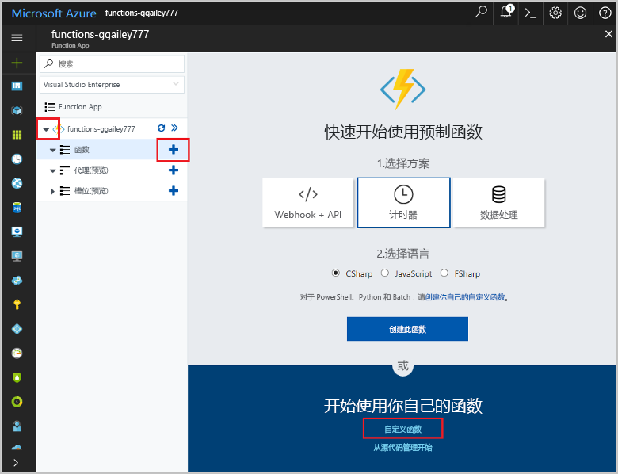

# <a name="create-an-openapi-definition-for-a-function"></a>为函数创建 OpenAPI 定义
通常使用 OpenAPI 定义（以前称为 [Swagger](http://swagger.io/) 文件）描述 REST API。 此定义中包含的信息涉及 API 中哪些操作可用，以及 API 的请求和响应数据应采用怎样的结构。

本教程将创建确定风力涡轮机上的紧急修复是否经济高效的函数。 然后为该函数应用创建一个 OpenAPI 定义，使该函数可使用其他应用和服务进行调用。

本教程介绍如何执行下列操作：

> [!div class="checklist"]
> * 在 Azure 中创建一个函数
> * 使用 OpenAPI 工具生成 OpenAPI 定义
> * 修改定义以提供额外的元数据
> * 通过调用函数测试定义

## <a name="create-a-function-app"></a>创建函数应用

必须使用函数应用托管函数的执行。 函数应用可将函数分组为逻辑单元，以便更轻松地管理、部署、缩放和共享资源。 

[!INCLUDE [Create function app Azure portal](../../includes/functions-create-function-app-portal.md)]

[!INCLUDE [functions-portal-favorite-function-apps](../../includes/functions-portal-favorite-function-apps.md)]


## <a name="create-the-function"></a>创建函数

本教程使用的 HTTP 触发函数采用两个参数：修复涡轮机的估计时间（小时）、涡轮机的容量（千瓦特）。 然后函数计算修复的费用和涡轮机 24 小时可以产生的收入。

1. 展开 Function App，选择“Functions”旁边的 + 按钮。 如果这是 Function App 中的第一个函数，请选择“自定义函数”。 此时将显示函数模板的完整集合。 

    

2. 在搜索字段中，键入 `http`，然后针对 HTTP 触发器模板选择“C#”。 
 
    

3. 为函数键入 `TurbineRepair` 作为名称，选择 `Function` 作为[身份验证级别](functions-bindings-http-webhook.md#http-auth)，然后选择“创建”。  

    

1. 将 run.csx 文件的内容替换为以下代码，然后单击“保存”：

    ```csharp
    using System.Net;

    const double revenuePerkW = 0.12; 
    const double technicianCost = 250; 
    const double turbineCost = 100;

    public static async Task<HttpResponseMessage> Run(HttpRequestMessage req, TraceWriter log)
    {   

        //Get request body
        dynamic data = await req.Content.ReadAsAsync<object>();
        int hours = data.hours;
        int capacity = data.capacity;

        //Formulas to calculate revenue and cost
        double revenueOpportunity = capacity * revenuePerkW * 24;  
        double costToFix = (hours * technicianCost) +  turbineCost;
        string repairTurbine;

        if (revenueOpportunity > costToFix){
            repairTurbine = "Yes";
        }
        else {
            repairTurbine = "No";
        }

        return req.CreateResponse(HttpStatusCode.OK, new{
            message = repairTurbine,
            revenueOpportunity = "$"+ revenueOpportunity,
            costToFix = "$"+ costToFix         
        }); 
    }
    ```
    此函数代码返回 `Yes` 或 `No` 的消息，指示紧急修复是否经济高效以及涡轮机产生的收入机会和修复涡轮机的费用。 

1. 若要测试该函数，请单击最右边的“测试”展开“测试”选项卡。在“请求正文”中输入以下值，然后单击“运行”。

    ```json
    {
    "hours": "6",
    "capacity": "2500"
    }
    ```

    

    响应正文中将返回以下值。

    ```json
    {"message":"Yes","revenueOpportunity":"$7200","costToFix":"$1600"}
    ```

现在已经有了确定紧急修复是否经济高效的函数。 接下来，请为该函数应用生成并修改 OpenAPI 定义。

## <a name="generate-the-openapi-definition"></a>生成 OpenAPI 定义

现在即可生成 OpenAPI 定义。 其他 Microsoft 技术（例如 API 应用、[PowerApps](functions-powerapps-scenario.md)、[Microsoft Flow](../azure-functions/app-service-export-api-to-powerapps-and-flow.md)）以及第三方开发者工具（例如 [Postman](https://www.getpostman.com/docs/importing_swagger) 和[其他更多包](http://swagger.io/tools/)）也可以使用此定义。

1. 请仅选择 API 支持的“谓词”（本示例中为 POST）。 这样可以生成更干净的 API 定义。

    1. 在新 HTTP 触发器函数的“集成”选项卡上，将“允许的 HTTP 方法”更改为“选定的方法”。

    1. 在“选定的 HTTP 方法”中，清除除“POST”外的所有选项，然后单击“保存”。

        
        
1. 单击函数应用名称（如“function-demo-energy”）>“平台功能” > API 定义”。

    

1. 在“API 定义”选项卡上，单击“函数”。

    

    此步骤为 Function App 启用一套 OpenAPI 选项，其中包括一个用于托管 Function App 域中的 OpenAPI 文件的终结点、一个 [OpenAPI 编辑器](http://editor.swagger.io)的内联副本和一个 API 定义模板生成器。

1. 单击“生成 API 定义模板” > “保存”。

    

    Azure 会在 Function App 中扫描 HTTP 触发器函数，并使用 functions.json 中的信息生成 OpenAPI 定义。 下面是生成的定义：

    ```yaml
    swagger: '2.0'
    info:
    title: function-demo-energy.azurewebsites.net
    version: 1.0.0
    host: function-demo-energy.azurewebsites.net
    basePath: /
    schemes:
    - https
    - http
    paths:
    /api/TurbineRepair:
        post:
        operationId: /api/TurbineRepair/post
        produces: []
        consumes: []
        parameters: []
        description: >-
            Replace with Operation Object
            #http://swagger.io/specification/#operationObject
        responses:
            '200':
            description: Success operation
        security:
            - apikeyQuery: []
    definitions: {}
    securityDefinitions:
    apikeyQuery:
        type: apiKey
        name: code
        in: query
    ```

    此定义描述为“模板”，因为它需要更多元数据才能组成完整的 OpenAPI 定义。 下一步会修改定义。

## <a name="modify-the-openapi-definition"></a>修改 OpenAPI 定义
生成模板定义后，接下来可以修改模板，以提供其他关于 API 操作和数据结构的元数据。 在“API 定义”中，删除从 `post` 到定义的底部生成的定义，粘贴以下内容，然后单击“保存”。

```yaml
    post:
      operationId: CalculateCosts
      description: Determines if a technician should be sent for repair
      summary: Calculates costs
      x-ms-summary: Calculates costs
      x-ms-visibility: important
      produces:
        - application/json
      consumes:
        - application/json
      parameters:
        - name: body
          in: body
          description: Hours and capacity used to calculate costs
          x-ms-summary: Hours and capacity
          x-ms-visibility: important
          required: true
          schema:
            type: object
            properties:
              hours:
                description: The amount of effort in hours required to conduct repair
                type: number
                x-ms-summary: Hours
                x-ms-visibility: important
              capacity:
                description: The max output of a turbine in kilowatts
                type: number
                x-ms-summary: Capacity
                x-ms-visibility: important
      responses:
        200:
          description: Message with cost and revenue numbers
          x-ms-summary: Message
          schema:
           type: object
           properties:
            message:
              type: string
              description: Returns Yes or No depending on calculations
              x-ms-summary: Message 
            revenueOpportunity:
              type: string
              description: The revenue opportunity cost
              x-ms-summary: RevenueOpportunity 
            costToFix:
              type: string
              description: The cost in $ to fix the turbine
              x-ms-summary: CostToFix
      security:
        - apikeyQuery: []
definitions: {}
securityDefinitions:
  apikeyQuery:
    type: apiKey
    name: code
    in: query
```

在此示例中，可以只粘贴已更新的元数据，但请务必了解对默认模板做出的修改类型：

+ 指定 API 生成并使用 JSON 格式的数据。

+ 指定所需的参数，包括其名称和数据类型。

+ 指定成功响应的返回值，包括其名称和数据类型。

+ 为 API 及其操作和参数提供友好的摘要和描述。 这对将要使用此函数的用户很重要。

+ 添加在 Microsoft Flow 和逻辑应用的 UI 中使用的 x-ms-summary 和 x-ms-visibility。 有关详细信息，请参阅 [Microsoft Flow 中适用于自定义 API 的 OpenAPI 扩展](https://preview.flow.microsoft.com/documentation/customapi-how-to-swagger/)。

> [!NOTE]
> 我们将安全性定义保留为默认身份验证方法，即 API 密钥。 如果使用不同的身份验证类型，可以更改此定义部分。

有关定义 API 操作的详细信息，请参阅 [Open API specification](https://swagger.io/specification/#operationObject)（Open API 规范）。

## <a name="test-the-openapi-definition"></a>测试 OpenAPI 定义
使用 API 定义前，最好先在 Azure Functions UI 中对其进行测试。

1. 在函数的“管理”选项卡上，在“主机密钥”下，复制“默认”密钥。

    

    > [!NOTE]
    >此密钥用于测试，还可以在使用应用或服务调用 API 时使用。

1. 返回到 API 定义：“function-demo-energy” > “平台功能” > “API 定义”。

1. 在右侧窗格中，单击“身份验证”，输入复制的 API 密钥，然后单击“验证”。

    

1. 向下滚动，单击“尝试此操作”。

    

1. 输入“小时”和“容量”的值。

    

    请注意，UI 使用了 API 定义中的描述。

1. 单击“发送请求”，然后单击“优质”选项卡查看输出。

    

## <a name="next-steps"></a>后续步骤

本教程介绍了如何：

> [!div class="checklist"]
> * 在 Azure 中创建一个函数
> * 使用 OpenAPI 工具生成 OpenAPI 定义
> * 修改定义以提供额外的元数据
> * 通过调用函数测试定义

转到下一主题，了解如何使用创建的 OpenAPI 定义创建 PowerApps 应用。
> [!div class="nextstepaction"]
> [从 PowerApps 调用函数](functions-powerapps-scenario.md)
