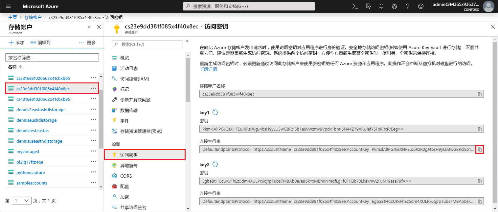

# <a name="work-with-azure-functions-core-tools"></a>使用 Azure Functions Core Tools

使用 Azure Functions Core Tools 可以在本地计算机上通过命令提示符或终端开发和测试函数。 本地函数可以连接到实时 Azure 服务，你可以在本地计算机上使用完整的 Functions 运行时调试函数。 甚至可以将函数应用部署到 Azure 订阅。

[!INCLUDE [Don't mix development environments](../../includes/functions-mixed-dev-environments.md)]

## <a name="core-tools-versions"></a>Core Tools 版本

Azure Functions Core Tools 有两个版本。 使用的版本取决于本地开发环境、[所选的语言](supported-languages.md)以及所需的支持级别：

+ [1.x 版](#v1)：支持 1.x 版运行时。 此 Tools 版本仅在 Windows 计算机上受支持，需从 [npm 包](https://docs.npmjs.com/getting-started/what-is-npm)安装。 借助此版本，可以使用不受官方支持的试验性语言创建函数。 有关详细信息，请参阅 [Azure Functions 中支持的语言](supported-languages.md)。

+ [2.x 版](#v2)：支持 [2.x 版运行时](functions-versions.md)。 此版本支持 [Windows](#windows-npm)、[macOS](#brew) 和 [Linux](#linux)。 使用特定于平台的包管理器或 npm 进行安装。

除非另有说明，否则本文中的示例适用于版本 2.x。

## <a name="install-the-azure-functions-core-tools"></a>安装 Azure Functions Core Tools

[Azure Functions Core Tools] 包含同一运行时的另一版本，该版本为本地开发计算机上可运行的 Azure Functions 运行时提供支持。 它还提供用于创建函数、连接到 Azure 和部署函数项目的命令。

### <a name="v2"></a>2.x 版

2.x 版工具使用构建在 .NET Core 之上的 Azure Functions 运行时 2.x。 .NET Core 2.x 支持的所有平台（包括 [Windows](#windows-npm)、[macOS](#brew) 和 [Linux](#linux)）都支持此版本。 必须先安装 .NET Core 2.x SDK。

#### <a name="windows-npm"></a>Windows

以下步骤使用 npm 在 Windows 上安装 Core Tools。 也可使用 [Chocolatey](https://chocolatey.org/)。 有关详细信息，请参阅 [Core Tools 自述文件](https://github.com/Azure/azure-functions-core-tools/blob/master/README.md#windows)。

1. 安装[用于 Windows 的 .NET Core 2.x SDK](https://www.microsoft.com/net/download/windows)。

2. 安装 [Node.js]，其中包括 npm。 对于 2.x 版工具，仅支持 Node.js 8.5 和更高版本。

3. 安装 Core Tools 包：

    ```bash
    npm install -g azure-functions-core-tools
    ```

#### <a name="brew"></a>带 Homebrew 的 MacOS

以下步骤使用 Homebrew 在 macOS 上安装 Core Tools。

1. 安装[用于 macOS 的 .NET Core 2.x SDK](https://www.microsoft.com/net/download/macos)。

2. 安装 [Homebrew](https://brew.sh/)（如果尚未安装）。

3. 安装 Core Tools 包：

    ```bash
    brew tap azure/functions
    brew install azure-functions-core-tools
    ```

#### <a name="linux"></a> 带 APT 的 Linux (Ubuntu/Debian)

以下步骤使用 [APT](https://wiki.debian.org/Apt) 在 Ubuntu/Debian Linux 发行版上安装 Core Tools。 有关其他 Linux 发行版，请参阅 [Core Tools 自述文件](https://github.com/Azure/azure-functions-core-tools/blob/master/README.md#linux)。

1. 安装[用于 Linux 的 .NET Core 2.x SDK](https://www.microsoft.com/net/download/linux)。

2. 将 Microsoft 产品密钥注册为受信任的密钥：

    ```bash
    curl https://packages.microsoft.com/keys/microsoft.asc | gpg --dearmor > microsoft.gpg
    sudo mv microsoft.gpg /etc/apt/trusted.gpg.d/microsoft.gpg
    ```

3. 验证你的 Ubuntu 服务器正在运行下表中的合适版本之一。 若要添加 apt 源，请运行：

    ```bash
    sudo sh -c 'echo "deb [arch=amd64] https://packages.microsoft.com/repos/microsoft-ubuntu-$(lsb_release -cs)-prod $(lsb_release -cs) main" > /etc/apt/sources.list.d/dotnetdev.list'
    sudo apt-get update
    ```

    | Linux 分发版 | 版本 |
    | --------------- | ----------- |
    | Ubuntu 18.04    | `bionic`    |
    | Ubuntu 17.10    | `artful`    |
    | Ubuntu 17.04    | `zesty`     |
    | Ubuntu 16.04/Linux Mint 18    | `xenial`  |

4. 安装 Core Tools 包：

    ```bash
    sudo apt-get install azure-functions-core-tools
    ```

## <a name="create-a-local-functions-project"></a>创建本地 Functions 项目

Functions 项目目录包含文件 [host.json](functions-host-json.md) 和 [local.settings.json](#local-settings-file) 以及若干个子文件夹，这些子文件夹包含各个函数的代码。 此目录相当于 Azure 中的一个函数应用。 若要详细了解 Functions 文件夹的结构，请参阅 [Azure Functions 开发人员指南](functions-reference.md#folder-structure)。

版本 2.x 要求在初始化项目时为项目选择默认语言，添加的所有函数使用默认语言模板。 在版本 1.x 中，每次创建函数时都要指定语言。

在终端窗口中或者在命令提示符下，运行以下命令创建项目和本地 Git 存储库：

```bash
func init MyFunctionProj
```

提供项目名称时，将创建并初始化具有该名称的新文件夹。 否则，初始化当前文件夹。  
在版本 2.x 中运行命令时，必须为项目选择一个运行时。 如果你打算开发 JavaScript 函数，请选择“节点”：

```output
Select a worker runtime:
dotnet
node
```

使用向上/向下箭头键选择语言，然后按 Enter。 JavaScript 项目的输出如以下示例所示：

```output
Select a worker runtime: node
Writing .gitignore
Writing host.json
Writing local.settings.json
Writing C:\myfunctions\myMyFunctionProj\.vscode\extensions.json
Initialized empty Git repository in C:/myfunctions/myMyFunctionProj/.git/
```

`func init` 支持以下选项，除非另有说明，否则这些选项仅限版本 2.x：

| 选项     | 说明                            |
| ------------ | -------------------------------------- |
| **`--csx`** | 初始化 C# 脚本 (.csx) 项目。 必须在后续命令中指定 `--csx`。 |
| **`--docker`** | 使用基于所选 `--worker-runtime` 的基础映像创建容器的 Dockerfile。 如果你打算发布到自定义 Linux 容器，请使用此选项。 |
| **`--force`** | 即使项目中存在现有的文件，也要初始化该项目。 此设置会覆盖同名的现有文件。 项目文件夹中的其他文件不受影响。 |
| **`--no-source-control -n`** | 阻止版本 1.x 中默认创建 Git 存储库的行为。 在版本 2.x 中，默认不会创建 git 存储库。 |
| **`--source-control`** | 控制是否创建 git 存储库。 默认不会创建存储库。 如果为 `true`，则会创建存储库。 |
| **`--worker-runtime`** | 设置项目的语言运行时。 支持的值为 `dotnet`、`node` (JavaScript)、`java` 和 `python`。 如果未设置，则初始化期间系统会提示你选择运行时。 |

> [!IMPORTANT]
> 默认情况下，Core Tools 版本 2.x 会为 .NET 运行时创建函数应用项目作为 [C# 类项目](functions-dotnet-class-library.md) (.csproj)。 这些 C# 项目可以与 Visual Studio 或 Visual Studio Code 结合使用，在测试期间以及发布到 Azure 时进行编译。 如果希望创建并使用在版本 1.x 和门户中创建的相同 C# 脚本 (.csx) 文件，则在创建和部署函数时必须包含 `--csx` 参数。

## <a name="register-extensions"></a>注册扩展

在版本 2.x 的 Azure Functions 运行时中，必须显式注册在函数应用中使用的绑定扩展（绑定类型）。

[!INCLUDE [Register extensions](../../includes/functions-core-tools-install-extension.md)]

有关详细信息，请参阅 [Azure Functions 触发器和绑定概念](functions-triggers-bindings.md#register-binding-extensions)。

## <a name="local-settings-file"></a>本地设置文件

文件 local.settings.json 存储 Azure Functions Core Tools 的应用设置、连接字符串和设置。 只有在本地运行时，Functions工具才使用 local.settings.json 文件中的设置。 默认情况下，将项目发布到 Azure 时，这些设置不会自动迁移。 [发布时](#publish)使用 `--publish-local-settings` 开关确保已将这些设置添加到 Azure 中的函数应用。 请注意，**ConnectionStrings** 中的值永远不会发布。 该文件的结构如下：

```json
{
  "IsEncrypted": false,
  "Values": {
    "FUNCTIONS_WORKER_RUNTIME": "<language worker>",
    "AzureWebJobsStorage": "<connection-string>",
    "AzureWebJobsDashboard": "<connection-string>",
    "MyBindingConnection": "<binding-connection-string>"
  },
  "Host": {
    "LocalHttpPort": 7071,
    "CORS": "*"
  },
  "ConnectionStrings": {
    "SQLConnectionString": "<sqlclient-connection-string>"
  }
}
```

| 设置      | 说明                            |
| ------------ | -------------------------------------- |
| IsEncrypted | 设置为“true”时，使用本地计算机密钥加密所有值。 与 `func settings` 命令配合使用。 默认值为“false”。 |
| **值** | 在本地运行时使用的应用程序设置和连接字符串的集合。 这些值对应于 Azure 中你的函数应用中的应用设置，例如 **AzureWebJobsStorage** 和 **AzureWebJobsDashboard**。 许多触发器和绑定都有一个引用连接字符串应用设置的属性，例如 [Blob 存储触发器](functions-bindings-storage-blob.md#trigger---configuration)的 **Connection**。 对于此类属性，你需要一个在 **Values** 数组中定义的应用程序设置。 <br/>对于 HTTP 之外的触发器，**AzureWebJobsStorage** 是一个必需的应用设置。 当在本地安装了 [Azure 存储仿真器](../storage/common/storage-use-emulator.md)时，可以将 **AzureWebJobsStorage** 设置 `UseDevelopmentStorage=true`，核心工具使用此仿真器。 这在开发期间非常有用，但是在部署之前，应当使用实际的存储连接进行测试。 |
| **主机** | 在本地运行时，本部分中的设置会自定义 Functions 主机进程。 |
| LocalHttpPort | 设置运行本地 Functions 主机时使用的默认端口（`func host start` 和 `func run`）。 `--port` 命令行选项优先于此值。 |
| **CORS** | 定义[跨域资源共享 (CORS)](https://en.wikipedia.org/wiki/Cross-origin_resource_sharing)可以使用的来源。 以逗号分隔的列表提供来源，其中不含空格。 支持通配符值 (\*)，它允许使用任何来源的请求。 |
| ConnectionStrings | 不要将此集合用于函数绑定使用的连接字符串。 此集合仅供通常从配置文件的 **ConnectionStrings** 节获取连接字符串的框架使用，例如[实体框架](https://msdn.microsoft.com/library/aa937723(v=vs.113).aspx)。 此对象中的连接字符串添加到提供者类型为 [System.Data.SqlClient](https://msdn.microsoft.com/library/system.data.sqlclient(v=vs.110).aspx) 的环境中。 此集合中的项不使用其他应用设置发布到 Azure 中。 必须将这些值显式添加到函数应用设置的**连接字符串**集合中。 如果要在函数代码中创建 [SqlConnection](https://msdn.microsoft.com/library/system.data.sqlclient.sqlconnection(v=vs.110).aspx)，则应将连接字符串值与其他连接一起存储在应用程序设置中。 |

还可以在代码中将函数应用设置值读取为环境变量。 有关详细信息，请参阅以下特定于语言的参考主题的“环境变量”部分：

+ [预编译 C#](functions-dotnet-class-library.md#environment-variables)
+ [C# 脚本 (.csx)](functions-reference-csharp.md#environment-variables)
+ [F # 脚本 (.fsx)](functions-reference-fsharp.md#environment-variables)
+ [Java](functions-reference-java.md#environment-variables)
+ [JavaScript](functions-reference-node.md#environment-variables)

如果没有为 **AzureWebJobsStorage** 设置有效的存储连接字符串并且没有使用仿真器，则会显示以下错误消息：

> local.settings.json 中的 AzureWebJobsStorage 缺少值。 该值对除 HTTP 以外的所有触发器都是必需的。 可运行“func azure functionapp fetch-app-settings \<functionAppName\>”或在 local.settings.json 中指定连接字符串。

### <a name="get-your-storage-connection-strings"></a>获取存储连接字符串

即使在使用存储仿真器进行开发时，你也可能希望使用实际的存储连接进行测试。 假设已[创建了存储帐户](../storage/common/storage-create-storage-account.md)，则可以通过下列方式之一获取有效的存储连接字符串：

+ 通过 [Azure 门户]。 导航到你的存储帐户，在“设置”中选择“访问密钥”，然后复制其中一个**连接字符串**值。

  

+ 使用 [Azure 存储资源管理器](https://storageexplorer.com/)连接到你的 Azure 帐户。 在“资源管理器”中，展开你的订阅，选择你的存储帐户，然后复制主或辅助连接字符串。

  

+ 使用核心工具通过下列命令之一从 Azure 下载连接字符串：

    + 从现有函数应用下载所有设置：

    ```bash
    func azure functionapp fetch-app-settings <FunctionAppName>
    ```
    + 获取特定存储帐户的连接字符串。

    ```bash
    func azure storage fetch-connection-string <StorageAccountName>
    ```

    如果你尚未登录到 Azure，系统会要求登录。

## <a name="create-func"></a>创建函数

若要创建函数，请运行以下命令：

```bash
func new
```

在版本 2.x 中运行 `func new` 时，系统会提示你选择采用函数应用默认语言的模板，另外还会提示你选择函数的名称。 在版本 1.x 中，系统还会提示你选择语言。

```output
Select a language: Select a template:
Blob trigger
Cosmos DB trigger
Event Grid trigger
HTTP trigger
Queue trigger
SendGrid
Service Bus Queue trigger
Service Bus Topic trigger
Timer trigger
```

函数代码在具有所提供的函数名称的子文件夹中生成，如以下队列触发器输出中所示：

```output
Select a language: Select a template: Queue trigger
Function name: [QueueTriggerJS] MyQueueTrigger
Writing C:\myfunctions\myMyFunctionProj\MyQueueTrigger\index.js
Writing C:\myfunctions\myMyFunctionProj\MyQueueTrigger\readme.md
Writing C:\myfunctions\myMyFunctionProj\MyQueueTrigger\sample.dat
Writing C:\myfunctions\myMyFunctionProj\MyQueueTrigger\function.json
```

也可以在命令中使用以下参数指定这些选项：

| 参数     | 说明                            |
| ------------------------------------------ | -------------------------------------- |
| **`--csx`** | （版本 2.x）生成版本 1.x 和门户所用的相同 C# 脚本 (.csx) 模板。 |
| **`--language -l`**| C#、F# 或 JavaScript 等模板编程语言。 此选项在版本 1.x 中是必需的。 在版本 2.x 中，请不要使用此选项，或选择与辅助角色运行时匹配的语言。 |
| **`--name -n`** | 函数名称。 |
| **`--template -t`** | 使用 `func templates list` 命令查看每种受支持语言的可用模板的完整列表。   |

例如，若要在单个命令中创建 JavaScript HTTP 触发器，请运行：

```bash
func new --template "Http Trigger" --name MyHttpTrigger
```

若要在单个命令中创建队列触发的函数，请运行：

```bash
func new --template "Queue Trigger" --name QueueTriggerJS
```

## <a name="start"></a>在本地运行函数

若要运行 Functions 项目，请运行 Functions 主机。 主机为项目中的所有函数启用触发器：

```bash
func host start
```

仅在版本 1.x 中需要 `host` 命令。

`func host start` 支持以下选项：

| 选项     | 说明                            |
| ------------ | -------------------------------------- |
| **`--no-build`** | 在运行之前请勿生成当前项目。 仅限于 dotnet 项目。 默认设置为 false。 仅限版本 2.x。 |
| **`--cert`** | 包含私钥的 .pfx 文件的路径。 仅与 `--useHttps` 结合使用。 仅限版本 2.x。 |
| **`--cors-credentials`** | 允许跨域经身份验证的请求（例如 cookies 和身份验证标头），仅限版本 2.x。 |
| **`--cors`** | 以逗号分隔的 CORS 来源列表，其中不包含空格。 |
| **`--language-worker`** | 用于配置语言辅助角色的参数。 仅限版本 2.x。 |
| **`--nodeDebugPort -n`** | 节点调试程序要使用的端口。 默认值：launch.json 中的值或 5858。 仅限版本 1.x。 |
| **`--password`** | 密码或包含 .pfx 文件密码的文件。 仅与 `--cert` 结合使用。 仅限版本 2.x。 |
| **`--port -p`** | 要侦听的本地端口。 默认值：7071。 |
| **`--pause-on-error`** | 退出进程前，暂停增加其他输入。 仅当从集成开发环境 (IDE) 启动 Core Tools 时才使用。|
| **`--script-root --prefix`** | 用于指定要运行或部署的函数应用的根目录路径。 此选项用于可在子文件夹中生成项目文件的已编译项目。 例如，生成 C# 类库项目时，将在某个根子文件夹中生成 host.json、local.settings.json 和 function.json 文件，其路径类似于 `MyProject/bin/Debug/netstandard2.0`。 在这种情况下，请将前缀设置为 `--script-root MyProject/bin/Debug/netstandard2.0`。 这是在 Azure 中运行的函数应用的根目录。 |
| **`--timeout -t`** | Functions 主机启动的超时时间（以秒为单位）。 默认值：20 秒。|
| **`--useHttps`** | 绑定到 `https://localhost:{port}` ，而不是绑定到 `http://localhost:{port}` 。 默认情况下，此选项会在计算机上创建可信证书。|

对于 C# 类库项目 (.csproj)，必须包含 `--build` 选项才能生成库 .dll。

Functions 主机启动时，会输出 HTTP 触发的函数的 URL：

```output
Found the following functions:
Host.Functions.MyHttpTrigger

Job host started
Http Function MyHttpTrigger: http://localhost:7071/api/MyHttpTrigger
```

>[!IMPORTANT]
>在本地运行时，不会对 HTTP 终结点强制执行身份验证。 这意味着所有本地 HTTP 请求都将作为 `authLevel = "anonymous"` 处理。 有关详细信息，请参阅 [HTTP 绑定](functions-bindings-http-webhook.md#authorization-keys)一文。

### <a name="passing-test-data-to-a-function"></a>将测试数据传递给函数

若要在本地测试函数，请[启动 Functions 主机](#start)，并在本地服务器上使用 HTTP 请求调用终结点。 你调用的终结点要取决于函数的类型。

>[!NOTE]
> 本主题中的示例使用 cURL 工具从终端或命令提示符发送 HTTP 请求。 你可以使用所选的工具将 HTTP 请求发送到本地服务器。 默认情况下，在基于 Linux 的系统上提供 cURL 工具。 在 Windows 上，必须先下载并安装 [cURL 工具](https://curl.haxx.se/)。

有关测试函数的更多常规信息，请参阅[在 Azure Functions 中测试代码的策略](functions-test-a-function.md)。

#### <a name="http-and-webhook-triggered-functions"></a>HTTP 和 webhook 触发的函数

调用以下终结点，以在本地运行 HTTP 和 webhook 触发的函数：

    http://localhost:{port}/api/{function_name}

请确保使用相同的服务器名称和 Functions 主机正在侦听的端口。 在启动 Function 主机时所生成的输出中可以看到该信息。 可以使用触发器所支持的任何 HTTP 方法来调用此 URL。

以下 cURL 命令使用查询字符串中传递的 name 参数从 GET 请求触发 `MyHttpTrigger` quickstart 函数。

```bash
curl --get http://localhost:7071/api/MyHttpTrigger?name=Azure%20Rocks
```

下面的示例是在请求主体中传递 name 的 POST 请求中调用的相同函数：

```bash
curl --request POST http://localhost:7071/api/MyHttpTrigger --data '{"name":"Azure Rocks"}'
```

可以从在查询字符串中传递数据的浏览器发出 GET 请求。 对于所有其他 HTTP 方法，必须使用 cURL、Fiddler、Postman 或类似的 HTTP 测试工具。

#### <a name="non-http-triggered-functions"></a>非 HTTP 触发的函数

对于 HTTP 触发器和 webhook 以外的所有类型函数，你可以通过调用管理终结点在本地测试函数。 在本地服务器上通过 HTTP POST 请求调用此终结点会触发该函数。 可以选择通过 POST 请求正文将测试数据传递给执行。 此功能类似于 Azure 门户中的“测试”选项卡。

可以调用以下管理员终结点以触发非 HTTP 函数：

    http://localhost:{port}/admin/functions/{function_name}

若要将测试数据传递给函数的管理员终结点，必须在 POST 请求消息的正文中提供数据。 消息正文需要具有以下 JSON 格式：

```JSON
{
    "input": "<trigger_input>"
}
```

`<trigger_input>` 值包含函数所需格式的数据。 下面的 cURL 示例是指向 `QueueTriggerJS` 函数的 POST。 在这种情况下，输入是一个字符串，等同于期望在队列中找到的消息。

```bash
curl --request POST -H "Content-Type:application/json" --data '{"input":"sample queue data"}' http://localhost:7071/admin/functions/QueueTriggerJS
```

#### <a name="using-the-func-run-command-in-version-1x"></a>在版本 1.x 中使用 `func run` 命令

>[!IMPORTANT]
> 该工具的 2.x 版本不支持 `func run` 命令。 有关详细信息，请参阅主题[如何指向 Azure Functions 运行时版本](set-runtime-version.md)。

也可以使用 `func run <FunctionName>` 直接调用函数并为函数提供输入数据。 此命令类似于在 Azure 门户中使用“测试”选项卡运行函数。

`func run` 支持以下选项：

| 选项     | 说明                            |
| ------------ | -------------------------------------- |
| **`--content -c`** | 内联内容。 |
| **`--debug -d`** | 运行函数前，将调试程序附加到主机进程。|
| **`--timeout -t`** | 本地 Functions 主机准备就绪前的等待时间（以秒为单位）。|
| **`--file -f`** | 要用作内容的文件名。|
| **`--no-interactive`** | 不提示输入。 适用于自动化方案。|

例如，若要调用 HTTP 触发的函数并传递内容正文，请运行以下命令：

```bash
func run MyHttpTrigger -c '{\"name\": \"Azure\"}'
```

### <a name="viewing-log-files-locally"></a>在本地查看日志文件

[!INCLUDE [functions-local-logs-location](../../includes/functions-local-logs-location.md)]

## <a name="publish"></a>发布到 Azure

Core Tools 支持两种类型的部署：将函数项目文件直接部署到函数应用，以及部署自定义 Linux 容器（仅在版本 2.x 中受支持）。 必须事先[在 Azure 订阅中创建函数应用](functions-cli-samples.md#create)。

在版本 2.x 中，发布之前必须在项目中[注册扩展](#register-extensions)。 应该生成需要编译的项目，以便可以部署二进制文件。

### <a name="project-file-deployment"></a>项目文件部署

最常见的部署方法涉及使用 Core Tools 打包函数应用项目、二进制文件和依赖项并将该包部署到函数应用。 可以选择[直接从部署包运行函数](run-functions-from-deployment-package.md)。

若要将 Functions 项目发布到 Azure 中的函数应用，使用 `publish` 命令：

```bash
func azure functionapp publish <FunctionAppName>
```

此命令发布到 Azure 中的现有函数应用。 如果订阅中不存在 `<FunctionAppName>`，会发生错误。 若要了解如何使用 Azure CLI 从命令提示符或终端窗口创建函数应用，请参阅[为无服务器执行创建函数应用](./scripts/functions-cli-create-serverless.md)。

`publish` 命令上传 Functions 项目目录的内容。 如果在本地删除文件，`publish` 命令不会将文件从 Azure 中删除。 可以使用 [Azure 门户]中的 [Kudu 工具](functions-how-to-use-azure-function-app-settings.md#kudu)删除 Azure 中的文件。

>[!IMPORTANT]
> 在 Azure 门户中创建函数应用时，该应用默认使用 2.x 版函数运行时。 要让函数应用使用 1.x 版运行时，请遵照[在版本 1.x 上运行](functions-versions.md#creating-1x-apps)中的说明。
> 无法为包含现有函数的函数应用更改运行时版本。

以下项目发布选项同时适用于 1.x 和 2.x 版本：

| 选项     | 说明                            |
| ------------ | -------------------------------------- |
| **`--publish-local-settings -i`** |  将 local.settings.json 中的设置发布到 Azure，如果该设置已存在，则提示进行覆盖。 如果在使用存储仿真器，则将应用设置更改为[实际的存储连接](#get-your-storage-connection-strings)。 |
| **`--overwrite-settings -y`** | 使用 `--publish-local-settings -i` 时隐藏覆盖应用设置的提示。|

以下项目发布选项仅在版本 2.x 中受支持：

| 选项     | 说明                            |
| ------------ | -------------------------------------- |
| **`--publish-settings-only -o`** |  仅发布设置，并跳过内容。 默认为提示。 |
|**`--list-ignored-files`** | 基于 .funcignore 文件显示发布期间忽略的文件列表。 |
| **`--list-included-files`** | 基于 .funcignore 文件显示发布的文件列表。 |
| **`--nozip`** | 关闭默认的 `Run-From-Zip` 模式。 |
| **`--build-native-deps`** | 发布 python 函数应用时跳过生成 .wheels 文件夹。 |
| **`--additional-packages`** | 构建本机依赖项时要安装的包列表。 例如：`python3-dev libevent-dev`。 |
| **`--force`** | 在某些情况下会忽略预发布验证。 |
| **`--csx`** | 发布 C# 脚本 (.csx) 项目。 |
| **`--no-build`** | 跳过 dotnet 函数的生成。 |
| **`--dotnet-cli-params`** | 发布编译的 C# (.csproj) 函数时，Core Tools 将调用“dotnet build --output bin/publish”。 传递到此选项的任何参数将追加到命令行。 |

### <a name="custom-container-deployment"></a>自定义容器部署

Functions 允许在自定义 Linux 容器中部署函数项目。 有关详细信息，请参阅[使用自定义映像在 Linux 上创建函数](functions-create-function-linux-custom-image.md)。 Core Tools 版本 2.x 支持部署自定义容器。 自定义容器必须有一个 Dockerfile。 在 `func init` 中使用 --dockerfile 选项。

```bash
func deploy
```

可使用以下自定义容器部署选项：

| 选项     | 说明                            |
| ------------ | -------------------------------------- |
| **`--registry`** | 当前用户登录到的 Docker 注册表的名称。 |
| **`--platform`** | 函数应用的托管平台。 有效选项为 `kubernetes` |
| **`--name`** | 函数应用名称。 |
| **`--max`**  | （可选）设置要部署到的最大函数应用实例数。 |
| **`--min`**  | （可选）设置要部署到的最小函数应用实例数。 |
| **`--config`** | 设置可选的部署配置文件。 |

## <a name="next-steps"></a>后续步骤

Azure Functions Core Tools 是[开源工具且托管在 GitHub 上](https://github.com/azure/azure-functions-cli)。  
若要提交 bug 或功能请求，[请打开 GitHub 问题](https://github.com/azure/azure-functions-cli/issues)。

<!-- LINKS -->

[Azure Functions Core Tools]: https://www.npmjs.com/package/azure-functions-core-tools
[Azure 门户]: https://portal.azure.com 
[Node.js]: https://docs.npmjs.com/getting-started/installing-node#osx-or-windows
