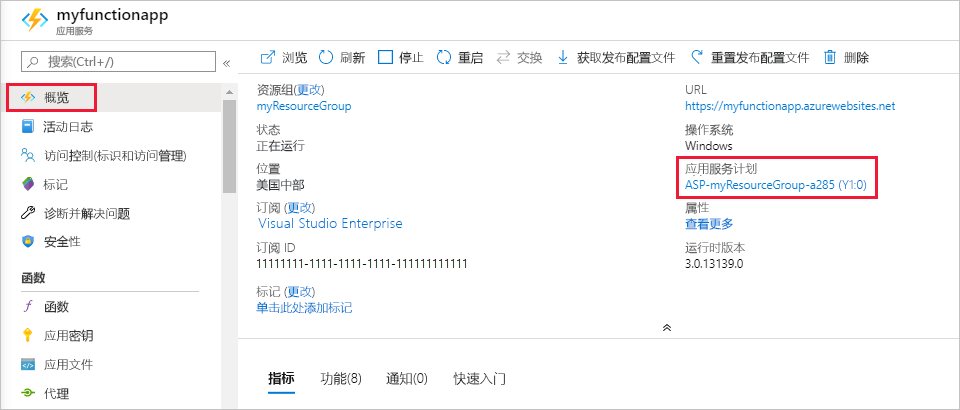

# <a name="azure-functions-scale-and-hosting"></a>Azure Functions 的缩放和托管

在 Azure 中创建函数应用时，必须为应用选择托管计划。 有三个可用于 Azure Functions 的托管计划：[消耗计划](#consumption-plan)、[高级计划](#premium-plan)和[专用（应用服务）计划](#app-service-plan)。

选择的托管计划将决定以下行为：

* 函数应用的缩放方式。
* 每个函数应用实例可用的资源。
* 支持高级功能，例如 Azure 虚拟网络连接。

当代码运行时，消耗和高级计划会自动添加计算能力。 当需要处理负载并在代码停止运行时进行缩放时，应用会进行扩展。 对于消耗计划，还不必提前为空闲 Vm 付费或预留容量。  

高级计划提供了额外的功能，如高级计算实例、使实例始终处于热热和 VNet 连接的能力。

应用服务计划可让你充分利用管理的专用基础结构。 函数应用不会基于事件进行缩放，这意味着从不会缩放到零。 （要求启用[Always on](#always-on) 。）

## <a name="hosting-plan-support"></a>托管计划支持

功能支持分为以下两个类别：

* _公开发布（GA）_ ：完全支持并批准生产使用。
* _预览版_：尚未完全受支持，也不会获得生产用途的批准。

下表显示了在 Windows 或 Linux 上运行时，对三个托管计划的当前支持级别：

| | 消耗计划 | 高级计划 | 专用计划 |
|-|:----------------:|:------------:|:----------------:|
| Windows | GA | GA | GA |
| Linux | GA | GA | GA |

## <a name="consumption-plan"></a>消耗计划

使用消耗计划时，会根据传入事件的数量动态添加和删除 Azure Functions 主机的实例。 这个无服务器计划会自动缩放，仅在函数运行时，才会产生计算资源费用。 在消耗计划中，函数执行在可配置的时间段后超时。

账单将基于执行数量、执行时间和所用内存。 账单是基于函数应用内的所有函数聚合而生成的。 有关详细信息，请参阅 [Azure Functions 定价页](https://azure.microsoft.com/pricing/details/functions/)。

消耗计划是默认的托管计划，它提供了以下优势：

* 仅当函数正在运行时才产生费用
* 可自动扩展，即使是在负载较高期间

同一区域中的函数应用可以分配到相同的消耗计划。 在相同的消耗计划中运行多个应用不会产生负面影响。 将多个应用分配到相同的消耗计划不会影响每个应用的复原能力、可伸缩性或可靠性。

若要详细了解在消耗计划中运行时如何估算成本，请参阅[了解消耗计划成本](functions-consumption-costs.md)。

## <a name="premium-plan"></a>高级计划

使用高级计划时，会根据传入事件的数目，添加和删除 Azure Functions 主机的实例，就像消耗计划一样。  高级计划支持以下功能：

* 永久温实例，以避免任何冷启动
* VNet 连接
* 无限制的执行持续时间
* 高级实例大小（一个核心、两个核心和四个核心实例）
* 更可预测的定价
* 针对具有多个 function app 的计划的高密度应用分配

有关如何配置这些选项的信息，请参阅[Azure Functions 高级计划文档](functions-premium-plan.md)。

高级计划的计费不是每次执行和内存计费，而是基于所需和预准备好实例使用的核心秒数和内存。 每个计划至少必须有一个实例处于热状态。 这意味着，每个活动计划的每月最低开销，而不考虑执行次数。 请记住，高级计划中的所有 function app 共享准备好和活动实例。

在以下情况下，请考虑 Azure Functions 高级计划：

* 函数应用持续或几乎持续运行。
* 您的小型执行数量很大，并且在消耗计划中的执行费用较高，但费用较低。
* 你需要比消耗计划提供的更多的 CPU 或内存选项。
* 你的代码所需的运行时间超过消耗计划[允许的最长执行时间](#timeout)。
* 你需要只能在高级计划（如虚拟网络连接）上使用的功能。

对高级计划运行 JavaScript 函数时，应选择具有较少个 vcpu 的实例。 有关详细信息，请参阅[选择单核高级计划](functions-reference-node.md#considerations-for-javascript-functions)。  

## <a name="app-service-plan"></a>专用（应用服务）计划

函数应用也可以与其他应用服务应用（基本、标准、高级和隔离 Sku）在同一专用 Vm 上运行。

在下列情况下，请考虑使用应用服务计划：

* 具有已运行其他应用服务实例的、未充分利用的现成 VM。
* 需要提供用于运行函数的自定义映像。

对于应用服务计划中的函数应用，你可以像对其他应用服务资源（例如 web 应用）一样付费。 如需详细了解如何使用应用服务计划，请参阅 [Azure 应用服务计划深入概述](../app-service/overview-hosting-plans.md)。

使用应用服务计划，可以通过添加更多 VM 实例来手动扩大。 你还可以启用自动缩放。 有关详细信息，请参阅[手动或自动缩放实例计数](../azure-monitor/platform/autoscale-get-started.md?toc=%2fazure%2fapp-service%2ftoc.json)。 还可以通过选择不同的应用服务计划来进行增加。 有关详细信息，请参阅[增加 Azure 中的应用](../app-service/manage-scale-up.md)。 

在应用服务计划上运行 JavaScript 函数时，应选择具有较少 vCPU 的计划。 有关详细信息，请参阅[选择单核应用服务计划](functions-reference-node.md#choose-single-vcpu-app-service-plans)。 
<!-- Note: the portal links to this section via fwlink https://go.microsoft.com/fwlink/?linkid=830855 --> 

### <a name="always-on"></a>Always On

如果在应用服务计划上运行，应启用 AlwaysOn 设置，使函数应用能正常运行。 在应用服务计划中，如果函数运行时处于不活动状态，几分钟后就会进入空闲状态，因此只有 HTTP 触发器才能“唤醒”函数。 只能对应用服务计划使用始终可用。 在消耗计划中，平台会自动激活函数应用。

[!INCLUDE [Timeout Duration section](../../includes/functions-timeout-duration.md)]


即使启用了 AlwaysOn，各函数的执行超时也由 [host.json](functions-host-json.md#functiontimeout) 项目文件中的 `functionTimeout` 设置控制。

## <a name="determine-the-hosting-plan-of-an-existing-application"></a>确定现有应用程序的托管计划

要确定你的函数应用所使用的托管计划，请在 [Azure 门户](https://portal.azure.com)中参阅函数应用的“概览”选项卡中的“应用服务计划/定价层”。 对于应用服务计划，还指明了定价层。



还可以使用 Azure CLI 来确定计划，如下所示：

```azurecli-interactive
appServicePlanId=$(az functionapp show --name <my_function_app_name> --resource-group <my_resource_group> --query appServicePlanId --output tsv)
az appservice plan list --query "[?id=='$appServicePlanId'].sku.tier" --output tsv
```  

此命令的输出为 `dynamic` 时，函数应用采用消耗计划。 如果 `ElasticPremium`此命令的输出，则函数应用位于高级计划中。 所有其他值表示应用服务计划的不同层。

## <a name="storage-account-requirements"></a>存储帐户要求

在任何计划中，函数应用都需要一个支持 Azure Blob、队列、文件和表存储的常规 Azure 存储帐户。 这是因为 Functions 依赖 Azure 存储来执行管理触发器和记录函数执行等操作，但某些存储帐户不支持队列和表。 这些帐户包括仅限 blob 的存储帐户（包括高级存储）和使用区域冗余存储空间复制的常规用途存储帐户，已在创建函数应用时将从现有的“存储帐户”选项中过滤掉。

用于存储应用程序数据的函数应用使用的相同存储帐户也可由触发器和绑定使用。 但是，对于存储密集型操作，应使用单独的存储帐户。  

有可能多个函数应用共享相同的存储帐户，而不会出现任何问题。 （这是一种很好的例子，即，当你使用 Azure 存储模拟器在本地环境中开发多个应用时，它的作用类似于一个存储帐户。） 

<!-- JH: Does using a Premium Storage account improve perf? -->

若要了解有关存储帐户类型的详细信息，请参阅 [Azure 存储服务简介](../storage/common/storage-introduction.md#azure-storage-services)。

## <a name="how-the-consumption-and-premium-plans-work"></a>消耗量和高级计划的工作原理

在消耗和高级计划中，Azure Functions 基础结构通过基于其函数触发的事件数来添加其他函数主机实例，从而缩放 CPU 和内存资源。 消耗计划中托管的每个函数实例限制为 1.5 GB 的内存和一个 CPU。  宿主的实例是整个函数应用，这意味着函数应用内的所有函数共享实例中的资源并同时缩放。 共享同一消耗计划的函数应用单独缩放。  在高级计划中，计划大小将确定该实例上该计划中的所有应用程序的可用内存和 CPU。  

函数代码文件存储在函数的主存储帐户的 Azure 文件共享上。 删除函数应用的主存储帐户时，函数代码文件将被删除并且无法恢复。

### <a name="runtime-scaling"></a>运行时缩放

Azure Functions 使用名为“缩放控制器”的组件来监视事件率以及确定是要扩大或缩小。 缩放控制器针对每种触发器类型使用试探法。 例如，使用 Azure 队列存储触发器时，它会根据队列长度和最旧队列消息的期限进行缩放。

Azure Functions 的小数位数是 function app。 横向扩展函数应用时，将分配额外的资源来运行 Azure Functions 主机的多个实例。 相反，计算需求下降时，扩展控制器将删除函数主机实例。 当函数应用内没有运行任何函数时，实例的数量最终将*放大*为零。


### <a name="understanding-scaling-behaviors"></a>了解缩放行为

缩放可根据多种因素而异，可根据选定的触发器和语言以不同的方式缩放。 需要注意以下几个复杂的缩放行为：

* 单函数应用仅可扩大到最多200个实例。 不过，单个实例每次可以处理多个消息或请求，因此，对并发执行数没有规定的限制。
* 对于 HTTP 触发器，将每隔1秒至少分配一次新实例。
* 对于非 HTTP 触发器，每隔30秒一次最多只能分配一个新实例。

不同触发器还可能有不同的缩放限制，如下所述：

* [事件中心](functions-bindings-event-hubs-trigger.md#scaling)

### <a name="best-practices-and-patterns-for-scalable-apps"></a>可缩放应用的最佳做法和模式

函数应用的许多方面会影响其缩放，包括主机配置、运行时占用空间和资源效率。  有关详细信息，请查看[性能注意事项一文的“可扩展”部分](functions-best-practices.md#scalability-best-practices)。 还要注意随着函数应用的扩展，连接是如何实施的。 有关详细信息，请参阅[如何在 Azure Functions 中管理连接](manage-connections.md)。

有关 Python 和 node.js 中的缩放的其他信息，请参阅[Azure Functions Python 开发人员指南-缩放和并发性](functions-reference-python.md#scaling-and-concurrency)和[Azure Functions node.js 开发人员指南-缩放和并发](functions-reference-node.md#scaling-and-concurrency)。

### <a name="billing-model"></a>计费模式

[Azure Functions 定价页](https://azure.microsoft.com/pricing/details/functions/)上详细介绍了不同计划的计费。 使用量在 Function App 级别聚合，只会统计函数代码的执行时间。 以下是计费单位：

* 以千兆字节/秒 (GB-s) 计量的资源消耗量。 根据内存大小和函数应用中所有函数的执行时间组合计算得出。 
* **执行**。 每次为响应事件触发而执行函数时记为一次。

有关如何了解消耗帐单的有用查询和信息，请参阅[帐单常见问题解答](https://github.com/Azure/Azure-Functions/wiki/Consumption-Plan-Cost-Billing-FAQ)。

[Azure Functions pricing page]: https://azure.microsoft.com/pricing/details/functions

## <a name="service-limits"></a>服务限制

下表指示在各种宿主计划中运行时应用于 function app 的限制：

[!INCLUDE [functions-limits](../../includes/functions-limits.md)]
