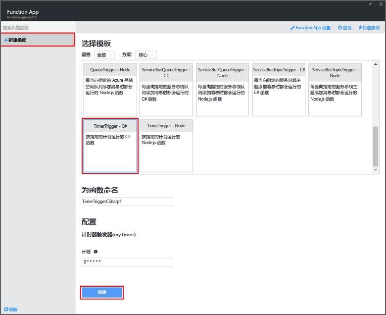

# <a name="use-azure-functions-to-perform-a-scheduled-clean-up-task"></a>使用 Azure Functions 来执行计划的清理任务
本主题演示如何使用 Azure Functions 来创建新的 C# 函数（在基于事件的计时器上运行），以便清理数据库表中的行。 新函数基于 Azure Functions 门户中的预定义模板创建。 若要支持这种情况，还必须设置数据库连接字符串，使其成为 Function App 中的应用程序服务设置。 

## <a name="prerequisites"></a>先决条件
必须先具有一个有效的 Azure 帐户，然后才能创建函数。 如果还没有 Azure 帐户， [可以使用免费帐户](https://azure.microsoft.com/free/)。

本主题演示的 TRANSACT-SQL 命令，它在 SQL 数据库的 *TodoItems* 表中执行大容量清理操作。 完成 [Azure App Service 移动应用快速入门教程](../app-service-mobile/app-service-mobile-ios-get-started.md)后，会创建相同的 TodoItems 表。 也可以使用示例数据库。如果选择使用不同的表，需要修改该命令。

还可以通过“所有设置” > “应用程序设置” > “连接字符串” > “显示连接字符串” > “MS_TableConnectionString”，使用门户中的移动应用后端来获取连接字符串。 还可以通过“所有设置” > “属性” > “显示数据库连接字符串” > “ADO.NET （SQL 身份验证）”，直接从门户中的 SQL 数据库获取连接字符串。

该方案使用针对数据库的大容量操作。 在移动应用程序表中，若要让函数处理单个 CRUD 操作，则应改用移动表格绑定。

## <a name="set-a-sql-database-connection-string-in-the-function-app"></a>设置 Function App 中的 SQL 数据库连接字符串
Function App 在 Azure 中托管函数的执行。 它是在 Function App 设置中存储连接字符串和其他机密信息的最佳做法。 在某个存储库中数代码结束时，这样可以防止意外泄漏。 

1. 转到 [Azure Functions 门户](https://functions.azure.com/signin) ，然后使用你的 Azure 帐户登录。
2. 如果存在要使用的现有 Function App，请从“函数应用”中选择它，然后单击“打开”。 若要创建新的 Function App，请为新的 Function App 键入唯一的**名称**或接受生成的名称，选择首选“区域”，然后单击“创建 + 开始使用”。 
3. 在 Function App 中，单击“函数应用程序设置” > **转到应用程序服务设置**。 
   
    
4. 在 Function App 中，单击所有设置“所有设置”，向下滚动到“应用程序设置”，然后在**名称**的“连接字符串”`sqldb_connection`类型下，粘贴连接字符串到“值”，再单击“保存”然后关闭 Function App 边栏选项卡，以返回到函数入口。
   
    

现在，可以添加连接到 SQL 数据库的 C# 函数代码。

## <a name="create-a-timer-triggered-function-from-the-template"></a>通过模板创建计时器触发的函数
1. 在 Function App 中，单击“+ 新建函数” > “TimerTrigger - C#” > “创建”。 这样可以创建一个使用默认名称的函数，该函数按默认计划每隔一分钟运行一次。 
   
    
2. 在“开发”选项卡的“代码”窗格中，在现有的函数代码的顶部添加以下程序集引用：
    ```cs
        #r "System.Configuration"
        #r "System.Data"
    ```

3. 向函数添加以下 `using` 语句：
    ```cs
        using System.Configuration;
        using System.Data.SqlClient;
        using System.Threading.Tasks;
    ```

4. 将现有 **Run** 函数替换为以下代码：
    ```cs
        public static async Task Run(TimerInfo myTimer, TraceWriter log)
        {
            var str = ConfigurationManager.ConnectionStrings["sqldb_connection"].ConnectionString;
            using (SqlConnection conn = new SqlConnection(str))
            {
                conn.Open();
                var text = "DELETE from dbo.TodoItems WHERE Complete='True'";
                using (SqlCommand cmd = new SqlCommand(text, conn))
                {
                    // Execute the command and log the # rows deleted.
                    var rows = await cmd.ExecuteNonQueryAsync();
                    log.Info($"{rows} rows were deleted");
                }
            }
        }
    ```

5. 单击“保存”，监视“日志”窗口以便执行下一个函数，请注意从 Todoitem 表中删除的行数。
6. （可选）使用[移动应用程序快速入门应用程序](../app-service-mobile/app-service-mobile-ios-get-started.md)，将附加项标记为“已完成”，然后返回到“日志”窗口，监视在下一步执行过程中该函数删除的相同行数。 

## <a name="next-steps"></a>后续步骤
请参阅以下主题，获取有关 Azure Functions 的详细信息。

* [Azure Functions 开发人员参考](functions-reference.md)  
  ，用于编码函数和定义触发器及绑定的程序员参考。
* [测试 Azure Functions](functions-test-a-function.md)  
   介绍可用于测试函数的各种工具和技巧。
* [如何缩放 Azure Functions](functions-scale.md)  
  讨论 Azure Functions 可用的服务计划（包括消耗量计划）以及如何选择适当的计划。  


