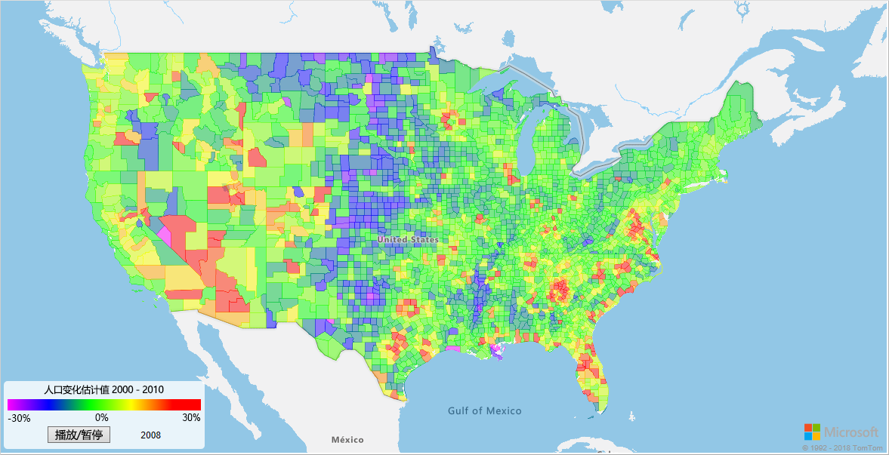
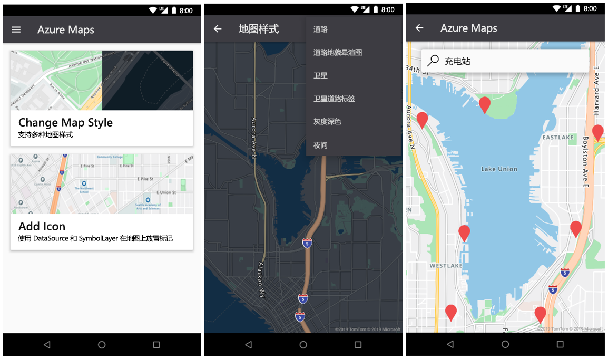

# <a name="what-is-azure-maps"></a>什么是 Azure Maps？

Azure Maps 是一系列地理空间服务，它使用全新地图绘制数据为 Web 和移动应用程序提供地理环境。 Azure Maps 具有以下功能：

* REST API，以多种样式和卫星图像呈现地图。
* 搜索服务，用于查找全世界的地址、地点和兴趣点。
* 各种路线选项，例如地点到地点、多地点、多地点优化、等时线、商务车、受影响的交通，以及路网路线。
* 交通情况视图和事故视图，适用于需要交通信息的应用程序。
* 出行服务，用于请求公共交通物流、实时规划路线，并请求替代运输模式的信息。
* 时区和地理位置服务，以及将位置转换为时区。
* 地理围栏和地图数据存储，其中的位置信息托管在 Azure 中。 
* 通过地理空间分析进行智能定位。 

此外，还可以通过 Web SDK 或 Android SDK 提供 Azure Maps 服务。 这些工具可以帮助开发人员快速开发和缩放将位置信息集成到 Azure 解决方案中的解决方案。 

可以注册获取免费的 [Azure Maps 帐户](https://azure.microsoft.com/services/azure-maps/)并开始开发。

以下视频深入介绍了 Azure Maps：

<br/>

<iframe src="https://channel9.msdn.com/Shows/Internet-of-Things-Show/Azure-Maps/player?format=ny" width="960" height="540" allowFullScreen frameBorder="0"></iframe>

## <a name="map-controls"></a>地图控件

### <a name="web-sdk"></a>Web SDK

Azure Maps Web SDK 允许你使用自己的内容和图像自定义交互式地图。 可以将此交互式地图用于 Web 或移动应用程序。 地图控件使用 WebGL，因此可以呈现大型数据集，同时保持高性能。 使用 JavaScript 或 TypeScript 通过此 SDK 进行开发。



### <a name="android-sdk"></a>Android SDK

使用 Azure Maps Android SDK 创建移动地图绘制应用程序。 



## <a name="services-in-azure-maps"></a>Azure Maps 中的服务

Azure Maps 包含以下九个可在 Azure 应用程序中提供地理上下文的服务。

### <a name="data-service"></a>数据服务

数据对于地图至关重要。 使用数据服务上传和存储地理空间数据（供空间操作使用）或图像组成部分。  使客户数据靠近 Azure Maps 服务可以降低延迟、提高工作效率，并在应用程序中创建新方案。 有关此服务的详细信息，请访问[数据服务 API 文档](https://docs.microsoft.com/rest/api/maps/data)。

### <a name="mobility-service"></a>移动服务

Azure Maps 移动服务可以实现实时行程规划。 它返回最佳的可能路线选项，并提供各种出行模式。 对于地铁（城市）区域，这些模式可能包括步行、单车和公共交通。 你可以请求交通路线、线路几何图形、站点列表、预计到达时间、实时到达时间，以及服务警报。

该服务还可以搜索位置周围的特定对象类型。 用户可以围绕某个位置搜索共享自行车、摩托车或汽车。 用户可以请求最近的停放点中可用自行车的数量，并搜索可用于拼车的汽车。 另外，用户可以查找未来可用情况和当前燃油水平等详细信息。

若要了解有关服务的更多信息，请参阅[移动 API 文档](https://docs.microsoft.com/rest/api/maps/mobility)。

### <a name="render-service"></a>呈现服务

呈现服务帮助开发人员创建带地图功能的 Web 和移动应用程序。 该服务使用有 19 个缩放级别的高品质光栅图形图像或完全可自定义的矢量格式的地图图像。


呈现服务现在提供预览版 API，使开发人员能够使用卫星图像。 有关更多详细信息，请阅读[呈现 API 文档](https://docs.microsoft.com/rest/api/maps/render)。

### <a name="route-service"></a>路线服务

“路线”服务包含实际基础结构的可靠几何计算，以及多种运输模式的指示。 通过此服务，开发人员可以计算大量出行模式（例如汽车、卡车、自行车或步行）的指示。 此服务还考虑流量条件、重量限制或危险材料运输等因素。


路线服务可以预览高级功能，例如： 

* 批处理多个路线请求。
* 提供一组起点和目的地之间的出行时间和距离表格。
* 根据时间或燃料需求，找出用户可以行驶的路线或距离。 

有关路线功能的详细信息，请阅读[路线 API 文档](https://docs.microsoft.com/rest/api/maps/route)。

### <a name="search-service"></a>搜索服务

搜索服务帮助开发人员按名称或类别搜索地址、地点、商家列表和其他地理信息。 搜索服务能根据纬度和经度将地址和十字路口进行[反向地理编码](https://en.wikipedia.org/wiki/Reverse_geocoding)。


搜索服务还提供高级功能，例如：

* 沿路线搜索。
* 在更大的区域内搜索。
* 批处理一组搜索请求。
* 搜索更大的区域，而不是定位点。 

用于批处理和区域搜索的 API 目前以预览版提供。 有关搜索功能的详细信息，请阅读[搜索 API 文档](https://docs.microsoft.com/rest/api/maps/search)。

### <a name="spatial-operations-service"></a>空间操作服务

Azure Maps 空间操作服务获取位置信息。 它会快速分析位置信息，帮助客户了解某时某地正在发生的事件。 它可以实现近乎实时地分析事件并对事件进行预测性建模。 

该服务使客户可以借助一系列常用的地理空间数学计算来增强其智能定位能力。 常用计算包括最近点、大圆圈航线距离和缓冲区。 若要详细了解该服务和各种功能，请阅读[空间操作 API 文档](https://docs.microsoft.com/rest/api/maps/spatial)。

### <a name="time-zone-service"></a>时区服务

使用时区服务，可以查询当前的、历史的和将来的时区信息。 还可以使用纬度和经度对或 [IANA ID](https://www.iana.org/)。 通过时区服务还可以实现：

* 将 Microsoft Windows 时区 ID 转换为 IANA 时区。
* 提取与 UTC 的时区偏移量。
* 获取选定时区的当前时间。 

查询时区服务的典型 JSON 响应如下例所示：

```JSON
{
    "Version": "2017c",
    "ReferenceUtcTimestamp": "2017-11-20T23:09:48.686173Z",
    "TimeZones": [{
        "Id": "America/Los_Angeles",
        "ReferenceTime": {
            "Tag": "PST",
            "StandardOffset": "-08:00:00",
            "DaylightSavings": "00:00:00",
            "WallTime": "2017-11-20T15:09:48.686173-08:00",
            "PosixTzValidYear": 2017,
            "PosixTz": "PST+8PDT,M3.2.0,M11.1.0"
        }
    }]
}
```

有关此服务的详细信息，请阅读[时区 API 文档](https://docs.microsoft.com/rest/api/maps/timezone)。

### <a name="traffic-service"></a>交通服务

交通服务是一套 Web 服务，开发人员可将其用于需要交通信息的 Web 或移动应用程序。 该服务提供两种数据类型：

* 交通流量：在路网中对所有关键道路进行实时观察获得的车速和行驶时间。
* 交通事故：有关路网周围的交通堵塞和事故的最新视图。


有关详细信息，请参阅[交通 API 文档](https://docs.microsoft.com/rest/api/maps/traffic)。

### <a name="ip-to-location-service"></a>IP to Location 服务

使用 IP to Location 服务预览检索的 IP 地址的双字母国家/地区代码。 此服务可基于地理位置通过提供自定义的应用程序内容帮助你增强用户体验。

有关 REST API 中的 IP to Location 服务的详细信息，请阅读 [Azure Maps 地理位置 API 文档](https://docs.microsoft.com/rest/api/maps/geolocation)。

## <a name="programming-model"></a>编程模型

Azure Maps 针对移动设备设计，可帮助你开发跨平台应用程序。 它使用语言无关的编程模型，并通过 [REST API](https://docs.microsoft.com/rest/api/maps/) 支持 JSON 输出。

此外，Azure Maps 还通过简单的编程模型提供了一个便利的 [JavaScript 地图控件](https://docs.microsoft.com/javascript/api/azure-maps-control)。 Web 和移动应用程序的开发都快速而简单。

## <a name="usage"></a>使用情况

若要访问 Azure Maps 服务，只需转到 [Azure 门户](https://portal.azure.com)并创建一个 Azure Maps 帐户即可。

Azure Maps 使用基于密钥的身份验证方案。 你的帐户将附带为你生成的两个密钥，请使用任一密钥。 开始将这些位置功能集成到应用程序中，并向 Azure Maps 服务发出请求。

注意：Azure Maps 将与第三方 TomTom 共享客户提供的地址/位置查询（简称“查询”），以实现地图功能。 与 TomTom 共享时，查询不会链接到任何客户或最终用户，也不能用于识别个人。 Microsoft 目前正在向“联机服务分包商”列表添加 TomTom。 请注意，与 Moovit 和 AccuWeather 集成的移动和天气服务目前以[预览版](https://azure.microsoft.com/support/legal/preview-supplemental-terms/)提供。

## <a name="supported-regions"></a>支持的区域

除了以下区域之外，Azure Maps API 目前在所有国家/地区和区域都可用：

* 中国
* 韩国

验证当前 IP 地址的位置是否位于受支持的国家/地区。

## <a name="next-steps"></a>后续步骤

试用展示 Azure Maps 的示例应用：

> [!div class="nextstepaction"]
> [快速入门：创建 Web 应用](quick-demo-map-app.md)

随时掌握 Azure Maps 的最新信息： 

> [!div class="nextstepaction"]
> [Azure Maps 博客](https://azure.microsoft.com/blog/topics/azure-maps/)
