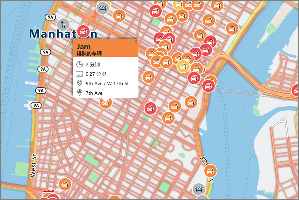

# <a name="an-introduction-to-azure-maps"></a>Azure Maps 简介
Azure Maps 是一项地理空间服务组合，包括适用于地图、搜索、路线、交通和时区的服务 API。 可以借助这组服务使用熟悉的工具快速开发和缩放将位置信息集成到 Azure 解决方案中的解决方案。 Azure Maps 为各行各业的开发人员提供强大的地理空间功能，并搭配了为 Web 和移动应用程序提供地理环境时所需的全新地图数据。 Azure Maps 是一组 REST API，随基于 Web 的 JavaScript 控件一起提供，使得开发简单、灵活且可跨多个媒体移植。 

以下视频介绍 Azure Maps：

<iframe src="https://channel9.msdn.com/Shows/Azure-Friday/Azure-Location-Based-Services/player" width="960" height="540" allowFullScreen frameBorder="0"></iframe>

Azure Maps 由五项主要服务组成，以支持需要地理环境的 Azure 应用程序。 逐一详细介绍每项服务。

“呈现服务”专为开发人员而设计，用于创建与映射有关的 Web 和移动应用程序。 该服务使用有 19 个缩放级别的高品质光栅图形图像或完全可自定义的矢量格式的地图图像。


“路线服务”包含强大的实际基础结构几何计算和多种运输模式指示。 通过此服务，开发人员可以计算大量出行模式（例如汽车、卡车、自行车或步行）的指示。 此服务还考虑流量条件、重量限制或危险材料运输等因素。


“搜索服务”旨在让开发人员按名称或类别搜索地址、地点、商家列表和其他地理信息。 搜索服务还可以基于纬度/经度[反向地理编码](https://en.wikipedia.org/wiki/Reverse_geocoding)地址和十字路口。 


“时区服务”允许你使用纬度-经度对或 [IANA ID](http://www.iana.org/) 来查询当前、历史和将来的时区信息。 时区服务还允许将 Microsoft Windows 时区 ID 转换为 IANA 时区，提取到 UTC 的时区偏移以及获取相应时区中的当前时间。 查询时区服务的典型 JSON 响应如下例所示：

```JSON
{
    "Version": "2017c",
    "ReferenceUtcTimestamp": "2017-11-20T23:09:48.686173Z",
    "TimeZones": [{
        "Id": "America/Los_Angeles",
        "ReferenceTime": {
            "Tag": "PST",
            "StandardOffset": "-08:00:00",
            "DaylightSavings": "00:00:00",
            "WallTime": "2017-11-20T15:09:48.686173-08:00",
            "PosixTzValidYear": 2017,
            "PosixTz": "PST+8PDT,M3.2.0,M11.1.0"
        }
    }]
}
```

“交通服务”是一套 Web 服务，旨在让开发人员创建交通所需的 Web 和移动应用程序。 该服务提供两种数据类型：
* 交通流量 - 路网中所有关键道路的实时观察速度和行驶时间。 
* 交通事件 - 有关路网周围的交通堵塞和事故的准确视图。



Azure Maps 是针对移动性而构建的，可以支持跨平台的应用程序，因为编程模型是不可知的，并且通过 REST API 支持输出 JSON。 此外，Azure Maps 还提供了一个简单的编程模型和方便的 JavaScript 地图控件，可以快速轻松地开发 Web 和移动应用程序。 

Azure Maps 使用基于密钥的身份验证方案，因此，访问这些服务需要导航到 [Azure 门户](http://portal.azure.com)，并创建一个 Azure Maps 帐户。 你的帐户将附带为你预生成的两个密钥。 首先将这些位置功能直接集成到你的应用程序，方法是使用请求 Azure Maps 服务的任一密钥。

## <a name="unsupported-regions"></a>不受支持的区域
当前某些国家/地区不支持 Azure Maps API。 请检查当前的 IP 地址，并确认该 IP 地址的位置不在下面所列的某个不受支持国家/地区：

* 阿根廷
* 中国
* 印度
* 摩洛哥
* 巴基斯坦
* 韩国

## <a name="next-steps"></a>后续步骤

现在已概要了解 Azure Maps。 下一步是试用展示服务的示例应用。

> [!div class="nextstepaction"]
> [启动演示交互式搜索地图](quick-demo-map-app.md)
