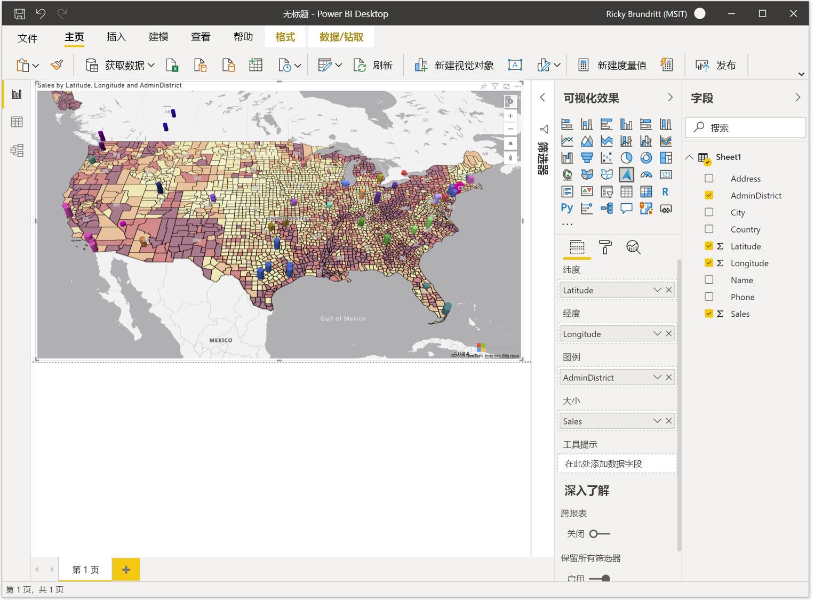

# Azure Maps Power BI visual 入门

<Token>**适用于：**  Power BI 服务 ***使用者***  面向开发人员的 Power BI 服务 & 开发人员  Power BI Desktop  需要 Pro 或 Premium 许可证 </Token>

本文说明如何使用 Power BI 的 Microsoft Azure 映射视觉对象。

> [!NOTE]
> 可以在 Power BI Desktop 和 Power BI 服务中创建和查看此视觉对象。 本文中的步骤和图示来自 Power BI Desktop。

Power BI 的 Azure Maps 视觉对象提供了一组丰富的数据可视化效果，适用于地图上的空间数据。 估计超过 80% 的业务数据具有位置上下文。 Azure Maps 视觉对象可用于深入了解此位置上下文的关联方式，并影响你的业务数据。

## 向 Azure 发送哪些内容？

Azure Maps 视觉对象连接到在 Azure 中托管的云服务，以检索位置数据，如用于创建地图可视化效果的地图图像和坐标。 

-   有关地图所关注区域的详细信息将发送到 Azure 以检索呈现地图画布所需的图像 (也称为地图图块) 。 
-   "位置"、"纬度" 和 "经度" 存储桶中的数据可能发送到 Azure，以检索 (名为地理编码) 的进程的地图坐标。 
-   如果启用了 Power BI 中的遥测选项，则可以在视觉对象 (的运行状况上收集遥测数据（即，崩溃报告) 。

除了上述方案以外，不会将映射上重叠的其他数据发送到 Azure Maps 服务器。 所有数据呈现都在客户端本地进行。

你或管理员可能需要更新你的防火墙，以允许访问使用以下 URL 的 Azure Maps 平台。

> `https://atlas.microsoft.com`

若要了解详细信息，请参阅 [Microsoft Azure 法律信息](https://azure.microsoft.com/support/legal/)，了解与 Azure Maps 视觉对象相关的隐私和使用条款。

## 预览版行为和要求

**Azure Maps**的此预览版有一些注意事项和要求：

-   **Azure Maps**视觉对象处于预览状态，必须在 Power BI Desktop 中启用。 若要启用**Azure Maps**，请选择 "**文件** &gt; **选项" 和 "设置** &gt; **Options** &gt; " "**预览功能**"，然后选择 " **Azure Maps" 视觉对象**。 如果在执行此操作后 Azure Maps 视觉对象不可用，则可能需要启用管理门户中的租户管理交换机。
-   数据集必须具有包含 **纬度** 和 **经度** 信息的字段。 将来的更新中将添加 "位置" 字段地理编码。
-   此预览中当前未显示 Power BI 的内置图例控件。 它将添加到将来的更新中。

## 使用 Azure Maps 视觉对象

启用**Azure Maps**视觉对象后，在 "**可视化效果**" 窗格中选择 " **Azure Maps** " 图标。

Power BI 创建一个空 Azure Maps 可视化设计画布。 在预览中，会显示其他免责声明。

执行以下步骤以加载 Azure Maps 视觉对象：

1.  在 " **字段** " 窗格中，将包含纬度和经度坐标信息的数据字段拖到 **纬度** 和/或 **经度** 存储桶中。 这是加载 Azure Maps 视觉对象所需的最少量数据。
    
    > [!div class="mx-imgBorder"]
    > 

2.  若要基于分类为数据着色，请将分类字段拖到 "**字段**" 窗格的 "**图例**" 存储桶中。 在此示例中，我们使用的是 **AdminDistrict** 列 (也称为州或省) 。  
    
    > [!div class="mx-imgBorder"]
    > 

    > [!NOTE]
    > 此预览中当前未显示 Power BI 的内置图例控件。 它将添加到将来的更新中。

3.  若要对数据进行相对缩放，请将度量值拖到 "**字段**" 窗格的**大小**存储桶中。 在此示例中，我们使用的是 **Sales** 列。  
    
    > [!div class="mx-imgBorder"]
    > 

4.  使用 " **格式** " 窗格中的选项可自定义数据的呈现方式。 下图与上面的图相同，但是 "气泡图层填充透明度" 选项设置为50% 且启用了高对比度大纲选项。  
    
    > [!div class="mx-imgBorder"]
    > 

## 字段窗格 bucket

Azure Maps 视觉对象的 " **字段** " 窗格中提供以下数据存储桶。

| 字段     | 说明  |
|-----------|--------------|
| 纬度  | 用于指定数据点的纬度值的字段。 纬度值的格式应为-90 和90。  |
| 经度 | 用于指定数据点的经度值的字段。 经度值应在-180 到180之间，采用十进制度格式。  |
| 图例    | 用于对数据进行分类并为每个类别中的数据点分配唯一颜色的字段。 填充此 bucket 后，" **数据颜色** " 部分将出现在 " **格式** " 窗格中，允许调整颜色。 |
| 大小      | 用于映射上的数据点的相对大小的度量值。   |
| 工具提示  | 悬停形状时在工具提示中显示的其他数据字段。 |

## 地图设置

"格式" 窗格的 " **地图设置** " 部分提供了一些选项，可用于自定义地图的显示方式和对更新的响应。

| 设置             | 说明  |
|---------------------|--------------|
| 自动缩放           | 自动将地图缩放到通过视觉对象的 " **字段** " 窗格加载的数据。 数据更改时，地图将相应更新其位置。 当滑块处于 **Off** 位置时，将显示默认地图视图的其他地图视图设置。 |
| 世界包装          | 允许用户在水平方向上无休止地平移地图。 |
| 样式选取器        | 向地图添加一个按钮，该按钮允许报表读者更改地图的样式。 |
| 导航控件 | 将按钮作为另一种方法添加到地图，以允许报表读者缩放、旋转和更改地图的间距。 有关详细信息，请参阅此文档中的 [导航图](map-accessibility.md#navigating-the-map) ，了解用户可以在地图上导航的所有不同方式的详细信息。 |
| 地图样式           | 地图的样式。 有关 [支持的地图样式](supported-map-styles.md)的详细信息，请参阅此文档。 |

### 地图视图设置

如果 " **自动缩放** " 滑块处于 **关闭** 位置，则会显示以下设置，并允许用户指定默认的地图视图信息。

| 设置          | 说明   |
|------------------|---------------|
| 缩放             | 地图的默认缩放级别。 可以是0到22之间的数字。 |
| 中心纬度  | 地图中心的默认纬度。 |
| 中心经度 | 地图中心的默认经度。 |
| 方位          | 地图的默认方向（以度为单位），其中0表示北部，90为东，180为南部，270为西部。 可以是0到360之间的任意数字。 |
| 音调            | 地图的默认倾斜度，单位为0到60，其中0表示从地图向下直接查看。 |

## 注意事项和限制

以下服务和应用程序提供了 Azure Maps 视觉对象：

| 服务/应用                              | 是否支持 |
|------------------------------------------|--------------|
| Power BI Desktop                         | 是          |
| Power BI 服务 (app.powerbi.com)       | 是          |
| Power BI 移动应用程序             | 是          |
| Power BI 发布到 Web                  | 否           |
| Power BI Embedded                        | 否           |
| Power BI 服务嵌入 (PowerBI.com) | 是          |

将来的更新中将添加对其他 Power BI 服务/应用的支持。

**Azure Maps 在何处可用？**

目前，Azure Maps 当前在所有国家和地区可用，但以下情况除外：

- 中国
- 韩国

有关支持此视觉对象的不同 Azure Maps 服务的覆盖范围详细信息，请参阅 [地理覆盖信息](geographic-coverage.md) 文档。

**Azure Maps 视觉对象支持哪些 web 浏览器？**

请参阅此文档，了解 [Azure Maps WEB SDK 支持的浏览器](supported-browsers.md)的相关信息。

**我可以直观显示多少数据点？**

此视觉对象最多支持30000个数据点。

**此视觉对象中是否可以使用地址或其他位置字符串？**

此视觉对象的初始预览仅支持小数度的纬度值和经度值。 将来的更新将添加对地址和其他位置字符串的支持。

## 后续步骤

了解 Azure Maps Power BI 视觉对象的详细信息：

> [!div class="nextstepaction"]
> [了解 Azure Maps Power BI 视觉对象中的层](power-bi-visual-understanding-layers.md)

> [!div class="nextstepaction"]
> [管理组织中的 Azure Maps 视觉对象](power-bi-visual-manage-access.md)

自定义视觉对象：

> [!div class="nextstepaction"]
> [Power BI 中颜色格式设置的提示和技巧](https://docs.microsoft.com/power-bi/visuals/service-tips-and-tricks-for-color-formatting)

> [!div class="nextstepaction"]
> [自定义可视化效果的标题、背景和图例](https://docs.microsoft.com/power-bi/visuals/power-bi-visualization-customize-title-background-and-legend)
