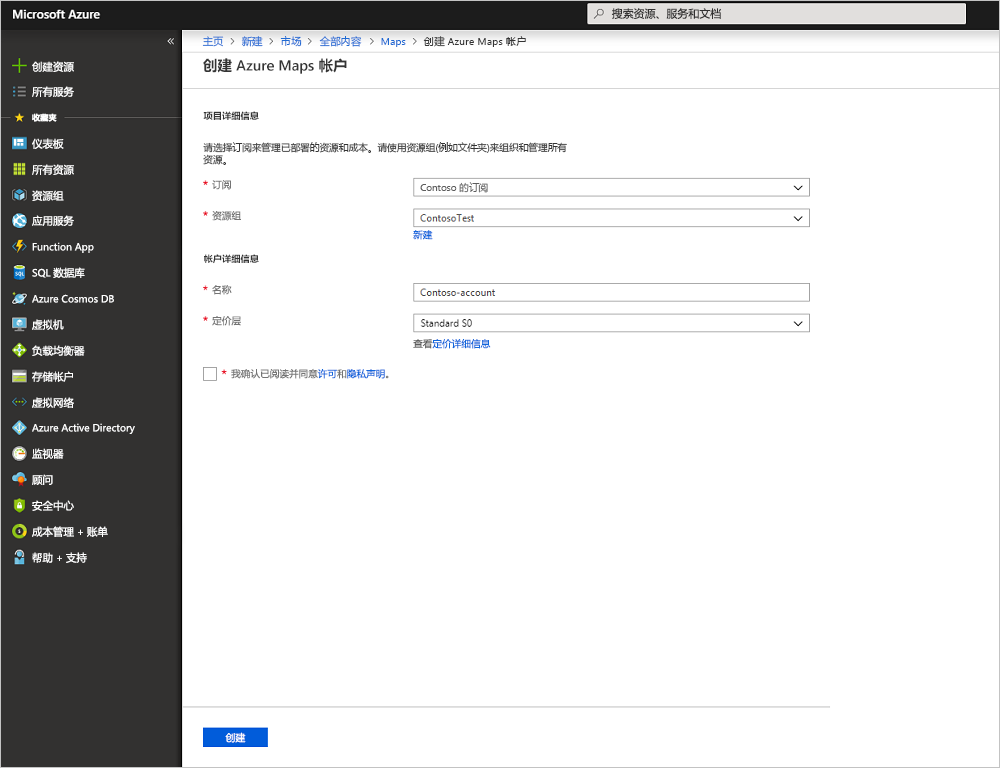
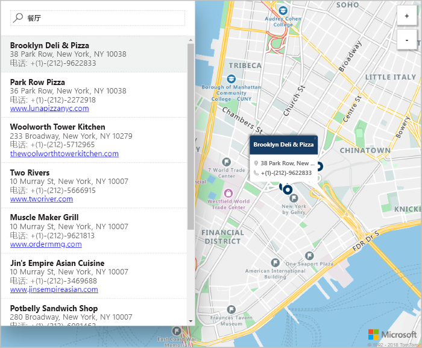

# 使用 Azure Maps 启动交互式搜索地图

本文演示 Azure Maps 功能如何创建地图，为用户提供交互式搜索体验。 本文逐步讲解了自行创建 Maps 帐户，以及获取要在演示 Web 应用程序中使用的帐户密钥的基本步骤。 

如果你还没有 Azure 订阅，可以在开始前创建一个 [免费帐户](https://azure.microsoft.com/free/?WT.mc_id=A261C142F)。

## 登录到 Azure 门户

登录到 [Azure 门户](https://portal.azure.com/)。

## 创建一个帐户并获取密钥

1. 在 [Azure 门户](https://portal.azure.com)的左上角单击“创建资源”。
2. 在“搜索 Marketplace”框中，键入“Maps”。
3. 从“结果”中，选择“Maps”。 单击地图下面显示的“创建”按钮。 
4. 在“创建 Maps 帐户”页上，输入以下值：
    - 新帐户的名称。 
    - 要用于此帐户的订阅。
    - 此帐户的资源组。 可以选择新建或使用现有的资源组。
    - 选择“资源组位置”。
    - 阅读许可证和隐私声明，并选择复选框接受这些条款。 
    - 最后，单击“创建”按钮。

    

5. 帐户成功创建后，将其打开，查找帐户菜单的设置部分。 单击“密钥”查看 Azure Maps 帐户的主要密钥和辅助密钥。 将“主密钥”值复制到本地剪贴板，以便在下一部分中使用。 

## 下载应用程序

1. 下载或复制 [interactiveSearch.html](https://github.com/Azure-Samples/azure-maps-samples/blob/master/src/interactiveSearch.html) 文件的内容。
2. 在本地将此文件的内容另存为 **AzureMapDemo.html**，并在文本编辑器中将其打开。
3. 搜索字符串 `<insert-key>`，并将其替换为在上一部分中获取的**主密钥**值。 

## 启动应用程序

1. 在所选的浏览器中打开文件 **AzureMapDemo.html**。
2. 观察显示的洛杉矶市地图。 进行缩放，查看地图如何自动根据缩放级别呈现更多或更少信息。 
3. 更改地图的默认中心。 在“AzureMapDemo.html”文件中，搜索名为“center”的变量。 将此变量的经度、纬度对值替换为新值“[-74.0060, 40.7128]”。 保存文件并刷新浏览器。 
3. 尝试交互式搜索体验。 在演示 web 应用程序左上角的搜索框中，搜索“餐厅”。 
4. 将鼠标移到搜索框下面显示的地址/位置列表上，可以看到，地图上的相应图钉会弹出有关该位置的信息。 为保护私营企业的隐私，地图中显示的名称和地址都是虚构的。 

    

## 清理资源

这些教程详细介绍如何用帐户使用和配置 Maps。 如何打算继续学习这些教程，请勿清除本快速入门中创建的资源。 如果不打算继续学习，请通过以下步骤删除通过本快速入门创建的所有资源。

1. 关闭运行 **AzureMapDemo.html** Web 应用程序的浏览器。
2. 在 Azure 门户的左侧菜单中单击“所有资源”，然后选择自己的 Maps 帐户。 在“所有资源”边栏选项卡的顶部单击“删除”。

## 后续步骤

本快速入门教程中创建了 Maps 帐户并启动了演示应用。 若要了解如何使用 Maps API 创建自己的应用程序，请继续学习以下教程。

> [!div class="nextstepaction"]
> [借助 Maps 搜索兴趣点](./tutorial-search-location.md)
