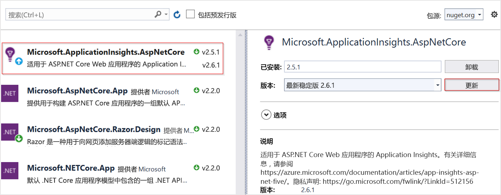

# <a name="application-insights-for-aspnet-core-applications"></a>ASP.NET Core 应用程序的 Application Insights

本文介绍如何为[ASP.NET Core](https://docs.microsoft.com/aspnet/core)应用程序启用 Application Insights。 当你完成本文中的说明时，Application Insights 将从 ASP.NET Core 应用程序收集请求、依赖项、异常、性能计数器、检测信号和日志。

我们将在此处使用的示例是一个面向 `netcoreapp2.2`的[MVC 应用程序](https://docs.microsoft.com/aspnet/core/tutorials/first-mvc-app)。 可以将这些说明应用于所有 ASP.NET Core 应用程序。

## <a name="supported-scenarios"></a>支持的方案

无论应用程序在何处运行， [ASP.NET Core 的 APPLICATION INSIGHTS SDK](https://nuget.org/packages/Microsoft.ApplicationInsights.AspNetCore)都可以监视应用程序。 如果你的应用程序正在运行，并且已通过网络连接到 Azure，则可以收集遥测数据。 支持 .NET Core 的任何地方都支持 Application Insights 监视。 支持涵盖：
* **操作系统**： Windows、Linux 或 Mac。
* **宿主方法**：进程内或进程外。
* **部署方法**：依赖于框架的或独立的。
* **Web 服务器**： IIS （Internet information server）或 Kestrel。
* **托管平台**： Azure App Service、azure VM、Docker、Azure Kubernetes SERVICE （AKS）等的 Web 应用功能。
* **.Net Core 运行时版本**： 1. xx、2. xx 或 3. xx
* **IDE**： Visual Studio、VS Code 或命令行。

> [!NOTE]
> 如果使用 ASP.NET Core 3.0 以及 Application Insights，请使用[2.8.0](https://www.nuget.org/packages/Microsoft.ApplicationInsights.AspNetCore/2.8.0)版本或更高版本。 这是支持 ASP.NET Core 3.0 的唯一版本。

## <a name="prerequisites"></a>先决条件

- 运行 ASP.NET Core 应用程序。 如果需要创建 ASP.NET Core 应用程序，请遵循本[ASP.NET Core 教程](https://docs.microsoft.com/aspnet/core/getting-started/)。
- 有效的 Application Insights 检测密钥。 需要此密钥才能将任何遥测数据发送到 Application Insights。 如果需要创建新的 Application Insights 资源来获取检测密钥，请参阅[创建 Application Insights 资源](https://docs.microsoft.com/azure/azure-monitor/app/create-new-resource)。

## <a name="enable-application-insights-server-side-telemetry-visual-studio"></a>启用 Application Insights 服务器端遥测（Visual Studio）

1. 在 Visual Studio 中打开项目。

    > [!TIP]
    > 如果需要，可以为项目设置源代码管理，以便跟踪 Application Insights 所做的所有更改。 若要启用源代码管理，请选择 "**文件**" > "**添加到源代码管理**"。

2. 选择“项目” **“添加 Application Insights 遥测”**  > 。

3. 选择“入门”。 根据你的 Visual Studio 版本，此选择的文本可能会有所不同。 某些早期版本使用的是 "**开始可用**" 按钮。

4. 选择你的订阅。 然后选择 "**资源** > **Register**"。

5. 将 Application Insights 添加到项目中后，请检查以确认你使用的是最新版本的 SDK。 请参阅**Project** > **管理 NuGet 包** > **applicationinsights.config. AspNetCore**。 如果需要，请选择 "**更新**"。

     

6. 如果按照可选提示操作并将项目添加到源代码管理中，请访问**查看** > **团队资源管理器** > **更改**。 然后，选择每个文件以查看 Application Insights 遥测数据所做更改的差异视图。

## <a name="enable-application-insights-server-side-telemetry-no-visual-studio"></a>启用 Application Insights 服务器端遥测（无 Visual Studio）

1. [为 ASP.NET Core 安装 APPLICATION INSIGHTS SDK NuGet 包](https://nuget.org/packages/Microsoft.ApplicationInsights.AspNetCore)。 建议始终使用最新的稳定版本。 在[开源 GitHub](https://github.com/Microsoft/ApplicationInsights-aspnetcore/releases)存储库中查找 SDK 的完整发行说明。

    下面的代码示例显示要添加到项目的 `.csproj` 文件中的更改。

    ```xml
        <ItemGroup>
          <PackageReference Include="Microsoft.ApplicationInsights.AspNetCore" Version="2.12.0" />
        </ItemGroup>
    ```

2. 将 `services.AddApplicationInsightsTelemetry();` 添加到 `Startup` 类中的 `ConfigureServices()` 方法，如以下示例中所示：

    ```csharp
        // This method gets called by the runtime. Use this method to add services to the container.
        public void ConfigureServices(IServiceCollection services)
        {
            // The following line enables Application Insights telemetry collection.
            services.AddApplicationInsightsTelemetry();
    
            // This code adds other services for your application.
            services.AddMvc();
        }
    ```

3. 设置检测密钥。

    尽管可以提供检测密钥作为 `AddApplicationInsightsTelemetry`参数，但建议在配置中指定检测密钥。 下面的代码示例演示如何在 `appsettings.json`中指定检测密钥。 请确保在发布过程中将 `appsettings.json` 复制到应用程序根文件夹。

    ```json
        {
          "ApplicationInsights": {
            "InstrumentationKey": "putinstrumentationkeyhere"
          },
          "Logging": {
            "LogLevel": {
              "Default": "Warning"
            }
          }
        }
    ```

    也可以在以下环境变量中指定检测密钥：

    * `APPINSIGHTS_INSTRUMENTATIONKEY`

    * `ApplicationInsights:InstrumentationKey`

    例如：

    * `SET ApplicationInsights:InstrumentationKey=putinstrumentationkeyhere`

    * `SET APPINSIGHTS_INSTRUMENTATIONKEY=putinstrumentationkeyhere`

    通常，`APPINSIGHTS_INSTRUMENTATIONKEY` 指定部署到 Azure Web 应用的应用程序的检测密钥。

    > [!NOTE]
    > 在代码中指定的检测密钥通过环境变量 `APPINSIGHTS_INSTRUMENTATIONKEY`，后者 wins 超过其他选项。

## <a name="run-your-application"></a>运行应用程序

运行应用程序并向其发出请求。 遥测现在应流向 Application Insights。 Application Insights SDK 会自动将传入的 web 请求收集到应用程序以及以下遥测。

### <a name="live-metrics"></a>实时指标

[实时指标](https://docs.microsoft.com/azure/application-insights/app-insights-live-stream)可用于快速验证是否已正确配置 Application Insights 监视。 尽管可能需要几分钟时间才能使遥测开始出现在门户和分析中，但实时指标会以近乎实时的方式显示正在运行的进程的 CPU 使用率。 它还可以显示其他遥测数据，如请求、依赖项、跟踪等。

### <a name="ilogger-logs"></a>ILogger 日志

自动捕获通过严重性 `Warning` `ILogger` 或更高版本发出的日志。 按照[ILogger 文档](ilogger.md#control-logging-level)来自定义 Application Insights 捕获的日志级别。

### <a name="dependencies"></a>依赖项

默认情况下启用依赖项集合。 [本文介绍](asp-net-dependencies.md#automatically-tracked-dependencies)自动收集的依赖项，还包含执行手动跟踪的步骤。

### <a name="performance-counters"></a>性能计数器

对 ASP.NET Core 中[性能计数器](https://azure.microsoft.com/documentation/articles/app-insights-web-monitor-performance/)的支持受到限制：

* 如果应用程序在 Azure Web 应用（Windows）中运行，SDK 版本2.4.1 和更高版本会收集性能计数器。
* SDK 版本2.7.1 和更高版本，如果应用程序在 Windows 和目标 `NETSTANDARD2.0` 或更高版本中运行，则会收集性能计数器。
* 对于面向 .NET Framework 的应用程序，SDK 的所有版本都支持性能计数器。
* SDK 版本2.8.0 和更高版本支持 Linux 中的 cpu/内存计数器。 Linux 不支持其他计数器。 在 Linux （和其他非 Windows 环境）中获取系统计数器的建议方法是使用[EventCounters](#eventcounter)

### <a name="eventcounter"></a>EventCounter

默认情况下启用 `EventCounterCollectionModule`，它将从 .NET Core 3.0 应用程序收集默认的计数器集。 [EventCounter](eventcounters.md)教程列出了收集的默认计数器集。 它还包含有关自定义列表的说明。

## <a name="enable-client-side-telemetry-for-web-applications"></a>为 web 应用程序启用客户端遥测

上述步骤足以帮助你开始收集服务器端遥测数据。 如果你的应用程序具有客户端组件，请按照后续步骤开始收集[使用情况遥测](https://docs.microsoft.com/azure/azure-monitor/app/usage-overview)数据。

1. 在 `_ViewImports.cshtml`中，添加注入：

    ```cshtml
        @inject Microsoft.ApplicationInsights.AspNetCore.JavaScriptSnippet JavaScriptSnippet
    ```

2. 在 `_Layout.cshtml`中，在 "`<head>`" 部分的末尾，但在其他任何脚本之前插入 `HtmlHelper`。 如果要从页面报告任何自定义的 JavaScript 遥测数据，请在此代码段之后注入：

    ```cshtml
        @Html.Raw(JavaScriptSnippet.FullScript)
        </head>
    ```
    
或者，若要使用 `FullScript` `ScriptBody` 可从 SDK v 2.14 开始使用。 如果需要控制 `<script>` 标记来设置内容安全策略，请使用此操作：

    ```cshtml
        <script> // apply custom changes to this script tag.
            @Html.Raw(JavaScriptSnippet.ScriptBody)
        </script>
    ```

前面引用的 `.cshtml` 文件名来自默认 MVC 应用程序模板。 最终，若要为应用程序正确启用客户端监视，JavaScript 代码段必须出现在你要监视的应用程序的每一页的 "`<head>`" 部分中。 可以通过将 JavaScript 代码片段添加到 `_Layout.cshtml`来完成此应用程序模板的目标。 

如果你的项目不包含 `_Layout.cshtml`，你仍可以添加[客户端监视](https://docs.microsoft.com/azure/azure-monitor/app/website-monitoring)。 为此，可以将 JavaScript 代码片段添加到用于控制应用中所有页面的 `<head>` 的等效文件中。 或者，您可以将代码片段添加到多个页面，但这种解决方案很难维护，我们通常不推荐这样做。

## <a name="configure-the-application-insights-sdk"></a>配置 Application Insights SDK

您可以自定义 ASP.NET Core 的 Application Insights SDK，以更改默认配置。 Application Insights ASP.NET SDK 的用户可能熟悉如何使用 `ApplicationInsights.config` 或通过修改 `TelemetryConfiguration.Active`更改配置。 更改 ASP.NET Core 的配置有所不同。 将 ASP.NET Core SDK 添加到应用程序，并使用 ASP.NET Core 内置[依赖关系注入](https://docs.microsoft.com/aspnet/core/fundamentals/dependency-injection)对其进行配置。 在 `Startup.cs` 类的 `ConfigureServices()` 方法中几乎进行所有配置更改，除非你有其他指示。 以下各节提供了详细信息。

> [!NOTE]
> 在 ASP.NET Core 应用程序中，不支持通过修改 `TelemetryConfiguration.Active` 来更改配置。

### <a name="using-applicationinsightsserviceoptions"></a>使用 ApplicationInsightsServiceOptions

您可以通过将 `ApplicationInsightsServiceOptions` 传递到 `AddApplicationInsightsTelemetry`来修改几个常见设置，如以下示例中所示：

```csharp
public void ConfigureServices(IServiceCollection services)
{
    Microsoft.ApplicationInsights.AspNetCore.Extensions.ApplicationInsightsServiceOptions aiOptions
                = new Microsoft.ApplicationInsights.AspNetCore.Extensions.ApplicationInsightsServiceOptions();
    // Disables adaptive sampling.
    aiOptions.EnableAdaptiveSampling = false;

    // Disables QuickPulse (Live Metrics stream).
    aiOptions.EnableQuickPulseMetricStream = false;
    services.AddApplicationInsightsTelemetry(aiOptions);
}
```

`ApplicationInsightsServiceOptions` 中的设置的完整列表

|设置 | 说明 | 默认
|---------------|-------|-------
|EnableQuickPulseMetricStream | 启用/禁用 LiveMetrics 功能 | true
|EnableAdaptiveSampling | 启用/禁用自适应采样 | true
|EnableHeartbeat | 启用/禁用检测信号功能，该功能定期（15分钟默认值）发送名为 "HeartBeatState" 的自定义指标，其中包含有关运行时（如 .NET 版本、Azure 环境信息，如果适用）等的信息。 | true
|AddAutoCollectedMetricExtractor | 启用/禁用 AutoCollectedMetrics 提取程序，它是一种 TelemetryProcessor，它在采样发生之前发送有关请求/依赖项的预聚合度量值。 | true
|RequestCollectionOptions.TrackExceptions | 启用/禁用请求收集模块报告未处理的异常跟踪。 | NETSTANDARD 2.0 中的 false （因为异常是通过 ApplicationInsightsLoggerProvider 跟踪的），否则为 true。

有关最新列表，请参阅[`ApplicationInsightsServiceOptions`中的可配置设置](https://github.com/microsoft/ApplicationInsights-dotnet/blob/develop/NETCORE/src/Shared/Extensions/ApplicationInsightsServiceOptions.cs)。

### <a name="sampling"></a>采样

适用于 ASP.NET Core 的 Application Insights SDK 支持固定速率和自适应采样。 自适应采样默认处于启用状态。 

有关详细信息，请参阅[配置 ASP.NET Core 应用程序的自适应采样](../../azure-monitor/app/sampling.md#configuring-adaptive-sampling-for-aspnet-core-applications)。

### <a name="adding-telemetryinitializers"></a>添加 TelemetryInitializers

若要定义随所有遥测发送的全局属性，请使用[遥测初始值设定项](https://docs.microsoft.com/azure/azure-monitor/app/api-filtering-sampling#addmodify-properties-itelemetryinitializer)。

向 `DependencyInjection` 容器添加任何新 `TelemetryInitializer`，如以下代码所示。 SDK 会自动选取添加到 `DependencyInjection` 容器中的任何 `TelemetryInitializer`。

```csharp
public void ConfigureServices(IServiceCollection services)
{
    services.AddSingleton<ITelemetryInitializer, MyCustomTelemetryInitializer>();
}
```

### <a name="removing-telemetryinitializers"></a>删除 TelemetryInitializers

默认情况下，遥测初始值设定项存在。 若要删除所有或特定的遥测初始值设定项，请在调用 `AddApplicationInsightsTelemetry()`*后*使用以下示例代码。

```csharp
public void ConfigureServices(IServiceCollection services)
{
    services.AddApplicationInsightsTelemetry();

    // Remove a specific built-in telemetry initializer
    var tiToRemove = services.FirstOrDefault<ServiceDescriptor>
                        (t => t.ImplementationType == typeof(AspNetCoreEnvironmentTelemetryInitializer));
    if (tiToRemove != null)
    {
        services.Remove(tiToRemove);
    }

    // Remove all initializers
    // This requires importing namespace by using Microsoft.Extensions.DependencyInjection.Extensions;
    services.RemoveAll(typeof(ITelemetryInitializer));
}
```

### <a name="adding-telemetry-processors"></a>添加遥测处理器

可以使用 `IServiceCollection`上的扩展方法 `AddApplicationInsightsTelemetryProcessor`，将自定义遥测处理器添加到 `TelemetryConfiguration`。 使用[高级筛选方案](https://docs.microsoft.com/azure/azure-monitor/app/api-filtering-sampling#itelemetryprocessor-and-itelemetryinitializer)中的遥测处理器。 使用以下示例。

```csharp
public void ConfigureServices(IServiceCollection services)
{
    // ...
    services.AddApplicationInsightsTelemetry();
    services.AddApplicationInsightsTelemetryProcessor<MyFirstCustomTelemetryProcessor>();

    // If you have more processors:
    services.AddApplicationInsightsTelemetryProcessor<MySecondCustomTelemetryProcessor>();
}
```

### <a name="configuring-or-removing-default-telemetrymodules"></a>配置或删除默认 TelemetryModules

Application Insights 使用遥测模块自动收集有关特定工作负载的有用遥测，而不需要用户手动跟踪。

默认情况下，将启用以下自动收集模块。 这些模块负责自动收集遥测数据。 您可以禁用或配置它们以更改其默认行为。

* `RequestTrackingTelemetryModule`-从传入的 web 请求收集 RequestTelemetry。
* `DependencyTrackingTelemetryModule`-从传出 http 调用和 sql 调用收集 Dependencytelemetry 描述。
* `PerformanceCollectorModule`-收集 Windows PerformanceCounters。
* `QuickPulseTelemetryModule`-收集遥测数据，以便在 Live 指标门户中显示。
* `AppServicesHeartbeatTelemetryModule` 收集用于托管应用程序 Azure App Service 环境的心节拍（以自定义指标的形式发送）。
* `AzureInstanceMetadataTelemetryModule` 收集用于托管应用程序的 Azure VM 环境的核心节拍（以自定义指标的形式发送）。
* `EventCounterCollectionModule`-收集[EventCounters。](eventcounters.md) 此模块是一项新功能，可在 SDK 版本2.8.0 和更高版本中使用。

若要配置任何默认 `TelemetryModule`，请使用 `IServiceCollection`上的扩展方法 `ConfigureTelemetryModule<T>`，如下面的示例中所示。

```csharp
using Microsoft.ApplicationInsights.DependencyCollector;
using Microsoft.ApplicationInsights.Extensibility.PerfCounterCollector;

public void ConfigureServices(IServiceCollection services)
{
    services.AddApplicationInsightsTelemetry();

    // The following configures DependencyTrackingTelemetryModule.
    // Similarly, any other default modules can be configured.
    services.ConfigureTelemetryModule<DependencyTrackingTelemetryModule>((module, o) =>
            {
                module.EnableW3CHeadersInjection = true;
            });

    // The following removes all default counters from EventCounterCollectionModule, and adds a single one.
    services.ConfigureTelemetryModule<EventCounterCollectionModule>(
            (module, o) =>
            {
                module.Counters.Clear();
                module.Counters.Add(new EventCounterCollectionRequest("System.Runtime", "gen-0-size"));
            }
        );

    // The following removes PerformanceCollectorModule to disable perf-counter collection.
    // Similarly, any other default modules can be removed.
    var performanceCounterService = services.FirstOrDefault<ServiceDescriptor>(t => t.ImplementationType == typeof(PerformanceCollectorModule));
    if (performanceCounterService != null)
    {
        services.Remove(performanceCounterService);
    }
}
```

### <a name="configuring-a-telemetry-channel"></a>配置遥测通道

默认通道为 `ServerTelemetryChannel`。 如下面的示例所示，可以重写它。

```csharp
using Microsoft.ApplicationInsights.Channel;

    public void ConfigureServices(IServiceCollection services)
    {
        // Use the following to replace the default channel with InMemoryChannel.
        // This can also be applied to ServerTelemetryChannel.
        services.AddSingleton(typeof(ITelemetryChannel), new InMemoryChannel() {MaxTelemetryBufferCapacity = 19898 });

        services.AddApplicationInsightsTelemetry();
    }
```

### <a name="disable-telemetry-dynamically"></a>动态禁用遥测

如果要有条件地和动态地禁用遥测，可以在代码中 ASP.NET Core 的任何位置解析 `TelemetryConfiguration` 实例，并在代码中设置 `DisableTelemetry` 标志。

```csharp
    public void ConfigureServices(IServiceCollection services)
    {
        services.AddApplicationInsightsTelemetry();
    }

    public void Configure(IApplicationBuilder app, IHostingEnvironment env, TelemetryConfiguration configuration)
    {
        configuration.DisableTelemetry = true;
        ...
    }
```

以上不会阻止任何自动收集模块收集遥测数据。 通过上述方法，只会禁用向 Application Insights 发送遥测数据。 如果不需要特定的自动收集模块，最好[删除遥测模块](#configuring-or-removing-default-telemetrymodules)

## <a name="frequently-asked-questions"></a>常见问题

### <a name="does-application-insights-support-aspnet-core-30"></a>Application Insights 是否支持 ASP.NET Core 3.0？

可以。 更新[APPLICATION INSIGHTS SDK ASP.NET Core](https://nuget.org/packages/Microsoft.ApplicationInsights.AspNetCore)版本2.8.0 或更高版本。 较早版本的 SDK 不支持 ASP.NET Core 3.0。

此外，如果使用的是基于 Visual Studio 的说明[，请更新](#enable-application-insights-server-side-telemetry-visual-studio)到最新版本的 visual studio 2019 （16.3.0）以进行载入。 Visual Studio 的早期版本不支持 ASP.NET Core 3.0 应用程序的自动载入。

### <a name="how-can-i-track-telemetry-thats-not-automatically-collected"></a>如何跟踪未自动收集的遥测数据？

使用构造函数注入获取 `TelemetryClient` 的实例，并对其调用所需的 `TrackXXX()` 方法。 建议不要在 ASP.NET Core 应用程序中创建新的 `TelemetryClient` 实例。 已在 `DependencyInjection` 容器中注册 `TelemetryClient` 的单一实例，该实例与其他遥测数据 `TelemetryConfiguration` 共享。 建议仅在需要与其他遥测数据分离的配置时才创建新的 `TelemetryClient` 实例。

下面的示例演示如何从控制器跟踪其他遥测数据。

```csharp
using Microsoft.ApplicationInsights;

public class HomeController : Controller
{
    private TelemetryClient telemetry;

    // Use constructor injection to get a TelemetryClient instance.
    public HomeController(TelemetryClient telemetry)
    {
        this.telemetry = telemetry;
    }

    public IActionResult Index()
    {
        // Call the required TrackXXX method.
        this.telemetry.TrackEvent("HomePageRequested");
        return View();
    }
```

有关 Application Insights 中的自定义数据报告的详细信息，请参阅[Application Insights 自定义指标 API 参考](https://docs.microsoft.com/azure/azure-monitor/app/api-custom-events-metrics/)。

### <a name="some-visual-studio-templates-used-the-useapplicationinsights-extension-method-on-iwebhostbuilder-to-enable-application-insights-is-this-usage-still-valid"></a>某些 Visual Studio 模板在 IWebHostBuilder 上使用 .Useapplicationinsights （）扩展方法启用 Application Insights。 此使用情况是否仍然有效？

尽管仍支持 `UseApplicationInsights()` 扩展方法，但它在 Application Insights SDK 版本2.8.0 中被标记为已过时。 它将在 SDK 的下一个主版本中删除。 启用 Application Insights 遥测的建议方法是使用 `AddApplicationInsightsTelemetry()`，因为它提供了重载来控制某些配置。 此外，在 ASP.NET Core 3.0 应用程序中，`services.AddApplicationInsightsTelemetry()` 是启用 application insights 的唯一方法。

### <a name="im-deploying-my-aspnet-core-application-to-web-apps-should-i-still-enable-the-application-insights-extension-from-web-apps"></a>我要将 ASP.NET Core 应用程序部署到 Web 应用。 是否仍要启用 Web 应用中的 Application Insights 扩展？

如果 SDK 按本文中所示的生成时间安装，则不需要从应用服务门户启用[Application Insights 扩展](https://docs.microsoft.com/azure/azure-monitor/app/azure-web-apps)。 即使扩展已安装，它也会在检测到已将 SDK 添加到应用程序时重新关闭。 如果启用扩展中的 Application Insights，则无需安装和更新 SDK。 但如果你按本文中的说明启用 Application Insights，则具有更大的灵活性，因为：

   * Application Insights 遥测将继续在中使用：
       * 所有操作系统（包括 Windows、Linux 和 Mac）。
       * 所有发布模式，包括独立或框架相关。
       * 所有目标框架，包括完整 .NET Framework。
       * 所有托管选项，包括 Web 应用、Vm、Linux、容器、Azure Kubernetes 服务和非 Azure 托管。
       * 所有 .NET Core 版本，包括预览版本。
   * 从 Visual Studio 进行调试时，可以从本地查看遥测数据。
   * 您可以使用 `TrackXXX()` API 来跟踪其他自定义遥测数据。
   * 你对配置具有完全控制。

### <a name="can-i-enable-application-insights-monitoring-by-using-tools-like-status-monitor"></a>能否使用状态监视器等工具启用 Application Insights 监视？

No。 [状态监视器](https://docs.microsoft.com/azure/azure-monitor/app/monitor-performance-live-website-now)和[状态监视器 v2](https://docs.microsoft.com/azure/azure-monitor/app/status-monitor-v2-overview)目前仅支持 ASP.NET 4.x。

### <a name="is-application-insights-automatically-enabled-for-my-aspnet-core-20-application"></a>对于我的 ASP.NET Core 2.0 应用程序 Application Insights 自动启用吗？

`Microsoft.AspNetCore.All` 2.0 元包包含 Application Insights SDK （版本2.1.0）。 如果你在 Visual Studio 调试器下运行该应用程序，Visual Studio 将启用 Application Insights 并在 IDE 本身本地显示遥测数据。 除非指定了检测密钥，否则遥测不会发送到 Application Insights 服务。 建议按照本文中的说明来启用 Application Insights （即使是对于2.0 应用）。

### <a name="if-i-run-my-application-in-linux-are-all-features-supported"></a>如果我在 Linux 中运行我的应用程序，是否支持所有功能？

可以。 SDK 的功能支持在所有平台中都是相同的，但有以下例外：

* SDK 收集 Linux 上的[事件计数器](https://docs.microsoft.com/azure/azure-monitor/app/eventcounters)，因为只有 Windows 支持[性能计数器](https://docs.microsoft.com/azure/azure-monitor/app/performance-counters)。 大多数指标是相同的。
* 即使默认情况下启用 `ServerTelemetryChannel`，如果应用程序在 Linux 或 MacOS 中运行，则通道不会自动创建本地存储文件夹，以在出现网络问题时暂时保留遥测数据。 由于存在此限制，因此当存在暂时性网络或服务器问题时，遥测将丢失。 若要解决此问题，请配置通道的本地文件夹：

```csharp
using Microsoft.ApplicationInsights.Channel;
using Microsoft.ApplicationInsights.WindowsServer.TelemetryChannel;

    public void ConfigureServices(IServiceCollection services)
    {
        // The following will configure the channel to use the given folder to temporarily
        // store telemetry items during network or Application Insights server issues.
        // User should ensure that the given folder already exists
        // and that the application has read/write permissions.
        services.AddSingleton(typeof(ITelemetryChannel),
                                new ServerTelemetryChannel () {StorageFolder = "/tmp/myfolder"});
        services.AddApplicationInsightsTelemetry();
    }
```

### <a name="is-this-sdk-supported-for-the-new-net-core-30-worker-service-template-applications"></a>新的 .NET Core 3.0 辅助角色服务模板应用程序是否支持此 SDK？

此 SDK 需要 `HttpContext`，因此不能在任何非 HTTP 应用程序（包括 .NET Core 3.0 辅助服务应用程序）中使用。 请参阅[本](worker-service.md)文档，了解如何使用新发布的 APPLICATIONINSIGHTS.CONFIG WorkerService SDK 在此类应用程序中启用 application insights。

## <a name="open-source-sdk"></a>开源 SDK

[阅读代码或为其做出贡献](https://github.com/microsoft/ApplicationInsights-dotnet#recent-updates)

## <a name="video"></a>视频

- 查看此外部分步视频，[使用 .Net Core 和 Visual Studio 从头开始配置 Application Insights](https://www.youtube.com/watch?v=NoS9UhcR4gA&t) 。
- 查看此外部分步视频，[使用 .Net Core 配置 Application Insights 并](https://youtu.be/ygGt84GDync)从头开始 Visual Studio Code。

## <a name="next-steps"></a>后续步骤

* [探索用户流](../../azure-monitor/app/usage-flows.md)，了解用户如何在应用中导航。
* [配置快照集合](https://docs.microsoft.com/azure/application-insights/app-insights-snapshot-debugger)，以查看引发异常时源代码和变量的状态。
* [使用 API](../../azure-monitor/app/api-custom-events-metrics.md)发送自己的事件和指标，以详细了解应用的性能和使用情况。
* 使用[可用性测试](../../azure-monitor/app/monitor-web-app-availability.md)从世界各地不断检查应用。
* [ASP.NET Core 中的依赖项注入](https://docs.microsoft.com/aspnet/core/fundamentals/dependency-injection)
