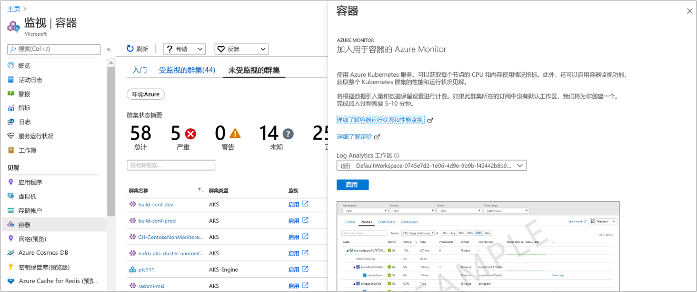

# <a name="enable-monitoring-of-azure-kubernetes-service-aks-cluster-already-deployed"></a>启用已部署的 Azure Kubernetes Service （AKS）群集的监视

本文介绍如何设置容器的 Azure Monitor，以监视托管在[Azure Kubernetes Service](https://docs.microsoft.com/azure/aks/)上并且已在订阅中部署的托管 Kubernetes 群集。

可以使用受支持的方法之一来启用已部署的 AKS 群集的监视：

* Azure CLI
* Terraform
* [从 Azure Monitor](#enable-from-azure-monitor-in-the-portal)或[直接从 AZURE 门户中的 AKS 群集](#enable-directly-from-aks-cluster-in-the-portal)
* 通过使用 Azure PowerShell cmdlet `New-AzResourceGroupDeployment` 或 Azure CLI 来[提供 Azure 资源管理器模板](#enable-using-an-azure-resource-manager-template)。

## <a name="sign-in-to-the-azure-portal"></a>登录到 Azure 门户

登录 [Azure 门户](https://portal.azure.com)。

## <a name="enable-using-azure-cli"></a>启用 Azure CLI

以下步骤使用 Azure CLI 对 AKS 群集启用监视。 在此示例中，不需要预先创建或指定现有的工作区。 如果区域中尚不存在默认的工作区，此命令可以简化在 AKS 群集订阅的默认资源组中创建默认工作区的过程。  创建的默认工作区的格式类似于 *DefaultWorkspace-\<GUID>-\<Region>* 。  

```azurecli
az aks enable-addons -a monitoring -n MyExistingManagedCluster -g MyExistingManagedClusterRG  
```

输出如下所示：

```output
provisioningState       : Succeeded
```

### <a name="integrate-with-an-existing-workspace"></a>与现有工作区集成

如果要将与现有工作区集成，请执行以下步骤，以首先确定 `--workspace-resource-id` 参数所需的 Log Analytics 工作区的完整资源 ID，然后运行命令，针对指定的工作区启用监视外接程序。  

1. 使用以下命令列出你有权访问的所有订阅：

    ```azurecli
    az account list --all -o table
    ```

    输出如下所示：

    ```output
    Name                                  CloudName    SubscriptionId                        State    IsDefault
    ------------------------------------  -----------  ------------------------------------  -------  -----------
    Microsoft Azure                       AzureCloud   68627f8c-91fO-4905-z48q-b032a81f8vy0  Enabled  True
    ```

    复制 " **SubscriptionId**" 的值。

2. 使用以下命令切换到承载 Log Analytics 工作区的订阅：

    ```azurecli
    az account set -s <subscriptionId of the workspace>
    ```

3. 下面的示例以默认 JSON 格式显示订阅中的工作区列表。

    ```azurecli
    az resource list --resource-type Microsoft.OperationalInsights/workspaces -o json
    ```

    在输出中找到工作区名称，然后将该 Log Analytics 工作区的完整资源 ID 复制到字段**id**下。

4. 运行以下命令以启用监视外接程序，并替换 `--workspace-resource-id` 参数的值。 字符串值必须在双引号内：

    ```azurecli
    az aks enable-addons -a monitoring -n ExistingManagedCluster -g ExistingManagedClusterRG --workspace-resource-id "/subscriptions/<SubscriptionId>/resourceGroups/<ResourceGroupName>/providers/Microsoft.OperationalInsights/workspaces/<WorkspaceName>"
    ```

    输出如下所示：

    ```output
    provisioningState       : Succeeded
    ```

## <a name="enable-using-terraform"></a>使用 Terraform

1. 将 oms_agent 附加配置文件添加到现有 [azurerm_kubernetes_cluster](https://www.terraform.io/docs/providers/azurerm/d/kubernetes_cluster.html#addon_profile) 资源

   ```
   addon_profile {
    oms_agent {
      enabled                    = true
      log_analytics_workspace_id = "${azurerm_log_analytics_workspace.test.id}"
     }
   }
   ```

2. 按照 Terraform 文档中的步骤添加 [ azurerm_log_analytics_solution](https://www.terraform.io/docs/providers/azurerm/r/log_analytics_solution.html)。

## <a name="enable-from-azure-monitor-in-the-portal"></a>从门户中的 Azure Monitor 启用

要启用 Azure Monitor 对 Azure 门户中的 AKS 群集的监视，请执行以下操作：

1. 在 Azure 门户中选择“监视”。

2. 从列表中选择容器。

3. 在“监视 - 容器”页上，选择“非监视群集”。

4. 从非监视群集的列表中找到容器，然后单击“启用”。   

5. 在“载入到用于容器的 Azure Monitor”页上，如果现有 Log Analytics 工作区与群集在同一订阅中，请从下拉列表中选择该工作区。  
    列表预先选择了 AKS 容器在订阅中部署到的默认工作区和位置。

    

    >[!NOTE]
    >如果想要创建新的 Log Analytics 工作区用于存储来自群集的监视数据，请按照[创建 Log Analytics 工作区](../../azure-monitor/learn/quick-create-workspace.md)中的说明进行操作。 确保在部署 AKS 容器的同一订阅中创建工作区。

启用监视后，可能需要约 15 分钟才能查看群集的运行状况指标。

## <a name="enable-directly-from-aks-cluster-in-the-portal"></a>直接从门户中的 AKS 群集启用

若要直接从 Azure 门户中的一个 AKS 群集启用监视，请执行以下操作：

1. 在 Azure 门户中，选择“所有服务”。

2. 在资源列表中，开始键入“Containers”。  列表会根据输入的内容进行筛选。

3. 选择“Kubernetes 服务”。  

    

4. 在容器列表中，选择一个容器。

5. 在容器概述页面中，选择“监视容器”。  

6. 在“载入到用于容器的 Azure Monitor”页上，如果现有 Log Analytics 工作区与群集在同一订阅中，请从下拉列表中选择该工作区。  
    列表预先选择了 AKS 容器在订阅中部署到的默认工作区和位置。

    

    >[!NOTE]
    >如果想要创建新的 Log Analytics 工作区用于存储来自群集的监视数据，请按照[创建 Log Analytics 工作区](../../azure-monitor/learn/quick-create-workspace.md)中的说明进行操作。 确保在部署 AKS 容器的同一订阅中创建工作区。

启用监视后，可能需要约 15 分钟才能查看群集的运行数据。

## <a name="enable-using-an-azure-resource-manager-template"></a>使用 Azure 资源管理器模板启用

此方法包含两个 JSON 模板。 一个模板指定用于启用监视的配置，另一个模板包含参数值，通过配置这些参数值可指定：

* AKS 容器资源 ID。
* 在其中部署群集的资源组。

>[!NOTE]
>模板需要部署在群集所在的资源组中。
>

使用 Azure PowerShell 或 CLI 启用监视之前，必须先创建 Log Analytics 工作区。 若要创建工作区，可通过 [Azure 资源管理器](../../azure-monitor/platform/template-workspace-configuration.md)、[PowerShell](../scripts/powershell-sample-create-workspace.md?toc=%2fpowershell%2fmodule%2ftoc.json) 或在 [Azure 门户](../../azure-monitor/learn/quick-create-workspace.md)中进行设置。

如果不熟悉使用模板部署资源的概念，请参阅：

* [使用 Resource Manager 模板和 Azure PowerShell 部署资源](../../azure-resource-manager/templates/deploy-powershell.md)

* [使用资源管理器模板和 Azure CLI 部署资源](../../azure-resource-manager/templates/deploy-cli.md)

如果选择使用 Azure CLI，首先需要在本地安装和使用 CLI。 必须运行 Azure CLI 版本2.0.59 或更高版本。 若要确定版本，请运行 `az --version`。 如果需要安装或升级 Azure CLI，请参阅[安装 Azure CLI](https://docs.microsoft.com/cli/azure/install-azure-cli)。

### <a name="create-and-execute-a-template"></a>创建和执行模板

1. 将以下 JSON 语法复制并粘贴到文件中：

    ```json
    {
      "$schema": "https://schema.management.azure.com/schemas/2015-01-01/deploymentTemplate.json#",
      "contentVersion": "1.0.0.0",
      "parameters": {
        "aksResourceId": {
          "type": "string",
          "metadata": {
            "description": "AKS Cluster Resource ID"
          }
        },
        "aksResourceLocation": {
          "type": "string",
          "metadata": {
            "description": "Location of the AKS resource e.g. \"East US\""
          }
        },
        "aksResourceTagValues": {
          "type": "object",
          "metadata": {
            "description": "Existing all tags on AKS Cluster Resource"
          }
        },
        "workspaceResourceId": {
          "type": "string",
          "metadata": {
            "description": "Azure Monitor Log Analytics Resource ID"
          }
        }
      },
      "resources": [
        {
          "name": "[split(parameters('aksResourceId'),'/')[8]]",
          "type": "Microsoft.ContainerService/managedClusters",
          "location": "[parameters('aksResourceLocation')]",
          "tags": "[parameters('aksResourceTagValues')]",
          "apiVersion": "2018-03-31",
          "properties": {
            "mode": "Incremental",
            "id": "[parameters('aksResourceId')]",
            "addonProfiles": {
              "omsagent": {
                "enabled": true,
                "config": {
                  "logAnalyticsWorkspaceResourceID": "[parameters('workspaceResourceId')]"
                }
              }
            }
          }
        }
      ]
    }
    ```

2. 将此文件以“existingClusterOnboarding.json”文件名保存到本地文件夹。

3. 将以下 JSON 语法粘贴到文件中：

    ```json
    {
      "$schema": "https://schema.management.azure.com/schemas/2015-01-01/deploymentParameters.json#",
      "contentVersion": "1.0.0.0",
      "parameters": {
        "aksResourceId": {
          "value": "/subscriptions/<SubscriptionId>/resourcegroups/<ResourceGroup>/providers/Microsoft.ContainerService/managedClusters/<ResourceName>"
        },
        "aksResourceLocation": {
          "value": "<aksClusterLocation>"
        },
        "workspaceResourceId": {
          "value": "/subscriptions/<SubscriptionId>/resourceGroups/<ResourceGroup>/providers/Microsoft.OperationalInsights/workspaces/<workspaceName>"
        },
        "aksResourceTagValues": {
          "value": {
            "<existing-tag-name1>": "<existing-tag-value1>",
            "<existing-tag-name2>": "<existing-tag-value2>",
            "<existing-tag-nameN>": "<existing-tag-valueN>"
          }
        }
      }
    }
    ```

4. 使用 AKS 群集的**AKS 概述**页上的值编辑**aksResourceId**和**aksResourceLocation**的值。 **workspaceResourceId** 的值是 Log Analytics 工作区的完整资源 ID，其中包含工作区名称。

    编辑**aksResourceTagValues**的值以匹配为 AKS 群集指定的现有标记值。

5. 将此文件以“existingClusterParam.json”文件名保存到本地文件夹。

6. 已做好部署此模板的准备。

   * 若要使用 Azure PowerShell 进行部署，请在包含模板的文件夹中使用以下命令：

       ```powershell
       New-AzResourceGroupDeployment -Name OnboardCluster -ResourceGroupName <ResourceGroupName> -TemplateFile .\existingClusterOnboarding.json -TemplateParameterFile .\existingClusterParam.json
       ```

       配置更改可能需要几分钟才能完成。 完成后，系统会显示包含结果的消息，如下所示：

       ```output
       provisioningState       : Succeeded
       ```

   * 若要 Azure CLI 部署，请运行以下命令：

       ```azurecli
       az login
       az account set --subscription "Subscription Name"
       az group deployment create --resource-group <ResourceGroupName> --template-file ./existingClusterOnboarding.json --parameters @./existingClusterParam.json
       ```

       配置更改可能需要几分钟才能完成。 完成后，系统会显示包含结果的消息，如下所示：

       ```output
       provisioningState       : Succeeded
       ```

       启用监视后，可能需要约 15 分钟才能查看群集的运行状况指标。

## <a name="verify-agent-and-solution-deployment"></a>验证代理和解决方案部署

如果代理版本为 *06072018* 或更高版本，则可验证代理和解决方案是否均已成功部署。 如果是早期版本的代理，则只能验证代理的部署情况。

### <a name="agent-version-06072018-or-later"></a>06072018 版或更高版本的代理

运行以下命令，验证代理是否已成功部署。

```
kubectl get ds omsagent --namespace=kube-system
```

输出应如下所示，指明其已正确部署：

```output
User@aksuser:~$ kubectl get ds omsagent --namespace=kube-system
NAME       DESIRED   CURRENT   READY     UP-TO-DATE   AVAILABLE   NODE SELECTOR                 AGE
omsagent   2         2         2         2            2           beta.kubernetes.io/os=linux   1d
```  

若要验证解决方案的部署，请运行以下命令：

```
kubectl get deployment omsagent-rs -n=kube-system
```

输出应如下所示，指明其已正确部署：

```output
User@aksuser:~$ kubectl get deployment omsagent-rs -n=kube-system
NAME       DESIRED   CURRENT   UP-TO-DATE   AVAILABLE    AGE
omsagent   1         1         1            1            3h
```

### <a name="agent-version-earlier-than-06072018"></a>代理版本低于 06072018

若要验证 06072018 之前发布的 Log Analytics 代理版本是否已正确部署，请运行以下命令：  

```
kubectl get ds omsagent --namespace=kube-system
```

输出应如下所示，指明其已正确部署：  

```output
User@aksuser:~$ kubectl get ds omsagent --namespace=kube-system
NAME       DESIRED   CURRENT   READY     UP-TO-DATE   AVAILABLE   NODE SELECTOR                 AGE
omsagent   2         2         2         2            2           beta.kubernetes.io/os=linux   1d
```  

## <a name="view-configuration-with-cli"></a>使用 CLI 查看配置

使用 `aks show` 命令获取详细信息，例如，解决方案是否已启用、Log Analytics 工作区 resourceID 是什么，以及有关群集的摘要详细信息。  

```azurecli
az aks show -g <resourceGroupofAKSCluster> -n <nameofAksCluster>
```

片刻之后，该命令将会完成，并返回有关解决方案的 JSON 格式信息。  命令结果应显示监视加载项配置文件，并类似于以下示例输出：

```output
"addonProfiles": {
    "omsagent": {
      "config": {
        "logAnalyticsWorkspaceResourceID": "/subscriptions/<WorkspaceSubscription>/resourceGroups/<DefaultWorkspaceRG>/providers/Microsoft.OperationalInsights/workspaces/<defaultWorkspaceName>"
      },
      "enabled": true
    }
  }
```

## <a name="next-steps"></a>后续步骤

* 如果在尝试载入解决方案时遇到问题，请查看[故障排除指南](container-insights-troubleshoot.md)

* 启用监视功能以收集 AKS 群集的运行状况和资源利用率，并了解[如何使用](container-insights-analyze.md)容器 Azure Monitor。
