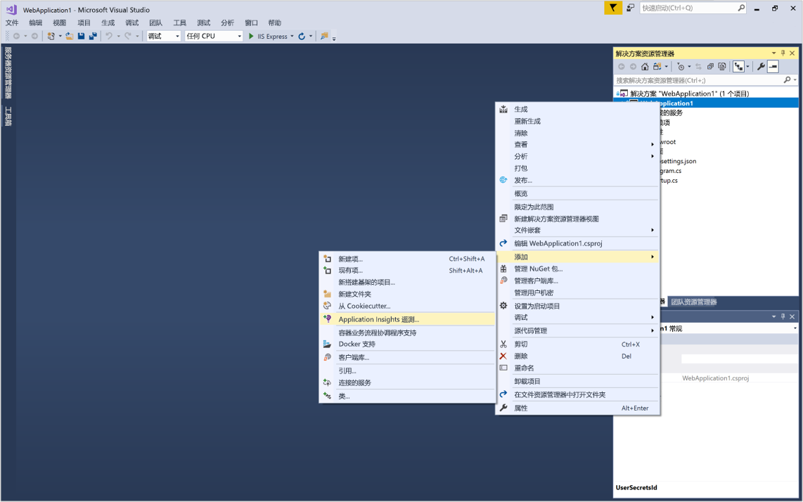
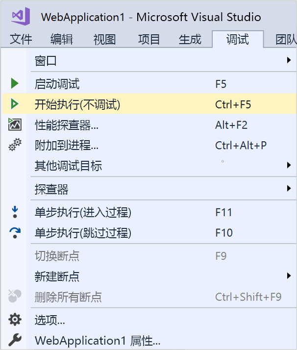
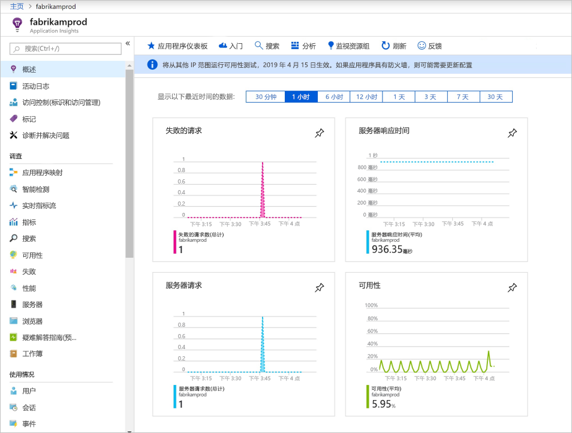
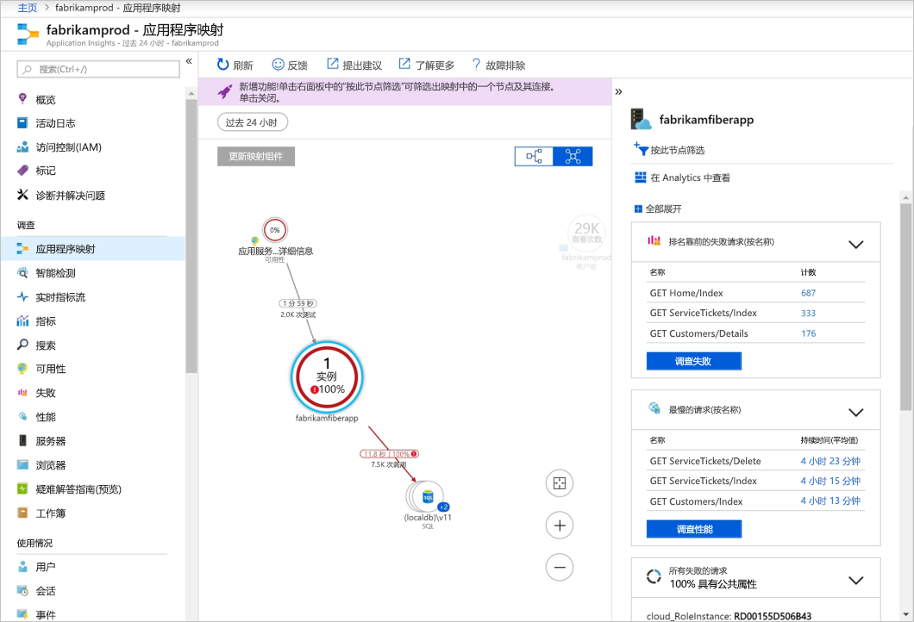
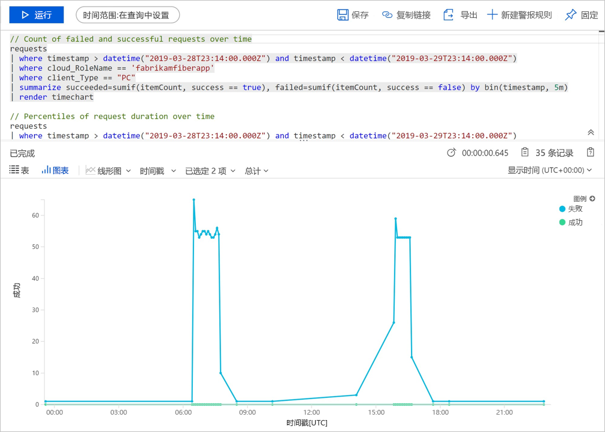
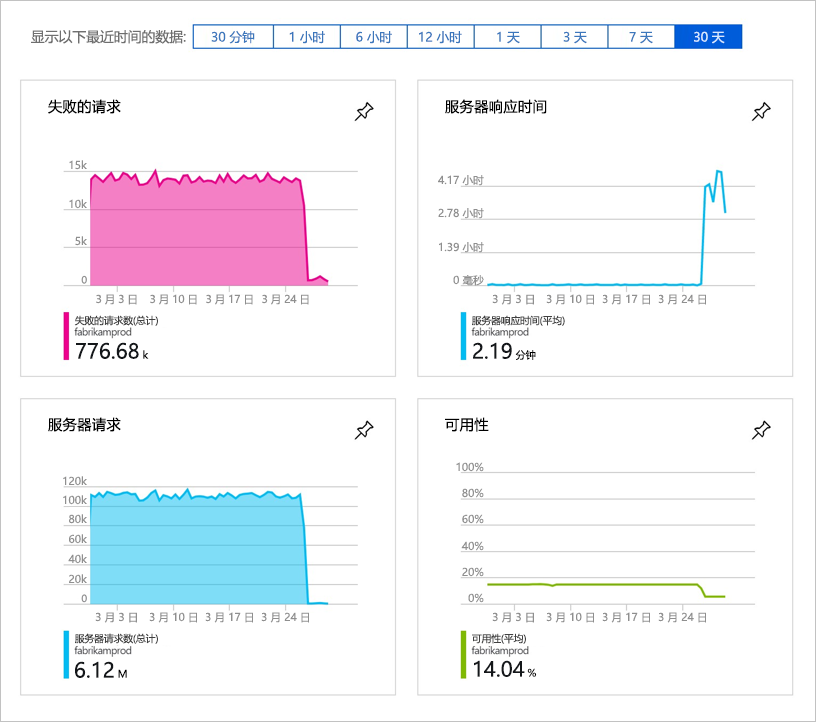
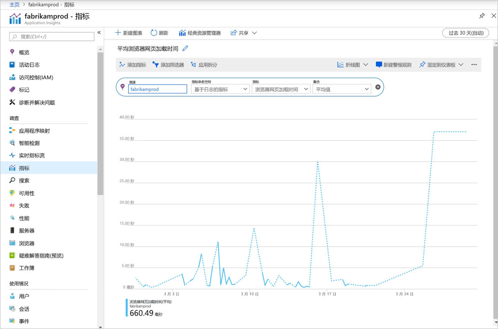

# 开始监视 ASP.NET Core Web 应用程序

使用 Azure Application Insights，可轻松监视 Web 应用程序的可用性、性能和使用情况。 还可以快速确定并诊断应用程序中的错误，而无需等待用户报告这些错误。 

本快速入门介绍如何将 Application Insights SDK 添加到现有 ASP.NET Core Web 应用程序。 若要了解如何在没有 Visual Studio 的情况下配置 Application Insights，请查看此[文章](https://docs.microsoft.com/azure/azure-monitor/app/asp-net-core)。

## 先决条件

完成本快速入门教程需要：

- 使用以下工作负荷安装 [Visual Studio 2019](https://www.visualstudio.com/downloads/)：
  - ASP.NET 和 Web 开发
  - Azure 开发
- [安装 .NET Core 2.0 SDK](https://www.microsoft.com/net/core)
- 将需要 Azure 订阅和现有 .NET Core Web 应用程序。

如果没有 ASP.NET Core Web 应用程序，可以使用分步指南来[创建 ASP.NET Core 应用并添加 Application Insights](../../azure-monitor/app/asp-net-core.md)。

如果没有 Azure 订阅，请在开始之前创建一个[免费](https://azure.microsoft.com/free/)帐户。

## 登录到 Azure 门户

登录到 [Azure 门户](https://portal.azure.com/)。

## 启用 Application Insights

Application Insights 可以从任何连接 Internet 的应用程序收集遥测数据，而不考虑它是在本地运行还是在云中运行。 按照以下步骤开始查看此数据。

1. 选择“创建资源”   >   “开发人员工具” >   “Application Insights”。

   > [!NOTE]
   >如果这是你首次创建 Application Insights 资源，可以通过访问[创建 Application Insights 资源](https://docs.microsoft.com/azure/azure-monitor/app/create-new-resource)文档来了解更多信息。

    此时会显示配置对话框，请使用下表填写输入字段。

   | 设置        |  值           | 说明  |
   | ------------- |:-------------|:-----|
   | **名称**      | 全局唯一值 | 标识所监视的应用的名称 |
   | **资源组**     | myResourceGroup      | 用于托管 App Insights 数据的新资源组的名称 |
   | **位置** | 美国东部 | 选择离你近的位置或离托管应用的位置近的位置 |

2. 单击“创建”。 

## 配置 App Insights SDK

1. 在 Visual Studio 中打开 ASP.NET Core Web 应用**项目** > 在**解决方案资源管理器**中右键单击“应用名称”> 选择“添加”   > “Application Insights 遥测”  。

    

2. 单击“入门”  按钮

3. 选择帐户和订阅 > 选择在 Azure 门户中创建的**现有资源** > 单击“注册”。 

4. 选择“项目” > “管理 NuGet 包” > “包源: nuget.org” > “更新”，将 Application Insights SDK 包更新到最新稳定版本     。

5. 选择“调试”   > “开始执行(不调试)”  (Ctrl+F5) 启动应用

    

> [!NOTE]
> 这需要 3-5 分钟，然后数据才开始显示在门户中。 如果此应用是一个低流量测试应用，请记住，仅当存在活动请求或操作时，才会捕获大多数指标。

## 开始在 Azure 门户中监视

1. 在 Azure 门户中重新打开 Application Insights 的“概述”  页（选择“主页”  ，然后在最新资源下选择此前创建的资源），以便查看有关当前正在运行的应用程序的详细信息。

   

2. 单击“应用程序映射”  以获取应用程序组件之间依赖关系的可视布局。 每个组件均显示 KPI，如负载、性能、失败和警报。

   

3. 单击“应用分析”  图标   “在 Analytics 中查看”。 这将打开“Application Insights Analytics”  ，该软件提供丰富的查询语言，可用于分析 Application Insights 收集的所有数据。 在本示例中，将生成以图表形式呈现请求计数的查询。 可以编写自己的查询来分析其他数据。

   

4. 返回到“概述”  页并检查 KPI 仪表板。  此仪表板提供有关应用程序运行状况的统计信息，包括传入请求数、这些请求的持续时间，以及发生的任何故障。 

   

5. 在左侧单击“指标”  。 使用指标资源管理器调查资源的运行状况和利用率。 可以单击“添加新图表”  创建其他自定义视图，或者选择“编辑”  修改现有的图表类型、高度、调色板、分组和指标。 例如，可以制作一个图表来显示浏览器页面的平均加载时间，只需从指标下拉列表中选取“浏览器页面加载时间”并从聚合中选择“平均”即可。 若要详细了解 Azure 指标资源管理器，请访问 [Azure 指标资源管理器入门](../../azure-monitor/platform/metrics-getting-started.md)。

     

## 视频

- 有关从头开始[使用 NET Core 和 Visual Studio 配置 Application Insights](https://www.youtube.com/watch?v=NoS9UhcR4gA&t) 的外部分步说明视频。
- 有关从头开始[使用 .NET Core 和 Visual Studio Code 配置 Application Insights](https://youtu.be/ygGt84GDync) 的外部分步说明视频。

## 清理资源
完成测试后，即可删除资源组和所有相关的资源。 为此，请执行以下步骤。

1. 在 Azure 门户的左侧菜单中，单击“资源组”  ，然后单击“myResourceGroup”  。
2. 在资源组页上单击“删除”  ，在文本框中键入 **myResourceGroup**，然后单击“删除”  。

## 后续步骤

> [!div class="nextstepaction"]
> [查找和诊断运行时异常](https://docs.microsoft.com/azure/application-insights/app-insights-tutorial-runtime-exceptions)
