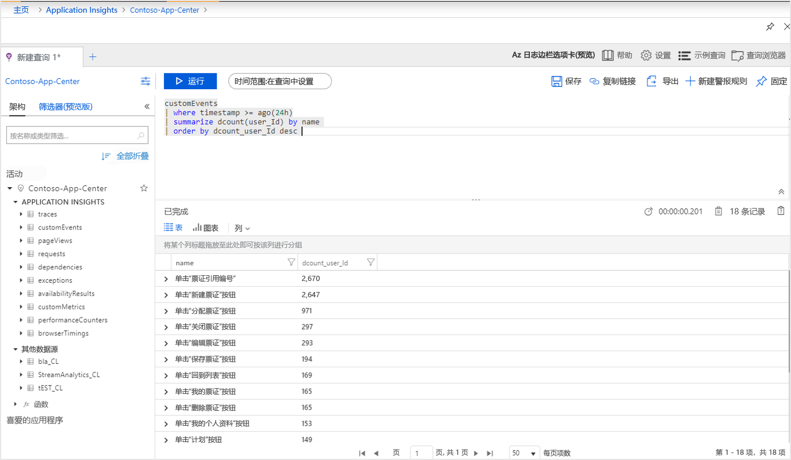
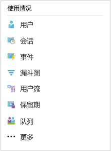
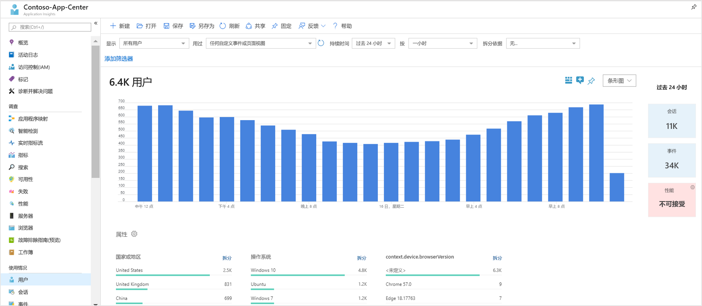
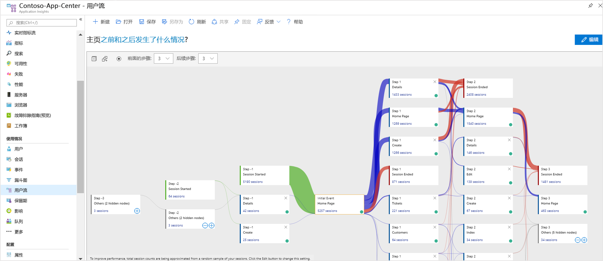

# <a name="start-analyzing-your-mobile-app-with-app-center-and-application-insights"></a>开始使用 App Center 和 Application Insights 分析移动应用

本快速入门将指导你完成将应用的 App Center 实例连接到 Application Insights 的整个过程。 与 App Center 的[分析](https://docs.microsoft.com/mobile-center/analytics/)服务提供的工具相比，Application Insights 的功能更为强大，可让你对遥测数据进行更准确的查询、分段、筛选和分析。

## <a name="prerequisites"></a>先决条件

若要完成本快速入门，你需要：

- Azure 订阅。
- iOS、Android、Xamarin、通用 Windows 或 React 本机应用。
 
如果没有 Azure 订阅，请在开始之前创建一个[免费](https://azure.microsoft.com/free/)帐户。

## <a name="sign-up-with-app-center"></a>使用 App Center 注册
首先，创建一个帐户并[使用 App Center 注册](https://appcenter.ms/signup?utm_source=ApplicationInsights&utm_medium=Azure&utm_campaign=docs)。

## <a name="onboard-to-app-center"></a>载入到 App Center

在将 Application Insights 用于移动应用之前，需要将应用载入 [App Center](https://docs.microsoft.com/mobile-center/)。 Application Insights 不直接从移动应用接收遥测。 而是，应用会将自定义事件遥测发送到 App Center。 然后，App Center 会在收到事件时，将这些自定义事件的副本连续导出到 Application Insights。 （这不适用于 [Application Insights JS SDK](https://github.com/Microsoft/ApplicationInsights-JS) 或 [React Native 插件](https://github.com/Microsoft/ApplicationInsights-JS/tree/master/extensions/applicationinsights-react-native)，其中遥测直接发送到 Application Insights。）

若要载入应用，请按照应用支持的每个平台的 App Center 快速入门进行操作。 为每个平台创建单独的 App Center 实例：

* [iOS](https://docs.microsoft.com/mobile-center/sdk/getting-started/ios)。
* [Android](https://docs.microsoft.com/mobile-center/sdk/getting-started/android)。
* [Xamarin](https://docs.microsoft.com/mobile-center/sdk/getting-started/xamarin)。
* [通用 Windows](https://docs.microsoft.com/mobile-center/sdk/getting-started/uwp)。
* [React 本机](https://docs.microsoft.com/mobile-center/sdk/getting-started/react-native)。

## <a name="track-events-in-your-app"></a>跟踪应用中的事件

在将应用载入到 App Center 后，需要对其进行修改，以使用 App Center SDK 发送自定义事件遥测。 自定义事件是导出到 Application Insights 的唯一一种 App Center 遥测。

若要从 iOS 应用发送自定义事件，请在 App Center SDK 中使用 `trackEvent` 或 `trackEvent:withProperties` 方法。 [了解有关从 iOS 应用跟踪事件的详细信息。](https://docs.microsoft.com/mobile-center/sdk/analytics/ios)

```Swift
MSAnalytics.trackEvent("Video clicked")
```

若要从 Android 应用发送自定义事件，请在 App Center SDK 中使用 `trackEvent` 方法。 [了解有关从 Android 应用跟踪事件的详细信息。](https://docs.microsoft.com/mobile-center/sdk/analytics/android)

```Java
Analytics.trackEvent("Video clicked")
```

若要从其他应用平台发送自定义事件，请在其 App Center SDK 中使用 `trackEvent` 方法。

若要确保收到自定义事件，请转到 App Center“分析”  部分下的“事件”  选项卡。 从应用发送事件后，可能需要等待几分钟才会显示事件。

## <a name="create-an-application-insights-resource"></a>创建 Application Insights 资源

在应用发送自定义事件，并且 App Center 收到这些事件后，需要在 Azure 门户中创建 App Center 类型的 Application Insights 资源：

1. 登录 [Azure 门户](https://portal.azure.com/)。
2. 选择“创建资源”   >   “开发人员工具” >   “Application Insights”。

    > [!NOTE]
    > 如果这是你首次创建 Application Insights 资源，可以通过访问[创建 Application Insights 资源](https://docs.microsoft.com/azure/azure-monitor/app/create-new-resource)文档来了解更多信息。

    随后会显示一个配置对话框。 请使用下表填写输入字段。

    | 设置        |  值           | 说明  |
   | ------------- |:-------------|:-----|
   | **名称**      | 某些全局唯一值，如“myApp-iOS” | 标识所监视的应用的名称 |
     | **资源组**     | 一个新资源组或菜单中的一个现有资源组 | 在其中创建新 Application Insights 资源的资源组 |
   | **位置** | 菜单中的某个位置 | 选择离你近的位置或离托管应用的位置近的位置 |

3. 单击“创建”。 

如果应用支持多个平台（iOS、Android 等），则最好创建单独的 Application Insights 资源，每个平台使用一个资源。

## <a name="export-to-application-insights"></a>导出到 Application Insights

在“概述”页面上的新 Application Insights 资源中  。 从资源中复制检测密钥。

在应用的 [App Center](https://appcenter.ms/) 实例中，执行以下操作：

1. 在“设置”  页上，单击“导出”  。
2. 选择“新建导出”  ，选择“Application Insights”  ，然后单击“自定义”  。
3. 将 Application Insights 检测密钥粘贴到此框中。
4. 同意增加包含 Application Insights 资源的 Azure 订阅的使用量。 每个 Application Insights 资源对每月收到的前 1GB 数据是免费的。 [了解有关 Application Insights 定价的详细信息。](https://azure.microsoft.com/pricing/details/application-insights/)

请务必为应用支持的每个平台重复此过程。

在设置[导出](https://docs.microsoft.com/mobile-center/analytics/export)后，会将 App Center 收到的每个自定义事件复制到 Application Insights 中。 可能需要几分钟的时间才能将事件复制到 Application Insights 中，因此，如果事件未立即显示，请等待一段时间，然后再做进一步的诊断。

为了在首次连接时提供更多的数据，会将 App Center 中最近 48 小时的自定义事件自动导出到 Application Insights。

## <a name="start-monitoring-your-app"></a>开始监视应用

Application Insights 可以查询、分段、筛选和分析来自应用的自定义事件遥测，相比 App Center 提供的分析工具，其功能更为强大。

1. **查询自定义事件遥测。** 在 Application Insights“概述”  页上，选择“日志(分析)”  。

   将打开与 Application Insights 资源关联的 Application Insights 日志（分析）门户。 通过日志（分析）门户，可以直接使用 Log Analytics 查询语言来查询数据，因此，可以询问有关应用及其用户的任意复杂的问题。
   
   在日志（分析）门户中打开一个新选项卡，然后粘贴以下查询。 它将返回在过去24小时内从应用发送每个自定义事件的用户数，这些数量按照非重复计数排序。

   ```AIQL
   customEvents
   | where timestamp >= ago(24h)
   | summarize dcount(user_Id) by name 
   | order by dcount_user_Id desc 
   ```

   

   1. 通过单击文本编辑器中查询的任意位置，选择此查询。
   2. 然后，单击“运行”  运行查询。 

   详细了解有关 [Application Insights 分析](../../azure-monitor/app/analytics.md)和 [Log Analytics 查询语言](https://aka.ms/LogAnalyticsLanguageReference)的信息。


2. **分段和筛选自定义事件遥测。** 从 Application Insights“概述”  页面上，选择目录中的“用户”  。

   

   用户工具可显示你的应用中有多少用户点击了某些按钮、访问了某些屏幕或使用 App Center SDK 执行了作为事件进行跟踪的任何其他操作。 如果你一直在寻找对 App Center 事件进行分段和筛选的方法，那么用户工具会是一个不错的选择。

    

   例如，通过选择“拆分依据”  下拉菜单中的“国家或地区”  ，来根据地域对使用量进行分段。

3. **分析应用中的转换、保留和导航模式。** 从 Application Insights“概述”  页面上，选择目录中的“用户流”  。

   

   用户流工具直观显示用户在某些起始事件之后发送的事件。 它可用于获取用户浏览应用的整体情况。 它可以显示许多用户改动应用的地方，或反复执行相同操作的地方。

   除了用户流，Application Insights 还提供几种其他用户行为分析工具来回答特定的问题：

   * 漏斗图  ，用于分析和监视转换率。
   * 保留  ，用于分析随着时间的推移应用保留用户的情况。
   * 工作簿  ，用于将可视化效果和文本组合到可共享的报表中。
   * 队列  ，用于命名和保存特定用户或事件组，以便可以轻松地通过其他分析工具引用它们。

## <a name="clean-up-resources"></a>清理资源

如果不希望继续将 Application Insights 和 App Center 一起使用，请关闭 App Center 中的导出并删除 Application Insights 资源。 这将防止 Application Insights 进一步收取此资源的费用。

要关闭 App Center 中的导出，请执行以下操作：

1. 在 App Center 中，转到“设置”  ，然后选择“导出”  。
2. 单击想要删除的 Application Insights 导出，然后单击底部的“删除导出”  并确认。

要删除 Application Insights 资源，请执行以下操作：

1. 在 Azure 门户的左侧菜单中，单击“资源组”  ，然后选择在其中创建 Application Insights 资源的资源组。
2. 打开要删除的 Application Insights 资源。 然后在该资源的顶部菜单中单击“删除”  并确认。 这将永久删除导出到 Application Insights 的数据的副本。

## <a name="next-steps"></a>后续步骤

> [!div class="nextstepaction"]
> [了解客户如何使用应用](../../azure-monitor/app/usage-overview.md)
