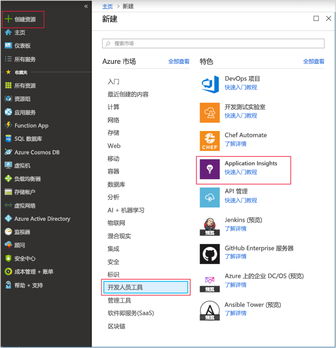
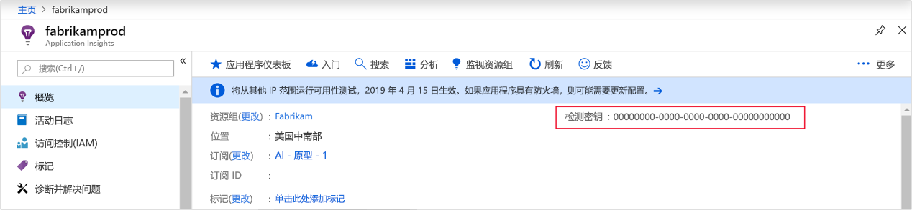
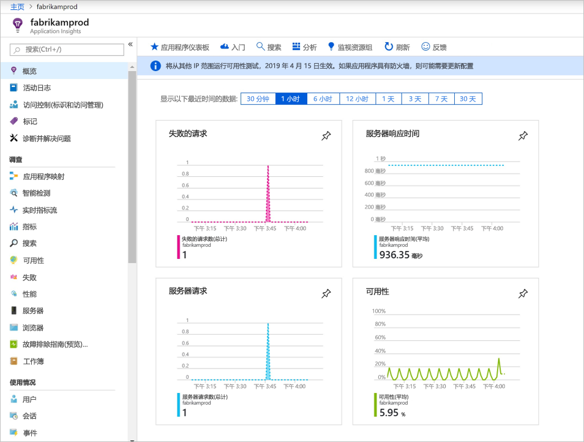
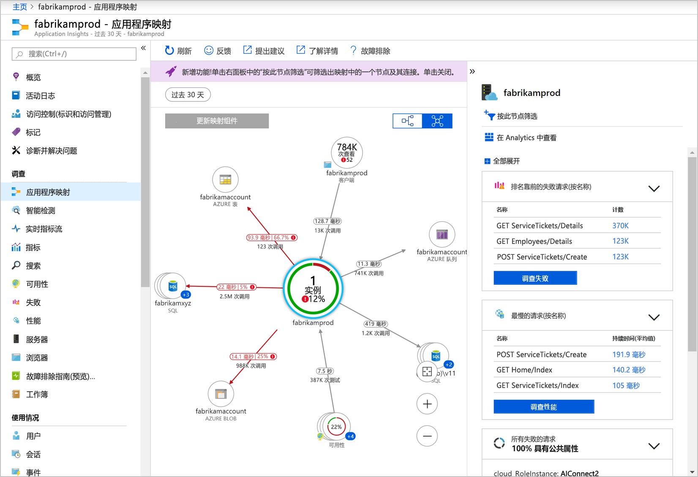
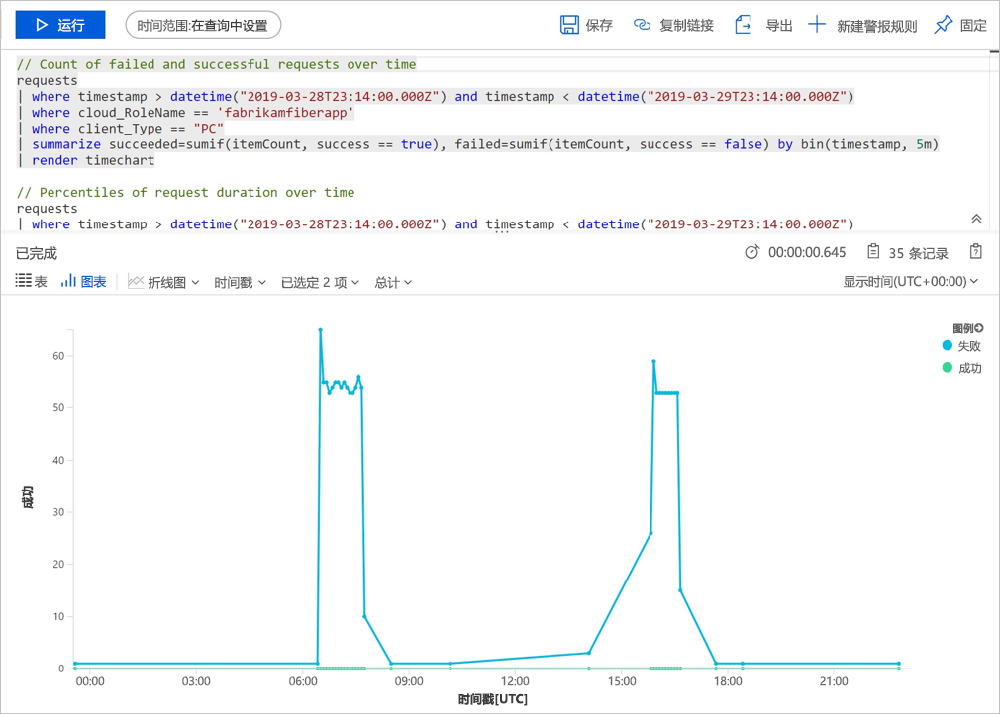
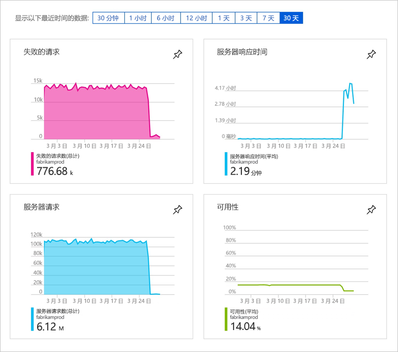
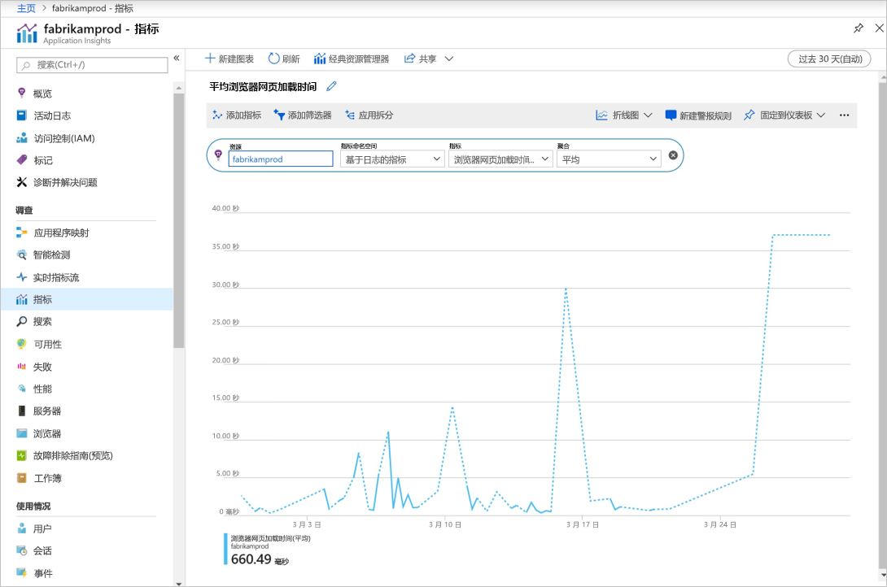

# <a name="quickstart-start-monitoring-your-nodejs-web-application-with-azure-application-insights"></a>快速入门：使用 Azure Application Insights 开始监视 Node.js Web 应用程序

本快速入门介绍如何将用于 Node.js 的 0.22 版 Application Insights SDK 添加到现有 Node.js Web 应用程序。

使用 Azure Application Insights，可轻松监视 Web 应用程序的可用性、性能和使用情况。 还可以快速确定并诊断应用程序中的错误，而无需等待用户报告这些错误。 使用 0.20 版 SDK 发行版及更高版本，可以监视常见的第三方包，包括 MongoDB、MySQL 和 Redis。

## <a name="prerequisites"></a>先决条件

完成本快速入门教程需要：

- 需要 Azure 订阅和现有 Node.js Web 应用程序。

如果没有 Node.js Web 应用程序，则可以按照[创建 Node.js Web 应用快速入门](https://docs.microsoft.com/azure/app-service/app-service-web-get-started-nodejs)创建一个。

如果没有 Azure 订阅，请在开始之前创建一个[免费](https://azure.microsoft.com/free/)帐户。

## <a name="sign-in-to-the-azure-portal"></a>登录到 Azure 门户

登录到 [Azure 门户](https://portal.azure.com/)。

## <a name="enable-application-insights"></a>启用 Application Insights

Application Insights 可以从任何连接 Internet 的应用程序收集遥测数据，而不考虑它是在本地运行还是在云中运行。 按照以下步骤开始查看此数据。

1. 选择“创建资源”   >   “开发人员工具” >   “Application Insights”。

   

   > [!NOTE]
   >如果这是你首次创建 Application Insights 资源，可以通过访问[创建 Application Insights 资源](https://docs.microsoft.com/azure/azure-monitor/app/create-new-resource)文档来了解更多信息。

   此时会显示配置页，请使用下表填写输入字段。 

    | 设置        | 值           | 说明  |
   | ------------- |:-------------|:-----|
   | **名称**      | 全局唯一值 | 标识所监视的应用的名称 |
   | **应用程序类型** | Node.js 应用程序 | 所监视的应用的类型 |
   | **位置** | 美国东部 | 选择离你近的位置或离托管应用的位置近的位置 |

2. 选择“创建”  。

## <a name="configure-app-insights-sdk"></a>配置 App Insights SDK

1. 选择“概述”，然后复制应用程序的**检测密钥**。 

   

2. 将用于 Node.js 的 Application Insights SDK 添加到应用程序。 从应用的根文件夹运行：

   ```bash
   npm install applicationinsights --save
   ```

3. 编辑应用的第一个 .js 文件并将以下两行添加到脚本的最顶部部分。 如果使用的是 [Node.js 快速入门应用](https://docs.microsoft.com/azure/app-service/app-service-web-get-started-nodejs)，则将修改 index.js 文件。 将 &lt;instrumentation_key&gt; 替换为应用程序的检测密钥。 

   ```JavaScript
   const appInsights = require('applicationinsights');
   appInsights.setup('<instrumentation_key>').start();
   ```

4. 重启应用。

> [!NOTE]
> 这需要 3-5 分钟，然后数据才开始显示在门户中。 如果此应用是一个低流量测试应用，请记住，仅当存在活动请求或正在执行的操作时，才会捕获大多数指标。

## <a name="start-monitoring-in-the-azure-portal"></a>开始在 Azure 门户中监视

1. 现在可以在 Azure 门户中重新打开 Application Insights“概述”  页（已在其中检索到检测密钥），查看有关当前正在运行的应用程序的详细信息。

   

2. 选择“应用程序映射”  以获取应用程序组件之间依赖关系的可视布局。 每个组件均显示 KPI，如负载、性能、失败和警报。

   

3. 选择“应用分析”  图标   “在 Analytics 中查看”。  这将打开“Application Insights Analytics”  ，该软件提供丰富的查询语言，可用于分析 Application Insights 收集的所有数据。 在本示例中，将生成以图表形式呈现请求计数的查询。 可以编写自己的查询来分析其他数据。

   

4. 返回到“概述”  页并检查 KPI 图形。  此仪表板提供有关应用程序运行状况的统计信息，包括传入请求数、这些请求的持续时间，以及发生的任何故障。

   

   若要启用“页面视图加载时间”  图表以填充“客户端遥测”  数据，请将此脚本添加到要跟踪的每一页：

   ```HTML
   <!-- 
   To collect user behavior analytics tools about your application, 
   insert the following script into each page you want to track.
   Place this code immediately before the closing </head> tag,
   and before any other scripts. Your first data will appear 
   automatically in just a few seconds.
   -->
   <script type="text/javascript">
     var appInsights=window.appInsights||function(config){
       function i(config){t[config]=function(){var i=arguments;t.queue.push(function(){t[config].apply(t,i)})}}var t={config:config},u=document,e=window,o="script",s="AuthenticatedUserContext",h="start",c="stop",l="Track",a=l+"Event",v=l+"Page",y=u.createElement(o),r,f;y.src=config.url||"https://az416426.vo.msecnd.net/scripts/a/ai.0.js";u.getElementsByTagName(o)[0].parentNode.appendChild(y);try{t.cookie=u.cookie}catch(p){}for(t.queue=[],t.version="1.0",r=["Event","Exception","Metric","PageView","Trace","Dependency"];r.length;)i("track"+r.pop());return i("set"+s),i("clear"+s),i(h+a),i(c+a),i(h+v),i(c+v),i("flush"),config.disableExceptionTracking||(r="onerror",i("_"+r),f=e[r],e[r]=function(config,i,u,e,o){var s=f&&f(config,i,u,e,o);return s!==!0&&t["_"+r](config,i,u,e,o),s}),t
       }({
           instrumentationKey:"<insert instrumentation key>"
       });
       
       window.appInsights=appInsights;
       appInsights.trackPageView();
   </script>
   ```

5. 在左侧，选择“指标”。  使用指标资源管理器调查资源的运行状况和利用率。 可以选择“添加新图表”  创建其他自定义视图，或者选择“编辑”  修改现有的图表类型、高度、调色板、分组和指标。 例如，可以制作一个图表来显示浏览器页面的平均加载时间，只需从指标下拉列表中选择“浏览器页面加载时间”并从聚合中选择“平均”即可。 若要详细了解 Azure 指标资源管理器，请访问 [Azure 指标资源管理器入门](../../azure-monitor/platform/metrics-getting-started.md)。

   

若要了解有关监视 Node.js 的详细信息，请查看[其他 App Insights Node.js 文档](../../azure-monitor/app/nodejs.md)。

## <a name="clean-up-resources"></a>清理资源

完成测试后，即可删除资源组和所有相关的资源。 为此，请执行以下步骤。

1. 在 Azure 门户的左侧菜单中，选择“资源组”  ，然后选择“myResourceGroup”  。
2. 在资源组页上选择“删除”  ，在文本框中输入 **myResourceGroup**，然后选择“删除”  。

## <a name="next-steps"></a>后续步骤

> [!div class="nextstepaction"]
> [查找和诊断性能问题](https://docs.microsoft.com/azure/application-insights/app-insights-analytics)
