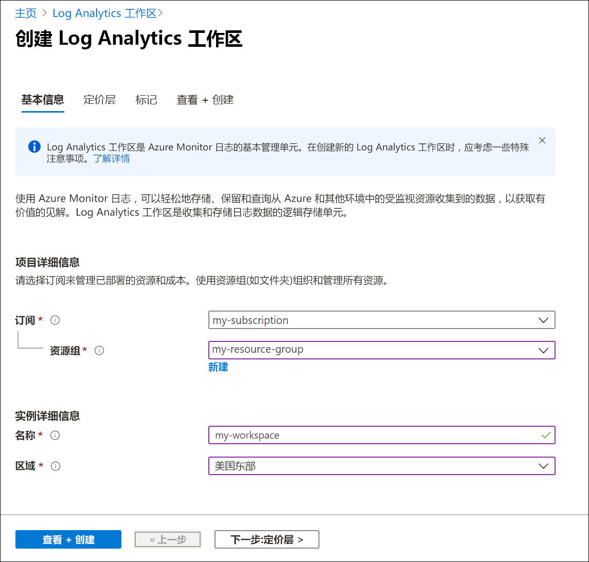
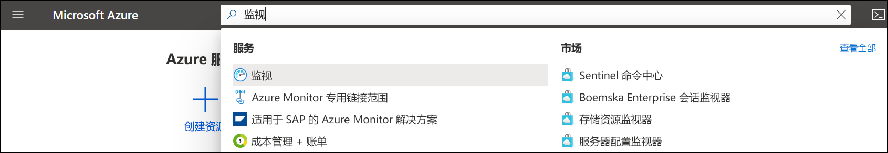
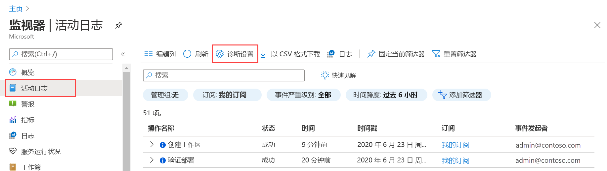
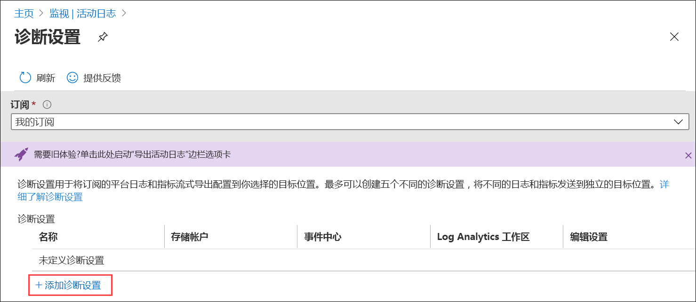
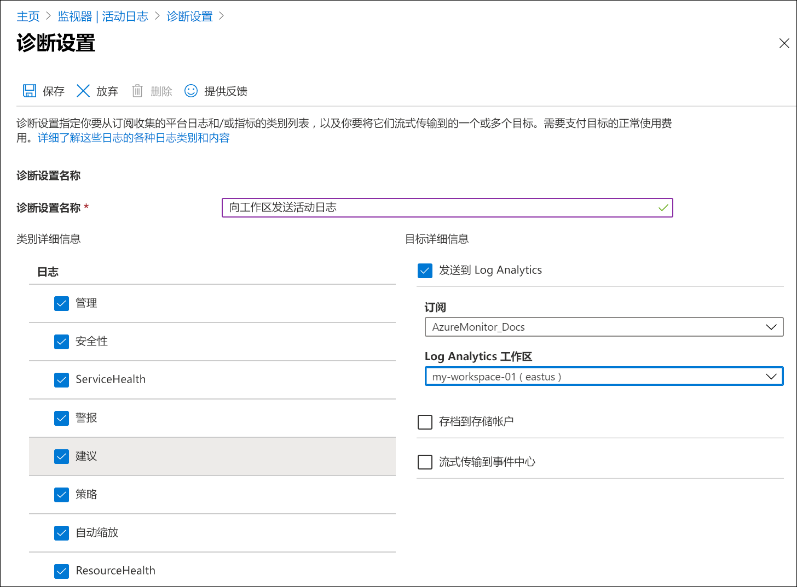
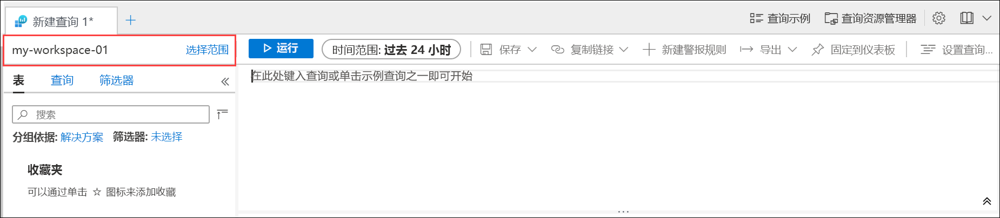
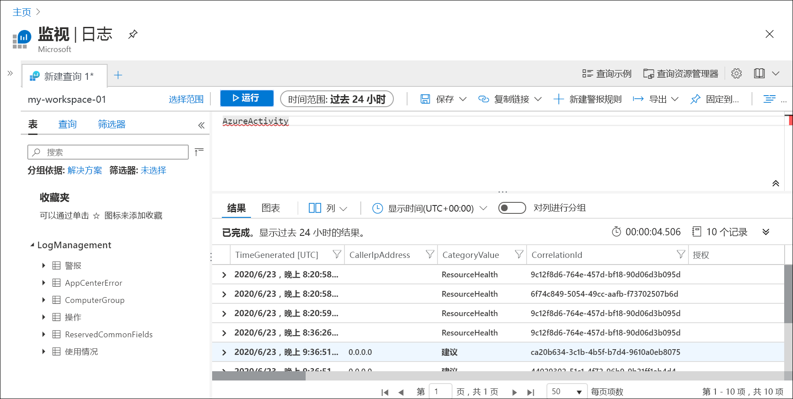
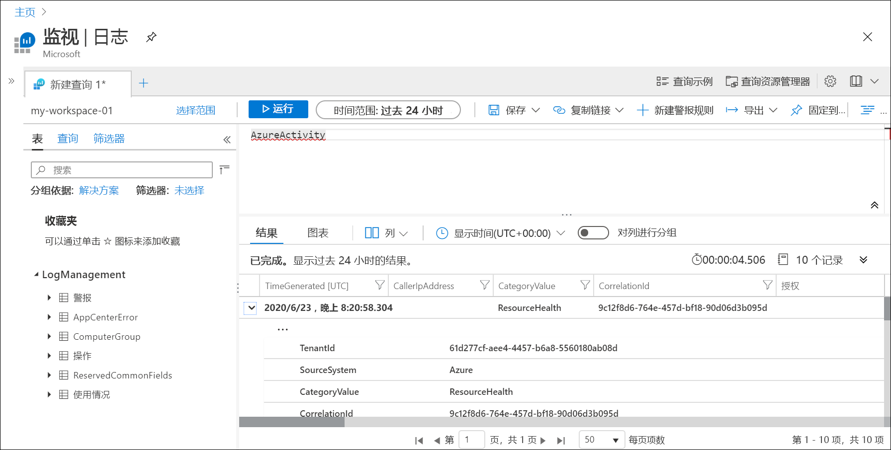
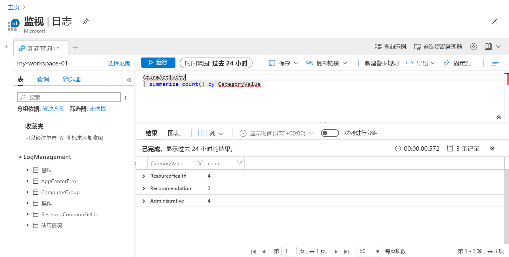

# 使用 Azure 门户将 Azure 活动日志发送到 Log Analytics 工作区
活动日志是 Azure 中的一种平台日志，可用于深入了解订阅级别事件。 这包括何时修改了资源或何时启动了虚拟机等信息。 可以在 Azure 门户中查看活动日志，或在 PowerShell 和 CLI 中检索条目。 本快速入门演示如何使用 Azure 门户创建 Log Analytics 工作区和诊断设置，从而将活动日志发送到 Azure Monitor 日志，从中可以使用[日志查询](../log-query/log-query-overview.md)对活动日志进行分析，并启用其他功能，例如[日志警报](../platform/alerts-log-query.md)和[工作簿](../platform/workbooks-overview.md)。 

## 登录到 Azure 门户
在 [https://portal.azure.com](https://portal.azure.com) 中登录 Azure 门户。 

## 创建 Log Analytics 工作区
在 Azure 门户中，搜索并选择“Log Analytics 工作区”。 

  
单击“添加”，然后为“资源组”、工作区“名称”和“位置”提供值   。 工作区名称在所有 Azure 订阅中必须是唯一的。

单击“查看 + 创建”以查看设置，然后单击“创建”以创建工作区 。 这将选择“即用即付”的默认定价层，在你开始收集到足够量的数据之前，将不会产生任何更改。 收集活动日志是免费的。

## 创建诊断设置
在 Azure 门户中，搜索并选择“监视”。 

选择“活动日志”。 你应该会看到当前订阅最近的事件。 单击“诊断设置”以查看此订阅的诊断设置。

单击“添加诊断设置”以创建新设置。 

键入名称，例如“将活动日志发送到工作区”。 选择各个类别。 选择“发送到 Log Analytics”作为唯一的目标，然后指定创建的工作区。 单击“保存”以创建诊断设置，然后关闭页面。

## 生成日志数据
仅将新的活动日志条目发送到 Log Analytics 工作区，因此将记录在订阅中执行的一些操作，例如启动或停止虚拟机，或者创建或修改其他资源。 可能需要等待几分钟，才能创建诊断设置并将数据首次写入工作区。 此延迟过后，所有写入活动日志的事件将在几秒钟内发送到工作区。

## 通过日志查询检索数据

在“Azure Monitor”菜单中选择“日志” 。 关闭“示例查询”页面。 如果范围未设置为所创建的工作区，则单击“选择范围”并进行查找。

在查询窗口中，键入 `AzureActivity` 然后单击“运行”。 这是一个简单的查询，它返回“AzureActivity”表中的所有记录，该表中包含从活动日志发送的所有记录。

展开其中一条记录以查看其详细属性。

尝试使用更为复杂的查询，例如 `AzureActivity | summarize count() by CategoryValue`，该查询提供按类别汇总的事件计数。

## 后续步骤
在本快速入门中，已将活动日志配置为发送到 Log Analytics 工作区。 现可配置要收集到工作区中的其他数据，在工作区中可以使用 Azure Monitor 中的[日志查询](../log-query/log-query-overview.md)来分析这些数据，并利用[日志警报](../platform/alerts-log-query.md)和[工作簿](../platform/workbooks-overview.md)等功能。 接下来，应从 Azure 资源中收集[资源日志](../platform/resource-logs.md)，以补充活动日志中的数据，从而深入了解各资源内执行的操作。

> [!div class="nextstepaction"]
> [使用 Azure Monitor 收集和分析资源日志](tutorial-resource-logs.md)
