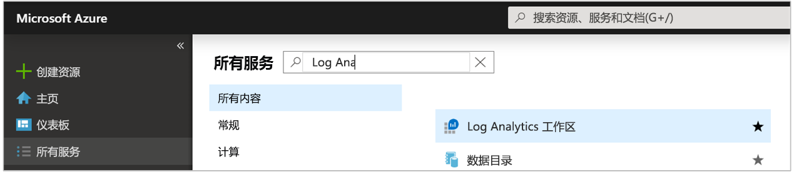
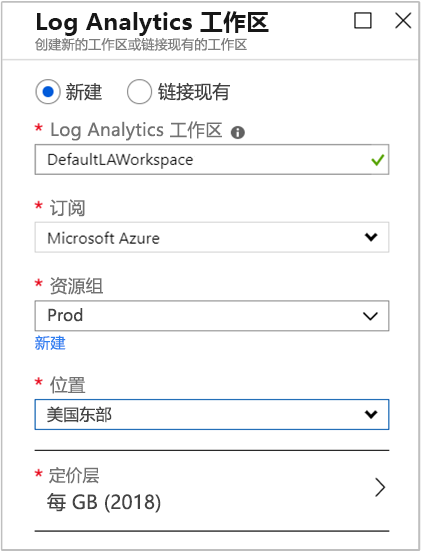
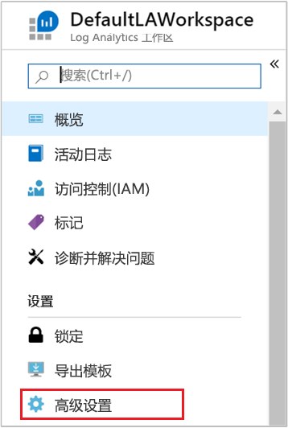
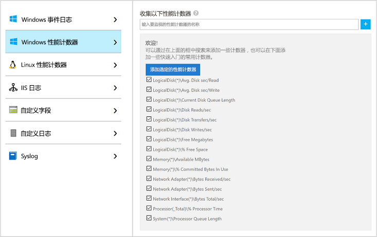
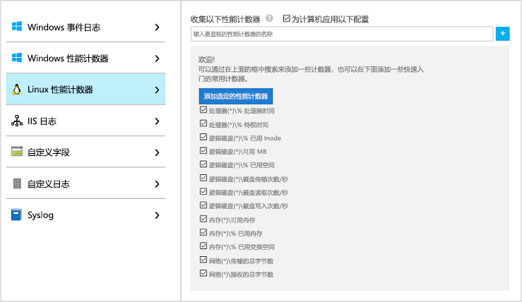
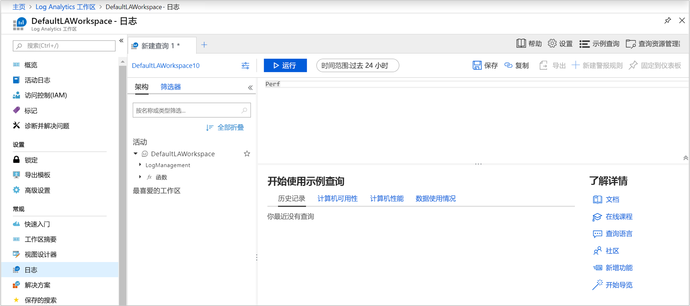
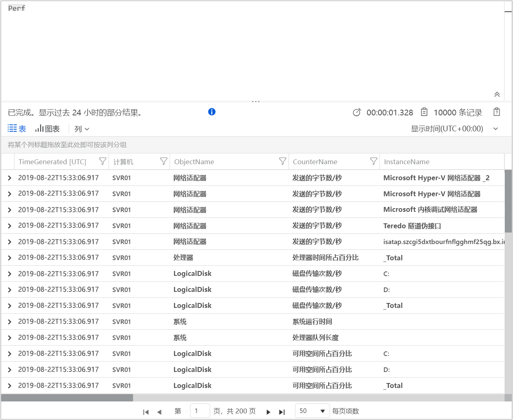
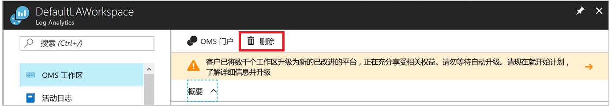

# 使用 Azure Monitor 从 Azure 虚拟机收集数据

[Azure Monitor](../overview.md) 可以直接从 Azure 虚拟机将数据收集到 Log Analytics 工作区，以便进行详细分析和关联。 安装适用于 [Windows](../../virtual-machines/extensions/oms-windows.md) 和 [Linux](../../virtual-machines/extensions/oms-linux.md) 的 Log Analytics VM 扩展允许 Azure Monitor 从 Azure VM 收集数据。 本快速入门介绍如何通过几个简单步骤，使用 VM 扩展从 Azure Linux 或 Windows VM 中配置和收集数据。  
 
本快速入门假定你拥有现有 Azure 虚拟机。 如果没有，可根据 VM 快速入门[创建 Windows VM](../../virtual-machines/windows/quick-create-portal.md) 或[创建 Linux VM](../../virtual-machines/linux/quick-create-cli.md)。

## 登录到 Azure 门户

在 [https://portal.azure.com](https://portal.azure.com) 中登录 Azure 门户。 

## 创建工作区

1. 在 Azure 门户中，选择“所有服务”。  在资源列表中，键入“Log Analytics”  。 开始键入时，会根据输入筛选该列表。 选择“Log Analytics 工作区”  。

       

2. 选择“创建”  ，然后为以下各项选择选项：

   * 为新的 Log Analytics 工作区  提供名称，如 DefaultLAWorkspace  。  
   * 如果选择的默认值不合适，请从下拉列表中选择要链接到的**订阅**。
   * 对于“资源组”  ，选择包含一个或多个 Azure 虚拟机的现有资源组。  
   * 选择向其部署 VM 的“位置”  。  如需其他信息，请参阅[提供 Log Analytics 的区域](https://azure.microsoft.com/regions/services/)。
   * 如果在 2018 年 4 月 2 日后创建的新订阅中创建工作区，则它将自动使用“每 GB”  定价计划，并且不提供用于选择定价层的选项。  如果是为 4 月 2 日之前创建的现有订阅创建工作区，或者是为绑定到现有 EA 注册的订阅创建工作区，则可以选择首选定价层。  有关特定层的其他信息，请参阅 [Log Analytics 定价详细信息](https://azure.microsoft.com/pricing/details/log-analytics/)。
  
         

3. 在“Log Analytics 工作区”窗格中提供所需的信息后，选择“确定”。    

在验证信息和创建工作区时，可以在菜单中的“通知”下面跟踪操作进度  。 

## 启用 Log Analytics VM 扩展

[!INCLUDE [log-analytics-agent-note](../../../includes/log-analytics-agent-note.md)] 

对于已在 Azure 中部署的 Windows 和 Linux 虚拟机，可使用 Log Analytics VM 扩展安装 Log Analytics 代理。 使用扩展可简化安装流程，并可自动配置代理，以将数据发送至指定的 Log Analytics 工作区。 在发布新版本时，代理也会自动升级，以确保你拥有最新的功能和修补程序。 在继续之前，请验证 VM 是否正在运行，否则此过程将无法成功完成。  

>[!NOTE]
>无法将适用于 Linux 的 Log Analytics 代理配置为向多个 Log Analytics 工作区报告。 

1. 在 Azure 门户中，选择左上角的“所有服务”  。 在资源列表中，键入“Log Analytics”  。 开始键入时，会根据输入筛选该列表。 选择“Log Analytics 工作区”  。

2. 在 Log Analytics 工作区列表中，选择之前创建的 DefaultLAWorkspace  。

3. 在左侧菜单上的“工作区数据源”下，选择“虚拟机”  。  

4. 在“虚拟机”  列表中，选择要在其中安装代理的虚拟机。 请注意，VM 的“Log Analytics 连接状态”  指示其“未连接”  。

5. 在虚拟机的详细信息中，选择“连接”  。 则自动会为 Log Analytics 工作区安装并配置代理。 此过程需要几分钟的时间，在此期间，“状态”显示“正在连接”   。

6. 安装并连接代理后，会使用“此工作区”更新“Log Analytics 连接状态”。

## 收集的事件和性能数据

Azure Monitor 可以从你为长期分析和报告指定的 Windows 事件日志或 Linux 系统日志和性能计数器中收集事件，并在检测到特定条件时采取措施。 首先，请按照下列步骤操作，配置从 Windows 系统日志和 Linux Syslog 以及几个常见性能计数器中收集事件。  

### Windows VM 中的数据收集

1. 选择“高级设置”  。

    

2. 选择“数据”  ，然后选择“Windows 事件日志”  。

3. 可通过键入日志名称添加事件日志。  键入“System”，然后选择加号 (**+**)。

4. 在表中，选中严重性“错误”  和“警告”  。

5. 选择页面顶部的“保存”来保存配置。 

6. 选择“Windows 性能数据”  ，在 Windows 计算机上启用性能计数器收集。

7. 首次为新的 Log Analytics 工作区配置 Windows 性能计数器时，可以选择快速创建几个通用的计数器。 将这些计数器在一个复选框中依次列出。

    

    选择“添加所选性能计数器”  。  随即会添加它们，并且通过 10 秒收集示例间隔进行预设。
  
8. 选择页面顶部的“保存”来保存配置。 

### Linux VM 中的数据收集

1. 选择“Syslog”  。  

2. 可通过键入日志名称添加事件日志。  键入“Syslog”，然后选择加号 (**+**)。  

3. 在表中，取消选中严重性“信息”  、“通知”  和“调试”  。 

4. 选择页面顶部的“保存”来保存配置。 

5. 选择“Linux 性能数据”  ，在 Linux 计算机上启用性能计数器收集。 

6. 首次为新的 Log Analytics 工作区配置 Linux 性能计数器时，可以选择快速创建几个通用的计数器。 将这些计数器在一个复选框中依次列出。

    

    选择“将下列配置应用到我的计算机”  ，然后选择“添加选定的性能计数器”  。  随即会添加它们，并且通过 10 秒收集示例间隔进行预设。  

7. 选择页面顶部的“保存”来保存配置。 

## 查看收集的数据

现已启用数据收集，开始运行简单的日志搜索示例，查看来自目标 VM 的部分数据。  

1. 在所选工作区中，从左侧窗格中选择“日志”  。

2. 在日志查询页上，在查询编辑器中键入 `Perf`，然后选择“运行”  。

     

    例如，下图中的查询返回了 10,000 条性能记录。 结果会大大减少。

    

## 清理资源

不再需要 Log Analytics 工作区时，将其删除。 为此，请选择之前创建的 Log Analytics 工作区，并在资源页上选择“删除”  。

## 后续步骤

从 Windows 或 Linux 虚拟机收集操作和性能数据后，现在可轻松开始浏览、分析免费  收集的数据，并对它们采取措施。  

若要了解如何查看和分析数据，请继续本教程。

> [!div class="nextstepaction"]
> [在 Log Analytics 中查看或分析数据](../../azure-monitor/learn/tutorial-viewdata.md)
