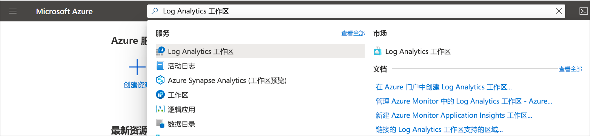

# 在 Azure 门户中创建 Log Analytics 工作区
使用“Log Analytics 工作区”菜单通过 Azure 门户创建 Log Analytics 工作区  。 Log Analytics 工作区是适用于 Azure Monitor 日志数据的唯一环境。 每个工作区都有其自己的数据存储库和配置，并且数据源和解决方案均配置为将其数据存储在特定工作区中。 如果打算从以下源收集数据，则需要 Log Analytics 工作区：

* 订阅中的 Azure 资源
* 受 System Center Operations Manager 监视的本地计算机
* System Center Configuration Manager 中的设备集合 
* Azure 存储中的诊断或日志数据

对于其他源，如环境中的 Azure VM 和 Windows VM 或 Linux VM，请参阅以下主题：

*  [从 Azure 虚拟机收集数据](../learn/quick-collect-azurevm.md) 
*  [从混合 Linux 计算机收集数据](../learn/quick-collect-linux-computer.md)
*  [从混合 Windows 计算机收集数据](quick-collect-windows-computer.md)

如果没有 Azure 订阅，请在开始之前创建一个[免费帐户](https://azure.microsoft.com/free/?WT.mc_id=A261C142F)。

## 登录到 Azure 门户
在 [https://portal.azure.com](https://portal.azure.com) 中登录 Azure 门户。 

## 创建工作区
1. 在 Azure 门户中，单击“所有服务”  。 在资源列表中，键入“Log Analytics”  。 开始键入时，会根据输入筛选该列表。 选择“Log Analytics 工作区”  。

    
  
2. 单击“添加”，然后为以下各项选择选项  ：

   * 为新的 Log Analytics 工作区  提供名称，如 DefaultLAWorkspace  。 
   * 如果选择的默认值不合适，请从下拉列表中选择要链接到的**订阅**。
   * 对于**资源组**，选择要使用已设置的现有资源组，还是要创建一个新资源组。  
   * 选择可用**位置**。  如需详细信息，请参阅[Log Analytics 现已推出的区域](https://azure.microsoft.com/regions/services/)然后搜索从 Azure Monitor**搜索产品**字段。  
   * 如果在 2018 年 4 月 2 日后创建的新订阅中创建工作区，则它将自动使用“每 GB”  定价计划，并且不提供用于选择定价层的选项。  如果是为 4 月 2 日之前创建的现有订阅创建工作区，或者是为绑定到现有企业协议 (EA) 注册的订阅创建工作区，则可以选择首选定价层。  有关特定层的详细信息，请参阅 [Log Analytics 定价详细信息](https://azure.microsoft.com/pricing/details/log-analytics/)。

          

3. 在“Log Analytics 工作区”窗格上提供所需信息后，单击“确定”   。  

在验证信息和创建工作区时，可以在菜单中的“通知”下面跟踪操作进度  。 

## 后续步骤
现在，你已有可用的工作区，可以配置监视遥测收集、运行日志搜索分析该数据，以及添加管理解决方案以提供其他数据和分析见解。 

* 若要启用通过 Azure 诊断或 Azure 存储从 Azure 资源收集数据，请参阅[收集要在 Log Analytics 中使用的 Azure 服务日志和指标](../platform/collect-azure-metrics-logs.md)。  
* [将 System Center Operations Manager 添加为数据源](../platform/om-agents.md)以从报告 Operations Manager 管理组的代理收集数据并将其存储在 Log Analytics 工作区中。 
* 连接 [Configuration Manager](../platform/collect-sccm.md) 以导入作为层次结构中集合成员的计算机。  
* 查看可用的[监视解决方案](../insights/solutions.md)以及如何从工作区添加或删除解决方案。
